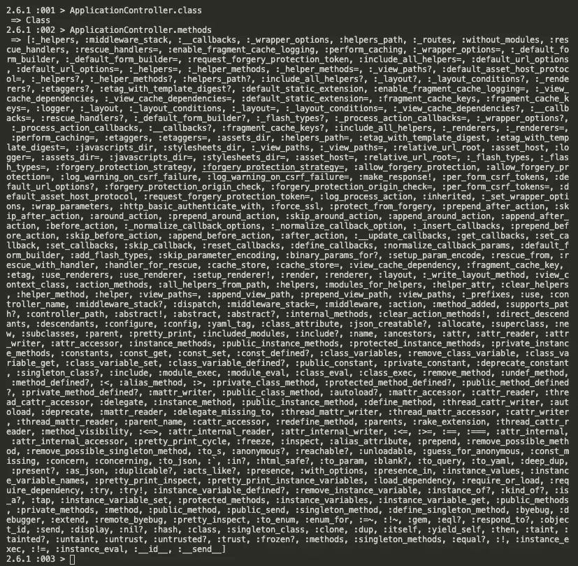

# Ruby on Rails

> 原文：<https://medium.com/nerd-for-tech/ruby-on-rails-b1904794e4ad?source=collection_archive---------2----------------------->

熨斗学校的基础设施周！

由[马丁·桑切斯](https://unsplash.com/@zekedrone?utm_source=unsplash&utm_medium=referral&utm_content=creditCopyText)在 [Unsplash](https://unsplash.com/s/photos/train?utm_source=unsplash&utm_medium=referral&utm_content=creditCopyText) 拍摄的照片

欢迎来到替代熨斗学校，Mod 2！！在 Mod 1 中学习 Ruby 编程语言时，我们在 CLI(命令行界面)中与应用程序模型进行了交互。我一直在想，我们是不是在铁轨上，却不知何故不知道。*“我一直听说的这个奇妙的轨道是什么？?"很久以前(也就是两周半前)，我们的 Ruby 应用看起来有点像太空入侵者的最原始版本，而现在在 Rails 上，项目开始看起来像一个实际的网页，尽管相当基础。婴儿学步！*

图片来自*绿野仙踪*华纳家庭视频 1939 — gif。由你真正创造

本质上，Rails 是一个框架，它利用 Ruby 语言和一系列很酷的新工具(加上 Ruby 令人敬畏的活动记录数据库接口),使用相当标准化的文件结构将我们的信息带到网页上。(我推荐一个关于创建一个新的 Rails 应用[的好的/快速的分解，这里是](/@sunjetliu/welcome-to-rails-a-guide-for-beginners-from-a-beginner-d9caa894c4d5)，由 Flatiron 的一个同学写的)。

为了了解 Rails 及其 MVC(模型/视图/控制器)[软件设计模式](https://en.wikipedia.org/wiki/Model%E2%80%93view%E2%80%93controller)的基础知识，我们需要快速回顾一下客户端-服务器响应周期:

1.  客户机(也就是你的浏览器)向远程服务器发送一个请求:例如，通过一个人输入`google.com`；
2.  远程服务器(也称为 Google 的服务器)接收请求，考虑 HTTP 动词(关于 HTTP 动词的大量/简短阅读可以在这里找到)和路由/路径(url)，使用这些信息传递给适当的控制器；
3.  控制器接受这些信息，加上被称为“聊天”的方法/动作，与一个或多个与数据库“聊天”的模型“聊天”,一些信息被转发回控制器；
4.  从这里，控制器将检索到的数据发送到一个. html.erb 视图(模板)页面，该页面对应于路由器调用的操作/方法，然后在网络间呈现…
5.  …客户端(浏览器)将这些信息翻译到您的计算机上。

> *以后想看这个故事吗？把它保存在***日志中。**

*咻！我知道。这已经很多了。一个人可以花一个小时(或七个小时！)只讨论客户机-服务器响应周期的复杂性。但是我们不会那么做。我们将直接使用控制器。根据 [Ruby on Rails 指南](https://guides.rubyonrails.org/action_controller_overview.html)::*控制器是一个继承自* `*ApplicationController*` *的 Ruby 类，它拥有与任何其他类一样的方法。当您的应用程序收到请求时，路由将确定运行哪个控制器和动作，然后 Rails 创建该控制器的一个实例，并运行与动作同名的方法。”**

*所以控制器是一个包含方法的类。在上面提到的客户机-服务器响应周期中，它是一个重要的协调者。但是你可能会问，什么是应用控制器呢？ApplicationController 是 Rails 中的控制器类，继承自 ActionController::Base。*

**

*在终端，你可以打电话。班级和。方法，根据对象的类来查看对象可用的工具。*

*[记住](https://api.rubyonrails.org/classes/ActionController/Base.html) : *“默认情况下，只有 Rails 应用中的 ApplicationController 继承了* `*ActionController::Base*` *。所有其他控制器都继承自 ApplicationController。这为您提供了一个类来配置诸如请求伪造保护和敏感请求参数过滤之类的事情。”**

**

*是的，我还是喜欢披萨。在此插入自引用链接[。](/an-idea/ternary-operators-and-why-i-love-them-53f1fdad9bfd?source=friends_link&sk=9751a3361b06d266ce7c1de9cabb2826)*

**

*ApplicationController 继承了强大的 ActionController::Base*

*在某种程度上，ApplicationController 是所有其他控制器的看门人。您实际上可以在您的 ApplicationController 中编写任何规则/条件，并且该条件将应用于您的应用程序中的所有其他控制器。就像任何类一样，当被调用时，它实例化一个新的应用程序实例。*

*什么是 ActionController::Base？好吧，回到 [Ruby Guides](https://guides.rubyonrails.org/action_controller_overview.html) :
*“动作控制器是 MVC 中的 C。路由器确定了请求使用的控制器后，控制器负责理解请求，并产生适当的输出。幸运的是，Action Controller 为您做了大部分基础工作，并使用智能约定尽可能简单明了地实现这一点。”**

*`::`只是命名空间的常规符号。GeeksforGeeks [的极客告诉我们](https://www.geeksforgeeks.org/namespaces-in-ruby/#:~:text=A%20namespace%20is%20a%20container,%2C%20other%20modules%2C%20and%20more.&text=The%20namespace%20in%20Ruby%20is,start%20from%20a%20capital%20letter.) : *“名称空间是多个项目的容器，包括类、常数、其他模块等等。一般来说，它们是以层次结构的形式组织的，这样名字就可以重复使用。Ruby 中的名称空间是通过在名称空间名称前面加上关键字 module 来定义的。**

*所以::符号的目的是告诉我们 ActionController 将以分层类型的格式“包含”Base 及其函数。除了基地还有其他选择。例如，ActionController 可以命名为 Metal，这为您的控制器创建了更有限的功能。或者 ActionController:: Parameters， [which](https://api.rubyonrails.org/classes/ActionController/Parameters.html) *"允许您选择哪些属性应该被允许进行批量更新，从而防止意外地公开那些不应该公开的属性。为此提供了两种方法:* `[*require*](https://api.rubyonrails.org/classes/ActionController/Parameters.html#method-i-require)` *和* `[*permit*](https://api.rubyonrails.org/classes/ActionController/Parameters.html#method-i-permit)` *。”*(听着耳熟？*cough_strong_params_cough*)要获得所有 ActionController 选项的完整列表，请在此随意浏览[。](https://api.rubyonrails.org/classes/ActionController.html)*

*如果我们打电话。我们会看到 ActionController 是一个模块！但是如果我们打电话。ActionController::Base 上的类我们看到它是一个类。(这个话题的这一方面需要我进行更多的教育。等我拿到 Ruby 的博士学位，我会和你一起回去的！)*

*在这一点上，我能提供的最好的简短回答是，ActionController::Base 提供了标准的工具箱/少量的 Ruby 功能/魔法，我们已经了解并喜欢上了它们。现在，这对我来说已经足够了！*

*Rails 上绝对有一个巫师。他的名字很可能是马茨！*

## *更多来自期刊*

*有许多黑人创造者在科技领域做着令人难以置信的工作。这些资源为我们中的一些人提供了启示:*