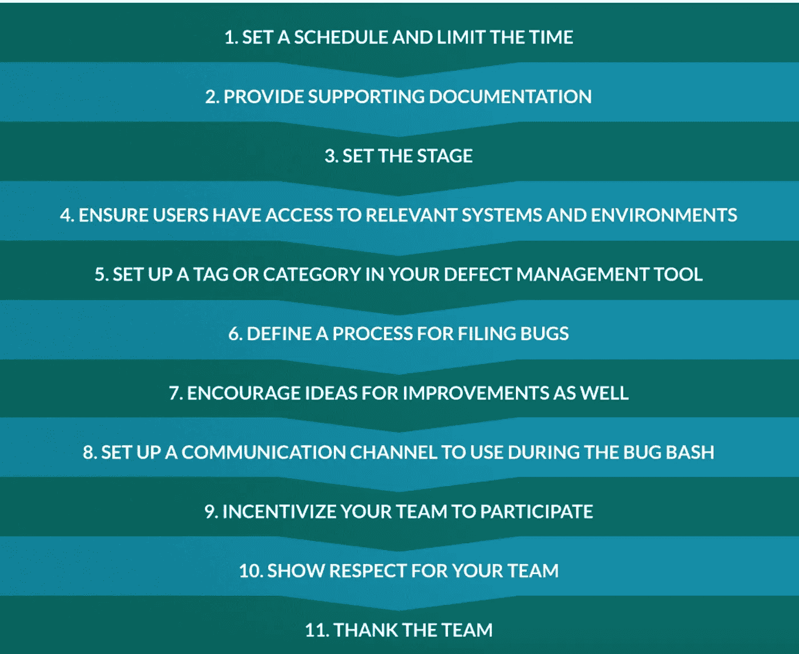

# 举办一次成功的 Bug Bash

> 原文：<https://medium.com/nerd-for-tech/run-a-successful-bug-bash-21ec921c38c5?source=collection_archive---------3----------------------->

# 什么是昆虫狂欢会

bug bash 是一个共同的努力，在这个过程中，一个跨职能的团队会将他们通常的职责放在一边，在指定的时间框架内测试程序。开发人员、测试人员、产品经理、设计人员、写作人员、客户支持人员和销售人员联合起来，从多种角度和用途用多种方法测试应用程序。强大的测试脚本很少用于 bug bash。目标是让多个个体“拉动产品”并检测在以前的测试中无法发现的缺陷和改进区域。

# 利益

尽管出于各种原因，它不应该被用来代替严格的测试。bug bash 是一种在新特性、产品或更新发布之前进行快速功能测试的绝妙技术。以下是一些其他的优势。

bug bash 让团队快速进行随机测试，通常会导致更大范围的问题。由于各种工作都要进行测试，因此有几种方法最有可能进行测试。这里的区别在于，某些“错误”实际上并不是真正的缺陷。当一个团队成员不知道这个产品时，他们可能会认为它应该以某种方式运行，并因此报告不正确的错误。大多数团队都接受这种负面影响，因为它会导致高测试覆盖率，尽管它会产生一些不正确的错误报告。

这为其他团队成员提供了研究应用程序和执行特别测试的巨大机会。这种测试方法是一种很好的技术，可以让你更多地了解那些可能与产品没有太多联系的团队成员。整个团队离产品越近，你的团队就越了解你如何参与产品。在许多更大的企业中，团队脱离了产品，因此，远离了用户和更广泛的产品目标。通过让整个团队更接近产品和消费者，它有助于实现目标，增强客户的同理心，甚至可能激发新的产品创意。

这些聚会可能是一个极好的机会去认识你组织中的其他人，尝试一些超出他们日常任务范围的事情。它允许个人理解不同工作的功能、价值和其他同事的想法。这将 bug 变成了一把双刃剑:部件文化和质量保证测试的构建者。

# 谁在举办一场昆虫狂欢会？

通常，组织者是测试团队的领导。然而，帮助开发人员或其他团队成员(如产品经理)解决大问题并不罕见。每个人都应该最终评估 bug bash 对产品质量和组织文化的影响程度。

# 运行 bug bash 的提示

如果你是进行 bug bash 的新手，这可能会有点令人生畏。有很多事情要考虑，在准备过程中，有很多事情你想做。这里有一些建议可以确保你成功。

1.  制定时间表和时间限制
    在安排一个 bug bash 时，你会希望尽快把它安排到你的团队成员的日程表上。我建议您利用贵组织的日历系统发出邀请。这个活动一般要一个小时的时间限制。这将有助于找到可用的时间，并鼓励快速测试，而不会让参与者筋疲力尽。
2.  提供支持
    的文档快速描述被检查的特性或应用是有帮助的。您可以有以前的文档，或者提供功能规范可能会有用。保持文档简单，你不希望用大量必要的阅读来打扰你的测试人员，但是一些支持性的材料可能是帮助你搭建平台的一个很好的方法。
3.  搭建舞台
    给他们一个你为什么要这么做的大纲，以及他们具体要测试什么。审查测试范围，以便您的参与者在您希望关注的范围内。有些同事可能希望被分配到应用程序的特定部分。提前检查一下，这样每个人都能达到预期。
4.  确保用户可以访问适当的环境和系统
    确保你可以在 bug-bash 之前访问测试环境和任何相关的工具，比如你的缺陷管理程序。如果你没有出席 bug bash，你的时间将会非常宝贵，你也不会非常信任你的 Bug Bash 参与者。请记住，他们正在花时间帮助你，做好准备，充分利用他们通常的义务。
5.  在你的缺陷管理工具中设置一个类别或标签
    在 bug bash 开始之前，配置你的 bug 跟踪应用程序，使参与者更容易记录问题和测量 bug bash 结果。特别是，使用标签、类别或 epic 来构建您的 bug 追踪器，以便您可以回顾并检查已经记录了多少缺陷，以及哪些 bug-bash 问题在待办事项中。bug bash 可能问题的合并将让您估计事件的影响。
6.  制定一个缺陷归档流程
    一些参与者可能不熟悉缺陷跟踪流程，因此你需要关于如何记录缺陷的清晰直接的说明。编写一个简明的分步指南，以便参与者可以在保密的情况下快速记录错误。这些说明也可以包含在日历中。
7.  提出改进建议
    虽然 bug bash 本质上是为了鼓励参与者记录他们认为是“bug”的问题，但你也应该利用它来敦促人们提出修复和升级建议。回想一下，在这短暂的时间里，你有不同数量的人参与测试…利用他们来获得一系列产品改进的想法！
8.  在 bug bash 期间建立一个沟通渠道。Slack 和微软的团队在当今的交流中很流行。用你目前的沟通方式来解决问题。如果你的分布式工作变得流行，你可能不会和你的参与者在同一个房间，但这并不意味着你可以虚拟地复制它。此外，在 bug bash 期间，可以建立一个共享的 zoom 调用来加入每个人。这允许团队在实时测试时提出问题并获得快速反馈。
9.  鼓励你的团队加入
    为了鼓励其他人加入，订购一些披萨或小吃。无论情况如何，对他们的工作和时间给予报酬。这将保持你的能量水平，并促使你参加下一次的 bug-bash。您甚至可以通过为个人重新编译最有缺陷或最重要的缺陷来创建一个竞争方面。
10.  尊重你的团队
    要知道有些人可能不像其他人那样专业，你会收到各种各样的评论和错误。不要拒绝或忽视任何错误。努力理解它们，并解释为什么在这种情况下，某个项目会被忽略。如果你只是抛出缺陷而不解释，你会觉得你的参与者没有价值。这不仅损害了你的团队的士气，也阻碍了它参与未来的 bug bugs。
11.  感谢团队
    一旦你完成了 bug bash，感谢你的团队。向他们展示你的时间和工作，鼓励他们参加下一次 bug-bash。

最后，一个能源友好的合作活动可以是一个 bug-bash。为了一个共同的目的，它集合了不同的职责，但是一个好的 bug 需要大量的思考和计划。使用上述指南来确保你的下一个 bug-bash 是成功的！