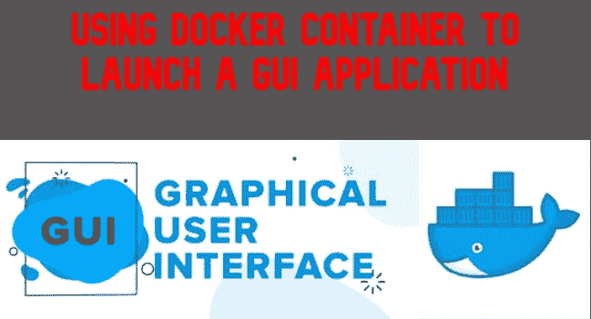
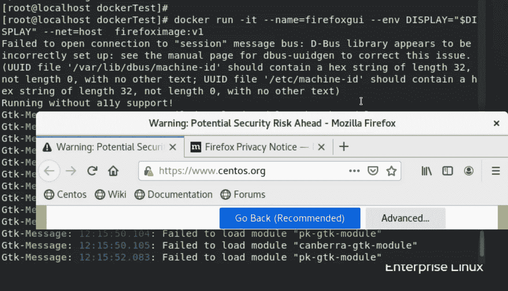

# 在 Docker 容器中运行 GUI 程序

> 原文：<https://medium.com/nerd-for-tech/running-a-gui-program-in-docker-container-cd220e7a658a?source=collection_archive---------12----------------------->



## 如何使用 Docker 容器运行 GUI 程序？

欢迎极客们！！！我希望你在这里找到一些有趣的东西。

所以让我们从博客开始吧！！！

## 介绍

我们可能都知道多克。Docker 启动容易，开机快，真的很舒服。如果你是这项技术的新手，你可能想看看我的博客，看看 Docker 是什么，以及我们如何在我们的系统中设置 Docker。你可以看看我关于如何在 RedHat Linux 8 中设置 Docker 的博客。

[](/swlh/configuring-web-server-in-docker-inside-cloud-d46fbf60ccf5) [## 在云内的 Docker 中配置 Web 服务器

### 如何在 Docker 容器中配置 Web 服务器，Docker 容器在云实例中启动。

medium.com](/swlh/configuring-web-server-in-docker-inside-cloud-d46fbf60ccf5) 

Docker 之所以迅捷，原因之一就是轻便。它可以在几秒钟内启动 container/OS。如果我们更深入地研究，它实际上是一个由其他程序运行的过程，使它变得更快(我们在那里有更多)。Docker 的所有程序都与 CLI 兼容。Docker 中的大多数程序都是 CLI 程序，不需要任何显卡或图形来使用。

那么问题来了，如何使用 Docker 容器运行任何图形程序？是的，我们实际上不会在容器中运行 GUI 程序，因为 Docker 没有任何 GUI 支持。尽管如此，我们将在 Docker 中安装一个 GUI 软件，使用 Docker 容器资源，运行程序，并查看图形。

## 实际的

现在就从练习开始吧。我们的系统中有 docker 软件。我使用 RedHat 作为我的基本系统，docker 将在这里启动。

首先，让我展示一下我的 Docker 版本:


如我们所见，我使用的是 Docker 20.10.6。而这也意味着 Docker 成功安装在我的系统中。

命令**“docker PS-a”**显示任何容器是否正在运行。在我们的情况下，我们没有任何。新的开始。

## 图像创建

Docker 容器是用图像创建的。通常，在预先构建的映像中，映像不附带 GUI 程序，因此我们必须创建自己的映像，并在其中包含 GUI 程序。我们正在使用 **Dockerfile** 来创建一个图像。我们已经创建了一个目录，并在其中创建了一个 docker 文件，因此稍后当我们尝试构建映像时，它会自动检测并使用这个文件。


所以在 docker 文件中，我们写了一些代码。我们已经使用了 **centos** 映像来构建我们的定制映像，在那里我们使用 RUN 安装了 firefox，然后我们使用 CMD 来运行 firefox 程序。所以当这个镜像建立时，它会安装 firefox，当有人运行/启动这个镜像的容器时，它会直接运行 firefox，我们知道 firefox 是一个 GUI 程序。


现在，在我们构建映像之前，让我们看看系统中可用的映像。我们使用命令**“docker 图像”**


我们可以在上面的图片中看到可用的图片。现在，我们将根据需要使用 docker 文件构建我们的映像。为此，我们使用命令:

```
$ docker build -t firefoximage:v1 .
```


我们的图像创建过程开始了，当我们检查可用的图像时，我们可以在下图中看到一个新的图像出现了，它的名称是**“Firefox image”，**，正如我们在上面的图像中使用的。


现在，我们有了图像，让我们试着用这个图像创建一个容器。我们可以使用命令:

```
docker run -it --name=<name for container> <imagename>
```


在上面的图片中，docker 容器失败了，它显示没有显示器可以运行我们的 firefox 程序。

让我解释一下，我们需要一个 GUI 屏幕来运行 GUI 程序，而容器没有任何 GUI 屏幕或任何运行 GUI 的驱动程序或软件，所以我们使用我们的主机系统 GUI 并要求 Docker 使用该 GUI 来运行其程序。为此，我们需要给 Docker 一个 env 变量显示。它保存了我们想要使用的显示套接字名称。如果使用 PC，显示指的是主监视器。然后我们内部已经用了`--net= host`一些联网概念，简而言之就是 Docker 用的主机 RedHat 系统网卡。



在上图中，我们可以看到容器在后台运行，然后在前台，火狐浏览器已经启动。这意味着我们已经成功地在 Docker 中推出了一个 GUI 程序。我们可以用 Ctrl+C 来停止程序。

# **结论**

我们已经成功地发布了一个 Docker 容器，它可以在里面托管一个 GUI 应用程序。我们使用了一些曲折和技巧，完成了任务。

我希望我已经解释了一切，如果你有任何疑问或建议，你可以在这个博客上评论或在我的 LinkedIn 上联系我。

[](https://www.linkedin.com/in/mishanregmi/) [## 密山 Regmi -研究实习生- SkillGeek | LinkedIn

### 在世界上最大的职业社区 LinkedIn 上查看米山·雷米的个人资料。密山有一个工作列在他们的…

www.linkedin.com](https://www.linkedin.com/in/mishanregmi/) 

*感谢您坚持到博客结束，请提出一些改进意见。你的建议真的会激励我。*