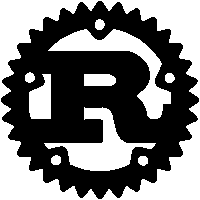

# Rust 变量和可变性

> 原文：<https://medium.com/nerd-for-tech/rust-variables-and-mutability-d045c32b5f83?source=collection_archive---------8----------------------->



# 变量

变量表示系统中存储该变量的位置。这些值大多在程序执行期间更改。变量只在它们被声明的范围内有效。

# 变量的类型

**可变变量:**

*   [其值经常被修改的变量](https://www.technologiesinindustry4.com/)。

**不可变变量:**

*   值不能被修改的变量。

为了安全起见，Rust 中的[变量默认为不可变的](https://www.technologiesinindustry4.com/)。然而，我们将改变变量的可变性

**示例:更改不可变变量**

```
fn main() {let x = 5;println!("The value of x is:{}", x);x = 6;println!("The value of x is:{}", x);}
**Result**
```

这个程序会给出一个[编译时错误](https://www.technologiesinindustry4.com/)，因为我们试图改变一个不可变变量的值。
**示例:改变可变变量**

```
fn main() {let mut x = 5;println!("The value of x is:{}", x);x = 6;println!("The value of x is:{}", x);}
**Result:**
```

x 的值是 5

x 的值是 6

# 常数

[常量是对声誉有保证的值](https://www.technologiesinindustry4.com/)，通常包含那些我们不想改变的值。
常量是通过使用“const”关键字声明的，因此必须对值的种类进行注释。语法:const MAX _ POINTS:u32 = 100 _ 000；
Rust 中对于常量的命名约定是全部使用大写字母，单词之间加下划线。
常量仅用作硬编码值，您希望在整个程序中使用。
常量大部分是在任何范围内声明的，包括全球范围，这使得它们对于代码的很多部分需要实现的值非常有用。

**例:**日照速度，π(π)

# 遮蔽

[遮蔽是指](https://www.technologiesinindustry4.com/)的解释[因为前一个变量而替换了一个同名的](https://www.technologiesinindustry4.com/)变量，因此新变量遮蔽了前一个变量。
变量经常被替换类型隐藏。例如，字符串通常作为整数隐藏。我们将通过使用一个等价的变量名并重复使用“let”关键字来隐藏一个变量。

**示例:隐藏变量**

```
fn main() {let x = 5;let x = x + 1;let x = x * 2;println!("The value of xis: {}", x);}**Result:**
```

x 的值是 12

注意:变量保持不变。

# 阴影和可变性的区别

[mut 和 shadowing](https://www.technologiesinindustry4.com/) 的区别在于，当
再次使用 let 关键字时，我们有效地创建了一个替换变量；我们将改变价值的排序，但使用一个等价的名称。
如果我们不小心试图在没有使用 let 关键字的情况下将值重新赋值给一个不可变变量，我们将会收到一个编译时错误。
我们将改变遮蔽的那种价值，但重用一个等价的名字。

**示例:通过隐藏改变数据类型**

```
let spaces = " ";let spaces = spaces.len();Note:  this may  change  the info  type from string to integer.Examplelet mut spaces = " ";spaces = spaces.len();Note: By using ‘mut’ we aren't allowed to vary the info sort of the variable.
```

更多详情请访问:[https://www . technologiesinindustry 4 . com/2020/10/Rust-variable-muta bility . html # more](https://www.technologiesinindustry4.com/2020/10/Rust-variable-mutability.html#more)