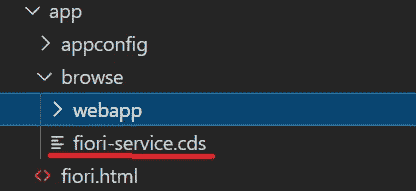
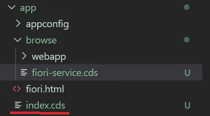
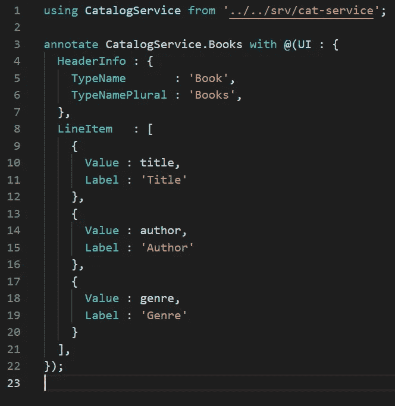
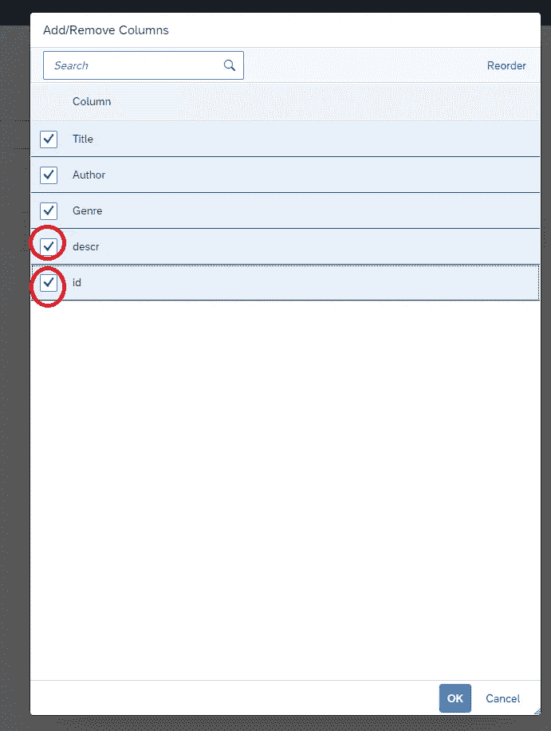
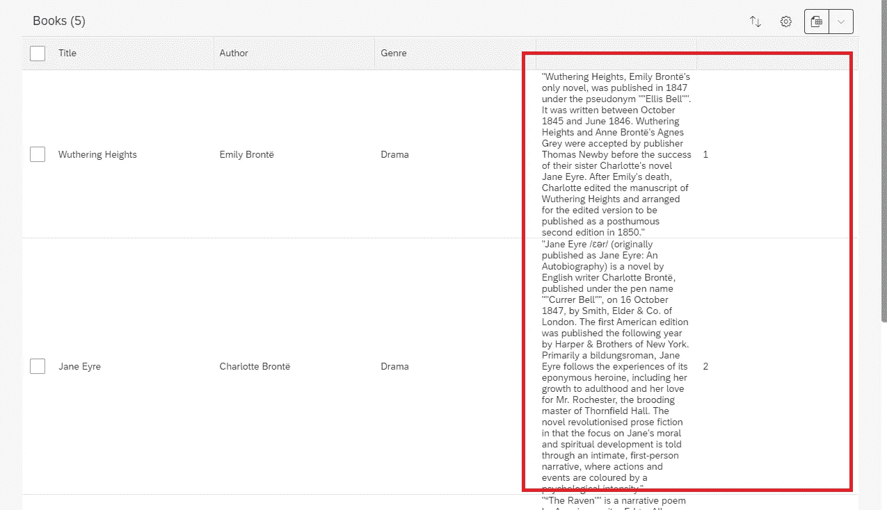
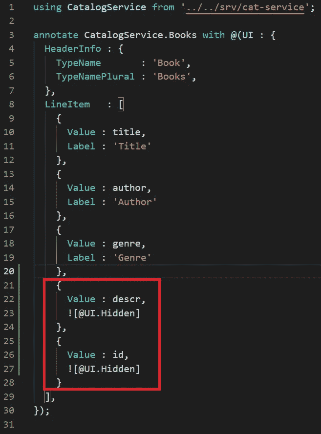
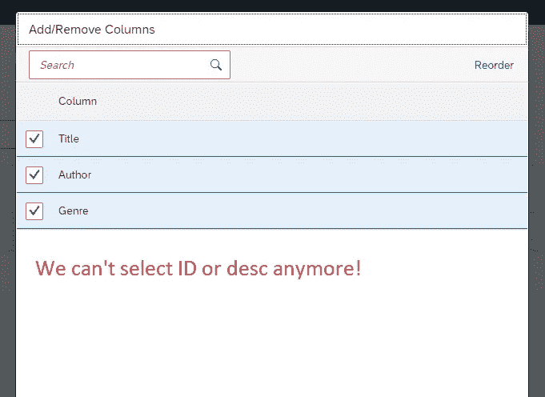

# SAP 教程:完整的 CAP Java 第 4 部分

> 原文：<https://medium.com/nerd-for-tech/sap-tutorial-complete-cap-java-4-6938e419f575?source=collection_archive---------6----------------------->

表格标题、列标题、隐藏字段、搜索、过滤和排序


由 [Pakata Goh](https://unsplash.com/@pakata?utm_source=medium&utm_medium=referral) 在 [Unsplash](https://unsplash.com?utm_source=medium&utm_medium=referral) 上拍摄的照片

## 内容

*   [上一篇:设置费奥里发射台和费奥里元素列表报告](/nerd-for-tech/sap-tutorial-complete-cap-java-3-adec221180bb)
*   **当前:表格标题、列标题、隐藏字段、搜索、过滤和排序**
*   [接下来:使用 CDS 和费奥里元素中的单元](https://bnheise.medium.com/sap-tutorial-complete-cap-java-part-5-fb3ff81e64c1)

这是完整的 CAP Java 教程系列的第 4 部分，我将向您展示如何一步一步地重建 SAP 的示例 [CAP Java bookstore](https://github.com/SAP-samples/cloud-cap-samples-java) 应用程序。在最后一步中，我们设置了一个基本的费奥里 UI，使用费奥里元素列表报告应用程序来显示我们的图书模型。在本节中，我们将继续通过添加列标题、隐藏不应该显示的字段以及实现搜索和过滤来配置 UI。

# 步骤 1:添加表格标题

让我们启动 SAP 的示例 CAP 应用程序，并将其与我们目前所拥有的进行比较。


SAP 的 CAP Java 示例


我们的应用程序到目前为止

请注意，我们的应用程序中缺少表的标题——Books——以及列标签。注意，我们还没有实现 rating 和 price 字段，所以现在我们将忽略它们。让我们设置标题和列标签。

首先，我们将在文件夹 *app/browse* 中创建一个名为 *fiori-service.cds* 的文件。这个文件将包含我们的 CatalogService 的 UI 注释。



接下来，我们必须导入我们的服务定义，您应该还记得在本系列的第 1 部分中我们在 *srv/cat-service.cds* 中定义的服务定义。将下面一行添加到 *fiori-service.cds.*

```
using CatalogService from '../../srv/cat-service';
```

接下来，我们需要向 Books 模型添加 UI 注释。我们首先要添加一些标题信息，如下所示:

```
annotate CatalogService.Books with @(UI : {
  HeaderInfo  : {
      TypeName : 'Book',
      TypeNamePlural : 'Books',
  },
});
```

我们从*注释*关键字开始。该关键字用于向从其他地方导入的定义添加注释。如果我们直接在我们的 *cat-service.cds* 文件中编写注释，我们就不需要使用这个关键字。我们不厌其烦地将 CDS 定义分开，一部分放在这里，一部分放在 *srv* 文件夹中的原因只是为了组织我们的代码，以便特定于 UI 的注释留在 UI 中，而特定于 API 的注释留在后端。但实际上，所有这些代码都将编译成一个 oData 元数据文档，该文档将从后端提供给费奥里元素 UI。

接下来我们添加 CatalogService。Books，我相信您可以猜到它指定了我们将向其添加注释的实体。

接下来是带有关键字的*，我认为它的存在主要是为了让 CD 读起来更像自然语言。在任何情况下，您都需要在添加注释之前使用它。*

接下来我们介绍一些 CDS 速记。解释这种语法的作用可能比简单地展示另一种编写方法更困难。看看下面的代码—它提供了相同的结果。

```
annotate CatalogService.Books with [@UI](http://twitter.com/UI).HeaderInfo : {
  TypeName       : 'Book',
  TypeNamePlural : 'Books'
};
```

然而，我们有许多 UI 注释要添加，这样做意味着必须重复*注释 CatalogService。带@UI 的书。~* 对于每个新的注释。这是很多重复的代码。

相反，我们使用@()来表示一组注释。在括号内，我们可以为一组注释提供名称空间，在本例中为 *UI* ，后跟一个冒号。从那时起，我们可以使用类似 JSON 的语法来表示每个特定的 UI 注释及其属性。

接下来，我们添加具有属性 TypeName 和 TypeNamePlural 的 HeaderInfo 注释，这是我们的实体的单复数名称。费奥里元素将在我们应用程序的不同地方使用这些值，但我们现在最感兴趣的是列表报告中表格的标题。这个可以解决这个问题。

在我们启动应用程序并看到结果之前，我们还需要做一件事。

在 *app* 文件夹中创建一个名为 *index.cds* 的文件。



在文件内部，导入我们的 *fiori-service.cds* 文件。

```
using from './browse/fiori-service';
```

这是为了让 CDS 运行时可以定位该文件，并将其正确地编译到我们的 oData 服务定义中。现在运行 *mvn spring-boot:运行*并打开应用程序。您应该看到这个:


我也鼓励你尝试使用 *cds compile* 将 *index.cds* 文件编译到 *edmx* 中，看看能不能在输出中找到我们刚刚添加的 UI 注释(如果你不记得怎么做了，查看本系列的 [Part 1](https://bnheise.medium.com/sap-tutorial-complete-cap-java-part-1-fc1868c7bbba) )。

在下一步中，我们将添加一些列标签。

# 步骤 2:添加默认列和列标签

下一步是设置列标签。我们可以通过使用另一个名为 *LineItem* 的注释来做到这一点，它允许我们从数据模型中指定应该显示为表的默认列的字段，并为它们分配一个标签以显示在表头中。让我们看一个例子:

```
annotate CatalogService.Books with @(UI : {
  HeaderInfo  : {
      TypeName : 'Book',
      TypeNamePlural : 'Books',
  },
  LineItem : [
      {
        Value: title,
        Label: 'Title'
      }
  ],
});
```

注意，LineItem 注释包含一个数组，因此我们可以在一个注释中定义所有的默认列。每个列定义是一个包含两个属性的对象，*值*和*标签*。因为我们已经指出我们正在注释 Books 实体，所以除了字段名之外，我们不需要提供任何东西。我确信我不需要说标签属性是做什么的。

让我们继续填写剩下的栏目。当然，这个描述太长了，无法在表格中显示，所以我们在这里省略了它。同样，没有必要显示 *id* 字段，所以我们也将省略它。下面是最终结果:



现在让我们重新启动服务器并检查结果:


成功！我们已经正确显示了默认列。然而，我们仍然有一个问题，看看当我们点击齿轮图标时会发生什么:



我们仍然可以选择 *desc* 和 *id* 字段，当我们单击“确定”时，它们仍然会显示在表格上:



那不行！在下一步中，我将向您展示如何隐藏不应该在 UI 中显示的字段。

# 步骤 3:隐藏字段

幸运的是，在表中隐藏字段是一件简单的事情。我们只需要在行项目数组中定义它们，但是要提供注释*！[@UI.hidden]* 而不是标签属性。每个隐藏的行项目应该看起来像这样:

```
 {
      Value: descr,
      .Hidden]
    }
```

这是我们的最终结果:



现在，当我们启动 UI 并单击齿轮图标时，我们会看到以下内容:



现在情况看起来不错，但是您会注意到我们的列表报告仍然缺少一些搜索字段:


我们的书店应用程序


SAP 的书店应用程序

正如我们所见，SAP 的书店应用程序有针对作者和流派的搜索字段。接下来让我们学习如何添加那些。

# 步骤 4:添加额外的搜索字段

向费奥里元素应用添加额外的搜索字段相当简单。我们只使用 SelectionFields 注释，它包含您希望允许过滤的字段的数组。然后，在我们的 *fiori-service.cds* 文件中，在行项目的正下方添加以下代码:

```
SelectionFields : [
    author,
    genre
  ],
```


不过，您可能会注意到一件小事:这两个字段的标签是小写的，而 SAP 书店应用程序中的标签是大写的。事实上，这是因为默认情况下，它们只是显示与实体定义中最初定义的字段名称完全相同的内容。在我们的例子中，这还不错，但很多时候我们的字段名可能是一个缩写，甚至是一个相当晦涩的代码，所以我们可能希望能够覆盖这个默认值。幸运的是，我们可以！

首先让我们在 *app* 文件夹中创建一个名为 *common.cds* 的文件。这个文件的目的是定义我们希望在整个 UI 中通用的 UI 特性，而不仅仅是在我们的*浏览*应用中。

在这个文件中，从 *db* 文件夹中导入书店模式，而不是从 *srv* 文件夹中导入服务定义。这是因为我们希望这些注释适用于我们的模型，无论它们在哪里使用，而不仅仅是针对特定的服务。您的 import 语句应该如下所示，但是一定要用您之前定义的名称空间替换*toad lop . bookshop*。

```
using { toadslop.bookshop as bookshop } from '../db/index';
```

接下来，我们将使用 *@title* 注释为这些字段定义一个标签，这些字段将在整个应用程序中通用。

```
annotate bookshop.Books with {
  author [@title](http://twitter.com/title) : 'Author';
  genre  [@title](http://twitter.com/title) : 'Genre';
}
```

关于 *@title* 注释的有趣之处在于，它还将处理 *LineItems、*的标签，因此我们实际上不需要之前在 *fiori-service* 中定义的标签，至少对于*作者*和*流派*字段是如此。继续删除它们。您的 *LineItems* 现在应该是这样的:

```
LineItem        : [
    {
      Value : title,
      Label : 'Title'
    },
    {Value : author},
    {Value : genre},
    {
      Value : descr,
      .Hidden]
    },
    {
      Value : id,
      .Hidden]
    }
  ],
```

最后，我们必须记住将我们新的 common.cds 文件导入到 *app* 文件夹的 index.cds 文件中，否则该文件的内容不会被编译。该文件现在应该如下所示:

```
using from './browse/fiori-service';
using from './common';
```

让我们来看看结果:


您还可以对其进行测试，以表明多亏了 CAP，现在开箱即可使用——不需要额外的配置！


我们快完成了。在本周结束之前，我们还有最后一件事要配置。你可能已经注意到，SAP 的书店应用程序默认按照字母顺序显示书籍，而我们的应用程序显然是随机排序的:


我们的书店


SAP 书店

这是因为作为默认设置，CAP 按 ID 对结果进行排序。如果您检查我们在 *db/data* 中的模拟数据 CSV 文件，您会看到我们的书籍实际上是根据它们的 id 排序的。让我们改变这一点。

# 步骤 5:更改默认排序顺序

要更改默认排序字段，让我们再次返回到 *fiori-service.cds.* 在我们的 UI 注释的末尾，在选择字段的正下方，添加以下内容:

```
PresentationVariant : {
    Text           : 'Default',
    SortOrder      : [{Property : title}],
    Visualizations : ['[@UI](http://twitter.com/UI).LineItem']
  },
```

这个 *PresentationVariant* 注释允许我们定义查询书籍的结果是如何形成的，以及结果将如何在 UI 中显示。

*PresentationVariant* 对象的第一个属性是 *Text* ，这有点违反直觉地表明了这个 *PresentationVariant 的名称。*这不是必需的，但如果我们希望一个实体有多个变体，这很有用。

下一个属性是我们真正关心的: *SortOrder* 。这里我们提供了一个对象数组，它至少需要一个名为 *Property* 的属性来指示排序的字段。如果两个实体的第一个属性的值恰好相同，向该数组添加多个属性可以提供额外的排序规则。注意，这些对象中的每一个都接受属性 *Descending，*，其值可以是 true 或 false。因为我们想要正常的字母顺序，而不是相反的，我们不需要这个属性，所以我们在这里省略它。

最后一个属性 Visualizations 包含一个可视化类型数组，该变量适用于该数组。在我们的例子中，我们只需要`UI.LineItem`，但是`UI.Chart`和`UI.DataPoint`也是可用的。

现在，如果我们再次启动我们的应用程序，我们会看到预期的结果:


结果按标题的字母顺序排序

# 结论

这就把我们带到了完整的 CAP Java 的第 4 部分的结尾。回顾一下，在本课中，我们学习了几种配置费奥里元素应用程序 UI 的方法，包括提供表名、设置列标签、添加过滤器、隐藏显示字段以及设置默认排序顺序。在接下来的部分中，我们将开始添加一些更复杂的特性，比如价格和评级字段。下次见！

本教程中有什么不清楚的吗？请在下面留下问题，我会尽快回复您。有什么不对吗？请在下面留下评论，让我知道(更正的来源将是最有帮助的)。谢谢大家的评论！

# 支持

你喜欢这个博客吗？想确保我能继续创作吗？然后考虑在 [Patreon](https://www.patreon.com/toadhousetutorials) 上订阅！