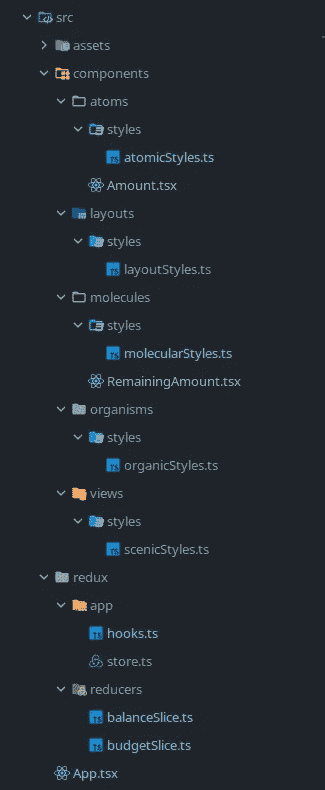

# 对混乱的代码说不

> 原文：<https://medium.com/nerd-for-tech/say-no-to-messy-code-b8071f9f6f64?source=collection_archive---------20----------------------->


照片由[在](https://unsplash.com/@thecreative_exchange?utm_source=medium&utm_medium=referral) [Unsplash](https://unsplash.com?utm_source=medium&utm_medium=referral) 上的创意交流

你有没有看过别人的回购协议，却不知道什么是什么？即使你是一个研究高级代码的初学者，你也应该至少能够勉强分辨出什么是什么。如果没有，这不一定是缺乏技能或知识的迹象，但更重要的是开发人员没有正确地设计他们的代码，没有足够描述性地命名他们的函数和变量(或至少留下描述性的注释)。

为此，我想列出一些指针和基本样式，让您了解应该如何构建代码。

## 缩进和行距

适当的缩进和行距可能是开发人员面临的最大问题之一，尤其是新开发人员。如果您是新手，或者希望改进您的代码，我恳请您继续阅读。

一般来说，不正确地格式化代码对于调试和开发来说是灾难性的。如果你不能轻松地阅读你自己的代码，你就有一个大问题。对于其他可能查看您的代码的开发人员和雇主来说尤其如此。如果你的项目完全是私有的，只有你能访问它，那么无用的代码勉强可以接受，但是在任何环境下使用都是不好的。

这个问题应该在我们写第一行代码之前，甚至在我们将“hello world”打印到控制台之前就解决。好习惯从现在开始。

每种语言都有自己的风格指南，这将集中在 Javascript 上，在许多语言中你可以应用类似的风格。

因此，让我们构建一个虚拟的 React 组件。

全球进口第一，并保持在首位。模块导入在顶部，项目导入在下面。如果最终有很多项目导入和模块导入，用空格将它们分开会很有帮助。

```
import React from 'react';
import styled from 'styled-components';import Profile from '../views/Profile';
import { useAppSelector } from '../../redux/app/hooks;
```

接下来是全局真常量(不应该被改变/修改的变量)。

```
import React from 'react';
import styled from 'styled-components';import Profile from '../views/Profile';
import { useAppSelector } from '../../redux/app/hooks;const ID = 10ad4J;
const MAXVALUE = 10;
```

后面跟着其他常数。

```
import React from 'react';
import styled from 'styled-components';import Profile from '../views/Profile';
import { useAppSelector } from '../../redux/app/hooks;const ID = 10ad4J;
const MAXVALUE = 10;const Container = styled.div`
   background-color: #ffffff;
`;
```

接下来是函数、组件和/或 CSS-in-JS。

```
import React, { useState } from 'react';
import styled from 'styled-components';import Profile from '../views/Profile';
import { useAppSelector } from '../../redux/app/hooks;const ID = 10ad4J;
const MAXVALUE = 100;const Container = styled.div`
   background-color: #ffffff;
`;const AComponent = () => {
   const isUserLoggedIn = useAppSelector(state => state.user.loggedIn); return (
      <Container>
         <Profile auth={isUserLoggedIn ? ID : false} />
      </Container>
   );
};
```

最后，我们把我们的出口。

```
// Spaces inside brackets, outside of JSX.
import React, { useState } from 'react';
import styled from 'styled-components';import Profile from '../views/Profile';
import { useAppSelector } from '../../redux/app/hooks;const ID = 10ad4J;
const MAXVALUE = 10;const Container = styled.div`
   background-color: #ffffff;
`;// Single props don't get parens.
const AComponent = props => {
   const [user, setUser] = useState({}); return (
      <Container>
      {// No spaces in brackets inside JSX}
         <NavBar loggedIn={user}/>
      </Container>
   );
};export default AComponent;
```

有比这更多的规则，但你有希望得到一般的想法，并可以很容易地扩展。

## 模块化(或代码拆分)

每个模块应该只做一件事，就像一个函数一样。这应该是对所有代码领域的实践。将所有代码放在一个文件中可能可行，但对于一个文件来说是不可读的，并且当您需要更新特定的代码分支时，很难隔离出来进行调试和开发。

代码分割是将代码分割成更小的块、组件，并将它们捆绑到模块中，并在需要的地方导入组件的过程。这些模块然后形成包。理想情况下，这个过程会使文件更容易阅读，并保持代码整洁。但也应该像读书一样读代码。

如果做得不正确，可能会导致流程中断，用户在阅读项目时必须在文件之间来回跳转，以了解正在进行的全部内容。

相反，应该发生的是，首先你的应用程序调用所有需要的数据，将响应映射成我们实际上可以有效工作的形式，并且只提供我们的程序工作所需的数据。然后，您的文件可能会调用一些辅助函数(理想情况下存储在外部文件中)来执行一些更进一步的巫术，然后将处理后的数据返回到一个对象中，我们可以在其他文件中处理该对象。理想情况下，一个文件应该只有一个输出，尽管它可以根据需要从多个地方获取输入。

OOP 设计方面的知识通常有助于这个想法，也可以用于函数式编程。

## **合适的项目目录结构**

能够阅读代码只是成功的一半。能够找到一个特定文件是另一半的四分之一，并能够确定该文件是什么是其余的。目录应该根据它们包含的内容来命名，文件应该根据它们处理的数据来命名，主要是根据文件做什么来命名。

遵循什么样的目录结构最终取决于所使用的堆栈。这是大多数 React 应用的基本结构(或者至少是我的个人项目):

```
Root
|_.ideconfigfolder
|_node_modules
|_public
  manifest.json
  index.json
  robots.txt
  ...other files including images and what not
|_src
  |_assets
  |_components
  |_utils
  |_redux
  |_styles
  App.jsx
index.jsx
...global project configs and ignores.
```

我遵循原子设计原则。我的结构看起来像这样:



如果你从这篇文章中得到什么，发展一种可读的风格，改进，并坚持下去。如果你不确定什么对你来说可读，什么对其他人来说可读，分享一个你的代码样本(一个好的样本大小，这样他们可以对你的风格有一个好的感觉)，并获得一些反馈。