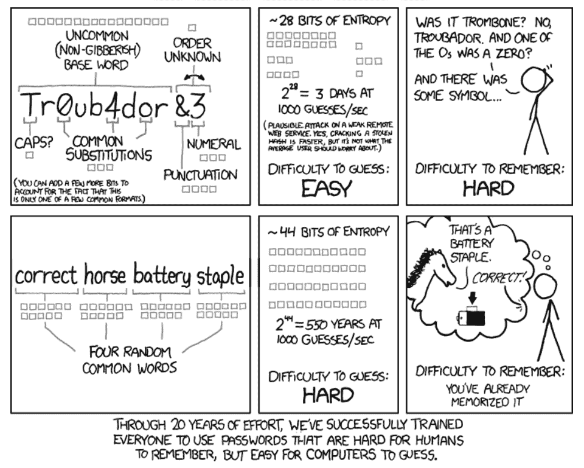

# 对密码管理员说“是”

> 原文：<https://medium.com/nerd-for-tech/say-yes-to-password-managers-64fe27a63225?source=collection_archive---------41----------------------->

照片由[弗兰克](https://unsplash.com/@franckinjapan?utm_source=medium&utm_medium=referral)在 [Unsplash](https://unsplash.com?utm_source=medium&utm_medium=referral) 上拍摄

最近[的一项研究](https://securitybrief.co.nz/story/average-person-has-100-passwords-study)显示，平均每个人有大约 100 个密码。在 2019 年就同一主题进行的一项研究中，研究人员发现，一个人必须记住大约 70-80 个密码。基本上，我们必须记住的密码数量在短短一年内增加了 25%左右。我很好奇他们在即将到来的一年里会增加多少。但是，考虑到目前的情况，可以有把握地认为，仅仅依靠我们的记忆已经不再是这样了。除非你不想每次想登录某个地方都使用“忘记密码”选项。

"在任何地方都使用相同的密码难道不是一个生活帮吗，tho？"—不，不是的。到处使用相同的密码可能会使记忆更容易，但从安全角度来看，不建议这样做。令人震惊的是，2019 年的一项[谷歌在线安全调查](https://services.google.com/fh/files/blogs/google_security_infographic.pdf)发现，52%的受访者在不止一个账户上使用同一个密码(但根据他们的说法，不是在每个账户上)，而 13%的人在每个账户上都重复使用一个密码。大忌。

所以，你的每个账户都需要不同的密码。但是你能在哪里堆叠所有这些密码呢？曾经有一段时间，你可以简单地将它们写在个人日记中，但那是在你没有 5 个不同的电子邮件账户、8 个社交媒体平台账户、4 个流媒体平台账户、7 个购物网站账户等等的时候。当我在 2012 年第一次创建我的脸书账户时，我记得把我的密码写在一张便利贴上，然后藏在我床上的枕头下。如果你能在你的房子里找到大约 90 个随机点来隐藏你所有的当前密码，你可以试一试！*请不要*。

也有可能将密码保存在浏览器或应用程序中，但是，正如我们将在本文中看到的，这也不是最安全的选择。我知道这看起来是最舒适的方式，但是请耐心等待，我会向您展示一个更好的选择:**密码管理器**。密码管理应用程序让你既安全又舒适。在接下来的几行中，我们将更多地讨论密码管理器，并分享 3 个最好的应用程序。

**密码管理员是做什么的？**

技术变得越来越先进的主要目的之一是让我们的生活变得更容易。但是，随着这一部门的改善，新的风险出现了。每个新创建的帐户相当于一个新的密码，你必须创建和记住。制作一个难以被黑客破解并且容易记忆的密码是可行的。制造大约 100 种不同的具有这两种特性的听起来像是不可能完成的任务。

这幅 xkcd 漫画完美地解释了密码的情况:“通过 20 年的努力，我们已经成功地训练每个人使用人类容易记住，但计算机容易猜到的密码”。幸运的是，密码管理员在这里拯救了这一天。他们会通过创建强密码来帮助你保护你的账户安全，他们也会帮你做记忆的工作。把这个应用想象成你密码的保险箱。

让我们看看密码管理器的好处:

*   你再也不用记住你的密码了:你只需要记住一个密码，也就是**主密码。**这是应用程序的密码。就像我们之前谈过的保险箱的钥匙。
*   它们会自动为您生成高度安全的密码:在创建新帐户之前，大多数密码管理员会询问您是否希望他们为您创建一个密码。它们是以一种不可能被猜到的方式被创造出来的。
*   它们保护您免受[网络钓鱼](https://www.phishing.org/what-is-phishing)的攻击(“网络钓鱼是一种网络犯罪，其中有人冒充合法机构通过电子邮件、电话或短信联系一个或多个目标，引诱个人提供敏感数据，如个人身份信息、银行和信用卡详细信息以及密码。”).网络钓鱼电子邮件中的链接会将您带到一个旨在让您共享您的敏感数据(密码、信用卡详细信息等)的网站。当您进入一个被密码管理器识别为合法/安全的网站时，密码管理器会自动完成您的登录凭据。因此，如果您看到您的凭据没有自动填写，您会注意到您所在的网站有问题。
*   它们节省时间:如上所述，密码管理员可以选择自动完成登录凭证。如果你不喜欢自动完成功能，还可以选择将密码管理器中的凭证复制粘贴到你想登录的网站上。
*   它们可以跨不同的操作系统同步:如果你白天是 Windows 用户，晚上是 Mac 用户，不用担心，你的密码就在附近！
*   它们有助于保护你的身份:每个账户都有不同的密码，如果有人设法黑掉其中一个，其他的就不会有任何危险。因为它们都是独一无二的，如果其中一个被黑了，你只需要关心那个特定的。万一发生数据泄露，这是一个额外的安全层，你会感激的。

现在我们已经对密码管理器的工作方式以及为什么它们是有益的有了一个总体的概念，让我们来看一些应用程序的例子。值得一提的是，大多数密码管理器并不是完全免费的。对于独家的，有时是重要的功能，你必须考虑付费的高级版本。这里有三个最好的，有免费和高级版本:

*   **保管员**。一个设计良好的应用程序，支持跨平台同步，并提供双因素认证。它保留了密码和文件的完整历史，并有“密码继承”的选项，如果需要，允许你与你亲近的人分享你的所有密码。一些缺点是它有一个有限的免费版本。
*   **最后一程。**它支持多种浏览器和平台，并提供关于您密码强度的报告。除此之外，你还可以使用黑暗网络监控工具。LastPass 也有双因素认证和“密码继承”选项。这种方法的缺点是对免费用户的同步限制，缺乏 U2F 支持，以及一些个人数据类型不能用于填写表格。
*   **达什莱恩。**这款手机有很多以安全为中心的额外功能，但免费用户没有那么多选择。Dashlane 跨每个平台/操作系统进行同步，包括 VPN 保护，并扫描暗网以查找受损帐户。除此之外，它还拥有其他密码管理器提供的大多数(如果不是全部)其他功能。缺点是它很贵，而且大部分很酷的功能在免费版中都没有。例如，如果您使用的是免费版本，您就不能在所有设备上同步您的密码。

**密码管理器保证 100%安全吗？**

嗯，不是 100%，但接近 99%。密码管理器可能会被黑客攻击，就像如今的其他数字应用一样。但是，虽然黑客可能设法得到它，这并不意味着他们会从您的密码管理器中获得任何信息。由于你的应用程序中的信息是加密的，这意味着黑客必须破译它。破译加密信息几乎是不可能的。

大多数密码管理员无权访问您的主密码或存储在应用程序中的加密信息。因此，密码管理器的安全性很大程度上取决于您唯一的主密码的强度。如果你确保这是不可能的猜测，没有人可以访问它，你是非常安全的。

**最终想法**

测试一些密码管理器，看看它们是如何工作的，以及它们有什么问题。一旦你看到仅仅依靠他们来创建和存储你的密码是多么容易，我敢肯定你不会回头。你可以先试试上面列表中列出的那些，或者如果你好奇想知道市场上还有什么其他选择，看看《个人电脑杂志》制作的这款 top 。

如果你想知道人们最常用的密码是什么，黑客破解密码需要多长时间，你可以看看 NordPass 的[这个顶级的](https://nordpass.com/most-common-passwords-list/)。令人惊讶的是，仍然有 2543285 人使用密码“123456”。我希望你不在其中。但是，如果你是，也许这篇文章是一个信号，是时候换一个密码管理器了。如果你不是，这仍然是一个信号，去开始使用密码管理器。