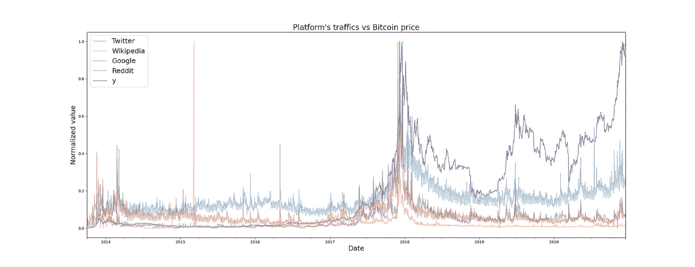
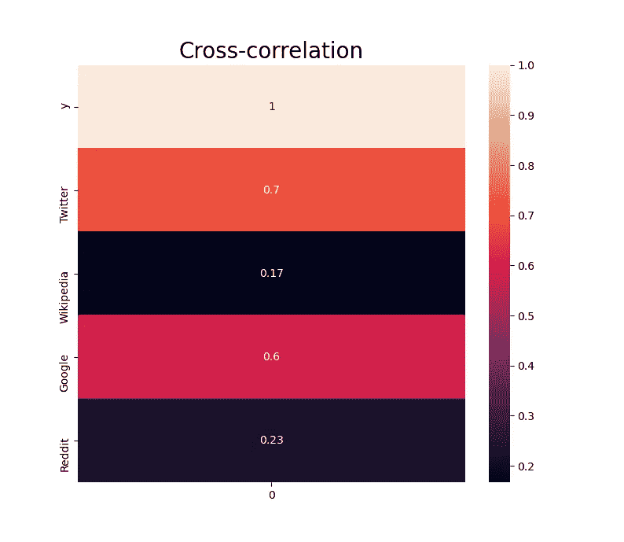
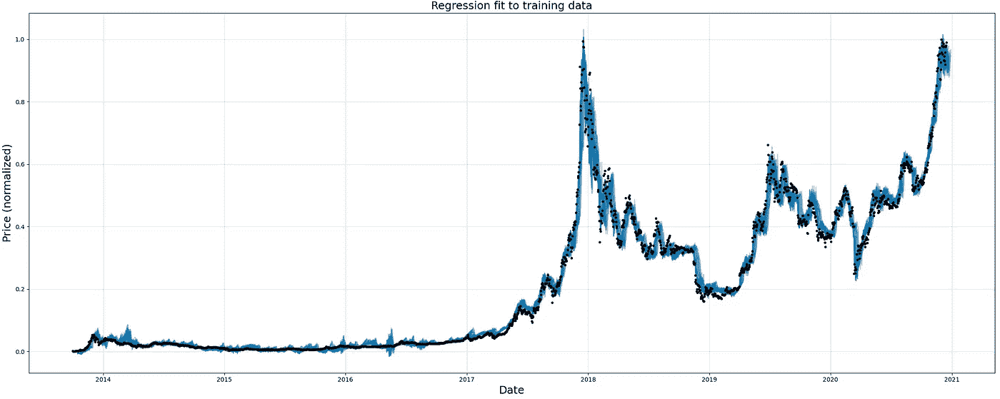
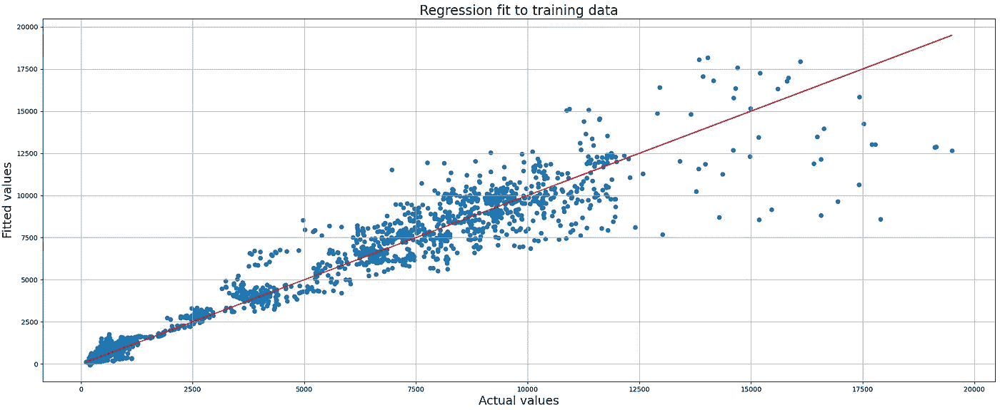
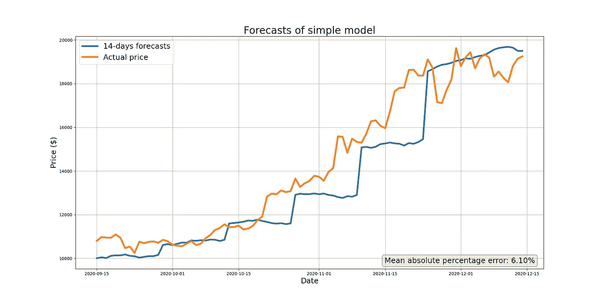
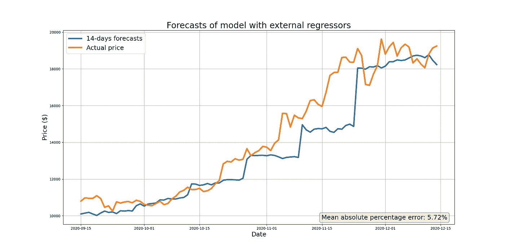

# 从在线平台收集数据以增强时间序列预测

> 原文：<https://medium.com/nerd-for-tech/scraping-data-from-online-platforms-to-enhance-time-series-forecasts-6eec3c68636d?source=collection_archive---------4----------------------->

利用推特、谷歌、Reddit 和维基百科预测比特币价格的亲身尝试

史蒂夫·伍兹在[的照片](https://www.shutterstock.com/image-photo/gloved-hand-using-ice-scraper-on-44027038)

# 介绍

在我们生活的这个数据驱动的世界里，网络抓取每天都变得越来越流行。无论是简单地从一个网站的多个页面中提取产品信息，还是创建将对某个问题给出可操作的见解的数据，“抓取”已经成为数据科学领域的一个流行词。

当进行时间序列预测时，找到合适的输入变量是最重要的。我们应该将输入变量视为外部时间序列，我们可以利用这些外部时间序列作为特征，以便对目标变量进行准确预测。

基于上述内容，我决定合并抓取和预测的概念，目的是演示如何轻松地从流行的在线平台中提取数据，并使用这些数据来提高其模型的预测准确性。在本文的上下文中，我们将从 Twitter、Google、Reddit 和 Wikipedia 收集数据，([1]，[3–6]，[8])，并用 Python 训练一个增强的 NeuralProphet 模型([2])，该模型利用收集的数据预测比特币的价格。

这里需要注意两件重要的事情。

首先，本文将展示的方法可以用于任何时间序列。比特币只是一个例子(考虑到它现在的趋势)。但是，请随意继续，并尝试用您感兴趣并想预测的任何东西来实现本教程！

*其次，我觉得有义务在这里写一个巨大的* ***免责声明*** *！请把这篇文章当成关于数据抓取/时间序列预测的* ***教程*** *仅此而已！不要用这种方法来指导你在哪里或者如何投资***！首先向具备所需知识的人寻求建议！**

# *步骤 1:收集数据*

*我们将收集的数据类型有:*

*   *包含“比特币”一词的**推文**的数量*
*   *关键词“比特币”的**谷歌趋势***
*   *subreddit *r/Bitcoin* 的新**帖子提交数量***
*   *维基百科上“比特币”一文的**浏览量***

*虽然对 tweets 或 Reddit 帖子的情感分析也可以提供大量的信息来源([3]，[4])，但我决定保持这个例子简单，只收集流量。文献中的一些工作表明，仅仅这些平台中的参与数量就表明了指数值的增加或减少([4]、[5])。*

*但别再说了。是时候让我们的手有点脏代码了。首先，让我们定义我们的函数，这些函数将对我们选择的每个平台进行搜集。*

*我们不想在这里重新发明轮子。我们希望以最简单、最快的方式提取有意义的数据，所以我们使用可用的即插即用库。*

*   *对于 Twitter，我们使用的是 [*snscrape*](https://github.com/JustAnotherArchivist/snscrape) 库，特别是它的 *twitter* 模块。我发现这个库的惊人之处在于，它使我们能够抓取 Twitter，而不需要通过官方的 Twitter API，也不需要显式地处理它将应用的所有速率限制。*
*   *对于 Google Trends，我们使用的是[*py Trends*](https://github.com/GeneralMills/pytrends/blob/master/examples/example.py)*库，特别是它的 *dailydata* 模块。**
*   **对于维基百科，我们使用的是[*pageviewapi*](https://github.com/ashermanwmf/pageviewapi)*库。***
*   ***对于 Reddit，我们使用 [*请求*](https://github.com/psf/requests) 库从 [*Pushshift API*](https://github.com/pushshift/api) 中获取数据。***

**每个库的请求参数和响应结构可能略有不同，但是它们都很直观，只要快速浏览一下它们的文档就很容易理解。这里我们可能想要注意的唯一一件事是，Reddit 的 *Pushshift API* 每次请求最多返回 100 个帖子，因此我们必须以 100 个为一批来计算每天的帖子数。**

**定义了所有的函数后，我们简单地用合适的参数调用它们，煮一杯咖啡(或两杯)，然后等待它们完成。**

**对于这个例子，我们收集了从 2013 年 1 月 10 日到 2020 年 12 月 15 日的每日数据。而且，玩笑归玩笑，考虑到它们必须处理的数据量，这些功能，尤其是 Twitter 功能，需要很长时间才能完成。但是，如果您希望使用最终的数据集，您可以在我的 GitHub [资源库](https://github.com/thanasisKirmizis/tds-forecast-bitcoin)中找到它。**

**比特币的价格历史数据是从[这里](https://coinmarketcap.com/currencies/bitcoin/historical-data/)下载的。为了简化我们的示例，我们只使用了可用数据中每天的收盘价。**

# **步骤 2:探索数据**

**太好了。我们已经成功地收集了所有的数据。现在是时候对它们进行一些探索了，以便对将要发生的事情有一些第一印象。**

****

**平台流量 vs 比特币价格(图片由作者提供)**

**事情开始变得有趣了。在读取、标准化和绘制我们的数据后，我们可以看到来自所有平台的流量至少在某种程度上与目标变量的变化相匹配。让我们通过计算互相关矩阵和对我们的列执行格兰杰因果关系测试来更深入一点。**

**在 [stackoverflow](https://stackoverflow.com/questions/58005681/is-it-possible-to-run-a-vector-autoregression-analysis-on-a-large-gdp-data-with) 上找到了计算格兰杰因果矩阵的函数**

****

**列之间的交叉关联(图片由作者提供)**

**虽然两个时间序列之间的相关性表明两者之间存在某种关系，但这并不一定表明因果关系。我们还需要一个指标来告诉我们一个时间序列的变化是否会引起另一个时间序列的变化。这个指标是格兰杰检验的 p 值，它告诉我们两个相关时间序列的变化是相互独立的。考虑到上述两个测试的结果，我们决定删除维基百科和 Reddit 上的数据，因为它们与我们的目标变量相关性很低，可能会使我们的模型更加混乱，而不是增强它。**

**作为一个额外的评论，维基百科的低相关性和高 p 值有点道理。人们去维基百科**了解**新的东西。但由于比特币进入市场已经有十年了，而且大多数用户已经知道了它，所以它在维基百科上的文章的浏览量并不能真正代表每天与它互动的人数。**

# **步骤 3:开发一个简单的模型**

**你们中的一些人可能已经熟悉了脸书的时间序列预测先知[7]。NeuralProphet 是 Prophet 上新发布的扩展，改进了后端的一些东西，也实现了自回归。如果您有兴趣了解更多关于这个非常有前途的包的信息，请前往[文档页面](https://neuralprophet.com/)。**

**对于我们的实验，我们将测试模型预测从 2020 年 9 月 15 日到 2020 年 12 月 15 日的 14 天窗口的能力。在每次迭代中，我们将使用截止到某个日期的所有数据来训练模型，然后从该日期开始对未来进行 14 天的预测。模型的自回归部分将包括 14 个滞后。受[这篇文章](https://towardsdatascience.com/time-series-modeling-of-bitcoin-prices-5133edfec30b)的启发，我们将训练我们的模型，禁用*每日 _ 季节性*，并将*季节性 _ 模式*设置为“乘法”。**

**本文的目的是如何**增强**我们的时间序列预测，让我们先构建一个简单的模型，不添加我们收集的数据，看看我们得到了什么。**

**为了快速可视化训练数据的拟合质量，我们应该根据实际数据绘制拟合图。**

********

**对训练数据的回归拟合(作者提供的图片)**

**好的，看起来拟合得很好，尽管有时较大的值被低估了。但是让我们切入正题，通过计算预测值和实际值之间的平均绝对百分比误差(MAPE)来评估测试集上的模型。**

****

**简单模型的预测(图片由作者提供)**

**还不错。该模型已经做了一些相当准确的预测，但它们似乎有点“陈旧”。看看添加从在线平台收集的数据是否会以某种方式增强模型的能力，应该会很有趣。**

# **步骤 4:增强我们的模型**

**NeuralProphet 允许我们用一个简单的命令在模型中添加外部回归变量。这些回归变量可以是滞后的，也可以是未来的。在我们的例子中，我们假设关于比特币**的在线流量先于**比特币价格的潜在变化，因此我们将添加我们的变量作为**滞后回归变量**。虽然这并不总是正确的，并且在这个主题上已经做了大量的研究([8])，但这足以证明本文旨在阐述的概念。**

**要在模型中包含外部回归变量，我们只需添加以下几行。**

**所有其他参数保持不变。让我们重新评估。**

****

**使用外部回归的模型预测(图片由作者提供)**

**通过添加粗略的数据，我们实现了 0.38%的 MAPE 下降，我们还可以看到，我们的预测更加“生动”地跟随实际值。虽然误差的减少不是很大，但我们不应该忘记，在我们的例子中，我们只是增加了两个回归量。人们只能想象这个模型的潜力，如果更多的，高度相关的目标变量，时间序列被发现和添加。**

# **结论**

**在本文中，我们将数据抓取的概念与时间序列预测相结合，以展示如何从在线平台提取流量数据，从而为我们提供可操作的见解并增强我们的预测。无论是我们使用的收集数据的方便的库，还是 NeuralProphet 令人兴奋的潜力，我希望你们都能发现一些有趣的东西来学习！**

# **参考**

**[1] Phillips，R. C .和 Gorse，d .,《加密货币价格驱动因素:小波相干分析再探》(2018)，PLOS ONE
[2]神经先知文档页，[http://neuralprophet.com/](http://neuralprophet.com/)
[3]buko vina，j .和 Marticek，m .,《情绪和比特币波动性》(2016)，MENDELU 商业和经济学工作论文 2016–58，布尔诺孟德尔大学商业和经济学院。
[4] Abraham，j .，Higdon，d .，Nelson，j .和 Ibarra，j .，利用推文量和情绪分析进行加密货币价格预测(2018)，《SMU 数据科学评论》
[5] Shen，d .，Urquhart，a .，和 Wang，p .，《推文预测比特币吗？(2019)，经济学快报
[6] Kristoufek，l .，比特币符合谷歌趋势和维基百科:量化互联网时代现象之间的关系(2013)，科学报告
[7]的先知文档页，[的](https://facebook.github.io/prophet/)
[8]李，x .和王，C. A .，加密货币汇率的技术和经济决定因素:比特币的案例(2017)，决策支持系统**