# 编写多阶段 Boss 战的脚本

> 原文：<https://medium.com/nerd-for-tech/scripting-a-multi-stage-boss-battle-86fb1c3b984d?source=collection_archive---------8----------------------->

## 如何在 Unity 和 C#中揭示它们的最终形式

2003 鸟工作室/东映动画集英社

这是一个漫长的编码和研究月，但我们在这里。我一直在构建的 2D 街机射击游戏就要完成了。只有最后一步摆在我面前:老板之战。

在这篇文章中，我将从头开始讲述组装这个东西的整个过程。老实说，我仍然很惊讶我没有遇到任何大的障碍或令人费解的错误。我对结果感到非常自豪。

让我们来看看。

# 银河爆破手

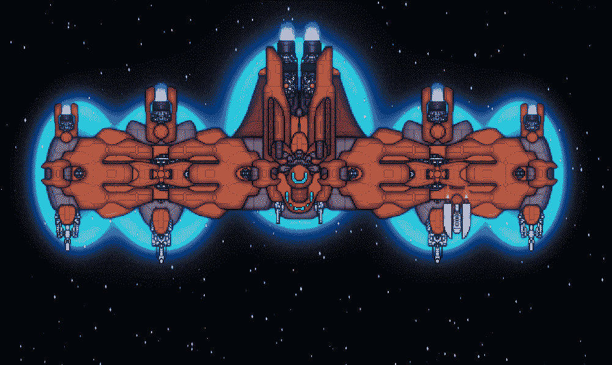

最后一个 boss 是巨大的无畏级:银河冲击波。不过，在代码中，我将把它称为“BigBadBoss”

这是这场遭遇战的初步草图:

战斗中的每一阶段都必须在下一阶段之前完成——因此第二阶段和第三阶段的对撞机被禁用，直到它们的前一波被摧毁。此外，玩家必须在第 1 和第 2 阶段消灭双方才能通关。

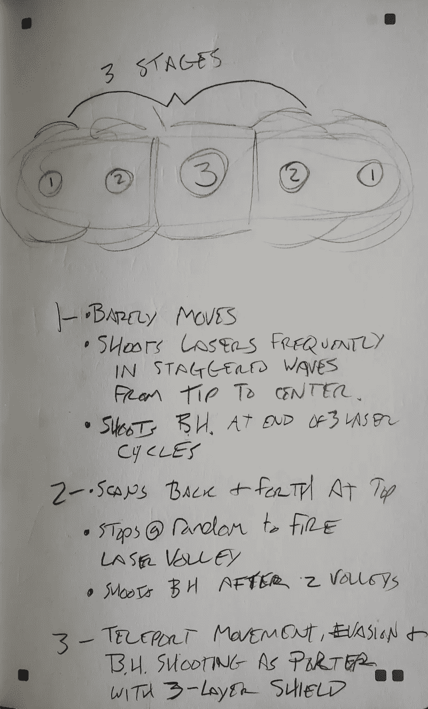

如果我认为除了我之外没人会看，这就是我的笔迹。

**第一阶段:** Boss 速度低，从盾牌无人机获得骑士的招式代码，虽然缩写为微小招式。它从每门加农炮的外部向内发射激光(每级两个)。在三次激光齐射结束时，它发射出一个黑洞抛射体。

**第二阶段:**外翼爆炸。Boss 加快速度，并开始在屏幕的左右边界之间来回移动(Boss 无法环绕)。和以前一样的齐射模式，但它发生得更快，黑洞每两次激光齐射就出现一次。

**第三阶段:**外层引擎爆炸。Boss 开始像“波特敌人类型”一样传送，并不断发射黑洞射弹。

我最初的计划是让每个部分在一个非常小的对撞机上受到一次撞击来摧毁每个部分。在阶段 3 期间，唯一被屏蔽的部分是中心部分。事实证明这太难了，我不得不更强烈地向玩家指出弱点。相反，我把对撞机做得更大，给每个部分都增加了护盾，并且需要三次撞击才能摧毁每个部分。这使得第一和第二阶段各有 12 次点击，最后阶段有 6 次点击。这样，玩家需要做的唯一猜测就是弄清楚只有外面的舞台会被损坏。

## 游戏对象剖析

因为老板分开了，我需要每一个部分都是它自己的游戏对象，它是舞台游戏对象的父对象，而舞台游戏对象又是整个老板游戏对象的父对象。

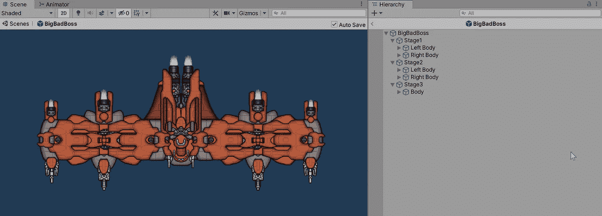

我还需要让 BigBadBoss 类知道整体的所有细节，这样我就可以根据需要销毁它们。嵌入每个身体部分的是空的游戏对象，作为激光和黑洞实例化的参考。

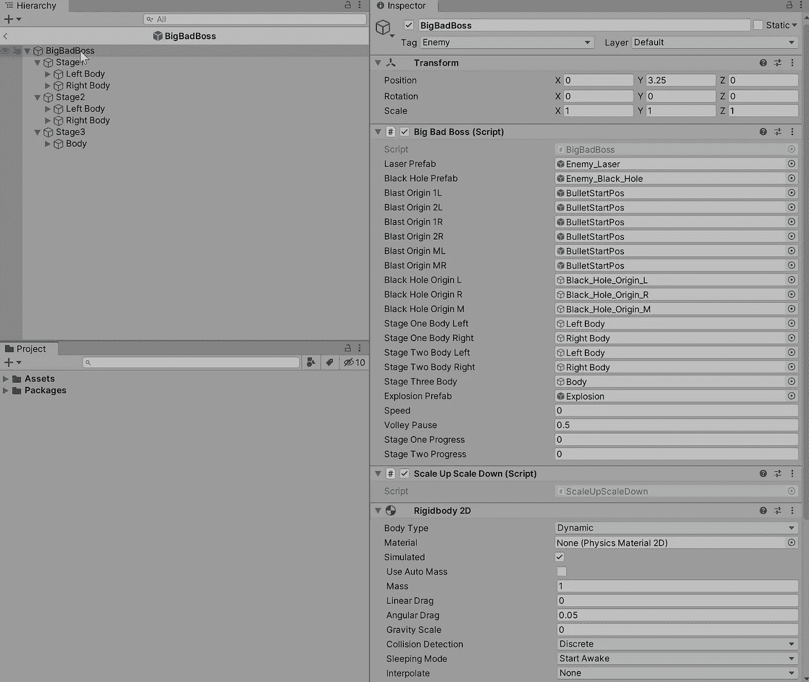

每个身体部分也有一个 BossSegmentDamage 脚本组件，它与主 Boss 类通信，并跟踪该部分的三个伤害羽以指示玩家击败该部分的进度，以及(在运行时实例化)一个盾。

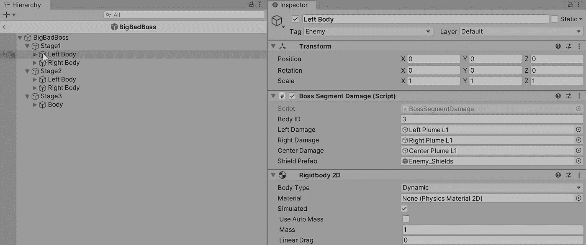

最后，阶段本身:

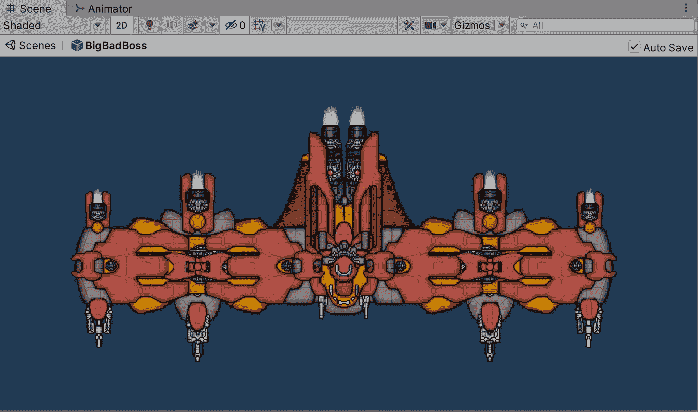

第一阶段

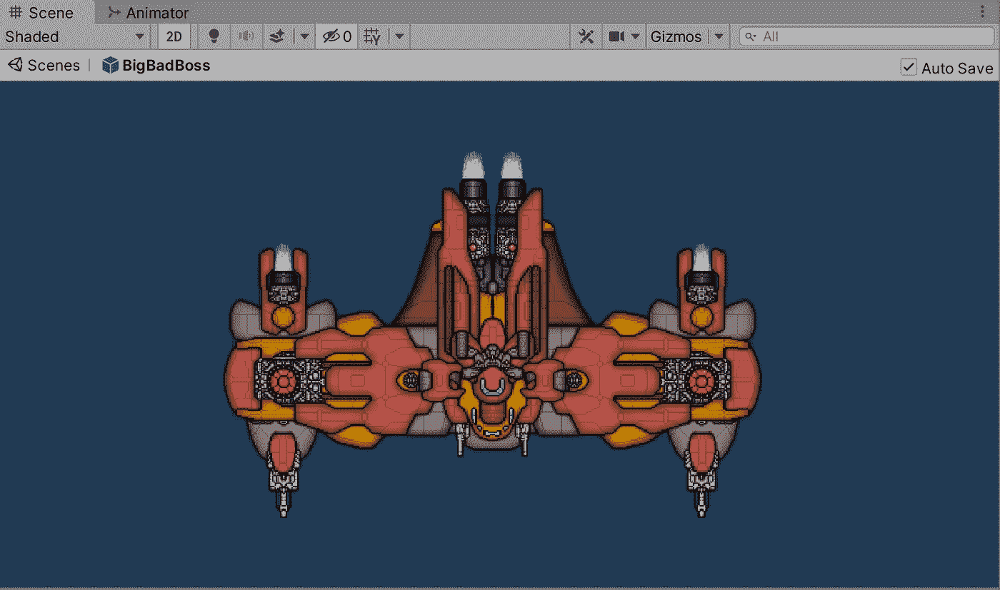

第二阶段

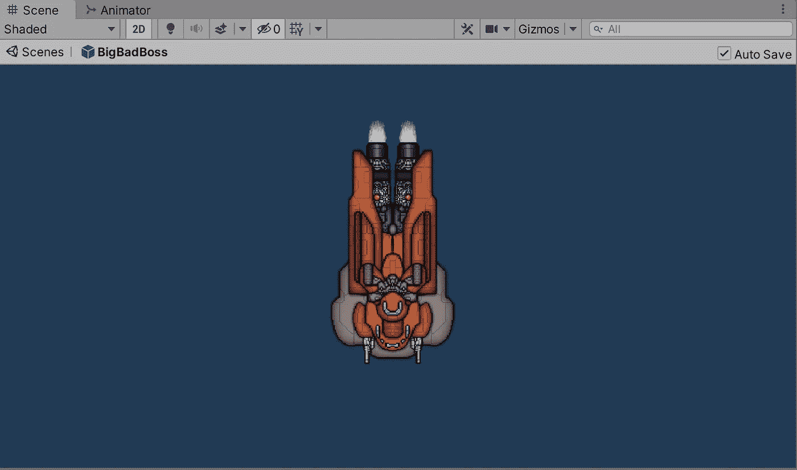

第 3 阶段

## 剧本

产卵经理知道，当我们到达波 13，老板是我们得到的唯一敌人。一旦它在现场，我需要它进入位置，开始它的编舞。对于最初的阻塞，我将设置一个 bool，我可以在 Update 方法中检查它。

BossChoreography 方法在每次阶段变化时都会被检查，并为每个阶段建立移动风格、速度和武器齐射时机。

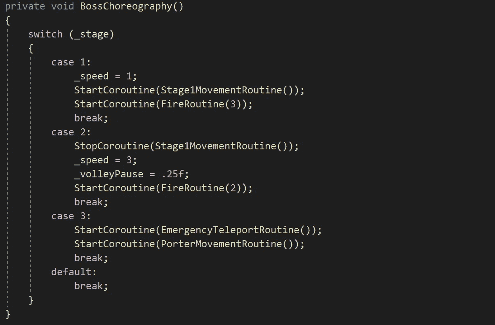

因此，在第一个阶段，我们正在执行 Stage1MovementRoutine，我们将 3 个截击传递给 FireRoutine(int cycles)。Stage1MovementRoutine 与盾牌无人机的移动例程相同。FireRoutine 需要一个整数来告诉 Boss 在发射黑洞齐射之前要运行多少次激光齐射。

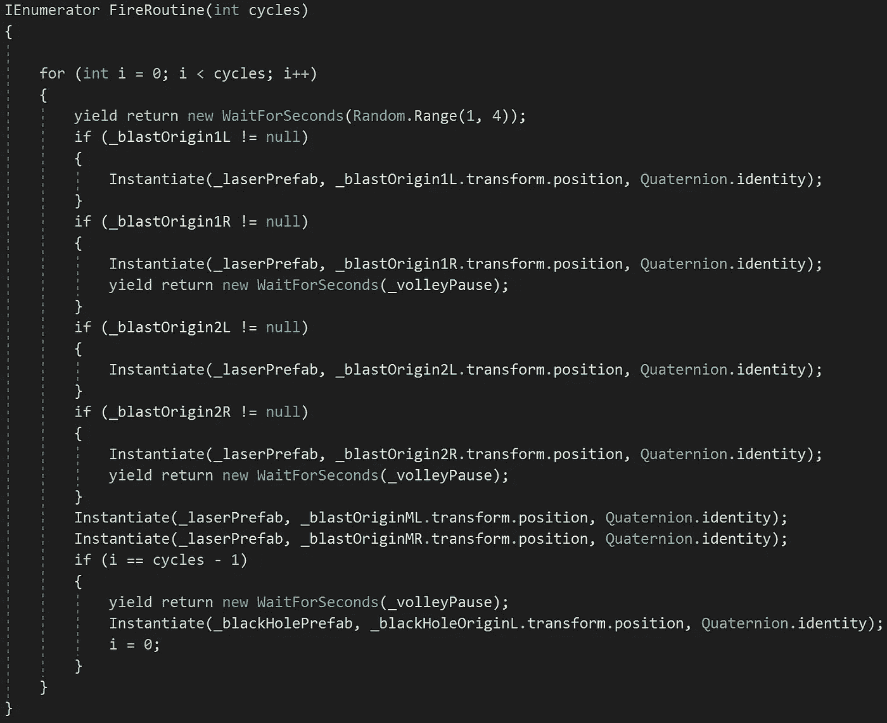

这个例程的关键是，当我到达 *i==cycles -1* 时，我将 I 设置回 0，以便在黑洞实例化后循环再次开始。

在动作开始之前，我们需要考虑的另一个 void Start()在 BossSegmentDamage 类中。在那里，我们为 boss 的每个部分实例化屏蔽，然后根据 bodyID 调整屏蔽的大小和位置。

现在启动已经完成，第一阶段正在运行。一旦外层部分受到足够的伤害，它们会向 BigBadBoss 发送一份关于它们的 bodyID 的报告。OnSegmentDestruction(int bodyID):

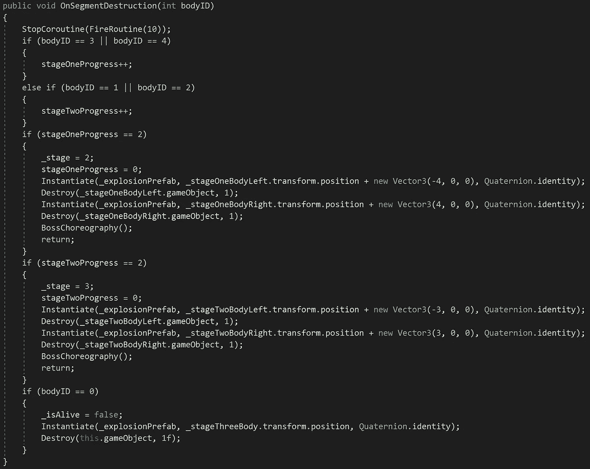

在这里，我们检查受到最大损害的身体部位的 bodyID。如果一个阶段的两个部分都完成了，则该方法实例化爆炸并销毁适当的身体部位。一旦发生这种情况，我们增加阶段，并在更新阶段切换的情况 2 时重新开始。

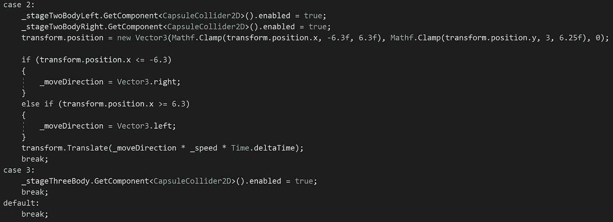

这为下一阶段启用了碰撞器。我这里还有第二阶段的动作代码。

最后，在第三阶段，我有了‘波特敌人类型’的传送和紧急传送程序——所以这里没有新的代码。

总的来说，我们的相遇是这样的:

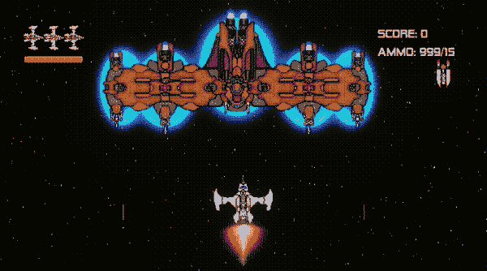

我把这里的图像质量归咎于介质；-)

这场战斗非常艰难。正如你可能看到的，我不得不给自己 1000 弹药，并关闭了我的碰撞器，以便轻松地向你展示战斗的所有阶段。

如果你想自己玩这个游戏，你可以在 https://simmer.io/@eMeLDi/galaxy-blaster[的 smember . io 上找到它](https://simmer.io/@eMeLDi/galaxy-blaster)

本文到此为止，本系列也是如此。我真的很喜欢制作这个游戏，完成它让我感觉很有成就感。我希望你喜欢跟随我的旅程，我希望你期待我在这个博客中详细介绍的下一个项目。

感谢阅读！