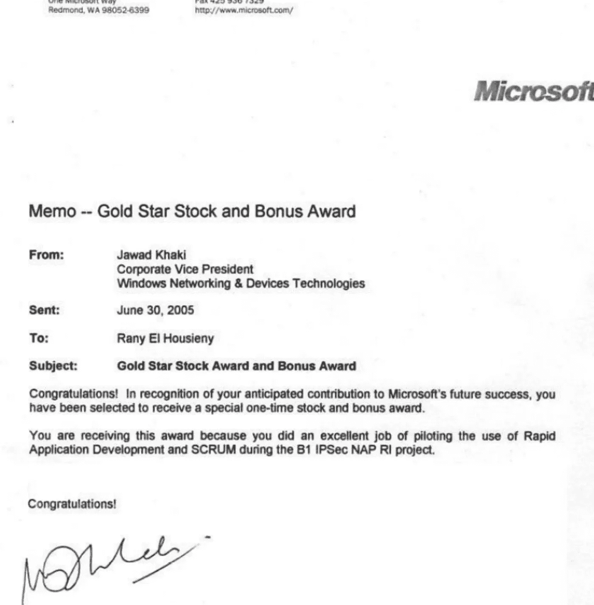

# Scrum 来拯救

> 原文：<https://medium.com/nerd-for-tech/scrum-to-the-rescue-76ba848bd19e?source=collection_archive---------13----------------------->

在我之前的一个团队中，我们每隔几年就会向客户交付一款产品。产品被分成几个部分。每个功能都属于一个功能组。每个功能组都在专用分支机构上开发和测试其功能。我们从主发布分支向客户发货。为了能够向发布分支发布任何特性，它应该通过某些质量关。这些质量关包括让 P0-P2 功能测试用例在一个特殊的环境中自动执行，这个环境足够隔离以测试客户机-服务器场景。这些测试用例将由另一个工具来度量，以确保它们覆盖了需要发布的新代码的 80%以上。它们必须通过可伸缩性、性能、压力和可靠性测试，以便不间断地连续运行。我们曾经和瀑布一起工作，每隔几年发布一次。在我们完成开发并发布第一个测试版之前，客户看不到产品。我们无法应用任何更改来满足客户的要求。运输周期是三到六年。我们设计了一个安全功能来保护网络免受没有最新更新或反病毒程序的易受攻击的机器的攻击。为了让这个特性进入发布分支，在开发结束后，质量团队花了 13 个月的时间，使用以前的瀑布模型在发布分支中检查这个特性，以便它可以提供给测试版客户。有很多地方可以改进。例如，质量团队花了四个月的时间来开发产品并制作自动化原型，这与开发代码有重复。此外，质量团队为自动化创建了一个框架，它本身就是一个产品，并且必须经历不同的迭代和质量问题。此外，开发人员必须将产品移交给测试开发人员，以了解产品如何工作，并学习如何为组件测试构建 mocks 和 stubs。完成框架后，我们花了另外四个月的时间将框架从测试开发人员转移到测试人员，并培训测试人员创建脚本，并将这些脚本添加到整个自动化框架中。之后，产品将在测试、开发人员和项目经理之间来回穿梭，以修复 bug、提高代码覆盖率、添加测试挂钩或提高可测试性。此外，还有许多月浪费在沟通不畅、范围/设计/功能蔓延上。设计上的一个小小的失误，直到几个月后才会被发现。

从我们收到来自客户的高级需求起 18 个月后，我们发布了一个测试版供特定客户试用。然而，经过几周的部署后，他们发现该解决方案存在漏洞，并且不能解决主要问题。不幸的是，“顾客不知道他们想要什么，直到他们看到它的工作”(Bentley 和 Whitten，2004)。他们认为最初的解决方案会通过更改从 DHCP 服务器接收的自动 IP 地址，将易受攻击的客户端与网络隔离开来。然而，真正的测试表明，客户在压力下完成他们的日常工作，他们会改变他们的自动分配的 IP 地址到一个静态的，并继续在网络上工作。不幸的是， ***开发过程不允许我们在花费数月或数年在一个可能不需要的功能上之前，向客户提供一个原型来尝试并给出更可靠的需求*** 。

在我们从客户那里收到新的需求之后，我们只有三周的时间来锁定稳定阶段的发布分支。这意味着，在不到三周的时间里，我们需要设计、开发、测试、构建自动化，并通过质量关，而在之前的特性中，这需要一年多的时间。经理们与副总裁进行了会谈，并决定不可能满足三周的窗口，他们即将关闭该功能。在这段时间里，我用新的开发方法制定了一个计划和路线图，这将使我们能够在不到 3 周的时间内发货，并让我们更接近客户，让他们尝试我们的早期迭代。

**解决方案**

我基于 Scrum、测试驱动开发(TDD)和快速应用开发(RAD)开发了一种新的迭代开发方法，以快速迭代，尽早进行测试，重用代码和单元测试，进行可测试性设计，减少沟通失误和过渡时间，并在设计代码时考虑测试和高覆盖率。此外，新流程将允许客户在流程早期参与，并消除浪费在扔掉工作上的时间。我从之前流程中的错误中吸取了教训，在创建新流程时避免了所有之前的问题。我把路线图、资源需求和风险缓解计划交给了副总裁和经理们。我提出了拯救产品和满足客户需求的计划。我设法得到了副总裁的批准和资源。我是一个团队的经理，负责按时交付这个产品。我承担了整个过程的所有权和责任。我超越了极限，扮演了不同的角色，作为 PM 组织可交付成果和调整设计，作为 Scrum master 监控进度和疏通团队，作为开发人员，因为我在解决方案的客户端提供了一个测试驱动开发的例子，作为 QA 设计自动化框架，构建端到端解决方案，并在整个过程中保持高质量。此外，我必须在过程的早期处理依赖关系，以确保所有的集成都到位，因为我们有很大一部分依赖于其他组。我从我们的副总裁那里得到了支持，并得到了一个可靠的承诺和可靠的时间来交付产品，从而在整个过程中顺利地完成所有事情。

***风险及缓解措施***

由于这是一个跨团队和跨学科的项目，我必须适应优先级冲突的风险，任何承诺的变更，或者来自依赖者、合作伙伴、开发人员或测试人员的延迟。因此，我必须让赞助商来推动这些优先事项。作为我向副总裁提出的计划的一部分，他承诺赞助项目并从合作伙伴那里获得服务协议。计划的每个部分都有一个后备计划，如果需要，我们有后备工程师。此外，我定义了关键组件，这些组件上的任何故障都会导致更大的故障，并给予它们更多的关注和缓解。此外，我必须考虑来自开发人员、测试人员或合作伙伴的延迟。因此，我们计划重用部分代码，使用备份工程师，或者从测试开发人员那里获得编码方面的帮助。此外，为了从每个人那里获得承诺，我必须有阻止它们的计划，并使每个成员得到最佳利用。例如，我已经提前要求实验室工程师和机器来解除开发人员的障碍，因为他们能做的最糟糕的任务是在开发期间设置场景并为测试准备端到端环境。我让他们自由地去做他们最擅长的事情，编码，并且利用了一个擅长设置场景的实验室工程师。这种方法让我能够让他们保持忠诚，尤其是来自合作伙伴和其他团队的忠诚。我必须尽早为他们提供一个工作接口，以测试他们的实现。除了将存根接口作为合同之外，我还创建了具有更少功能的重用就绪接口的备份计划，以防无法获得一些新接口，并设计了与这两种接口一起工作的代码。最后，我向我的 scrum 团队添加了合作伙伴和其他团队成员，以便能够查看进度，因为我是整个项目的所有者，不允许因为遗漏依赖而失败。一些合作伙伴在其他国家，我在 scrum 会议上使用在线交流。

***新方法论***

虽然敏捷开发已为公众所知，但要改变一个众所周知的瀑布过程，改变公司的习惯和环境，却是一项挑战。因此，我必须定制流程，并合并其中的一些以达到我的目标。下图总结了新方法的各个阶段，并将其与旧流程进行了比较。

新过程是一个迭代过程。它从代码设计文档开始，这是测试计划和测试工具设计的来源。这三个都经过了可测试性和代码重用的审查。我们重用了自动化的单元测试，这些测试从一开始就被设计成适合自动化框架。服务器端的开发人员创建模拟接口来测试客户端，反之亦然。开发人员很容易创建这些模拟，因为他们已经创建了代码并理解了功能。这样，我们就省去了开发人员和测试人员之间的转换和误解。此外，我们使用测试驱动开发，在原型阶段，单元测试、测试框架和测试用例由开发人员和测试人员共同开发。在这个阶段，开发人员和测试人员一起工作来产生一个原型，这个原型允许他们理解功能并解决任何技术问题。开发这个原型是为了让它可以被重用，而不是一个一次性代码。因此，我们用这个原型开发了单元测试，并用它的一部分作为模拟。在那之后，我们在迭代中工作，以产生一个以模块化方式端到端工作的解决方案，允许我们不断迭代。此外，它允许额外的需求和 bug 修复作为后续迭代的一部分。我们开发了最佳实践，考虑到代码覆盖率和可测试性的开发和设计。

**结果**

这种方法有两个主要结果。首先，它影响了直接产品，因为我能够在不到 3 周的时间内交付具有最新需求的新产品，以超过 85%的代码覆盖率通过自动化的质量关，通过压力、性能和可伸缩性测试。我能够满足客户的要求，同时也拯救了产品。我获得了巨大的认可、晋升和一个[金起点奖](https://rany.tk/static/goldstar-903d5dc81f6e748e390869ecf2a99eac.png)。我率先在公司内部获得了敏捷开发的培训。我也给其他团队提供培训。随着流程的进一步发展，我们能够自动更新以将更改应用于客户并接收他们的反馈。这种方法使得向客户交付特性成为可能，这提高了安全性，并转化为对我们双方的业务收益，它还开启了一个新时代，即在周期的早期让客户参与进来，以便能够获得早期反馈。此外，在流程的开始就加入 QA，为我们节省了在旧流程中浪费的大量时间。

其次，新方法对整个公司产生了战略影响。我将这个项目作为过渡到敏捷开发的试点。我一直在记录这个过程，并在考虑到未来适用性的情况下修改它。此外，我还收集了每位成员的反馈，以了解需要改进的地方，并将它们添加到我的最终提案中。因此，我能够将这一成功呈现给公司内部的所有其他团队。我接触了培训公司，并在公司内部创建了一个新的培训课程，为新的敏捷开发过程培训 Scrum 大师和开发人员。我能够将公司从瀑布式生命周期转变为敏捷开发生命周期，这有助于客户获得更快的更新和 bug 修复。

我被微软的副总裁授予了金星奖，因为我挽救了这个项目，并引入了一个新的敏捷项目来帮助满足客户

 [## Scrum 和建立高效的自我管理团队

### 18 年前(2003 年)，我向微软介绍了 Scrum 和敏捷(https://lnkd.in/gJy2GUJ)并获得了金星奖…

www.linkedin.com](https://www.linkedin.com/pulse/building-high-performing-self-managed-teams-rany-elhousieny-phd%E1%B4%AC%E1%B4%AE%E1%B4%B0/) 

**参考文献**

**安布勒，S. (2003)。敏捷需求:真正的信息。德弗克斯。检索于 2005 年 4 月 16 日，来自 http://www.devx.com/ DevX/Article/11801**

**本特利，l .，迪特曼，k .，&惠滕，J. (2004 年)。系统分析和设计方法(第 6 版。).纽约:麦格劳-希尔公司。**

福特雷尔，R. T .，谢弗，D. F .，T23 塞弗，国际法学会(2002 年)。质量软件项目管理。新泽西州上马鞍河:普伦蒂斯霍尔。

加尔布雷思，S. (2003 年)。需求分析:在软件购买决策中不带感情色彩。德弗克斯。检索于 2005 年 4 月 16 日，来自 http://www.devx.com/企业/文章/ 17541

科斯曼，R. (1997 年)。减少需求缺陷的两步法。软件工程年鉴，3477–494。

**麦凯布，r .&波伦，M. (2002 年)。你应该更敏捷吗？相声:国防软件工程杂志。检索 2005 年 4 月 15 日，来自**[**http://www.stsc.hill.af.mil/crosstalk/2002/10/mccabe.html**](http://www.stsc.hill.af.mil/crosstalk/2002/10/mccabe.html)

特纳，r .，&博姆，B. (2003 年)。软件管理中的人的因素:比较敏捷方法和计划驱动方法的教训。相声:国防软件工程杂志。检索于 2005 年 4 月 16 日，来自 http://www.stsc.hill.af.mil/相声/2003/12/0312turner.html

维斯特莱特特区(2005 年)。从敏捷企业到敏捷供应链的互联网速度竞争。商业整合杂志。检索于 2005 年 4 月 16 日，来自 http://www.bijonline.com/ Article.asp？部门编号=1