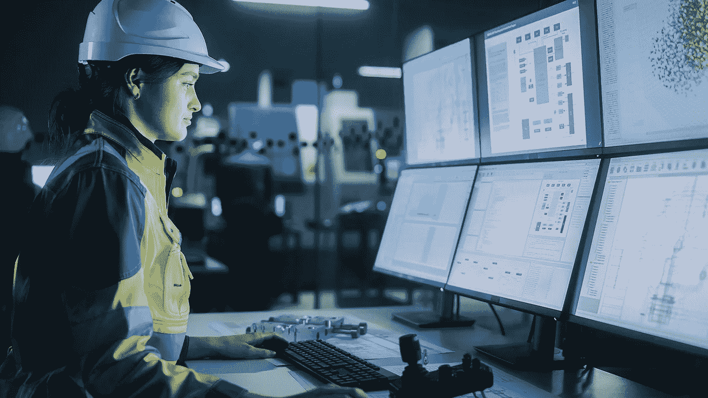

# 想要安全的关键基础设施？保护您的控制系统

> 原文：<https://medium.com/nerd-for-tech/securing-critical-infrastructure-takes-securing-control-systems-82d35b4b9c03?source=collection_archive---------10----------------------->

几十年来，一批专家和高级政府官员一直在发布关于美国关键基础设施遭受[“网络珍珠港”攻击的警告。鉴于过去几个月发生的事件——针对燃料和食品供应商的重大勒索软件攻击——这些警告看起来既有先见之明，现在也更加紧迫。](https://www.nytimes.com/2012/10/12/world/panetta-warns-of-dire-threat-of-cyberattack.html)

但这些警告中没有的一点是，美国可能无法判断导致美国重要基础设施相当一部分瘫痪的重大网络事件是单纯的灾难性事故还是恶意攻击。或者，更糟糕的是，如果这是一次攻击，它可能无法确定是谁干的。

应用控制解决方案公司的管理合伙人乔·维斯认为，这不是一个锡纸帽阴谋论。Weiss 还是工业控制系统(ICSs)方面的专家，工业控制系统运行着美国大多数关键基础设施的物理组件，包括管道、发电厂、供水和下水道系统、交通控制(即交通灯等)。)，还有更多。

ICSs 最初并不是为连接到互联网而设计的，但现在可以了。因此，如果运行它们的软件和监控它们的传感器被黑客攻击，损失可能是灾难性的。

虽然没有已知的网络攻击长期破坏美国关键基础设施的主要元素，但有多个短期影响的例子。“控制系统网络事件几乎发生在所有使用控制系统的关键基础设施中，包括电力、水、石油/天然气/化学品、管道、制造、运输、国防、建筑等。韦斯在[最近的一篇博文](https://www.controlglobal.com/blogs/unfettered/it-may-not-be-possible-to-recognize-a-cyber-pearl-harbor-as-a-cyber-event/)中写道。

其中最臭名昭著的是 2010 年针对伊朗核计划的 [Stuxnet 攻击](https://www.csoonline.com/article/3218104/what-is-stuxnet-who-created-it-and-how-does-it-work.html),归咎于美国和以色列，它们通过欺骗控制它们的系统来摧毁近 1000 台铀浓缩离心机，使其认为它们很好，而实际上它们正在失去控制。

据韦斯称，传感器正在检测出什么问题，但黑客已经能够控制显示器，显示器显示一切正常。

在 2021 年 2 月试图在坦帕附近的佛罗里达州奥尔德斯马尔的饮用水中下毒失败后，韦斯说，他已经记录了美国和国际上近 100 起控制系统水/废水网络事件，尽管“并非所有案件都与网络有关。”

“许多事件都是无意的。然而，这些影响可能是毁灭性的，”他写道，并引用了一家自来水公司无意中从超级基金井场向饮用水系统抽水的例子。

**焦点不对**

韦斯多年来一直警告说，对关键基础设施的不断升级的危险是由于对网络安全的关注过多，而对控制系统的关注不够。

“IT 网络网络攻击是短暂的，因为它们不会损坏涡轮机、变压器、泵、马达、阀门等设备。这就是为什么网络攻击不是‘网络珍珠港’，”他写道。

“然而(网络)是政府的重点。对于控制系统，则相反。通常当一个控制系统受到冲击时，影响是无法隐藏的——管道破裂、火车相撞、灯光熄灭、污水排放等等。相反，挑战在于识别网络电子通信是否在区分攻击和事故时发挥了作用。”

韦斯说，即使有，ICSs 中也没有足够的法医能力来快速做到这一点。他写道:“控制系统将构成一个‘网络珍珠港’，但这些关键系统和设备只有最低限度的网络安全、认证或网络日志记录。”。

在最近针对关键基础设施的勒索软件攻击中，这并不是一个问题，因为肇事者表明了自己的身份。

黑暗勒索团伙声称对[哥伦比亚输油管道攻击](https://www.politico.com/news/2021/05/08/colonial-pipeline-cyber-attack-485984)负责，该攻击导致东海岸近一周的燃料供应几乎一半被切断。对肉类供应商 JBS 的攻击中断了该国大部分的食品供应，是由 REvil 团伙实施的，他们最近攻击了网络管理公司 Kaseya Ltd

这些并不构成战争行为，但它们是网络攻击可能造成的身体伤害的不祥例子。

如果没有好的方法来判断一个事件是如何发生的，或者是谁做的，情况可能会更糟。“很少有事件像导弹发射一样明确或容易归因，”韦斯写道，但他补充说，“网络攻击的现象绝不是那么清楚。你可能知道控制或安全系统出现了故障或没有按预期工作，但这不太可能是无意的或网络攻击。”

事实上，2018 年 9 月，在马萨诸塞州梅里马克谷地区发生一系列天然气[爆炸和火灾后，花了数周时间才确认原因是人为错误，因为该事件——工作人员未能禁用，然后在压力实际增加时显示低压——是网络攻击可能导致的那种事情。爆炸造成一人死亡，22 人受伤，数百所房屋受损。2020 年，哥伦比亚大学被勒令支付 5300 万美元的刑事罚款。](https://www.justice.gov/usao-ma/pr/columbia-gas-sentenced-connection-september-2018-gas-explosions-merrimack-valley)

**设定优先级**

在一次采访中，韦斯想要澄清的是，他并不是说“谁和为什么”是最重要的事情——避免一场灾难才是。“如果我的飞机引擎着火了，我不关心它为什么会发生或谁可能会引起它，直到我把飞机放到地面上，”他说。“那我在乎。”

但他说，政府和关键基础设施行业仍然没有专注于修复控制系统特有的漏洞。他说，更好的网络安全以防止勒索软件攻击是一件好事，也是必要的，但还不够，因为它没有解决对 ICSs 的威胁。

新思软件完整性集团的首席安全顾问迈克尔·法比安(Michael Fabian)同意，网络安全需要更多地关注操作技术(OT)和信息技术(IT)。

他[告诉每日瑞士新闻](https://portswigger.net/daily-swig/us-dhs-issues-second-directive-for-securing-critical-fuel-supplies-in-wake-of-colonial-pipeline-attack)说，殖民管道攻击没有直接影响 OT 系统，但是公司担心攻击者已经“获得了信息，允许他们潜在地攻击他们运营的 OT 区域。在我过去 12 年进行的 OT/IT 评估中，我观察到许多违反基本安全概念的情况。”

但他说，他认为韦斯关于攻击 ICSs 造成灾难性破坏的警告被大大夸大了。他指出，在过去的 15 年中，已经有八项关于关键基础设施的总统行政命令，许多关键基础设施组织已经为其 OT 实施了安全计划。

“集成电路中的一些低级设备没有能力进行某些日志记录和数字取证，但这并不意味着我们不能弄清楚发生了什么，”他说。“社区和(拉尔夫)兰格纳(OT 安全咨询公司兰格纳的创始人兼首席执行官)对 Stuxnet 所做的出色的逆向工程就是证明。”

无论是公共部门还是私营部门，似乎都更加关注 ICS 安全——看看最近一系列关于关键基础设施安全的政府建议和命令，其中一些特别提到了控制系统安全。它们包括:

*   在过去的一周，国土安全部运输安全管理局(TSA)发布了一项[指令](https://www.dhs.gov/news/2021/07/20/dhs-announces-new-cybersecurity-requirements-critical-pipeline-owners-and-operators)，“要求运输危险液体和天然气的 TSA 指定的关键管道的所有者和运营商实施一系列急需的保护措施，以抵御网络入侵。”
*   上个月，联邦网络安全和基础设施安全局(CISA)发布了[“运营技术资产面临的勒索软件威胁日益增加”，](https://www.cisa.gov/publication/ransomware-threat-to-ot)一份详细描述“运营技术资产和控制系统”面临的威胁的情况说明书
*   二月份，在 Oldsmar 水处理系统攻击之后，联邦调查局、CISA、环境保护局和多州信息共享和分析中心发布了一份关于保护控制系统的联合咨询[，其中包括一份建议“安装独立的网络物理系统安全(CPSS)以限制控制系统被破坏时的任何损害。这些因素包括化学泵和化学储罐的尺寸、阀门上的传动装置和压力开关。”](https://www.mass.gov/doc/joint-fbi-cisa-cybersecurity-advisory-on-compromise-of-water-treatment-facility/download)

在私营部门——特别是汽车行业——新思科技公司网络供应链风险管理项目总监唐纳德·戴维森说,“在汽车工程师协会([SAE(](https://www.sae.org/works/committeeHome.do?comtID=TEAG32)) G32()上有很多活动，关注 IT 和 OT 领域的硬件和软件。”

他同意，早就应该认识到，网络安全不仅要涵盖信息系统(计算机和网络)，还要解决“通过集成电路(硬件)和软件实现数字化的东西”。

但他表示，SAE 已经“启动了一项新的 CPSS 标准，以应对”大量且不断增加的网络物理系统漏洞，这是由于广泛的攻击媒介利用支持网络物理系统的复杂硬件、软件和固件的集成来利用漏洞和弱点。"

网络物理系统是最重要的基础设施。

**任重道远**

尽管如此，Weiss 认为工业和政府在有效处理控制系统威胁方面还有很长的路要走。

他指出，T2 总统乔·拜登(Joe Biden)的“关于改善国家网络安全的行政命令”(EO)，没有提到控制系统或监控和数据采集(SCADA)，这是一种软件和硬件系统，允许公司在本地或远程控制工业过程。

事实上，Robert Chesney 和 Trey Herr 在 Lawfare 的[帖子中承认，“如果你想要一份处理关键基础设施的文件……这份 EO 不适合你。”](https://www.lawfareblog.com/everything-you-need-know-about-new-executive-order-cybersecurity)

韦斯说，最近一项关于 ICS 安全系统(如波士顿港的液化天然气罐)中使用的最先进压力传感器的网络安全研究发现，“没有网络安全，也没有认证。所以没有办法知道是谁告诉它做它正在做的事情，或者它是否来自传感器。”

“你确实有连续的压力数据记录，但它会被周期性地覆盖，所以你没有记录最近的数据。”

他说，有助于保护控制系统的是“离线的、不在互联网上的传感器，所以你知道你可以信任它们。现在这还不是常态。这是一个问题。”