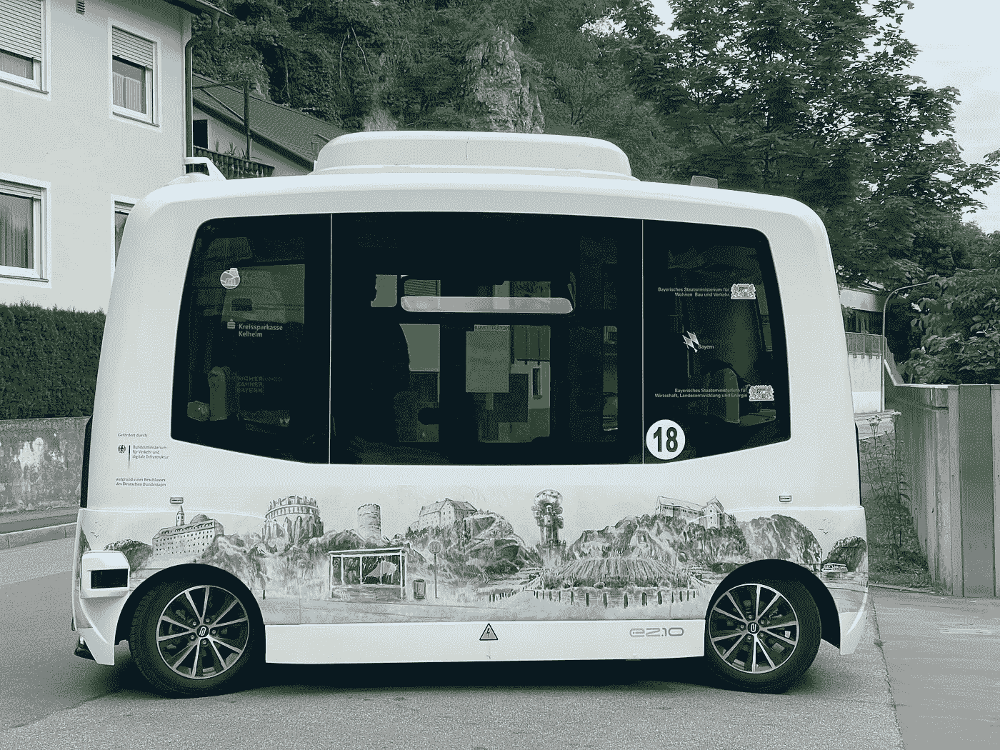

# 市中心的自动驾驶汽车，打破了 RoboBus 和 RoboTaxi 之间的界限

> 原文：<https://medium.com/nerd-for-tech/self-driving-cars-in-downtown-breaking-the-boundary-between-robobus-and-robotaxi-100b8340bdf9?source=collection_archive---------1----------------------->

在中国无锡结束的 2021 年世界物联网博览会上，青州宣布，该国首辆开放式 5G 自动驾驶网约车将在无锡上路，开始定期运营。自动驾驶行业也第一次发现，RoboBus 和 RoboTaxi 并没有什么不同。

## 小型公共汽车的优点

小巴业务是自动驾驶市场的一小部分。小巴轨道的成本没有那么刚性，商业链条也不复杂，更适合创业公司快速贯穿商业模式。相比之下，无人物流是一个涉及人、路、货、车、系统等的大轨道。，投入巨大，只适合有工业背景的大公司。

自动驾驶迷你巴士的另一个优势是，它们可以通向自动驾驶市场(RoboTaxi)，但这不是最终状态。投入的时间和成本是创业公司可以承受的。选择这样一个大市场的“小切口”，然后一步一步，以积小胜为大胜的方式逐步发展。

场景一样，技术也差不多。本质是为轨道交通最后 3 公里提供服务。既然人们通过平台叫出租车，那么公交车也可以通过平台叫。

未来的 RoboTaxi 永远不会基于量产汽车进行改装，而是服务于技术测试和迭代。相对于传统公交高峰期的不足和高峰期的高空驶率，网络订票模式更加灵活，公共交通资源的利用更加合理。

网约车的自动驾驶也可以更好地顺应智能、绿色、互联、共享等公共交通的需求和趋势。RoboBus 是实现 RoboTaxi 更务实的方式。在未来，技术和商业形式将会融合。在服务器端，自动驾驶小巴士将有一个专用的叫车平台。路线不固定，多人出行订单优先，区别于传统公交。

目前，青州智行的商业模式是与城市公交运营集团合作，通过弹性调度，提高载客效率，降低空驶率，实现“弹性发车”，降低成本。

根据他们的测算，如果未来两年能达到 1000 到 10000 辆的运营规模，这种模式在业务上是可以收支平衡的。

## 自动驾驶行业背后的数据标注服务

**标注越准确，算法性能越好。**

我们需要明确的是，对于 AI 公司和整个行业来说，数据标注是实现人工智能的重要一环。标注数据的准确性和效率影响着人工智能算法模型的最终结果。

驾驶过程中任何微小的错误都可能导致可怕的后果。如今，随着几起自动驾驶汽车事故的发生，人们越来越关注驾驶安全问题。

如果说之前算法模型使用的一般数据集是粗粮，那么算法模型目前需要的是定制化的营养餐。如果公司想要进一步提高某些模型的商业化，他们必须逐步从通用数据集向前发展，创建自己独特的数据集。由于大量的训练数据和高精度的要求，高质量的数据标注服务对于保证自动驾驶汽车对公众的安全至关重要。

## 常见的数据标注类型包括:

*   2D 包围盒
*   [车道标线](https://tinyurl.com/u7u4me)
*   [视频跟踪标注](http://tinyurl.com/wmu4yfhh)
*   点标注
*   三维物体识别
*   3D 分割
*   传感器融合:传感器融合长方体/传感器融合分割/传感器融合长方体跟踪
*   [语义分割](https://tinyurl.com/48w576p7)

# 结束

将你的数据标注任务外包给 [ByteBridge](https://tinyurl.com/ybubc5my) ，你可以更便宜更快的获得高质量的 ML 训练数据集！

*   无需信用卡的免费试用:您可以快速获得样品结果，检查输出，并直接向我们的项目经理反馈。
*   100%人工验证
*   透明和标准定价:[有明确的定价](https://www.bytebridge.io/#/?module=price)(包括人工成本)

为什么不试一试？

资料来源:http://app.myzaker.com/news/article.php?pk=617d1cfb8e9f0936a6384a45