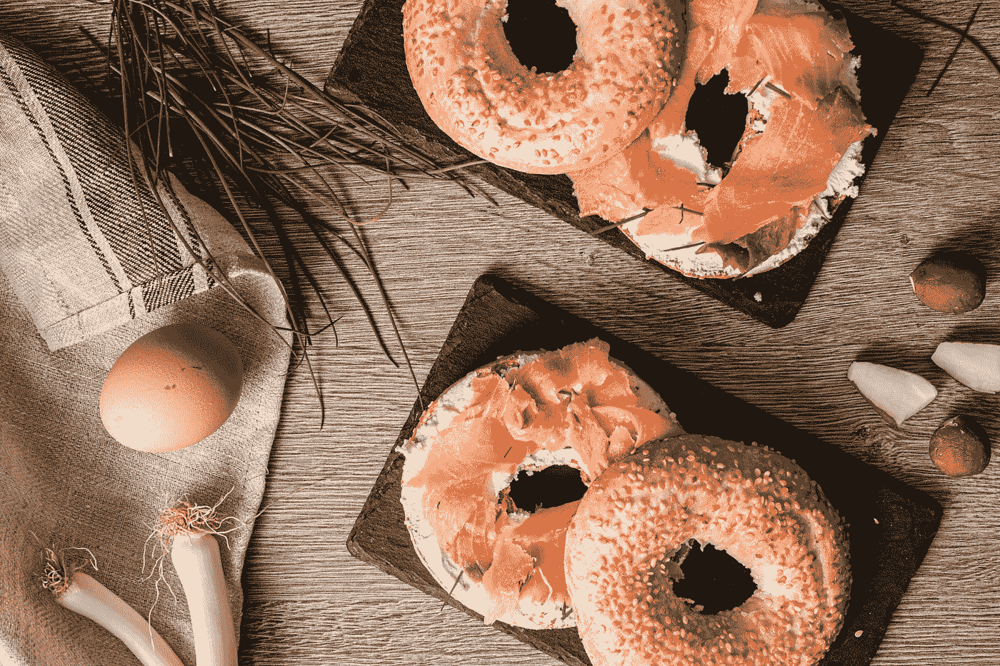
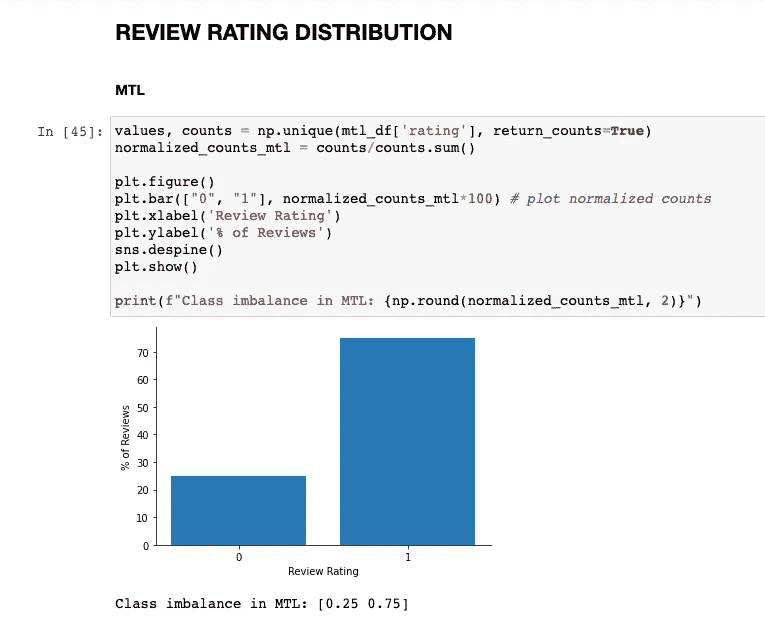
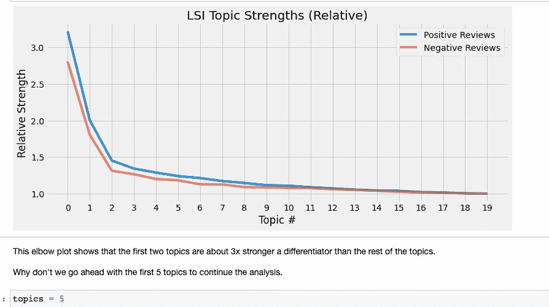
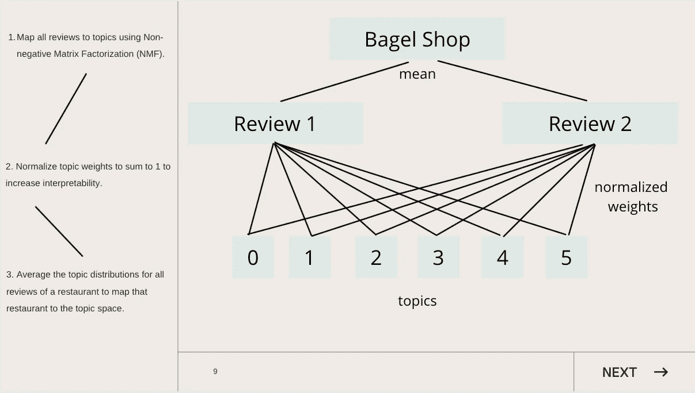

# 百吉饼店评论的情感分析——比较纽约和蒙特利尔

> 原文：<https://medium.com/nerd-for-tech/sentiment-analysis-on-bagel-shop-reviews-comparing-new-york-city-montr%C3%A9al-ffc4ef65a76f?source=collection_archive---------8----------------------->

可以肯定地说，大多数去过纽约或蒙特利尔的人可能都吃过百吉饼——这是一种可靠的、不含脂肪的食物选择，就像 24 小时营业的餐馆和街角小酒馆(或蒙特利尔的熟食店)一样无处不在。这两个城市都以百吉饼闻名，而且都倾向于声称自己的百吉饼比对方的好。如果你不知道这场争论有多激烈，问问去过或住在这两个城市的人就知道了。

2008 年，当美国宇航局官员问加拿大宇航员格雷戈里·查米托夫，他想带什么食物上发现号进行为期两周的太空飞行时，他从他堂兄的蒙特利尔百吉饼店*费尔蒙特百吉饼店要了新鲜的百吉饼。*

照片由[露西·利兹](https://www.pexels.com/@lulizler?utm_content=attributionCopyText&utm_medium=referral&utm_source=pexels)从[派克斯](https://www.pexels.com/photo/bagel-with-salmon-3957499/?utm_content=attributionCopyText&utm_medium=referral&utm_source=pexels)拍摄

对于当地人和游客来说，Yelp 可能会因为他们的商业页面属性，即游客留下的星级和评论，而影响你访问一家商店。

作为一项实验，我想看看我是否能确定百吉饼爱好者更喜欢哪个城市，为了回答这个问题，我开始了一项分析，并提出了这个问题:人们能在 Yelp 上比较两个地方(在我的情况下，纽约市和蒙特利尔市)的相同类型的餐馆(在我的情况下，提供百吉饼的餐馆)以确定哪个有更好的产品或服务吗？

作为一个住在蒙特利尔、去过纽约、尝过两种面包圈的人，我觉得自己是深入分析的合适人选。为了澄清区别，蒙特利尔风格的百吉饼是手工制作的，用木柴烘烤，与纽约风格的百吉饼相比，它更小，更薄，留有更大的洞，质地更致密，也更甜。纽约风格的百吉饼往往更大(像美国的所有东西一样)，内部更柔软，更耐嚼。

> 尽管在我的调查后无法说出哪个城市的百吉饼更好，但我相信，有了这些新信息，我的发现不再依赖 Yelp 上已经存在的数字属性，如星级和评论数，而是提供了对实际文本数据的观察，这些数据已经转化为对给定餐厅的百吉饼体验的有意义的见解。

据我所知，还没有任何数据驱动的方法来回答我提出的问题，但是，许多数据科学家已经使用 Yelp 的评论数据来预测餐馆的评级，并使用各种自然语言处理(NLP)技术来评估企业的未来发展，这在我考虑如何处理我的研究问题时对我很有帮助。

为了开始我的调查，我需要数据。我决定从 Yelp 中抓取以下属性来组成我的数据集:

*   餐馆名称
*   用户姓名
*   客户位置
*   审查文本
*   评审评级(客户)
*   审查日期

当我使用 Python 的网页抓取库 Selenium 和 BeautifulSoup 时，我一直被 Yelp 的网站屏蔽，最终我发现了一个免费的谷歌 Chrome 扩展，名为[“网页抓取器”](https://chrome.google.com/webstore/detail/web-scraper-free-web-scra/jnhgnonknehpejjnehehllkliplmbmhn?hl=en)。我在使用他们的服务时从来没有被屏蔽过，并且会推荐它。

我想对这两个城市的评论和评级行为有一个大致的了解，所以开始我的分析时，我只是从 Yelp 上搜集了大约 10，000 条评论和评级，其中包括各种类型的餐馆。事实证明，这在洞察方面没有太大帮助，所以我直接进入了百吉饼数据集，该数据集由纽约和蒙特利尔出售百吉饼的商店的大约 7300 条评论和评级组成。

一旦我把包含 Yelp 数据的 CSV 文件读入 Python，我就把它们转换成熊猫数据帧。在我进行调查之前，我确保每个 CSV 都由相同的列组成，以使我的清洗过程更加简化。

我删除了由 web scraper 生成的不必要的列，并为了可解释性而重命名了一些列。没有任何空值或重复值需要处理，但是，我必须转换“rating”列，因为它是作为字符串读入的。‘5 星评级’变成了简单的整数‘5’。

在刮擦过程中，我有一种预感，星级分布将非常不平衡，因为我主要只看到 5 星和 4 星评级。在未来，我希望将更多的审查数据导入到 ML 管道中，以平衡数据集，因为我相信这最终会导致扭曲的结果。接下来，我将评级列二进制化，这样评级为 4 和 5 的评论就变成了 1(正面)，低于 4 的评论变成了 0(负面)。蒙特利尔的阶级不平衡是 25%负和 75%正，纽约是 24%负和 76%正。

查看评论长度分布，每个城市的每个明星都有一个非常相似的分布，这让我有信心该模型会更少偏差。

一旦我将正面和负面评论二进制化，我就将它们划分到它们自己的数据框中，只有文本列。然后使用 TFIDF(术语频率的缩写-逆文档频率)和 1-grams 对每篇综述进行标记化，这给出了最一致的结果和清晰的主题。对于主题建模，我尝试了潜在语义分析(LSI)，潜在狄利克雷分配(LDA)和非负矩阵分解(NMF)。谁想出这些名字的？！

负面评论标记的单词权重对于 LSI 来说不是很好解释，但是，我能够根据主题强度来确定用于我的建模的主题数量。

我对 LDA 抱有希望，但最终由于我的班级不平衡和没有足够的负面评论数据，正面和负面评论之间的意义重叠使得很难理解主题，所以最终我决定选择 NMF，它给出了最可解释的结果和独特的主题。

我提出了两套不同的主题，分别针对负面和正面的评论。这在蒙特利尔和纽约之间有所不同，但差别不大。

接下来的过程包括将所有评论映射到主题，将主题权重归一化为 1，并对百吉饼店的所有评论的主题分布进行平均，以将该主题映射到餐馆。

这个过程在我的互动花枝可视化中看得很清楚，你可以在这里看到:

新建模的数据用于显示正面和负面评论的主题强度。

我开始确定哪个城市的百吉饼更好，但随着我花更多时间处理数据并开始建模，我清楚地知道，评论数据并不能真正反映哪个城市的百吉饼更好的问题，因为它们与其他事情太混为一谈了，如我在主题建模中看到的各种主题。

尽管在我的调查后无法说出哪个城市的百吉饼更好，但我相信，有了这些新信息，我的发现不再依赖 Yelp 上已经存在的数字属性，如星级和评论数，而是提供了对实际文本数据的观察，这些数据已经转化为对给定餐厅的百吉饼体验的有意义的见解。

我这个项目的下一步是在更大的 Yelp 数据集上更多地研究客户元数据，以分析当地人和游客之间不同的评论行为。花更多的时间在更好的标记化上(用更多的数据)来查看更多种类的主题也是有帮助的。因为负面和正面评论的意思有重叠，我也可以试着为所有评论创建一个单独的主题空间，而不仅仅是正面和负面的。

查看我的 GitHub 上的代码:[https://github.com/setadrift/capstone_1](https://github.com/setadrift/capstone_1)

谢谢，

邓肯·安德森
LinkedIn:[https://www.linkedin.com/in/duncan-kg-anderson/](https://www.linkedin.com/in/duncan-kg-anderson/)推特:@duncanand