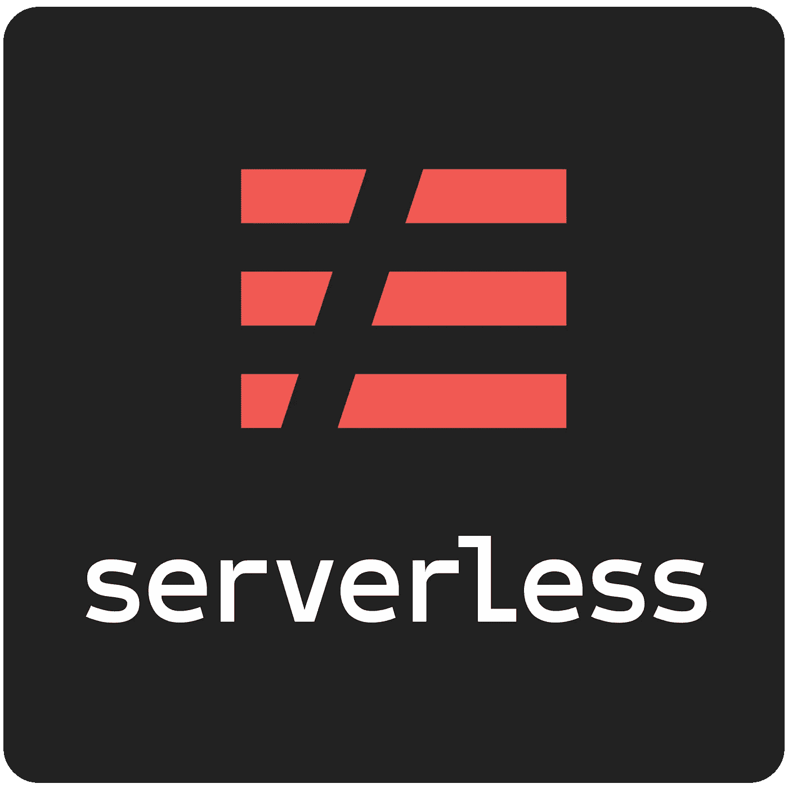

# 无服务器计算

> 原文：<https://medium.com/nerd-for-tech/server-less-computing-4376656b0e39?source=collection_archive---------5----------------------->

# 介绍

无服务器是一种在云基础设施上部署和运行应用程序的方法。它基于按使用付费的基础，不需要租赁或购买服务器。它是一种云原生开发模型，使开发人员能够构建和运行应用程序，而无需管理服务器。

在本文中，我们将了解无服务器方法的核心概念。

# 描述

[无服务器并没有忽视服务器的现实。](https://www.technologiesinindustry4.com/2021/11/lstm-meta-learner-in-machine-learning.html')它的软件需要硬件来运行。无服务器只是消除了公司和开发人员租用或购买服务器的需求。

我们将应用程序上传到无服务器提供商，以便设置和部署环境。它负责服务器上的传递、加载、应用程序控制、设置和执行。

提供者将应用程序保存在特定的容器中。[容器表示远程环境。](https://www.technologiesinindustry4.com/2021/11/lstm-meta-learner-in-machine-learning.html)这涵盖了运行应用程序的所有要求。我们可以把容器看作是室内植物的花盆。植物盆由泥土组成，里面塞满了植物生存所必需的所有矿物质。

[与花盆相同的容器](https://www.technologiesinindustry4.com/2021/09/what-are-containers-in-linux.html)允许无服务器提供者安全地移动和存储应用程序。这也允许根据需要执行它和制作它的副本。

无服务器的主要优势在于我们不需要进行任何类型的服务器管理。无服务器提供商为我们完成了这一切。然而，它确保了如果大量对应用程序的调用同时发生，它将克隆足够的容器来控制所有的调用。每个克隆体都是第一个克隆体的精确副本。如果需要的话，供应商可以制作成千上万的克隆体。

无服务器提供商对所有操作细节负责。例如，他知道应用程序存储在哪里。如何以及在哪里复制它，以及何时装载新的容器。类似地，他确保何时减少复制的[容器](https://www.technologiesinindustry4.com/2021/09/what-are-containers-in-linux.html)的数量来卸载空闲的服务器。

# 无服务器是如何工作的？

无服务器提供者为应用程序提供了一个与众不同的计算容器。计算容器是事件驱动的。因此，只有当一个明确的事件激活时，它才会被触发。事件是特定的外部动作。与物理触发器的作用完全相同。

**例子**

家庭灯是一个很好的例子，因为打开它们的事件可能不同。

*   一个明确的灯开关是由压力引起的。
*   运动传感器与运动检测纠缠在一起。
*   当太阳下山时，日光感应器会打开灯。
*   另一方面，容器不限于处理明确的事件和调用包含的函数。
*   此外，他们还放弃了自己制造事件的功能。
*   无服务器容器的功能是事件监听器和事件发射器。
*   无服务器提供者处理许多触发器。可以运行这些功能。
*   激活列表取决于提供者和实现。

# 无服务器架构

无服务器不同于其他云计算模式。云提供商负责处理云基础设施和应用的扩展。无服务器应用部署在容器中，容器在命名时会自动按需引入。

我们按照用户预先购买的功能单位向公共云提供商支付永不停机服务器组件的费用。那就是在标准的基础设施即服务(IaaS)云计算模型中运行应用程序。

[通过无服务器架构，应用仅在需要时启动。](https://www.technologiesinindustry4.com/)当事件激活应用程序代码运行时，公共云提供商积极为代码分配方法。当代码完成执行时，用户停止给出。无服务器为开发人员提供了与应用程序扩展和服务器供应相关的例行且不专业的任务。

以下内容全部卸载给云服务提供商，无需服务器；

*   日常任务，例如管理操作系统和文件系统，
*   安全补丁
*   负载平衡
*   容量管理
*   缩放比例
*   记录和监控。

# 无服务器使用案例

[无服务器架构是异步、无状态应用的最佳选择。那可以马上开始。类似地，无服务器适用于理解需求中罕见的随机流的用例。](https://www.technologiesinindustry4.com/)

*   传入图像文件的批处理。它可能偶尔运行，但也必须在大量图像同时到达时做好准备。
*   一项任务，如监视数据库的输入偏差，然后执行一系列功能。
*   无服务器应用同样适用于包括传入数据水道、聊天机器人、安排好的任务或业务逻辑的用例。
*   后端 API 和 web 应用
*   业务流程自动化
*   切断更少的网站
*   通过各种系统集成。

# 无服务器计算的优势和劣势

**优点**

*   无服务器计算可能会提高开发人员的工作效率并降低运营成本。
*   开发人员有更多的时间通过卸载配置和管理服务器的例行任务来强调他们的应用程序。
*   无服务器支持通过减少对开发人员的需求，允许采用 DevOps。也就是自由定义他们需要运营为他们提供的基础架构。
*   它可能会通过包含来自第三方 BaaS helps 的整个组件来进一步更新应用程序开发。
*   在无服务器模式下，运营成本很低，因为我们可以根据需要为基于云的计算时间付费。

**劣势**

*   [不运行自己的服务器或控制自己的服务器端逻辑会有缺点。](https://www.technologiesinindustry4.com/)
*   云提供商可能对其组件的交互方式有严格的限制，从而影响他们自己的系统的灵活性和定制程度。
*   IT 堆栈这些方面的让步机制也让我们陷入了供应商锁定。决定更换供应商同样会带来升级系统以遵循新供应商条款的成本。

[https://www . technologiesinindustry 4 . com/2021/11/server less-computing . html](https://www.technologiesinindustry4.com/2021/11/serverless-computing.html)