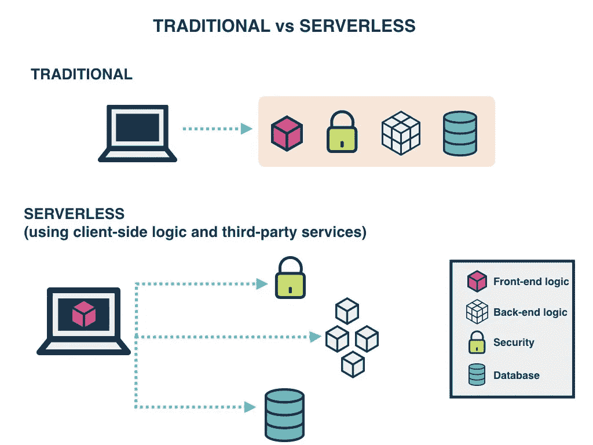
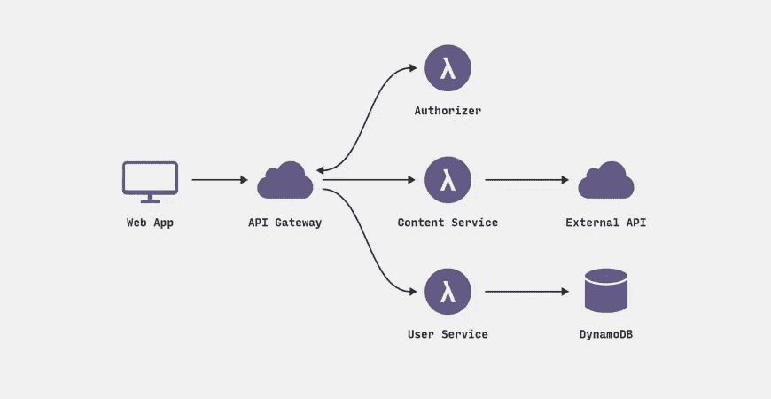

# 无服务器架构和应用-您需要知道的一切！

> 原文：<https://medium.com/nerd-for-tech/serverless-architecture-and-applications-all-you-need-to-know-fd363c11dfd?source=collection_archive---------11----------------------->

avaScript 是一种已经存在很久的编程语言。去年，在作为一种网络编程语言推出 25 年后，它完成了。与其他同类语言不同，这种语言随着时间的变化而不断发展。像网络应用、游戏和艺术等各种应用都可以用 JavaScript 编码。一个这样的应用是开发无服务器功能。在本文中，我将介绍无服务器架构和应用程序。

## 无服务器是什么意思？

无服务器是一种云计算执行模型，其中云提供商动态管理服务器的分配和供应。无服务器应用运行在无状态计算容器中，这些容器由事件触发、短暂(可能持续一次调用)，并且完全由云提供商管理。这些应用程序的定价是基于执行次数而不是计算能力。

**无服务器架构**被许多组织定义为构建和运行应用程序和服务而无需运行基础设施的方式。它提供了一种从一个人的工作负荷中去除架构责任的方法，包括像扩展和维护这样的责任。缩放和其他此类活动可以是自动的，用户只需为自己使用的服务付费。这种架构允许用户编写和实现代码，而不会给他们带来思考底层基础设施的麻烦。尽管顾名思义，无服务器并不意味着代码在没有服务器的情况下运行，而是意味着开发人员不再需要关心服务器管理。因此，在这种架构模型中，不需要预先购买或租用服务器来托管和执行服务器端代码。而**、无服务器应用、**也被称为**功能即服务或 FaaS、**是大多数行业云提供商提供的服务，他们只允许用户编写代码。幕后的基础设施由他们管理。用户可以编写各种功能来实现业务逻辑，然后可以很容易地将所有这些功能组合在一起，相互交流。云提供商提供的一些最受欢迎的 FaaS 产品有:

*   Azure 函数(微软)
*   AWS Lambda (AWS-亚马逊网络服务)
*   谷歌云功能(谷歌)

这些具有无服务器架构的无服务器应用程序具有一些固有的特征。它们如下:

*   进入门槛低:这意味着开始让自己的代码在无服务器架构中运行相对简单。学习使用无服务器并不需要很多先决条件。从而对进入这个领域的知识要求非常低。
*   **无主机**:使用无服务器架构意味着人们不再需要与服务器交互。由于没有服务器，这大大降低了维护的运营开销。
*   **无状态**:这意味着这些应用程序的状态在执行开始时被创建，在函数成功执行后被销毁。没有自动存储关于这些功能状态信息。如果用户需要存储状态信息，可以使用类似数据库的独立存储系统。
*   **弹性**:使用无服务器架构提供了巨大的弹性。它提供了巨大的可伸缩性。这也意味着不需要手动管理资源。因此，资源分配中的许多挑战消失了。
*   **分布式**:由于部署单元非常小，所以无服务器架构本质上是分布式的。许多组件必须通过网络集成，如身份验证、数据库、队列等。
*   **事件驱动**:这意味着你需要一个在执行这些功能之前发生的事件。事件可以是 REST API 请求、添加到队列中的消息等等。来自事件的响应也称为触发器，可用于启动无服务器应用程序的执行。

构建无服务器应用程序

## 优势:

1.  无服务器应用程序和架构的使用带来了许多好处，因为它提供了一种经济高效的模式，用户只需为所使用的服务付费，而不必担心内部架构的投资。
2.  “功能即服务”架构(即 FaaS 实现)允许开发人员创建独立、足智多谋的功能，如 API 调用。
3.  有了云提供商提供的所有服务，用户就不必担心基础设施的安全性和维护。
4.  对于开始自己创业的人来说，由于其模块化的性质，这增加了在市场上启动整个应用程序的时间，这使得可以部分启动应用程序，而不是一次性启动整个应用程序。
5.  使用无服务器允许开发者根据应用程序的使用和流行程度来缩减或投资应用程序。如上所述，它还有助于更快地部署应用程序和代码，并提供更大的灵活性。

因此，与传统的托管方法相比，使用无服务器架构为开发人员提供了许多好处。

## 局限性:

尽管无服务器应用程序为用户和开发者提供了各种各样的好处，但它也有一些局限性。

1.  使用无服务器的一个主要缺点是必须依赖云提供商来监控和维护系统，因为开发人员对内部架构的访问是有限的。
2.  此外，由于许多小部件将被集成到系统中，随着模块化的增加，系统往往变得非常复杂。
3.  由于一切都在云中运行，所以在开发阶段没有本地环境来测试和调试代码。这对于不太熟练且缺乏经验的开发人员来说是一个问题。
4.  如果从长远来考虑，由于集成了许多小组件，无服务器比传统的托管方法更昂贵。
5.  在这种架构中，云提供商控制着组件之间的交互，因此系统的灵活性和定制性受到了影响。
6.  冷启动也是无服务器应用程序面临的重大限制之一。

## 结论

无服务器架构当然非常令人兴奋，但是它也有很多限制。架构的有效性和成功取决于业务需求，而不仅仅取决于技术。同样的，无服务器也可以大放异彩，只是用在合适的地方，因为它不是所有问题的解决方案。因此，如果使用得当，无服务器架构只是部署应用程序的又一个选择，具有许多好处。

希望我能解释无服务器架构的基础。您可以参考下面参考资料部分给出的网站来详细了解无服务器。

参考资料:

1.  [https://www . thoughtworks . com/insights/blog/traits-server less-architecture](https://www.thoughtworks.com/insights/blog/traits-serverless-architecture#:~:text=Conclusion,distributed%2C%20and%20event%2Ddriven)/
2.  [https://new relic . com/blog/best-practices/what-is-server less-architecture](https://newrelic.com/blog/best-practices/what-is-serverless-architecture)