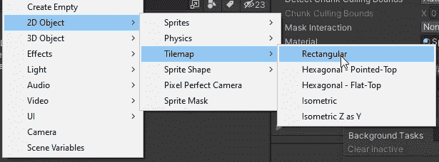
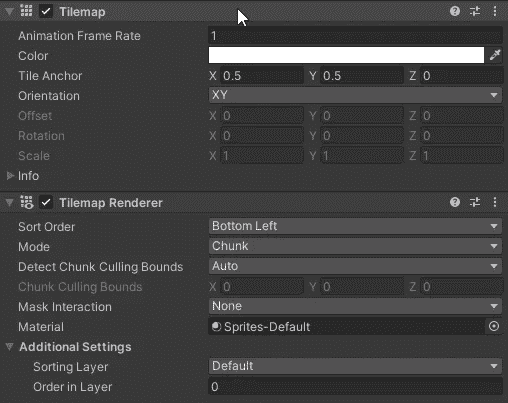
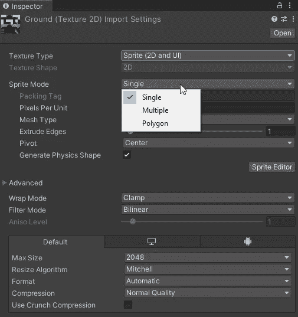
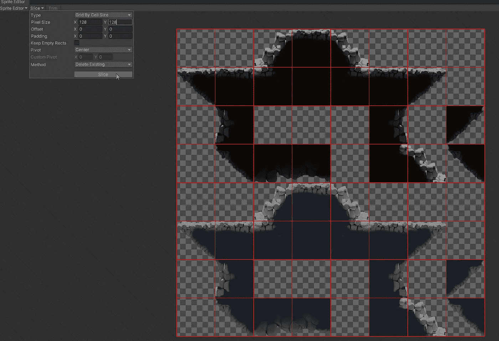
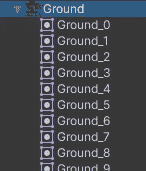
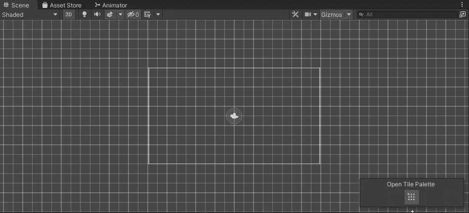
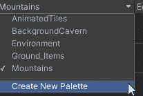

# 为 2D 游戏设置 Tilemap

> 原文：<https://medium.com/nerd-for-tech/setting-up-a-tilemap-for-a-2d-game-8b69a77070d9?source=collection_archive---------5----------------------->

目标:学习如何使用 tilemap 和导入精灵

大家好。我们有一个新的系列教程，我们将学习更多关于 2D 游戏开发的知识，我必须承认，我最喜欢这个了！

一旦你的 2D Unity 项目设置好并准备好了，你就可以立即开始创建网格，在上面绘制一个或多个 **tilemaps** 。确保您已经安装了所需的软件包！

然后让我们创建矩形 tilemap，它可以在 2D 游戏对象中找到。

一个 grid 对象出现了，带有一个子 tilemap:我建议你重命名它，因为你可以有不止一个。

在检查器中，您可以调整一些属性:关于网格，您可以选择单元格大小(注意 Z 变量，这意味着也可以使用 3D tilemaps)、单元格之间的间隙、形状等；对于 tilemap，您可以选择颜色、锚定、分类…

**锚定点**非常重要，因为瓷砖的位置可以根据其真实位置(矢量 3)或网格参考进行评估，即使用整数(矢量 3Int)。它们之间的转换由 Tilemap 类提供的方法来执行，但是知道由于所选择的锚定，可能存在偏移(例如 tile(0，0)- > world(0.5f，0.5f))总是有用的。

这就是在项目中放置 tilemap 所需要知道的全部内容。在后续教程中，我们将更好地探索许多有用的功能。

在结束之前，我想分享另一个关于你在 2D 磁贴地图中最常使用的小知识:**精灵**。

尤其是在使用 tilemaps 的时候，你可能(甚至想)会遇到“**多个**”的 sprite 模式。在这种模式下，你告诉 Unity 一个给定的图像包含不止一个精灵。你还必须告诉 Unity 如何识别不同的精灵，要么手动选择，要么提供一个规则。

如果你打开精灵编辑器，你可以看到一个**切片**下拉菜单，这将允许你选择如何切片图像:按单元大小，按单元号，或者你可以让 Unity 决定和识别单元。

现在你有精灵了！您可以在项目视图中看到不同之处:图像可以扩展以显示其所有切片精灵！

我们所要做的就是创建一个**调色板**。对于画家来说，调色板将是一种基本元素的目录(对我们来说是精灵瓷砖，对画家来说是颜色)，我们可以在我们的 tilemap(画家的画布)上绘画。要创建调色板，我们需要选择网格，然后打开瓷砖调色板(右下角)。

现在我们必须使用适当的按钮创建一个新的调色板。命名并保存它。拖动精灵到窗口，你的调色板就准备好了！

下次，我们要去画画！