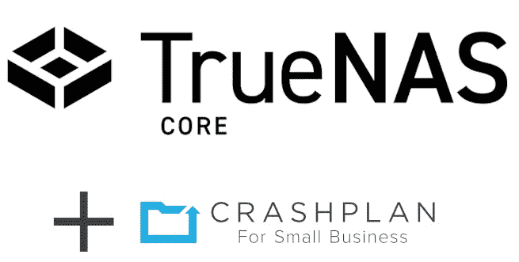
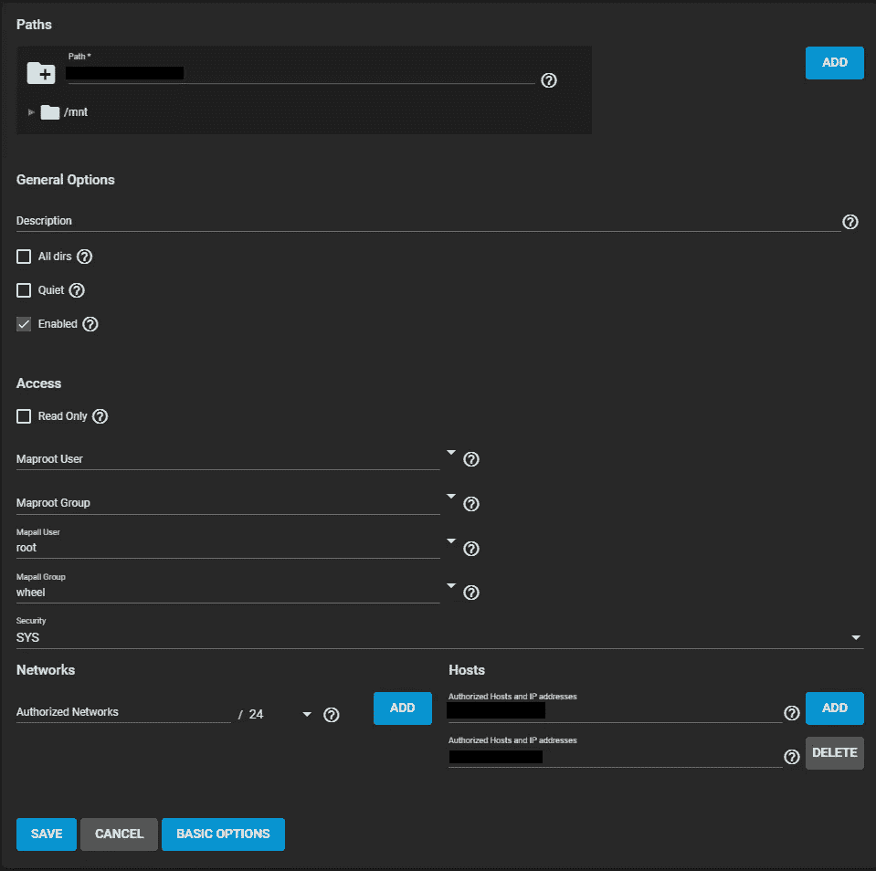
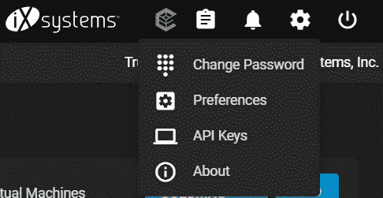
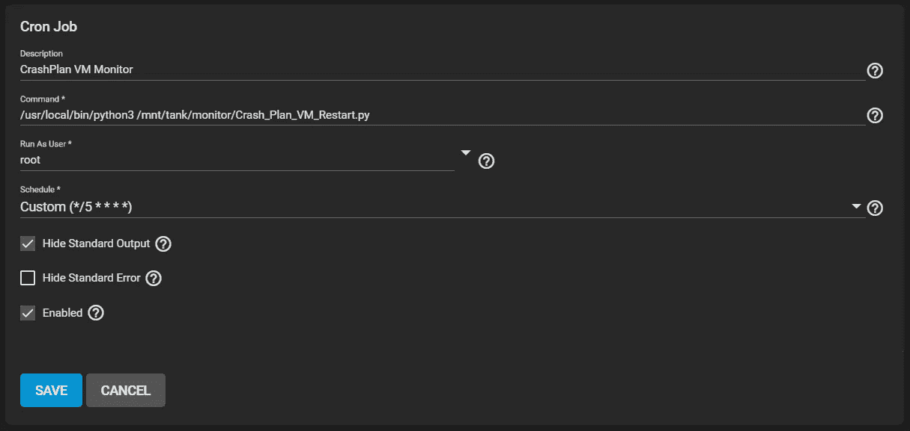

# 使用 Crashplan Pro 备份设置 TrueNAS

> 原文：<https://medium.com/nerd-for-tech/setting-up-truenas-with-crashplan-pro-backup-8707cb1f6e8b?source=collection_archive---------7----------------------->



我最近想更新我的 NAS 以使用 TrueNAS，因为它已经从过去的免费 NAS 走了很长的路。然而，我目前的 NAS 解决方案是一个定制的 Debian 服务器，带有 Linux 上的 OpenZFS、CrashPlan Pro、Plex、Syncthing 和各种监控脚本，用于擦洗 ZFS 水箱、监控我的 UPS，并向我发送电话警报。大部分内容很容易转换到 TrueNAS。不幸的是，CrashPlan 已经很久没有被支持了，我也找不到一个好的设置指南，所以我自己做了…

由于各种原因，Crashplan 不受支持。第一个 Crashplan 很久以前就放弃了对 FreeBSD 的任何支持和兼容性，这可能至少部分地使我更难做我想做的事情，也是 CrashPlan Pro 服务从 Java 转向 electronic 的结果。另一个问题是 CrashPlan Pro 基本上做了阿桂要求(再次可能是为了防止人们做我正在尝试做的事情)。以下是我如何让它在我的环境中工作。

# 在 Bhyve 虚拟机中安装 Debian

首先，你需要一个 Linux 虚拟机。TrueNAS 使得使用 Bhyve 直接从 TrueNAS 应用程序创建虚拟机成为可能。不幸的是，我经历了一大堆问题和烦恼，这也是我写这篇博客的部分原因。我选择了 Debian，但是理论上你可以选择任何你想要的。你应该选择一个图形安装有限的操作系统，因为 Bhyve 似乎对图形支持非常挑剔。你还应该选择一个由 CrashPlan 支持的、使用 UEFI 的操作系统(这样比夫·VNC 会玩得很好)。

接下来，创建您的虚拟机。在第一个屏幕上，检查配置设置，如下所示:


虚拟机设置的第 1 步

确保选择“Linux”的“客户操作系统”，选中“启动时启动”、“启用 VNC”、“延迟虚拟机启动直到 VNC 连接”，并设置“UEFI”的“启动方法”。

我创建了一个具有以下设置的虚拟机，这些设置略高于 Crashplan 的基本要求([https://support . code 42 . com/Small _ Business/Get _ Started/CrashPlan _ for _ Small _ Business _ requirements](https://support.code42.com/Small_Business/Get_Started/CrashPlan_for_Small_Business_requirements))，对于我的 24TB NAS 来说，这些设置似乎很好:3gb 的 RAM、100 GB 的硬盘空间(crash plan 需要相当大的空间用于缓存)、2 个 CPU、2 个内核和 4 个线程:


虚拟机设置的第 2 步

剩下的设置应该非常简单。确保保留网络设置，允许虚拟机拥有自己的 IP 地址，并选择和上传你的发行版的安装光盘(假设从现在开始使用 Debian)。

在启动虚拟机之前，单击它，转到“设备”，然后单击 VNC 设备上的“编辑”。将分辨率设置为“800x600”或“1280x1024”。这一点很重要，否则当你启动虚拟机时，你会看到一片混乱。

现在启动虚拟机。然后使用内置 VNC 显示器进行连接。出现提示时，快速选择“受限图形”安装程序。现在像平常一样安装。我推荐使用像 XFCE 或 LXDE 这样的轻量级 GUI。在安装程序中检查“OpenSSH 服务器”是非常重要的。我也会取消选择“打印服务器”。

一旦安装完成，它会告诉你删除安装盘，并重新启动。据我所知，唯一的方法是在 TrueNAS 中导航到虚拟机下的“Devices”选项卡，然后删除 CDROM 设备。

现在点击 VNC 设备上的编辑，取消选中“延迟虚拟机启动，直到 VNC 连接”。最后，将分辨率编辑为您希望正常使用的分辨率。我设置为“1600x1200”。无论您选择什么，请确保它是一个标准分辨率，并记住它，因为我们以后会需要它。

# 修复引导

当您启动您的新虚拟机时，您可能会发现自己在 UEFI shell 中进行设置，并且虚拟机不会引导到 Debian。出于我不完全理解的原因，Bhyve 似乎不能自动切换到 Debian UEFI config。别担心，我们现在会解决的。

从 UEFI shell 执行以下序列:

```
Shell> fs0:
edit startup.nsh
\EFI\debian\grubx64.efi
ctrl-s <cr>
<enter>
ctrl-q <cr>
reset
```

此时，您的虚拟机应该在延迟后正常启动。然而，你看到的不是图形显示，而是控制台输出或混乱的画面。别担心，我们会马上解决这个问题。

# 固定 X 窗口(图形显示)

现在，您需要进入虚拟机的命令行提示符。从 VNC 访问，您可以通过 Ctrl +Alt + F1 切换到新的控制台，但是如果这不起作用，您可能需要 SSH 到您的虚拟机。现在得到一个根壳。

我们需要做的第一件事是修复我们的环境，并在更新 grub 之前安装 vim，以正确设置我们的分辨率:

```
# apt update
# apt install vim
# export PATH=$PATH:/sbin:/usr/sbin
# vim /etc/default/grub
```

现在将以下两行添加到/etc/default/grub 中，替换任何现有的类似行，并更改分辨率以匹配您之前为 Bhyve 的 VNC 设备设置的分辨率:

```
GRUB_GFXMODE=1600x1200
GRUB_GFXPAYLOAD_LINUX=keep #Not sure this is needed
```

保存文件，然后运行以下命令:

```
# update-grub
```

最后一步是告诉 XWindows 为图形界面使用 fbdev 设备。为此，我们需要创建“/usr/share/X11/xorg . conf . d/10-FB dev . conf”。把以下内容放进去:

```
Section "Device"
    Identifier "Card0"
    Driver "fbdev"
EndSection
```

这最后一步在我所能找到的任何地方都没有记录，但是我能够根据设置基于 BSD 的 VM 的说明来推导出这一步。

此时，您应该能够重新启动虚拟机。然后通过 VNC 重新连接，最终会看到一个图形化的登录界面。

出于我不知道的原因，有时 X Windows 会在启动过程中到达 X Windows 启动点时无法启动，如果你没有通过 VNC 连接的话，至少在 Debian 中是这样。然而，这对于备份来说并不重要，因为 Crashplan 服务已经启动了。如果您通过 VNC 连接，并看到控制台输出声明 X Windows 即将启动，要么通过 SSH 登录并重启 X，要么重启 VM，然后立即通过 VNC 连接，直到它进入登录屏幕。

# 配置崩溃计划

首先你应该安装 CrashPlan。这应该很简单。只是去抓取安装 tar.gz，解压缩它，运行安装程序作为根。在 Debian 和 Ubuntu 上，所有的默认选项都应该没问题。

我们需要向虚拟机公开我们的 NAS 共享，以便 CrashPlan 可以备份它们。据我所知，没有办法，至少从 TrueNAS 接口可以像在 TrueNAS 监狱中那样直接暴露它们。我想到的解决方案是通过 NFS 共享我的 NAS 文件，并将其装载到虚拟机中。

为此，点击 TrueNAS 中的“共享”，然后点击“Unix 共享(NFS)”。现在点击“添加”。在“路径”部分，选择要备份的文件的路径。在我的例子中，我只是把 ZFS 坦克的根挂载点。确保选中“启用”框。现在点击“高级选项”。确保将“Mapall 用户”设置为“root”，将“Mapall 组”设置为“wheel”。安全性应设置为“SYS”。在主机下，添加 Crashplan 虚拟机的 IP。这些设置将确保可以装载 NFS 共享的任何人都具有完全访问权限，并且只有 CrashPlan 虚拟机 IP 可以装载 NFS 共享:



使您的设置看起来相似。

现在点击“保存”。

回到你的 CrashPlan 虚拟机。从根控制台运行以下命令:

```
# apt update
# apt install nfs-common
# vim /etc/fstab
# mkdir /mnt/*<your share mount point>*
```

在/etc/fstab 末尾添加以下内容:

```
*<ip address of your NAS>*:*<NFS export path> /mnt/**<your share mount point>* nfs  defaults  0  0
```

如果这让你困惑的话，下面是我的样子:

```
192.168.20.150:/mnt/tank /mnt/tank nfs  defaults  0  0
```

现在重启你的虚拟机。当您重新登录时，您应该能够转到/mnt/tank(或者您的 NFS 挂载应该挂载的位置),并且您应该看到您的所有 NAS 文件。最后，您应该能够浏览和添加/删除文件。

此时，您应该能够配置 CrashPlan 来备份您的文件。

# 监控和重启 CrashPlan

如果你和我一样，有相当大量的数据(即使没有也有可能)，你会发现 CrashPlan 的备份服务偶尔会崩溃，尤其是在初始备份阶段。为了防止您的备份停止，最好创建一个 cron 作业来对此进行监控，并自动重新启动 CrashPlan 服务。此外，我发现 Crashplan 有一种倾向，大约每 24-32 小时就会发疯并锁定整个虚拟机。发生这种情况时，您无法通过 SSH 或 VNC 访问它。

**解决 CrashPlan 服务死亡的第一个问题:**

第一步是创建一个重启脚本。我在我的 NAS 共享上创建了它，这样它也可以得到备份。在我的例子中，脚本位于“/mnt/tank/Monitor/Crash _ Plan _ Monitor”。以下是该脚本的内容:

```
#!/bin/bashps auxw | grep -q [C]ode42Service || systemctl restart code42
```

基本上，如果“code42”服务没有运行，上面的脚本将重新启动它。一旦创建了脚本，就应该确保“chmod +x”它。现在，在 Crashplan VM 中，使用“crontab -e”作为 root 编辑系统 cron 选项卡，并在底部添加以下行(根据您的用例适当地更新路径):

```
* * * * * /mnt/tank/monitor/Crash_Plan_Monitor
```

现在，cron 作业将每分钟运行一次，如果由于任何原因而终止，它将重新启动 CrashPlan。

**解决 CrashPlan 完全锁定虚拟机的第二个问题:**

这个问题有点复杂。我发现，仅仅创建一个 cron 作业来每 24 小时重启一次虚拟机是不够的，因为虚拟机会完全锁定，甚至这个 cron 作业也无法运行。为了解决这个问题，我创建了一个心跳脚本，然后创建了一个监控脚本来从外部重启虚拟机。我们来看看步骤。

第一步是创建心跳脚本。这很简单，只需向 Crashplan 虚拟机的根 crontab 添加以下行，类似于我们在上面添加之前的 cron 作业的方式:

```
* * * * * touch /mnt/tank/monitor/crashplan_heartbeat
```

这将每分钟运行一次(当虚拟机未完全锁定时)，并更新 NAS 共享上“crashplan_heartbeat”文件的修改日期。最好将 CrashPlan 更新为不尝试备份该文件，否则它可能会无休止地备份该文件。

为了处理这个文件的监控和 VM 的重启，我们将利用 TrueNAS 的 API 和 cronjob 功能。首先我们需要一个 API 密匙。使用完全特权帐户登录(我使用的是“root”帐户)，然后单击右上角的齿轮图标，然后单击“API Keys”



API 键菜单

现在，单击“Add”并创建新的 API 密钥，确保复制它显示的 API 令牌。

现在创建下面的脚本(显然要修改以匹配您的路径):/mnt/tank/monitor/Crash _ Plan _ VM _ restart . py

您的脚本应该如下所示:

崩溃计划监控脚本

确保将 API 令牌放在“bearer_token”变量中。“crashpan_vm_name”变量应该包含您的确切 CrashPlan vm 名称，如 TrueNAS VM 页面上所示。“heartbeat_path”变量应该是我们之前设置的心跳文件的路径。

上面的脚本将检查心跳文件的最后修改日期是否早于三分钟。如果是，脚本将对 TrueNAS 进行 API 调用，以停止并重启 CrashPlan 虚拟机。有一个 API 调用来重启 VM，但是我选择分别调用 Stop 和 start，因为至少在 TrueNAS web 应用程序中，在锁定的 VM 上单击“restart”似乎并不总是可靠的。你可以在这里找到更多关于 TrueNAS API 调用的信息:[https://www . TrueNAS . com/docs/hub/additional-topics/API/rest _ API/](https://www.truenas.com/docs/hub/additional-topics/api/rest_api/)

我们需要做的最后一件事是在 TrueNAS 上创建 cron 作业来启动我们的 VM 重启脚本。为此，请在 TrueNAS ->任务-> Cron 作业中导航。单击“添加”并对其进行配置(根据您的情况需要更新路径):



在我的示例中，我将作业配置为每五分钟运行一次，这应该足够了。

就是这样！尽管 CrashPlans 有崩溃和锁定的倾向，您现在应该有可靠工作的备份。

# 防止坠毁计划锁定的持续冒险…

写完上面的文章，编辑了几次之后，我继续遇到 CrashPlan 锁定的问题。看起来 CrashPlan 将吞噬 VM 上的所有内存，但不会退出到锁定我的 heartbeat cron 作业不运行的程度(至少不会立即运行)。虚拟机将一瘸一拐地前进，基本上已经死了，但还没有完全死，直到我试图通过控制台、SSH 或 VNC 访问它，这最后一步将成为众所周知的压垮骆驼的最后一根稻草，从而导致虚拟机完全锁定，并最终导致我的脚本重新启动它。这并不理想，但我最终有了一个可行的解决方案，如下所述。

当我设置我的虚拟机时，我给了它 3gb 的内存。我想做的是将 CrashPlan 服务器限制在 2g，这样总有至少 1g 的 ram 可以用于其他事情。我想出了如何在 SystemD 世界中使用控制组来实现这一点。

首先，在 CrashPlan 虚拟机的根提示符下，您需要安装“cgroup-bin”:

```
# export PATH=$PATH:/sbin:/usr/sbin
# apt update
# apt install cgroup-bin
```

现在我们需要更新 CrashPlan init 服务，以便在启动时创建并正确应用我们的控制组。为此，编辑“/etc/init.d/code42”并用以下内容替换“SCRIPTNAME”行:

```
cgcreate -g memory:CrashPlan
echo 2G > /sys/fs/cgroup/memory/CrashPlan/memory.limit_in_bytes
echo 3G > /sys/fs/cgroup/memory/CrashPlan/memory.memsw.limit_in_bytes
SCRIPTNAME="cgexec -g memory:CrashPlan /usr/local/crashplan/bin/service.sh"
```

第一个命令创建控制组，并将其称为“CrashPlan”。第二行将该组可以使用的物理内存限制为 2gb。第三行将虚拟内存(包括磁盘交换)限制为 3gb。这使得 CrashPlan 通过允许额外的 1gb 交换空间，在 2gb 的硬内存限制之上有了一点喘息的空间。更新后的 SCRIPTNAME 行确保 CrashPlan 服务总是在控制组中启动。

现在保存文件。然后运行以下命令来更新 SystemD 的服务守护程序:

```
# systemctl daemon-reload
```

最后，我们需要更新我们的 Grub 配置，以确保控制组配置工作。为此，请编辑“/etc/default/grub”。找到“GRUB_CMDLINE_LINUX”变量，并将以下内容添加到现有行中(如果已经有任何内容，则添加一个空格):

```
cgroup_enable=memory swapaccount=1
```

现在运行以下命令来更新 Grub，然后重新启动:

```
# update-grub
# reboot
```

现在应该对 CrashPlan 进行限制，使其不能完全瘫痪虚拟机。此外，如果 CrashPlan 服务崩溃，前面的两个监视作业应该重新启动它；如果它完全锁定，应该重新启动 VM。这应该会产生一个相当稳定的环境。