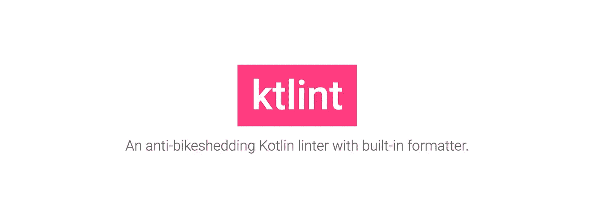

# 使用你的 Android 应用程序和 Github 钩子设置 ktlint

> 原文：<https://medium.com/nerd-for-tech/setup-ktlint-with-your-android-app-and-using-github-hooks-2cfc42a2cf2?source=collection_archive---------3----------------------->

项目林挺是任何团队在整个开发阶段面临的主要问题之一。因此，在这里我们将讨论如何启用 lint 检查，并将它们与 git 挂钩一起使用。

> 我们将使用代码林挺最著名的库之一，即 [**ktlint**](https://github.com/pinterest/ktlint) 。



因此，让我们从创建一个简单的应用程序开始。注意:示例项目不会遵循任何架构模式等。它将只关注代码林挺以及我们如何在我们的项目中使用 ktlint。

# **设置**

因此，从设置开始，有许多方法可以将 ktlint 添加到项目中。你可以把它作为一个单独的 Gradle 文件添加进来(如果你想知道的话，可以加上注释)，或者我们可以用最简单的方法使用一个 [Gradle 插件](https://github.com/jlleitschuh/ktlint-gradle)。我将向你展示如何使用 gradle 插件。

## 第一步

让我们在**项目 gradle 中添加依赖关系。**

```
classpath "org.jlleitschuh.gradle:ktlint-gradle:10.1.0"
```

## 第二步

然后在所有项目下应用上面的插件

```
apply plugin: "org.jlleitschuh.gradle.ktlint"
```

## 可选(步骤 3)

这一步是可选的，但是非常方便。默认情况下，Ktlint 不允许通配符导入。因此，使用这个代码片段，我们将覆盖这些设置。

```
// Optionally configure plugin
ktlint **{** debug.set(true)
    disabledRules.set(["no-wildcard-imports"])
}
```

仅此而已。完成了。您已经成功地在项目中设置了 ktlint。下面是我的 gradle 的样子。

```
// Top-level build file where you can add configuration options common to all sub-projects/modules.
buildscript **{** ext.kotlin_version = "1.5.0"
    repositories **{** google()
        mavenCentral()
        maven **{** url "https://plugins.gradle.org/m2/" **}** jcenter()
    **}** dependencies **{** classpath "com.android.tools.build:gradle:4.2.1"
        classpath "org.jetbrains.kotlin:kotlin-gradle-plugin:$kotlin_version"

        classpath "org.jlleitschuh.gradle:ktlint-gradle:10.1.0"

        // NOTE: Do not place your application dependencies here; they belong
        // in the individual module build.gradle files
    **}
}** allprojects **{** repositories **{** google()
        mavenCentral()
    **}** apply plugin: "org.jlleitschuh.gradle.ktlint"

    // Optionally configure plugin
    ktlint **{** debug.set(true)
        disabledRules.set(["no-wildcard-imports"])
    **}
}** task clean(type: Delete) **{** delete rootProject.buildDir
**}**
```

要检查其有效性，请打开终端并点击以下命令。

```
./gradlew ktlintCheck
```

这将在您的整个项目上运行 ktlint，并列出项目中的所有问题。现在，继续进行一些代码更改，然后运行上面的命令并检查输出。如果您遇到构建失败，您可以跟踪日志并检查不符合 lint proof 的文件，或者您可以简单地使用下面的命令，该命令将一次性修复所有问题。

```
./gradlew ktlintFormat
```

恭喜你！！！。您已经成功地将 ktlint 集成到您的项目中。现在，让我们讨论一下，如果您正在进行一个大项目，您希望每个开发人员在向 git 提交任何东西之前都进行 lint 检查，那么您如何能够实施 lint 检查。在下一节中，我们将讨论如何使用预提交钩子来运行 ktlintCheck 并为开发人员抛出错误。

# 对 KtLint 使用预提交挂钩

## 第一步

让我们在项目根文件夹中添加一个文件预提交，内容如下。

这基本上是在每次用户尝试提交时运行 ktlintCheck。现在我们将把这个预提交挂钩添加到我们的项目中，并在其上添加构建依赖项。

## 第二步

打开项目 gradle 文件，让我们添加一个任务，将它添加到 git 挂钩中。

```
task installGitHook(type: Copy) **{** from new File(rootProject.rootDir, 'pre-commit')
    into **{** new File(rootProject.rootDir, '.git/hooks') **}** fileMode 0777
**}** tasks.getByPath(':app:preBuild').dependsOn installGitHook
```

现在清理并构建您的项目。这将在`.git/hooks`文件夹下添加一个同名的预提交钩子。仅此而已。

## **恭喜你！！！**您现在可以开始了。现在，每当有人试图向您的项目提交任何东西时，您就站在一边，让 ktlint 为您施展魔法。

> 这是到我的存储库的[链接](https://github.com/ashishuniyal90/KtlinSetup/tree/main)。在下一篇文章中，我们将讨论在 ktlint 之上创建定制规则。

[](https://github.com/ashishuniyal90/KtlinSetup) [## ashishuniyal90/KtlinSetup

### 该项目是一个虚拟项目，我们可以看到如何将 ktlint 与项目以及预提交挂钩集成在一起…

github.com](https://github.com/ashishuniyal90/KtlinSetup)