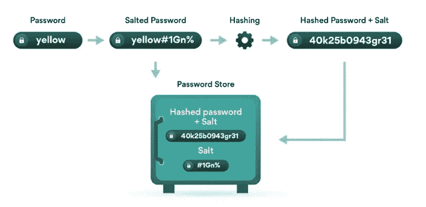

# SHA-2 和 Bcrypt 加密算法

> 原文：<https://medium.com/nerd-for-tech/sha-2-and-bcrypt-encryption-algorithms-e0c0599b0da?source=collection_archive---------0----------------------->

*|密码加密对比分析*

图片[来源](https://www.virtru.com/blog/four-things-encryption-technology/)

> 背景信息:X 公司正在评估他们用于保护密码的加密技术。该公司先前使用了 SHA-1 先前公布的关于其漏洞的证据。在进行进一步研究之前，X 公司将他们的加密方法改为 Bcrypt。这是对 Bcrypt 和 SHA-2 加密标准的研究和优缺点的简要概述。

**简介**

加密的使用有助于确保数据和系统的机密性、完整性和可用性(CIA)。我们的客户依靠我们的信息系统开展业务、提供服务，并最终通过更安全、更实惠的药物影响世界。需要适当的加密技术来保护认证系统，如电子商务、云存储和专有研究。普罗佩尔对技术、流程和程序的使用最终会影响何时、何人以及如何访问我们的系统。需要注意的是，SHA-256 或 Bcrypt 是否最适合我们现在和将来作为加密算法的需求。由于网络攻击和数据泄露的增加，需要重新评估以确保弹性安全态势。

**背景信息**

在 2011 年之前，SHA-1 被用作散列密码的首选加密系统，但 SHA-1 由于碰撞漏洞而被认为是不安全的。一种数学算法会进行数百万次计算，以找到与 SHA-1 哈希的匹配或冲突。由于 Bcrypt 不易受到此类漏洞的攻击，因此对 Bcrypt 进行了切换。值得注意的是，SHA-256 不会因为 SHA-1 被认为不安全而变得不安全。SHA-256 通过计算更大的哈希值(计算匹配更复杂)来防止冲突。与 SHA-256 的碰撞时有发生，但极难定位。由于计算能力的原因，各种加密技术将继续发展，并且需要持续的研究来提供保护敏感和关键数据的最佳机制。

**密码散列函数和历史记录**

**密码功能**

哈希算法获取可读的文本或明文，应用数学算法，并返回一个不可读的文本，称为密文。哈希是单向函数，这意味着您只能将明文哈希为密文。如下图所示，明文“Hello”被打乱以创建固定长度的数字和字符字符串，并返回哈希值或密文。(云闪)

云耀斑

哈希密码提供了用户和系统的隐私性、安全性、数据完整性和安全认证。散列密码是保护客户和专有数据的 CIA 的关键组成部分。一旦密码被散列，它就不能被反向工程，因为它是一个单向函数。

**沙系列的历史**

SHA 代表“安全散列算法”,是为散列数字签名和证书而设计的。随着时间的推移，随着计算能力的提高和漏洞的发现，SHA 已经变得越来越复杂。SHA-2 有许多变种，但 SHA-256 是最常见的，也是最有趣的一个。研究表明，SHA-256 比以前的版本更安全，美国国家标准与技术研究所(NIST)建议用它来取代以前的版本。(洛维里)

**工作原理**

加密技术的使用确保了数据在传输、存储和处理时受到保护且不可读。随着计算能力的不断提高，它支持暴力攻击，这允许咨询尝试所有可能的组合，直到找到哈希匹配。(Fortinet)哈希算法也容易受到彩虹表攻击，彩虹表攻击是指比较预先破解的大型哈希表以找到匹配项。当务之急是继续创新和实施更强大的加密系统，以对抗威胁因素和计算能力的增长。返回散列的大小很重要。哈希中的位数越多，加密过程的安全性就越高。(Pap)增加的散列大小需要更多的资源，这反过来会更加昂贵。在更快且资源更少的加密与更慢且更安全的加密之间存在权衡。

**对比分析**

有两种类型的散列:快速散列和慢速散列。这两种算法各有利弊，下面列出了较快的 SHA-256 算法和较慢的 Bcrypt 算法之间的比较分析。

**SHA-256 的优点&缺点**

SHA-256 比 Bcrypt 快

由于计算哈希值所需的计算能力更少，因此实现成本更低

算法最初不是为密码哈希设计的

易受暴力攻击和彩虹表攻击等常见攻击

**Bcrypt 详细信息**

Bcrypt 还有另一个组件需要解释，以提供详细的比较。除了给定的密码之外，在通过哈希算法之前，还会在密码中添加一个盐(或随机的数据位)。(Scott) Salting 增加了密码的复杂性以及使用暴力破解密码所需的时间。它还限制了彩虹表攻击。(Pap) Bcrypt 设计用于密码哈希，并提供其他组件来增加哈希密码的复杂性。下图说明了加盐密码的工作原理，并与之前的未加盐密码图进行了比较。(斯科特)

诺德帕斯

**Bcrypt 利弊**

专为密码哈希设计

加盐密码增加了复杂性，从而使它们更加安全

由于密钥分发，实施成本更高

与 SHA-256 相比，散列过程较慢

**推荐**

推荐的密码加密算法是 Bcrypt。Bcrypt 已经实现并提供了更高的安全性。Bcrypt 提供了多种安全含义，例如 salting 等。展望未来，Bcrypt 将提供强大的密码散列，并且可扩展以满足当前和未来的需求。(Arias)初始投资将带来回报，因为它是安全的，并且可以由开发人员轻松地实施到未来的服务和产品中。Bcrypt 算法和过程中的技术限制了攻击，并使攻击者更难泄露密码。Bcrypt 不是为加密大量数据而设计的。它最适用于密码，但是 SHA-256 更适用于大量数据，因为它成本更低，速度更快。保护数据没有“一刀切”的模式，但对于加密密码，Bcrypt 是一种强大的可扩展技术，将确保弹性安全态势。

**参考文献:**

阿里亚斯，丹。"散列在行动:理解 Bcrypt . " *Auth0* ，2021 年 2 月 25 日，[https://auth 0 . com/blog/hashing-in-action-understanding-bcrypt/。](https://auth0.com/blog/hashing-in-action-understanding-bcrypt/.)

云闪。“什么是加密？|加密类型| Cloudflare。*什么是加密？|加密类型*，2020，[https://www . cloud flare . com/learning/SSL/what-is-Encryption/。](https://www.cloudflare.com/learning/ssl/what-is-encryption/.)

Keromytis，D. " Bcrypt "*查看新 USENIX 网站。*，1999 年，[https://www . usenix . org/legacy/publications/library/procedures/usenix99/full _ papers/deradt/deradt _ html/node 22 . html .](https://www.usenix.org/legacy/publications/library/proceedings/usenix99/full_papers/deraadt/deraadt_html/node22.html.)

杰夫·m·洛维里:“MD5 Vs Sha-1 Vs SHA-2——哪一个是最安全的加密哈希以及如何检查它们。”*freecodecamp.org*，FreeCodeCamp.org，2020 年 3 月 27 日，[https://www . freecodecamp . org/news/MD5-vs-sha-1-vs-sha-2-哪一个是最安全的加密哈希和检查方法/。](https://www.freecodecamp.org/news/md5-vs-sha-1-vs-sha-2-which-is-the-most-secure-encryption-hash-and-how-to-check-them/.)

爸爸，西尔维亚。"加密已解释。" *DEV Community* ，DEV Community，2020 年 3 月 5 日，[https://dev.to/sylviapap/bcrypt-explained-4k5c](https://dev.to/sylviapap/bcrypt-explained-4k5c)。

斯科特，本杰明。“什么是密码盐？” *NordPass* ，NordPass，2020 年 8 月 12 日，[https://nordpass.com/blog/password-salt/.](https://nordpass.com/blog/password-salt/.)