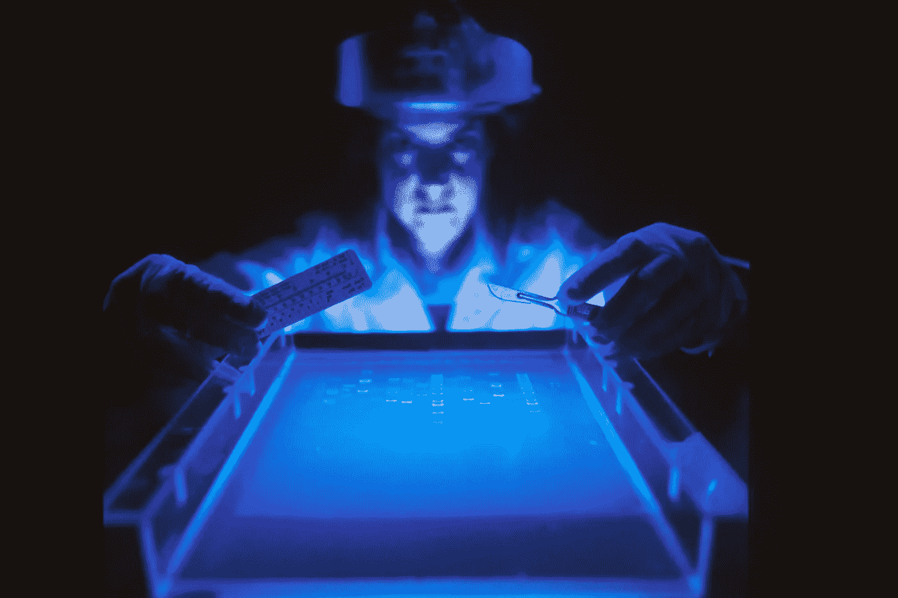

# 个人应该拥有自己的 DNA 吗？

> 原文：<https://medium.com/nerd-for-tech/should-individuals-own-their-own-dna-f3986ad072be?source=collection_archive---------1----------------------->

## 这是 2021 年哈佛深红全球征文比赛的全球决赛论文

国家癌症研究所/ Unsplash

乍一看，像个人 DNA 这样的私人物品似乎是可遗传所有权的明确候选对象:每个人生来就有一组特定的基因，这些基因有效地定义了他们是谁，没有他们的同意，这些基因不能被输出或复制。然而，根据现行法律，个人并不拥有自己的 DNA 或任何其他身体组织，这是正确的。DNA 是自然产生的，不能在实验室之外被操纵，所以没有人对它有初始控制权。如果他们真的拥有它，一些不必要的影响会立即出现。此外，对其如何用于研究或数据库的任何担忧都可以通过隐私和侵权法领域的法规得到更好的解决，从而使财产法在人类遗传密码问题上无效。

DNA 并不简单。当我们提到这个三个字母的单词时，我们指的是整个人类基因组，它由 23 对染色体组成，共同携带大约 22，000 个基因，每个基因有数百万个核苷酸。实际的脱氧核糖核酸(DNA)是编码每个基因的材料，形成了我们在生物学书籍中看到的著名的“双螺旋”结构。我们的核苷酸排列方式赋予我们独特的特征，因为成对的腺嘌呤和胸腺嘧啶以及成对的胞嘧啶和鸟嘌呤(四种可能的核苷酸)通过共价键连接在一起。这些序列中的一些是所有人共有的，因为它们编码了生命中必不可少的功能，但其他的则呈现出一些因人而异的变异。

这种多方面的遗传信息是从我们的父母那里遗传的，因此，被我们抑制了。没有人能够选择他们与生俱来的基因，这一事实使得他们本质上是自然及其内在过程的产物。美国最高法院在*Association of Molecular Pathology v . Myriad Genetics*(2013)一案中使用了后一个定义，以适用 DNA 在初始阶段不能由个人或第三方拥有的全球理解。在这个案例中，一家基因公司 Myriad 声称对它之前在实验室中发现的分离的 DNA 链拥有专利。如果 Myriad 对 BRCA1 和 BRCA2 基因的请求得到认可，该公司将拥有分离和研究一部分人类基因组的专有权。

大法官克拉伦斯·托马斯代表全体一致的法院驳回了专利申请，称“自然产生的 DNA 片段是自然的产物，不符合专利条件。”(*万千* 580)。高等法院的裁决反映了一种全球观点，即要拥有自然的东西，它必须经过修改，使之成为非自然的，即在自然界中没有以人类发展的形式出现(土地是这种“修改”规则的一个例外)。因此，在任何实验室改造之前，DNA 是一种自然现象，不能受制于所有权。

此外，托马斯大法官的意见还指出了一项相反的裁决可能带来的许多荒谬后果之一。在讨论为什么自然法则构成了美国专利法下的一种特殊情况时，他指出，“如果没有这种例外，专利的授予会有相当大的危险，会束缚[科学和技术]工具的使用，从而抑制以这些工具为前提的未来创新。”(*万千* 589)(内部引号省略)。事实上，如果基因研究由于所有权承认而依赖官僚主义和大量新的合同和同意程序，它将带来新的但不必要的负担，可能会排斥科学家并阻碍医学突破。

此外，当一个人去世时，其遗嘱上列出的受益人将有权获得死者的基因组，这种情况不仅令人感到不道德，而且还可能转化为葬礼和尸检的延迟和不受欢迎的障碍，甚至在死者亲属起诉医院医疗过失的情况下，在适当的分析火化尸体并因此消除所有遗传特征之前销毁证据。在其他情况下，比如骨髓移植，捐献者自己可能会受到诉讼:一个身体否认捐献组织的接受者可能有权起诉，因为他们得到的是“有缺陷的产品”。

然而，在同样的捐赠主题下，有人可能会说，根据目前的立法，当一个人将他们的 DNA 送到实验室或其他基因公司进行分析时，他们正在从事一种固有地包含和承认所有权(在这里是指这个人的基因组和该组织的方法)的交易。虽然这种推理有其优点，但在这种情况下理解的活动将是一种同意，而不是一种捐赠或赠予。当向研究人员提供他们的基因集合时，一个人将简单地授权部分入侵他们的身体及其产物。

即便如此，可以指出的是，作为参考，生物银行对捐赠的血液和组织拥有全球法院和法规认可的财产权——因此，DNA 也应该如此。虽然这是真的，但只是在某种程度上。在少数情况下，出于安全目的，所有权是必要的，因为这些机构必须保护这些材料不被篡改和盗窃，并且必须保证它们被充分存储并处于适当的状态，以便在不久或遥远的将来被其他人使用和采用。因此，有一个原始的原因可以解释为什么有些第三方是身体产品的所有者，也许在将来是人类基因组的所有者。

尽管有上述观点，但可以提出一个建议，即人们主要关心的不是他们的基因是如何获得的，而是如何使用的，这就重新引发了同意优于所有权的辩论(Clayton et al. 16)。如果主要问题不是关于所有权，而是关于过程，那么除了应用财产法和接受其过分的影响之外，还有更好的方法来解决这种担忧和控制 DNA 的不当使用。这些解决方案可以在侵权法和隐私法领域找到，这些领域非常适合管理第三方对基因信息的使用。

例如，目前的殴打条款已经保护个人免受威胁性身体接触对其身体的侵犯，这是在未经宿主允许的情况下获取 DNA 的必要行为(殴打不仅是侵权行为，也是犯罪)。这一保障措施不要求承认所有权，因为身体是殴打侵权行为的法定主体，同时没有法院说这是因为有人拥有他们的躯干。基因组，作为身体的一部分，被包括在对这种法律的解释中，因此，没有他们的同意，不能从一个人的细胞中取出。

在隐私阵营中，现有的立法要求医生和研究人员告知患者、捐赠者和研究对象与他们将要经历或参与的程序或项目相关的任何信息。只有在这种对话之后，实践者和科学家才能获得个人的授权并开始他们的行动；否则，他们将面临医疗过失诉讼。这种知情同意的做法甚至可能通过提议的动态同意方法得到改善，这将允许患者不断了解他们的 DNA 如何被使用，并尊重他们在任何时候退出研究的选择，同时还促进医疗创新(Kaye 等人 142)。这将是我们仍然能够为遗传学辩论提出的各种问题找到共同答案的许多方式之一，同时考虑到私人的关注和科学的进步。

尽管如此，人类基因组已经证明自己是一个复杂的结构，并对其与宿主和操作对象的关系进行了复杂的分析。但正如我们所讨论的，DNA 是自然产生的，没有经过修改，因此在当前的立法和司法判例下不受财产权的约束——不仅在美国如此，在全世界也是如此。如果相反的情况被确定，将会产生荒谬的后果，从不必要的死后痛苦到不值得的生前诉讼。此外，在今天的现实中，同意控制所有权，一些第三方实体拥有财产权只是因为有安全需要，而最好是作为隐私和侵权法问题直接限制 DNA 的不当使用，而不是遵从财产判例及其荒谬的后果。因此，个人不应该拥有自己的 DNA，而应该拥有更大的自主权和对其使用方式的输入。

分子病理学协会等诉 Myriad 遗传学公司等，569 u . s . 576–596。美国最高法院。2013.

卡特赖特-史密斯，劳拉。基因专利:分子病理学协会对基因测试和研究意味着什么？."公共卫生报告(华盛顿特区:1974 年)第 129 卷，3 (2014 年):289–92。土井:10.133338363637

Clayton EW，Halverson CM，Sathe NA，Malin BA (2018)美国个人对隐私和遗传信息的观点的系统文献综述。PLoS ONE 13(10): e0204417。https://doi.org/10.1371/journal.pone.0204417

动态同意:21 世纪研究网络的患者界面。欧洲人类遗传学杂志 23，141–146(2015 年)。https://doi.org/10.1038/ejhg.2014.71

塞格特、朱利安和阿帕娜·内森。"理解遗传数据的所有权和隐私."新闻中的科学，哈佛大学艺术与科学研究生院，2018 年 11 月 28 日，sitn . HMS . Harvard . edu/flash/2018/understanding-ownership-privacy-genetic-data/。

斯肯尼，洛安。"反对人们合法“拥有”自己的身体、身体部位和组织的论点."2002.《麦考瑞法律期刊》,第二卷，麦考瑞大学，2002 年 2 月，第 165-176 页，https://search . informit . org/doi/10.3316/informit。36316.66363636636