# 对 Mocha api 测试表现出一些热爱吧！测试#2

> 原文：<https://medium.com/nerd-for-tech/show-some-love-for-mocha-api-tests-testing-2-342fcd250aeb?source=collection_archive---------10----------------------->

# 介绍

这是第一部分的延续，你可以在这里找到[。在这一部分，我们将深入实际的 api 测试。我将向你展示一些用 Javascript 改编的设计模式，我们将在没有任何模仿或存根的情况下进行全面测试。](https://liudas-demikis.medium.com/show-some-love-for-mocha-api-tests-setting-up-1-4ba486fbdf4b)

# 让我们开始吧

首先，我们必须设置一个测试和 Mocha 脚本来运行它。我们可以通过按照模式`tests/**/*.test.js`在`tests/`目录中创建任何测试来做到这一点。开始测试的命令非常简单:`mocha tests/**/*.test.js —-reporter dot`。

npm 运行测试命令

示例测试由定义测试套件的单个`describe`块和一个用例`it`块组成。

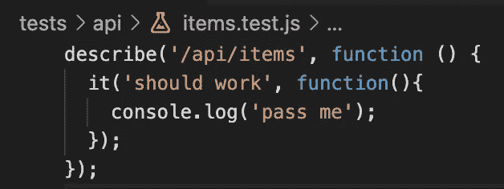

第一个示例测试

现在我将在我的`tests/`目录中创建两个模块— `util.js`和`create.js`。

Util 模块负责所有的测试基础设施，从其他文件导出所有东西，收集模型等等。现在，它将在每次测试和配置`mongoConnectionString`之前清理数据库。

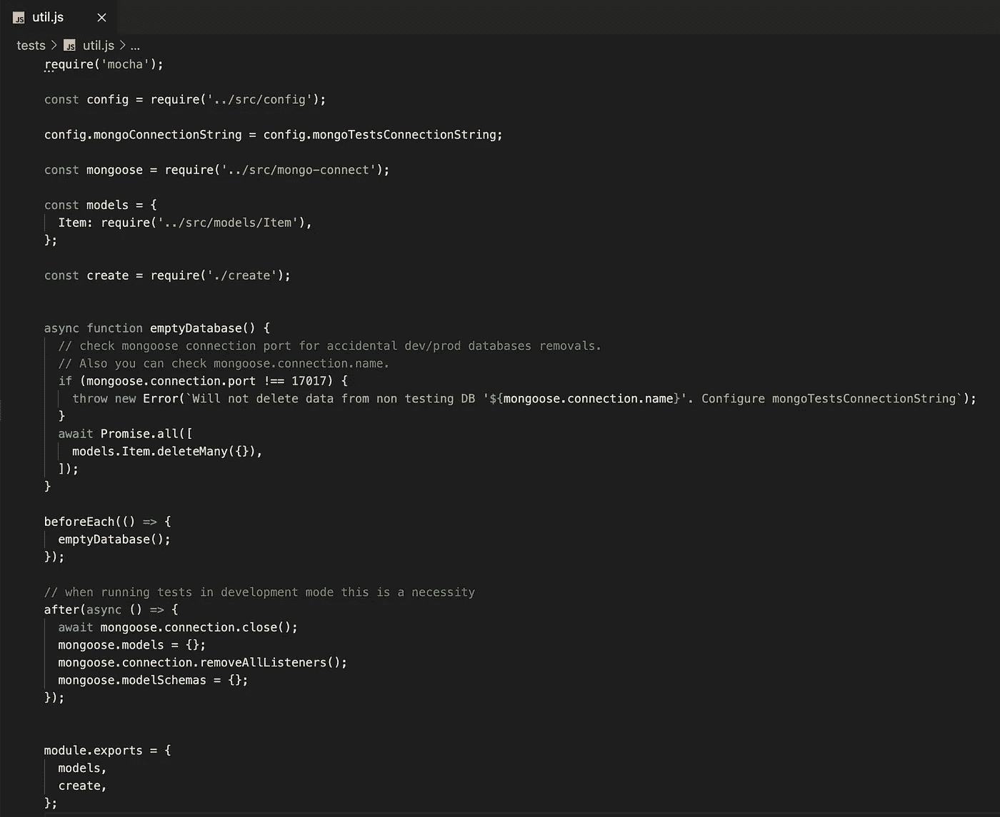

负责设置测试基础设施的 util.ts 文件

Create module 基本上是 Javascript 中一种经过改编的工厂设计模式。别害怕，我不会用类和花哨的 OOP 东西。我将为我们系统中的每个数据库模型创建两个函数。一个负责创建实体(数据传输对象)的 DTO，另一个负责将实际项目插入数据库。当我们想要用现有的实体预先设置数据库，或者我们想要通过 POST api 端点创建数据库中不存在的东西时，这将非常方便。

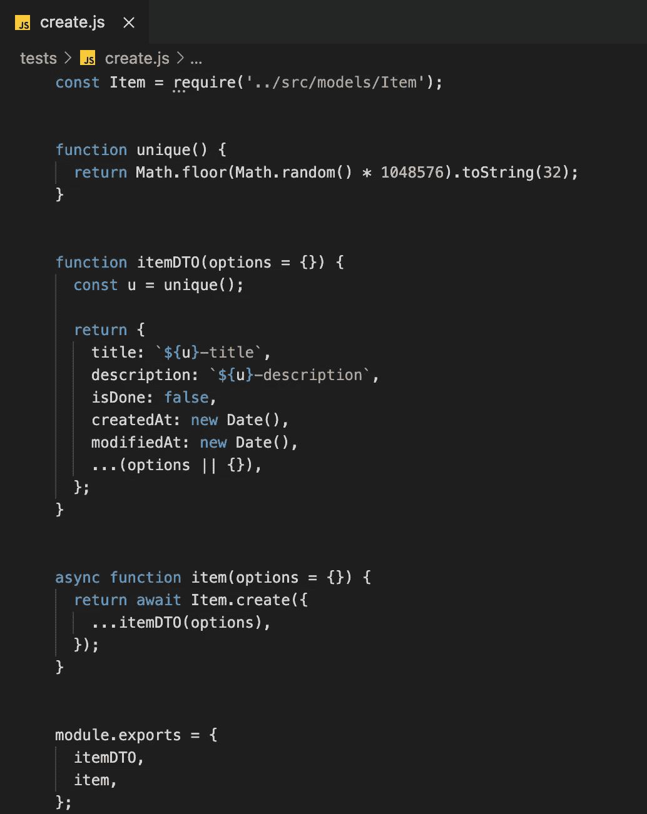

create.js 文件的行为类似于工厂设计模式

不要偷懒，明确定义所有的字段。另外，一个好的做法是为每个带字段名后缀的字符串字段使用唯一标识符。这只是帮助我调试测试的东西。

# 测试

我喜欢从定义每个 api 端点的主要测试用例及块开始。

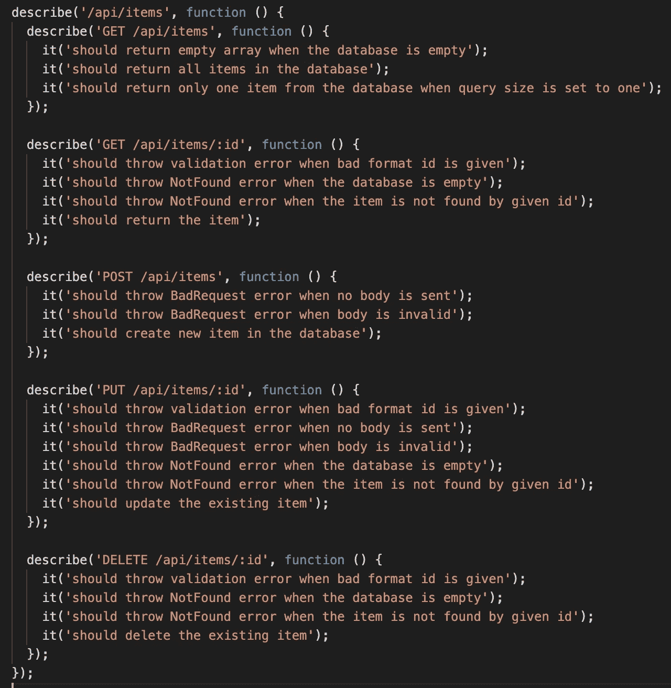

/api/items 资源的所有测试用例

如你所见，有两种类型的测试——失败之路和快乐之路。我在测试各种场景，尤其是不好的场景。通常每个 api 端点都有认证和授权检查。例如不发送令牌、发送无效令牌、不具有所需的权限等。有时测试用例可能包括节流——当您预期收到 429 太多请求错误之类的东西时。这个例子非常基本和简单——测试与数据库的交互、一些验证位和 restful api 指南检查。

你问我们怎么调用 api？这很简单——我们将使用`supertest`。当然我们要先装上`npm i -D supertest`。

现在让我们从 GET /api/items 端点开始。

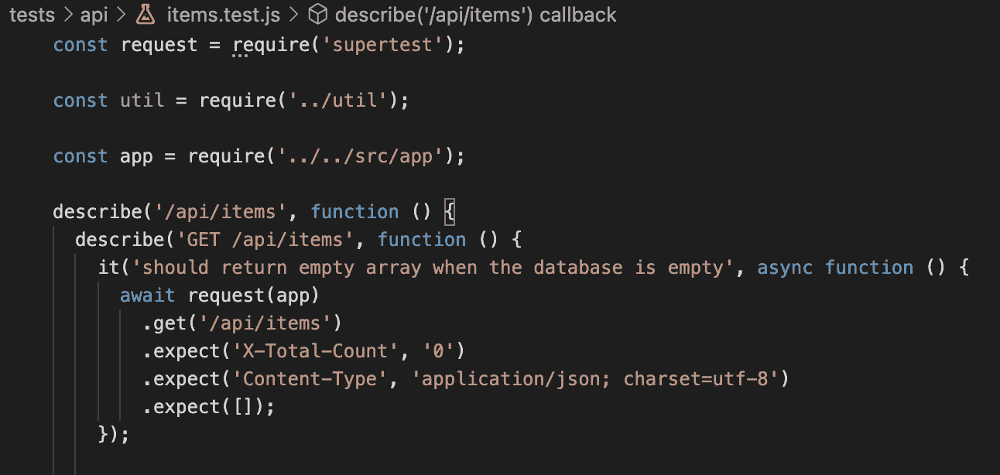

首次获取/API/项目测试

很简单，对吧？基本上，我用`supertest`函数`request`调用我的`express`应用程序，并期待一些结果。我总是喜欢检查像`Content-Type`这样的标题和我自己设置的标题— `X-Total-Count`。最后我要做的是——除了一个空数组——真正的身体。现在让我们试着创建一些东西并再次调用 api。

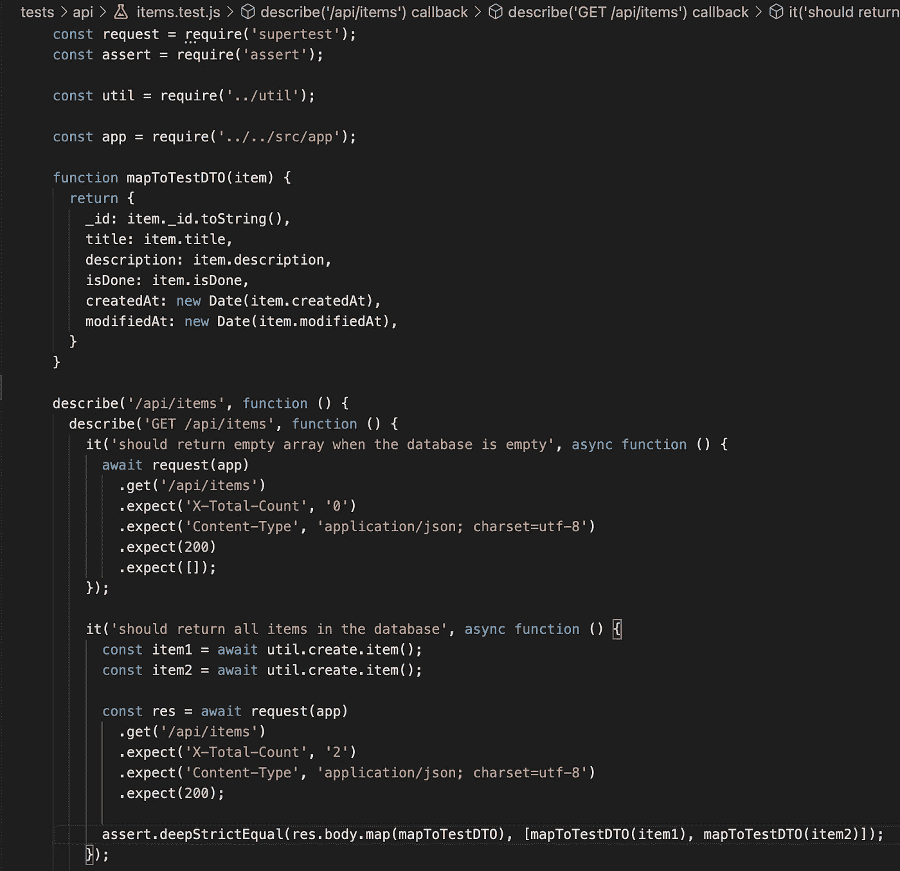

GET /api/items 第二次测试

我引入了断言库— `NodeJs` native `assert`。我看不出有什么好的理由使用像`chai`这样的库来实现简单的断言，这些断言可以通过使用环境提供给你的东西来实现。

所以我再次调用 api，但是使用数据库中预先插入的项目，我希望它们返回。我还引入了`mapToTestDTO`函数，我把它想象成一个适配器模式——我把响应和预期资源都改造成相同的结构。让我们通过编写最后一个测试用例来结束 GET /api/items 测试。

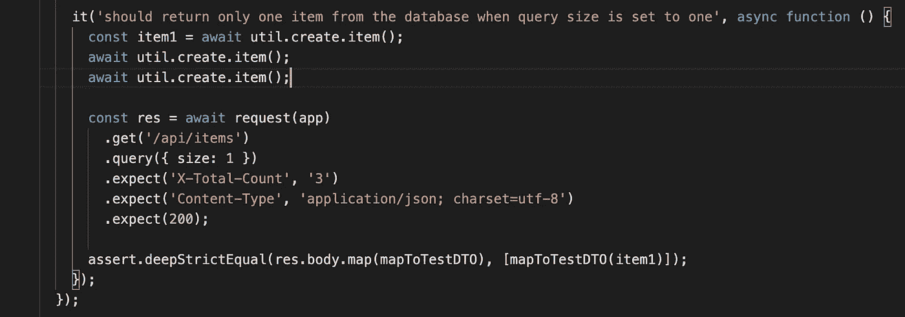

获取/api/items 最后一个测试用例

仅此而已。我们设置查询只返回一个项目，但是我们仍然期望`X-Total-Count`是 3，因为它不受查询的影响。

我不会像对这个测试那样关注所有的测试，但是我仍然会向您展示所有的实现并给出一些见解。接下来让我们做 GET /api/items/:id 端点。

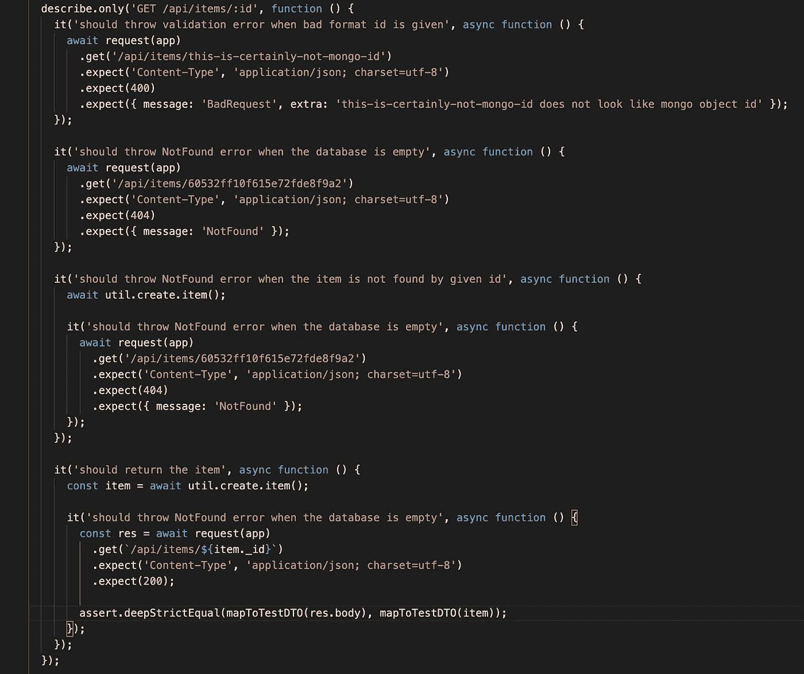

GET /api/items/:id 测试

所以这是不言自明的。当给出无效的 Mongo id 时，第一个测试套件预计会出现验证错误，它得到了一个错误。

当数据库为空时，第二个测试预期 NotFound 错误。当里面什么都没有的时候，你能归还什么？

第三次测试再次预期 NotFound 错误，即使数据库不为空，但给出了随机*有效* id。

最后一个测试只期望返回一个项目。

现在我们必须创造一些东西。我们将测试 POST /api/items 端点。这将有一些额外的验证逻辑。

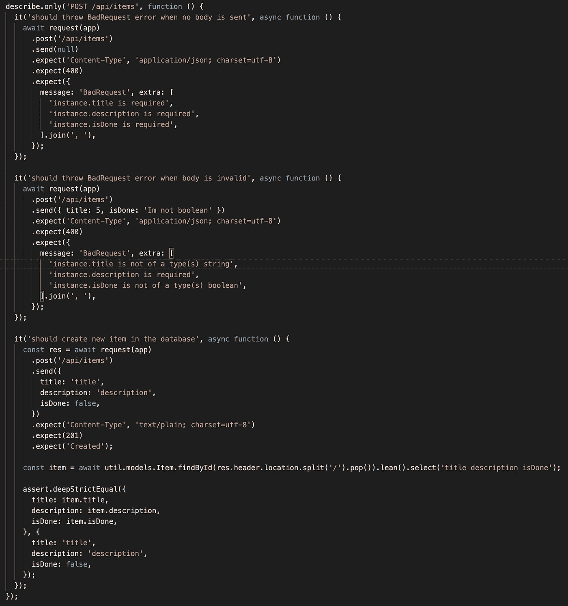

帖子/API/项目

第一个测试检查当我发送空主体时发生了什么——我相应地得到一个错误。

第二个测试尝试发送一串无意义的内容，并再次对请求做出相应的响应。

第三个有一些额外的逻辑。创建项目后，我们获取位置头值并提取 id。头看起来像下面的`/api/items/:id`。用这个 id，我向数据库发出一个请求，并验证新项目是用我的 body 有效载荷值创建的。

是时候做些更新了。你看不到任何新的东西，只是我们在更新已经存在的项目，而不是在许多验证通过后创建新的项目。

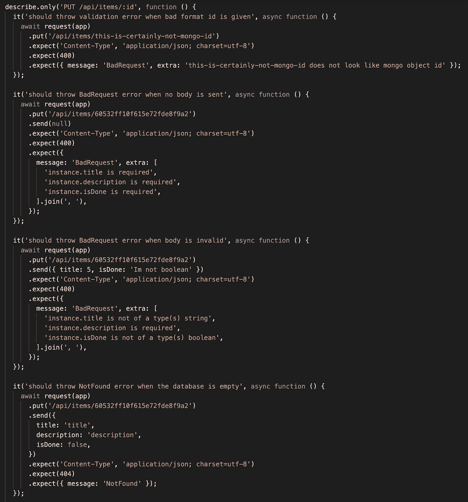

PUT /api/items/:id 第 1 部分

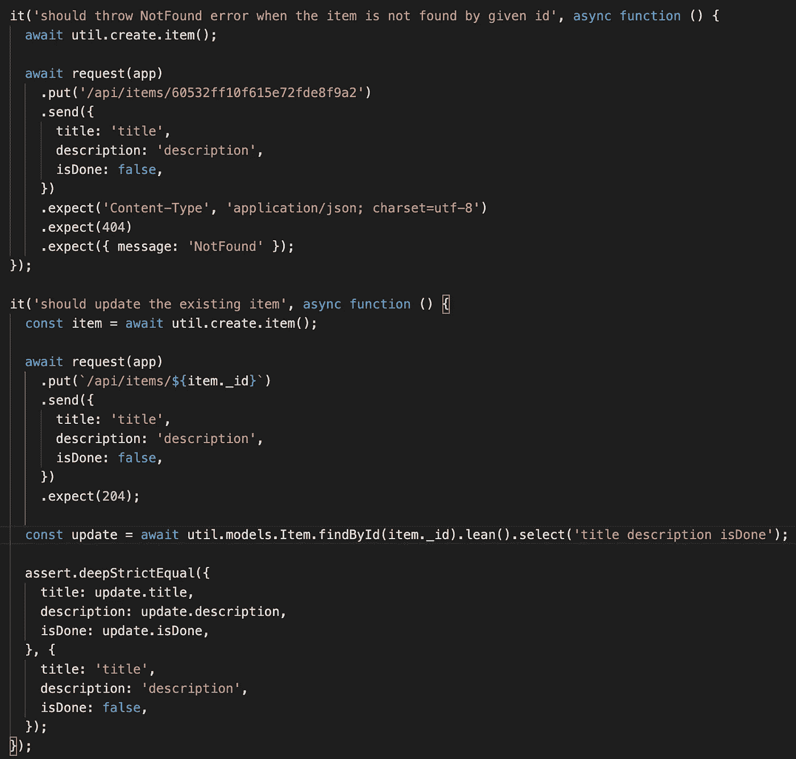

PUT /api/items/:id 第 2 部分

你已经看过大部分了。NotFound 和 id 验证基本上取自 GET /api/items/:id 测试，主体验证是 POST /api/items 的副本，也是最后一个——update 有一点不同，但它仍然非常类似于 POST endpoint。不要害怕重用你的东西，只是不要过于复杂，有时一个好的复制和粘贴比复杂的设计模式更好。

最后一个——删除。它基本上有一个先决条件—为了删除一个项目，它必须存在于数据库中。让我们试试。

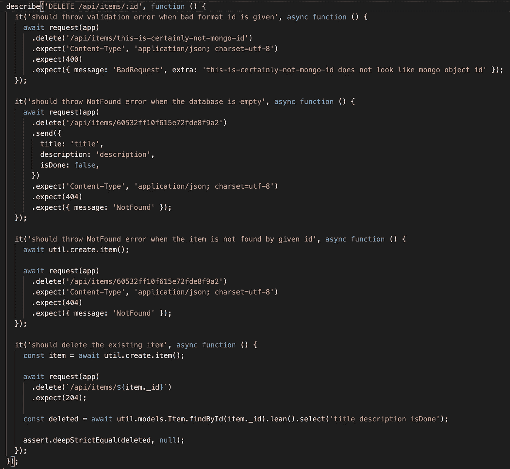

删除/api/items/:id

就是这样！一旦我们验证了 id 的完整性和项目的存在，我们可以期待它被删除。

# 最后润色

尝试为观察或开发模式配置 Mocha 测试脚本。它的*超级*快，它对所有文件的变化都有反应。您甚至可以使用简单的 save 命令或在终端中键入`rs`来重新运行它。它的美妙之处在于，在监视模式下，您不必重启整个 Mocha 运行时环境，它会一直运行，只需等待命令来启动实际的测试用例。

测试:观察脚本

利用`.only`和`.skip`关键词的力量。您可以将这些添加到任何`describe`和/或`it`模块上。`Only`会不会*只*运行你选择的这些测试`skip` …显然*会跳过*它们！

也有不同的测试记者，我只是喜欢用`--reporter dot`。以下是其他选项的示例:

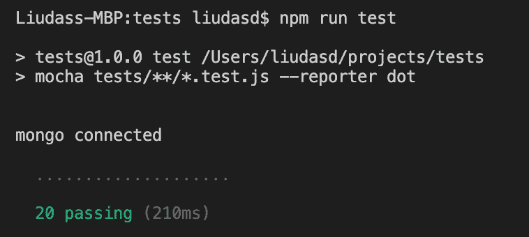

记者点

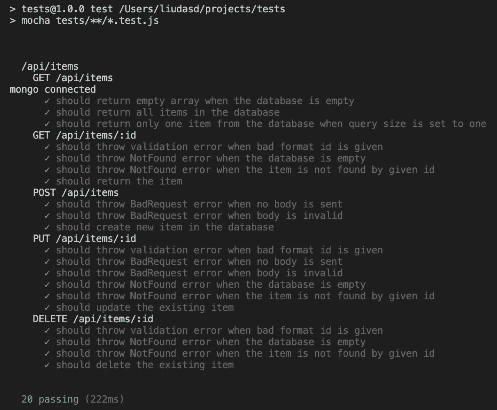

无报告者标志，或默认报告者

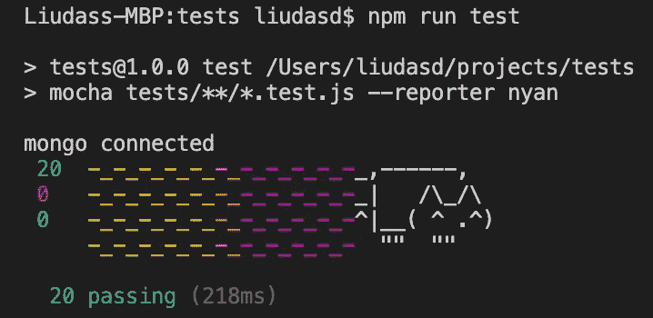

记者 nyan

还有许多不同的记者库，例如:`mocha-simple-html-reporter`、`mocha-teamcity-reporter`等。您可以像安装其他库一样安装它们，并使用 Mocha `--reporter`标志。

# 最后的话

*总是*测试你的应用。我一点也不反对单元测试，我认为所有的测试都会带来额外的价值，无论是单元、集成、api 还是 e2e。作为一名主要的后端开发人员，我最重视 API 测试。它们也很好地用一个公共的和众所周知的 TDD 框架实现了。此外，设计良好的 api 测试可以作为团队中其他开发人员的某种文档。

我们可以用 Mocha 非常快速地进行 api 测试，我们可以避免不必要的模仿，我们可以测试完整和真实的后端流程。这不仅允许您测试与数据库的交互，还允许您测试各种事情，例如安全扫描、节流、日志记录、审计等等。不要害怕测试，表现出对 Mocha api 测试的热爱！