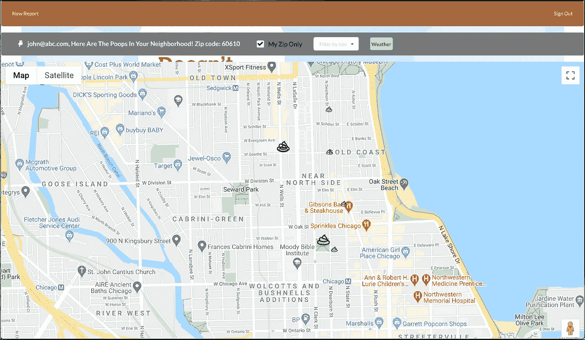
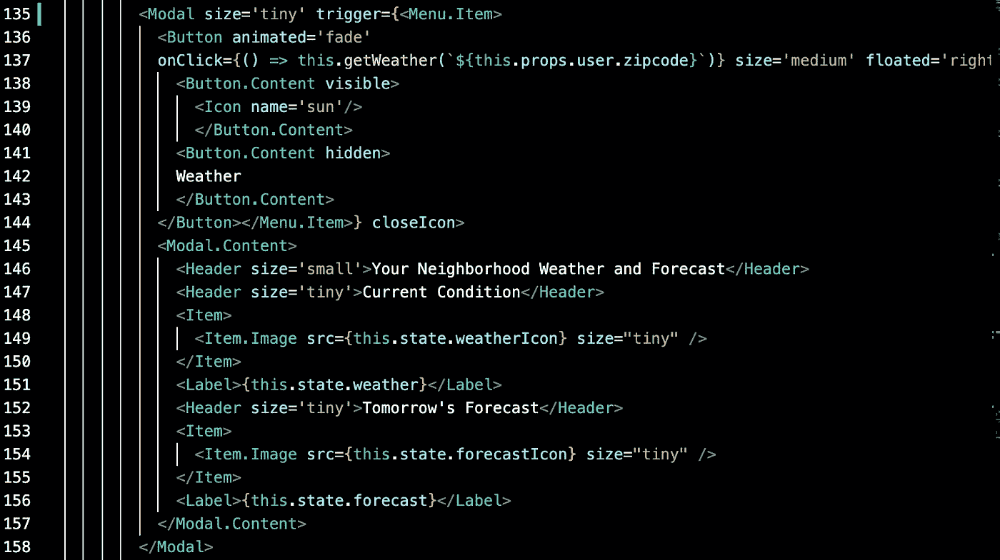
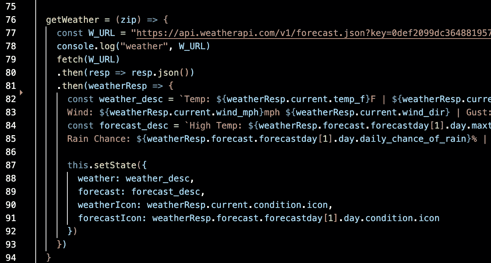

# 使用模型显示天气预报

> 原文：<https://medium.com/nerd-for-tech/showing-weather-forecast-using-a-modal-801af7a50e67?source=collection_archive---------13----------------------->

遛狗前想知道天气吗？我的狗粪追踪器应用程序的目标受众是那些发现其他狗主人没有捡起的狗粪的狗主人。很自然地，天气状况会浮现在脑海中，因为遛狗是默认的户外活动。在芝加哥严寒的冬天，也许零下 5F 的温度会激励一些人缩短步行时间，以避免对人或狗不必要的折磨。

由于天气状况或预报是人们快速浏览并继续前进的东西，我们不需要它显示在一个需要刻意导航动作的专用网页上。因此，模态是完美的解决方案。模式窗口是一个暂时阻止访问主页面视图的窗口，同时为显示的内容提供所需的焦点。然后，一旦不再需要关注，只需简单的点击(甚至不需要专用的关闭按钮)就可以快速移除，主视图立即恢复。

我在菜单上加了一个天气按钮。点击按钮，弹出天气预报信息模式。即使模式自带关闭按钮(x ),用户也可以点击模式窗口外的任何地方来关闭并恢复主地图视图。

这是 JSX 的场景。

由于 modal 是一个临时视图，我们不会像对待其他独立组件一样对待它。那么我们如何构建语义 UI 组件来适应它呢？答案在于我们希望如何触发模态的显示。在这种情况下，我希望在菜单栏上有一个按钮来触发模态。从概念上讲，结构是这样的:

<menu>
<菜单。项目>
…。
</菜单。>
项<菜单。项目>
…
</菜单。>项
项<菜单。项目>
…触发模态的项目…
</菜单项>
</菜单></menu>

正如您在上面的代码中看到的，JSX 是这样排列的:

<menu>
<菜单。项目>
…。
</菜单。>项
项<菜单。项目>
…
</菜单。>项
项<模态触发器={ <菜单。item>
…触发模态的按钮…
</menu . item>}>
<模态。内容>
……显示天气信息……
</Modal。内容>
</模态>
</菜单></menu>

从结构上来说，模态是菜单项之一。由于模态窗口在被触发之前是不会显示的，而且当它被激活时会控制整个视图焦点，所以组件在 JSX 层次结构中的位置并不重要。通过聚焦于触发模态的菜单项，当所有的模态动作项就位时，触发按钮就在它适当的位置。

现在我们可以检索天气信息并显示出来。

单击菜单项中的触发器按钮将调用 getWeather 函数。我使用天气 API 来获取当前状况和第二天的天气预报。我根据想要显示的信息格式化返回的 JSON 数据，并将它们插入本地状态。在 setState 之后刷新页面后，将显示模式，所有天气数据都存储在本地状态中。

给你。外面感觉像零下 5F，所以带着你毛茸茸的朋友快走，保持温暖。但是一定要接电话！