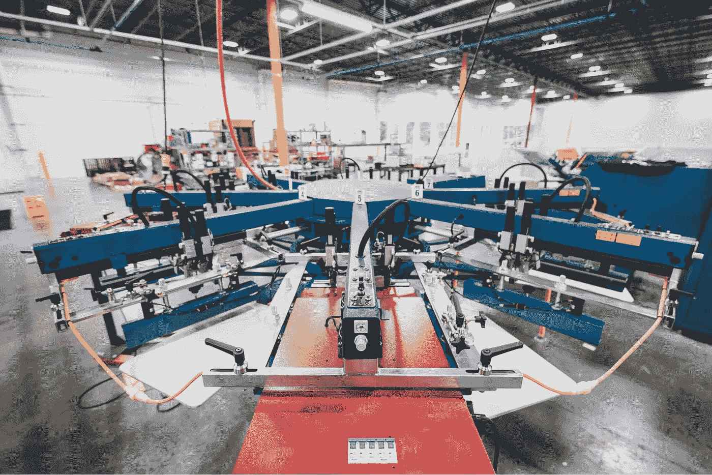
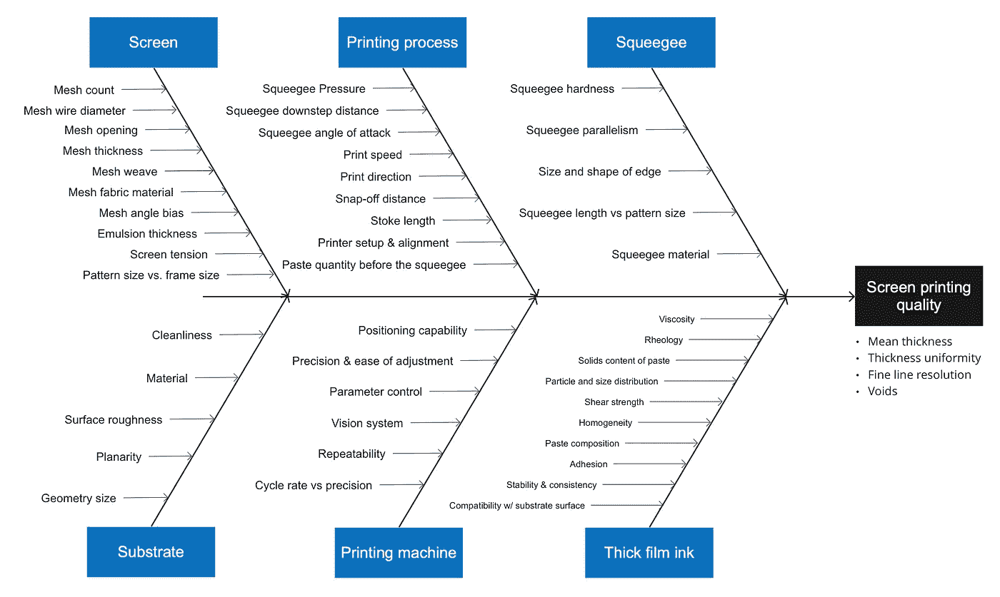
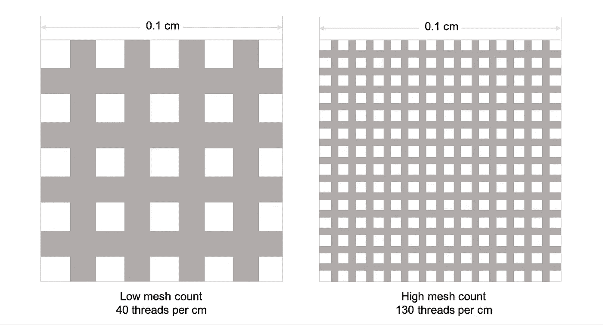
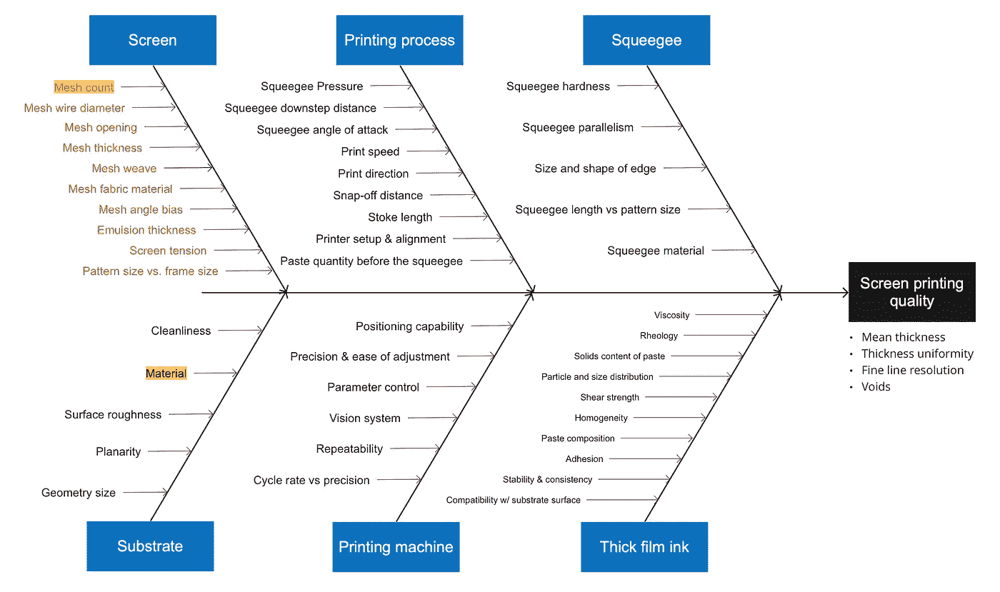
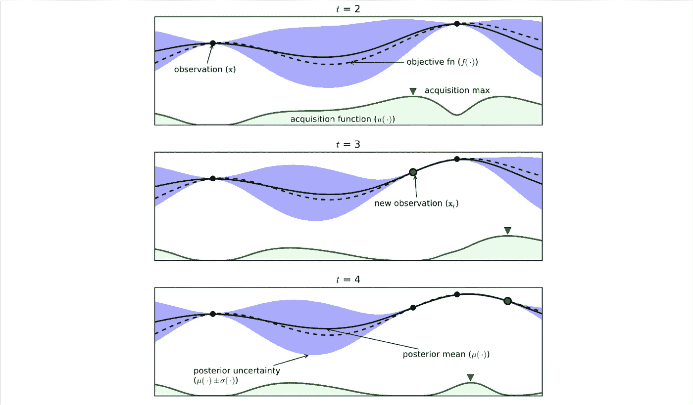
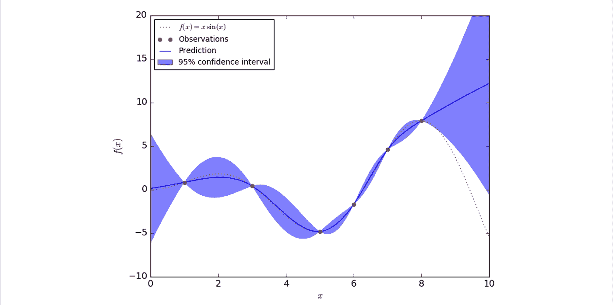
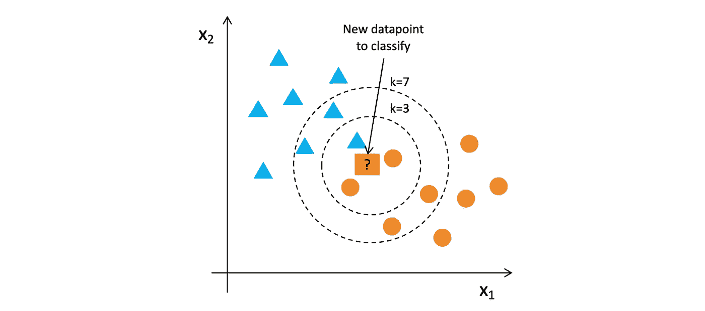
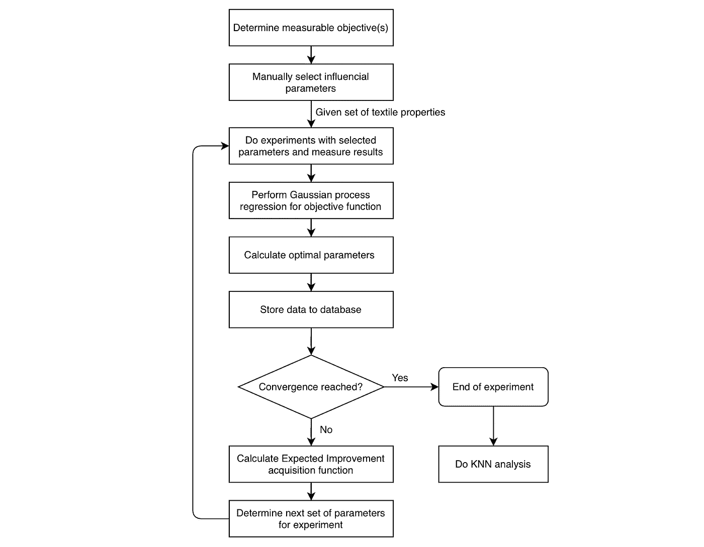

# 丝网印刷模板生产的参数优化

> 原文：<https://medium.com/nerd-for-tech/side-project-parametric-optimization-for-screen-print-stencil-production-d116d0b4828a?source=collection_archive---------18----------------------->

在兼职项目系列中，我探索工作之外的主题，在这些主题中，我运用我的供应链知识和/或技术技能来解决新领域中的问题，并偶尔发现一些可以跨领域利用的管理智慧。

作为我目前正在参加的人工智能案例竞赛的一部分，我的团队面临着一个挑战，那就是为台湾一家有 40 年历史的丝网印刷模板制造商找到最合适的生产参数。以下是我的头脑风暴过程和建议的解决方案:

# 1.摘要

模板制造商(以下简称“LW”)希望研究生产模板的最佳参数，重点是每种织物的性能(包括织物类型、重量、成分等)如何。)唯一有助于选择。我们的团队建议使用“贝叶斯优化”，一种在广泛的行业中被证明有效的数学方法，通过几个实验来确定最佳参数集。

图片来自[印刷版](https://www.printful.com/blog/dtg-vs-screen-printing/)

# 2.介绍

模版制作是丝网印刷供应链中的关键工序，也是最终印刷质量的决定性因素。这种工艺起源于公元 960 年至 1279 年的中国，随着时间的推移逐渐成熟，发展成为一个行业，其中紧密的供需关系比比皆是，植根于对彼此习俗和限制的默认遵守。因此，今天的模板制造商，如 LW，主要依靠经验丰富的工人，他们熟悉行业的“最佳实践”，做出关键的生产决策，尽管他们的专业知识从未经过科学验证。但是，如此多的因素共同影响产品质量的事实(图 1)只显示了人类独自以完美的准确度管理每个细节是多么繁重。因此，许多改进的机会仍然没有得到承认或解决。

图 1[1]:影响丝网印刷质量的因素

LW 希望回答的问题是，织物的不同特性如何影响选择最合适的筛网目数。这个问题反映了使用传统的试错法测试参数的痛点，尤其是面对从未见过的织物类型，不仅需要与上游和下游合作伙伴来回协商，而且如果选择了错误的参数，可能会引发代价高昂的返工。返工的成本粗略估计为 375 美元(每屏 75 美元 x 5 种颜色；相当于台湾平均月薪的 1/3)和 5 个额外工作日。

# 3.根据客户需求量身定制

## 问题分析

首先，我们将 LW 的问题分解为两个部分:织物属性(假设的“原因”)和网格数(假设的“效果”)。在丝网印刷中，织物特性决定了油墨吸收性、表面光滑度和其他导致独特印刷效果的纺织品特性的水平；网目数影响可以流过网孔的油墨量，从而影响最终产品的视觉效果，如分辨率水平和颜色均匀性。

图 2:网目数较低的网屏适用于较大的专色设计，并允许较大颗粒的油墨通过；网目数越高的屏幕越适合使用更精细细节的图像。

在这里，我们发现织物特性和网目数在决定最终产品质量方面都发挥了作用。也就是说，我们不应该使用最初暗示的“原因”和“结果”来解决问题，而是应该将“结果”设置为打印质量，并将“原因”设置为这两个因素。然而，我们发现 LW 目前使用经验和目视检查相结合的方法进行质量检查，而不是一套我们可以进行分析的客观测量方法。这意味着我们以后必须花时间和公司一起定义和实现新的标准。但是目前，在匆忙寻找任何解决方案之前，我们已经澄清了问题的输入和输出。

接下来，我们将问题映射回图 1。我们发现，除了织物特性和网目数量之外，许多其他因素也会影响印刷质量(图 3)。我们怀疑 LW 在调查中遗漏了其他因素(它也可以控制),因为调整这些因素被认为对质量无关紧要或微不足道。然而，考虑到新标准将在没有根据这些标准测量的任何历史数据的情况下实施，对 LW 最有利的是彻底审查所有潜在参数。盲目相信狭隘的问题会使我们失去超越客户过去表现的机会。只有综合评估所有相关参数，我们才能避免陷入局部优化陷阱，并获得 LW 可以长期依赖的结果。

图 3:鱼骨图，网眼数和织物属性(材料)用黄色突出显示。LW 可以调整的参数以红色突出显示。其他值得评估的参数有待 LW 公司进一步确认。

在意识到我们可以通过重新构建问题来更好地满足客户的需求后，我立即将这个想法带到了 LW 的领导团队，并获得了他们的批准，以推进我的计划。LW 的代表对我们团队的谨慎态度印象深刻，并表达了支持我们的强烈意愿。**这一经验表明，利益相关方真诚而积极的参与可以极大地促进信任和变革承诺。**

## 理念表达

LW 公司目前没有可用于分析的数据。然而，从头开始收集大量数据既昂贵又有风险。人类的判断已经有了相当高的成功率。因此，该公司可能对在数据收集方面进行大量投资以进一步改善其运营的兴趣有限，我们现在面临的挑战是找到一种高效的分析方法。

过去关于模板生产参数优化的研究，包括[2–4]，主要使用田口和 DOE 等方法。这种方法需要进行大量试验，以涵盖所有可能的参数组合，每个试验都完全独立于其他试验。我了解到一种叫做贝叶斯优化的替代方法，它利用以前试验中的银行洞察策略来指导下一次试验，可以帮助我们的团队使用很少的试验找到最佳方案。由于计算能力的提高，该方法在过去几年中重新获得了认可，并被证明在加速跨学科各种过程的全局优化搜索方面是有效的，包括深度学习模型的超参数调整[5]，磨床[6]和机器人[7]。我相信贝叶斯优化也是 LW 的成本敏感的制造环境的最佳选择。此外，由于该方法尚未应用于丝网印刷领域，如果成功，它将为该公司提供相对于其他制造商的竞争优势和一种全新的工艺思维方式。最后，如果 LW 公司决定在运营中引入更多数据需求模型，该方法将是一个很好的切入点。

# 4.理论

## 贝叶斯优化

贝叶斯优化结合了高斯过程回归和贝叶斯推理的概念，使用前者来构建未知函数的代理模型，使用后者在新的观察数据集可用时更新模型。然后，计算替代模型的获取函数将推荐用于下一个实验的参数集。重复这些过程，直到数据点满足收敛极限，此时我们可以找到目标函数的全局最优值(图 4[8])。

图 4:该图显示了经过三次迭代的贝叶斯优化分析。该图显示了紫色的目标函数(实际中未知)和绿色的获取函数如何随着附加实验的进行而更新。

## *贝叶斯推理*

贝叶斯推理基于贝叶斯定理，随着更多的观察数据变得可用，更新假设的概率。如果我们假设一个线性函数:𝑦 = 𝑤𝑥 + 𝜖，贝叶斯方法指定一个先验分布， *p(w)，*关于参数， *w* ，我们可以使用贝叶斯规则[9]更新先验分布:

## *高斯过程回归*

高斯过程是随机变量的集合，任何有限数量的随机变量都具有一致的高斯分布[10]。任何高斯过程都可以由均值和协方差(也称为核)函数唯一定义。高斯过程回归遵循贝叶斯推理的思想，将先验知识与新观察到的数据结合起来，以找到预测的分布(图 5[11])。

图 5:高斯过程回归

## *采集功能*

获取函数是数学技术，其通过平衡探索和开发效果来指导在贝叶斯优化期间应该如何探索参数空间。在本项目中，将使用预期改善(EI)采集功能:

EI 采集功能的目标是找到 *g(x)* ，该值有望在已知最大值 *g(x+)* 的基础上提高最多[12]。

## k 近邻算法(KNN)

KNN 是一种非参数方法，它根据新数据点与可用数据的相似性对其进行分类。基于用户分配的 *k* 值，该算法从我们的新数据点找到特征空间中距离最近的 *k* 数据点。那么最近的邻居本质上“投票”新数据点应该属于哪个类。例如，在图 6 中，当 *k* 为 3 时，新的数据点将被归类为橙色圆圈类。

图 6: KNN 算法

KNN 在小规模数据集上被证明是有效的。在 LW 的情况下，我们建议在数据库增长到一定程度时实现 KNN，以便分类结果可以解释。

# 5.方法学

图 7:计划的流程

提议的解决方案包括以下流程(图 7):

1.  *确定可测量的目标:*指导 LW 定义一套可扩展且易于应用的标准来测量最终产品的质量。潜在的指标包括表面粗糙度(Rz)、印刷厚度(EOM)、细线分辨率(显微镜检查)…等等。定量测量将确保数据集如实反映打印质量和“垃圾进，垃圾出”的自由分析。
2.  *手动选择有影响的参数:* LW 已经积累了近四十年的生产知识，这些知识不应该被忽视，而应该融入到研究过程中。因此，在对有意义的参数进行全面、深入的分析之前，我们将依靠有经验的工作人员过滤掉可忽略的参数。这样做将防止重复工作，并避免繁重的计算负荷。
3.  *进行贝叶斯优化分析:*考虑到 LW 缺乏历史数据进行分析，并且天真地从零开始收集大量数据对该公司来说可能风险过大，我们建议使用贝叶斯优化来有效地找出全局最优值，并提供快速的投资回报。这里，我们将遵循第 4 节“理论”中描述的步骤。
4.  *做 KNN 分析:*一旦收集了大量有意义的数据，我们就可以尝试实现 KNN 来更深入地研究不同参数之间的关系，这些参数不容易通过人的判断来识别。

# 6.可预见的风险

*   *优化的参数在实践中不适用:*如果推荐的参数集不能实现，(例如:没有针对特定网格数和网格厚度组合的屏幕)，我们应该按照降序找到较小的优化参数集来实现。
*   *与传统的试错法相比，使用贝叶斯优化没有显著的成本改进:*理论上，由于每个参数的多样性，所提出的方法应该比传统方法具有显著的成本优势。但是可能存在实际的约束来限制变量的多样性，从而限制贝叶斯优化所能带来的成本节约。如果我们没有从应用贝叶斯方法中看到明显更多的好处，我建议跳过贝叶斯优化，一旦收集到足够的数据，就直接进行 KNN 分析。
*   *巨大的计算成本:*贝叶斯优化需要巨大的计算能力，尽管我们希望计算成本落在合理的范围内，因为许多参数将被手动过滤掉。否则，我们建议将贝叶斯优化与进化算法相结合，以加快计算速度[13]。

# 7.预期成果

## **目标(在 3 个月的项目期内)**

*   完成对 3 种面料的研究。
*   与人的判断相比，在参数选择上实现至少 95%的准确性。
*   成功实现客户端操作的数据库和数据库 UI。

## **额外福利**

*   *最小化参数优化成本:*在满足质量要求的同时，减少 50%的实验次数。
*   *无缝数字化转型:*为过渡到数据驱动型文化建立必要的软件/硬件结构。
*   *加强供应商与客户的合作:*为行业内的各方提供一种低门槛的合作方式，以测试创新想法或检查当前流程。

# 8.引用的作品

[1]潘，j .，通凯，G. L .，&库尼特罗，A. (1999 年)。厚膜陶瓷基板细线印刷实验的丝网印刷工艺设计。*电子制造学报*，09(03)，203–213。

[2]严元泰，方廷辉，林永成(2011).用田口法优化膜上芯片封装针孔用 SN9000 油墨的丝网印刷参数。*机器人技术和计算机集成制造，* 27(3)，531–537。

[3]邱(2016)。基于一致模糊偏好关系和田口方法的丝网印刷参数优化研究。

[4] Cazac，v .，Cî rja，j .，Balan，e .，& Mohora，C. (2018 年)。取决于被印表面的丝网印刷质量研究。MATEC 会议网，178 ，03015。

[5]维多利亚，A. H .，&马拉加塔姆，G. (2020 年)。使用贝叶斯优化自动调整超参数。*进化系统*， *12* (1)，217–223。

[6]m .迈尔、a .鲁彭扬、c .博斯特和 k .韦格纳(2020 年)。使用高斯过程模型和约束贝叶斯优化的自寻优磨床。*国际先进制造技术杂志*，108(1–2)，539–552。

[7] D. J. Lizotte，T. Wang，M. H. Bowling，和 D. Schuurmans (2007)，高斯过程回归的自动步态优化， *IJCAI* ，第 7 卷，第 944-949 页。

[8]shahrari，b .，Swersky，k .，Wang，z .，Adams，R. P .，& de Freitas，N. (2016)。将人带出循环:贝叶斯优化综述。*IEEE 会议录*， *104* (1)，148–175。

[9]西特，H. (2020b，6 月 12 日)。*高斯过程回归快速入门——走向数据科学*。中等。[https://towards data science . com/quick-start-to-Gaussian-process-regression-36d 838810319](https://towardsdatascience.com/quick-start-to-gaussian-process-regression-36d838810319)

[10]石，Y. (2020 年 10 月 31 日)。*高斯过程，不太适合假人*。渐变。[https://the gradient . pub/Gaussian-process-not-quit-for-dummies/](https://thegradient.pub/gaussian-process-not-quite-for-dummies/)

[11] *高斯过程回归:基本介绍性示例— scikit-learn 0.17.1 文档。* (2014)。sci kit-学习。[https://sci kit-learn . org/0.17/auto _ examples/Gaussian _ process/plot _ gp _ regression . html](https://scikit-learn.org/0.17/auto_examples/gaussian_process/plot_gp_regression.html)

[12]克拉瑟，M. (2018 年 2 月 21 日)。*贝叶斯优化*。马丁·克拉瑟的博客。[http://krasserm.github.io/2018/03/21/bayesian-optimization/](http://krasserm.github.io/2018/03/21/bayesian-optimization/)

[13]兰，g .，托姆扎克，J. M .，罗杰斯，D. M .，，艾本，A. E. (2020 年)。用贝叶斯进化算法优化的时间效率。[https://arxiv.org/pdf/2005.04166.pdf](https://arxiv.org/pdf/2005.04166.pdf)

*请在下面留下评论，让我知道你的想法。如果你想看到更多这样的文章，请给我 10 个掌声！*