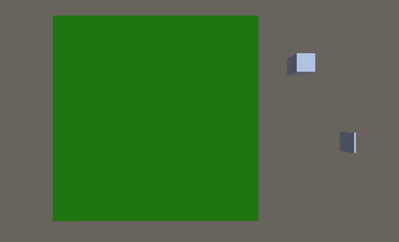
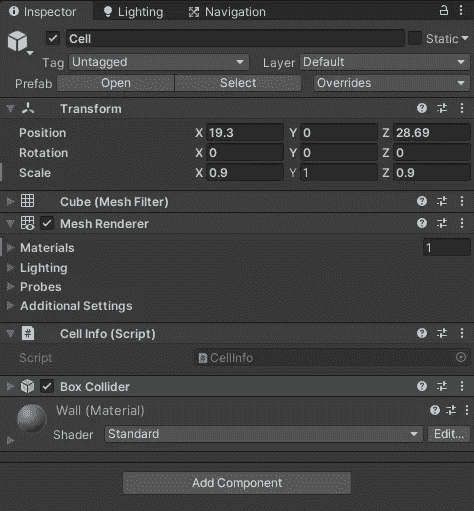
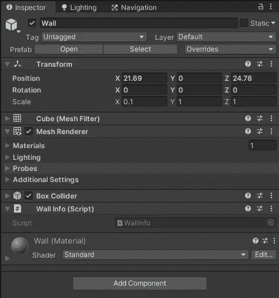
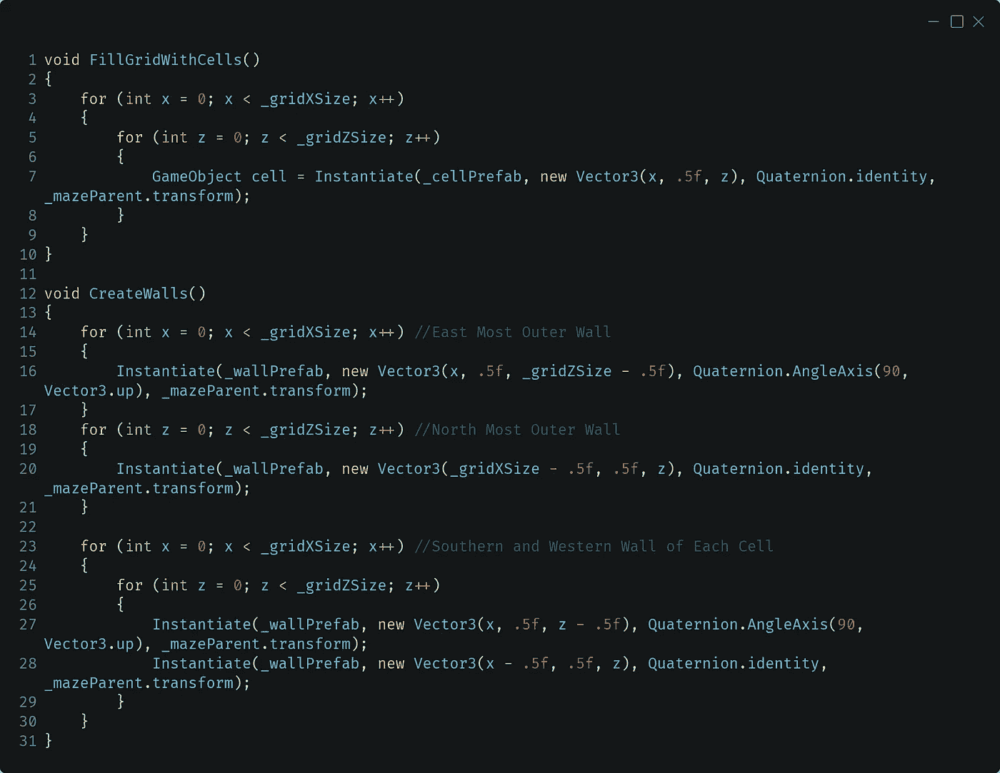

# 迷宫生成:制作网格

> 原文：<https://medium.com/nerd-for-tech/side-quest-maze-generation-making-the-grid-a83010e4c1a?source=collection_archive---------7----------------------->

短暂休息后，我回来了，并决定用迷宫一代来热身。

GIF 中的迷宫是使用递归回溯算法生成的，也称为洪水填充或深度优先搜索。也是我们探索编码的方法。

目标:从零开始生成一个随机迷宫。

条件:玩家或代理必须能够从任何其他点到达迷宫的任何一点。

对于这个设置，我将使用一个平面作为我的表面，一个立方体作为“细胞”,另一个立方体作为墙壁。

这是用于单元立方体的设置。在使它成为你的预设之前，确保位置设置为零。

以及墙壁立方体的设置。

首先，我们需要做的是创建网格，我们将成为一个迷宫。

在这部分代码中，我需要定义几个变量。_gridXSize 和 _gridZSize 是相当自明的，迷宫将建立在 X/Z 平面上，所以我将它们序列化，以便设计师可以选择网格的大小。_mazeParent 是一个空的游戏对象，它将容纳迷宫并允许我们保持场景的整洁。它可以即时创建，也可以由设计师添加。

如果 FillGridWithCells()，我们使用一个嵌套的 For 循环在网格的每个 X，Z 位置创建一个我们的单元预置的克隆。

对于墙壁，我们必须做一些稍微不同的事情。我们可以在网格中的每个单元格周围的每个方向创建一面墙，但这样我们最终会得到对折的墙。为了避免这种情况，我们将沿着迷宫的东侧(+X)创建墙。然后再沿着迷宫的北边(+Z)走。对于南面和西面的墙，我们将使用另一个嵌套的 For 循环来为每个单元格创建一对，这将填充迷宫的南面和西面边界，以及填充网格，而不会重叠。

对于表面放置，我们需要做一点数学计算来得到正确的大小和位置。首先要注意的是，比例为 1 的平面将覆盖比例为 1 的 10 乘 10 的立方体网格。所以当我们算出比例时(上面代码的第 4 行)，我们必须将结果除以 10。我在这里使用的+1 是为了在迷宫周围创造一点额外的东西，并不是严格需要的。但是当你处理两边都不是的迷宫时，它就派上用场了。

至于将平面图放在网格的中心，你需要为每个轴取网格大小的一半来找到中心点。

在下一篇文章中，我们将看看我们需要做这个网格来制作一个迷宫。