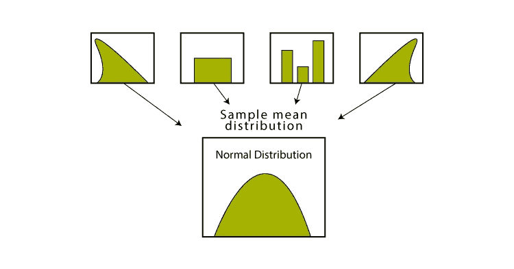
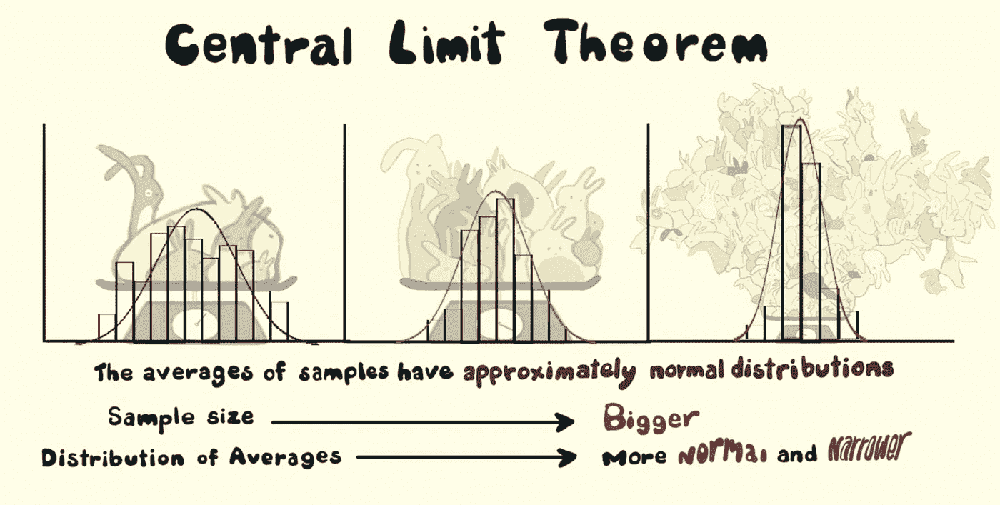
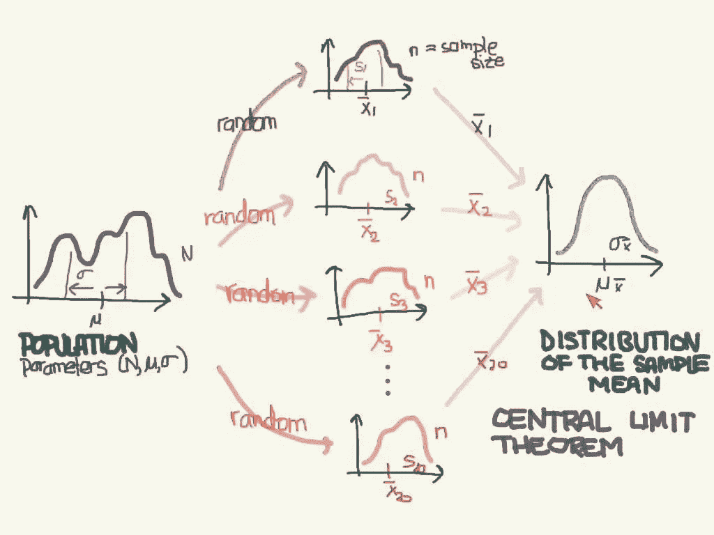

# 简单解释中心极限定理及其实际应用。

> 原文：<https://medium.com/nerd-for-tech/simply-explain-central-limit-theorem-and-its-real-world-applications-9565124c8538?source=collection_archive---------7----------------------->

迪努卡·兰卡洛卡在 [Unsplash](https://unsplash.com?utm_source=medium&utm_medium=referral) 上拍摄的照片

什么是中心极限定理？实际上，它并不复杂，但乍一看没有意义。

在这里，我将用一个真实世界的例子来简单地解释它，你将能够清楚地了解中心极限定理。

在大多数真实世界的用例中，我们不知道总体参数。举个例子，假设你是纽约市一家著名的蘑菇供应商，你每天向整个纽约市的超市供应蘑菇。现在你需要知道每天应该给超市供应多少蘑菇(平均蘑菇数)。因为你不需要让你的产品过剩或短缺。但是你怎么知道你的号码呢？实际上，你无法计算出你的顾客在纽约市所有的蘑菇消费量。是的，这仍然是可能的，但它会杀死你的宝贵时间以及你的钱。

那你现在能做什么？现在中心极限定理出现了。你可以应用中心极限定理来解决你的问题，你可以利用中心极限定理来计算你不知道的总体参数。

**最重要也是最神奇的是，你不需要知道人口分布就可以应用中心极限定理。你的人口分布可以是右偏的，左偏的，指数的，或者任何与中心极限定理无关的东西。**

为了应用中心极限定理，你应该收集一些你的客户在纽约市蘑菇消费的随机数据样本，并计算每个样本的平均值。当您收集随机数据样本时，您应该关注几个因素。

1.  **每个样本量应大于或等于 30。**
2.  你收集的样本应该是随机的，不应该偏向任何一方。
3.  **应该代表你的普通人群属性。**

现在你可以画出纽约市蘑菇消费的每个随机样本的平均值。你可以用直方图来说明你的结果。现在，你能看到什么？最有可能的是，你会看到蘑菇消耗量计算样本平均值的正态分布。你可以看到样本数据分布的均值和标准差。

**另一个要点是，当您增加随机样本的大小时，您的抽样平均分布将更接近正态分布，抽样平均分布标准偏差也将更小。**

> 简单来说，中心极限定理说，当我们收集样本大小(n)等于或大于 30 的随机样本，并且总体具有均值μ和标准差σ时，那么你的采样均值分布将几乎遵循正态分布，并且它的均值也将几乎类似于总体均值μ，其标准误差将为σ/ √n。

现在我们知道了分布的样本均值，根据中心极限定理，样本均值也等于总体均值。我们知道样本均值分布的标准误差。使用该值，我们可以得出总体标准偏差(标准误差= σ/ √n)。

现在我们可以借助中心极限定理得到总体参数(μ，σ)。通过使用总体参数我们可以计算出许多我们需要知道的事情*。*例如，我每天必须供应超过 1000 个蘑菇并且可能更多的概率是多少……..

# **感谢阅读！！！**