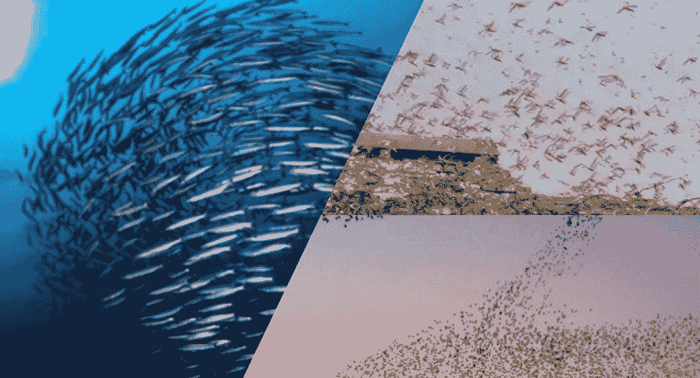
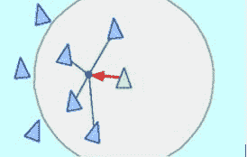
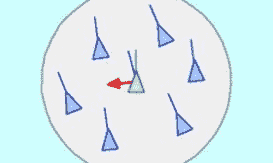
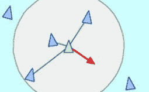
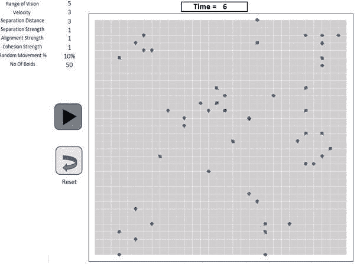

# 模拟虚拟代理中的群集行为

> 原文：<https://medium.com/nerd-for-tech/simulating-flocking-behavior-in-virtual-agents-c7b46a173171?source=collection_archive---------2----------------------->

> 在本文中，我将介绍 boids(一种模拟群集行为的算法)的基本工作原理。然后我分享了一个简单的模型，我只用 Excel**实现了一个二维 Boids 算法。最后，我简要概述了群体智能这个更广泛的主题和一些有趣的应用。

*[* *是的，是的——当然我可以用更现代的东西来实现它，比如 Javascript 或 Python，但是作为一个施虐受虐狂，我想看看我能在一种有 30 年历史的编程语言**的约束下把它推进多远]*

**

# **人工智能简介**

**除了有机会在本文的章节标题中制造真正可怕的双关语……尽管基于深度学习的人工智能受到了大肆宣传，但在这篇文章中，我想回到一些更古老的(但同样有趣的)技术，这些技术是在 20-30 年前在[群体智能](https://en.wikipedia.org/wiki/Swarm_intelligence)算法领域创建的。**

**其中许多在计算机科学领域实际上已经相当成熟(事实上下面链接中的一些文章可以追溯到 2010 年代早期)。群体智能的一些例子是[蚁群优化](https://towardsdatascience.com/the-inspiration-of-an-ant-colony-optimization-f377568ea03f)和[黏菌计算](https://massivesci.com/articles/slime-computers/),但是我们将讨论[和](https://www.urbandictionary.com/define.php?term=OG)群集行为模拟的例子**

**你可能已经看过我早期的帖子，关于使用基于代理的模型(仅使用 excel + vba 构建)来模拟疾病传染**

** [## 用 Excel 建立新冠肺炎传染病模型(...+VBA)

### 样板警告:我既不是流行病学家也不是统计学家，我建立的分析模型更多的是为了…

www.linkedin.com](https://www.linkedin.com/pulse/covid-19-contagion-modelling-excel-vba-eu-zhijing) 

在那个模型中，我没有使用[微分方程来模拟疾病的传播](https://mathworld.wolfram.com/SIRModel.html)，而是使用了一种基于规则的模拟方法，其中虚拟代理四处移动，随机感染他们的邻居。

我想重温一下基于主体的模型中真正让我感兴趣的方面，特别是简单的基于规则的局部交互如何在全局层面产生复杂的涌现行为。

# 什么是 Boids？(又名…Boid 哦 Boid 你是在享受吗…)

20 世纪 80 年代，斯坦福大学的克雷格·雷诺兹开发了一种模拟群集行为的有趣方法(想想成群的鸟、成群的蜜蜂、成群的鱼，甚至微生物群落的生长)

 [## Boids(羊群、牛群和学校:分布式行为模型)

### 1986 年，我制作了一个协调动物运动的计算机模型，比如鸟群和鱼群。它是基于…

www.red3d.com](https://www.red3d.com/cwr/boids/) 

当时，大多数“传统”方法都涉及某种形式的集中控制结构。

“boids”方法在上世纪 80 年代问世时的独特之处在于，它本质上是去中心化的，只涉及简单的地方规则。

在 boid 中，每个 boid(或代理)遵守三个简单的规则:

*   尝试向附近其他代理的平均位置移动(即内聚规则)

*   尝试旋转以匹配附近代理的平均对齐(即对齐规则)

*   通过确保最小分隔距离(例如分隔规则)来避免拥挤

# 开发一个基于 Excel+VBA 的群集模拟器

基于上面的一套规则，我对我最初的“疾病传播”模型进行了大量修改，改为成为“群集模拟器”。

从本质上说，诀窍是使用已经存在的公式，其中我有一个数组来测量模拟中每个代理之间的距离(我需要这个来模拟代理之间过于接近时感染传播的行为)

利用这一点，我基本上建立了一系列新的阵列，根据视觉范围测量每个智能体的最近邻居，然后建立向量来模拟各种内聚/对齐/分离力，而不是像原始模型那样让智能体在任何方向随机漫游

长话短说——它的工作原理是，通过改变内聚/对齐/分离因子之间的相对强度来调整模拟，并给群体的行为添加一点“随机性”。

还有——我知道没有人要求它，但是因为群集模型是用 SEIR 疾病传播模型建立的，它也可以模拟疾病在一群群集动物中的传播

如果你有兴趣玩我搭建的模拟器，这里有 xlsm 源文件 ***** :-

 [## Dropbox

### 编辑描述

www.dropbox.com](https://www.dropbox.com/scl/fi/fnn2c3rbmdw48j21wcqn5/FlockingSimulatorVer01.xlsm?dl=0&rlkey=m178iw1hrdy0hqku3kr7kdrr7) 

******* *因为 VBA 显然不是实现该算法的最有效的编程语言——这里有一个链接，链接到一个基于 Javascript 版本的 Boids 算法的*[*Github repo*](https://github.com/beneater/boids)

# 如今 Boids 是如何使用的

自从最初发表以来，这种基本方法已经扩展到包括许多其他因素，如结合物体回避(如逃离捕食者)或包括个体“逃离”群体的机会。(有时称为“领导变更”因素)

即使是现代的视频游戏引擎，如 Unreal，也以此为基础模拟成群结队的物体(下面视频中的 3m 49s 标记，以防时标不起作用)

这不仅仅是在视频游戏中使用这一概念——这也是用于控制 UAV-s(即无人机)的算法中相对成熟的应用:

这里有一个相当“煽情”的说法:

 [## 什么是无人机群，为什么每个军队都突然想要一个？

### 全世界的军队都在用成群结队的无人攻击机前进。但是什么是真正的无人机群和什么…

www.forbes.com](https://www.forbes.com/sites/davidhambling/2021/03/01/what-are-drone-swarms-and-why-does-everyone-suddenly-want-one/?sh=70ccf2922f5c) 

….为了平衡它——这里有一篇更枯燥、更学术、更少炒作的文章…

 [## IEEE Xplore 全文 PDF:

### 编辑描述

ieeexplore.ieee.org](https://ieeexplore.ieee.org/stamp/stamp.jsp?arnumber=8534340) 

# 总之…

在这篇文章中，我已经讨论了群体模拟器，但这只是这个广泛而有趣的主题的皮毛，因为还有一系列其他的群体智能应用。

例子多种多样，如:

*   [通过模仿白蚁进行协作的建筑机器人；](https://edition.cnn.com/2014/05/29/tech/innovation/big-idea-swarm-robots/index.html)
*   [通过模仿蚁群如何寻找食物来优化物流/交付路线的算法；使用粒子群优化算法提取图像特征](https://www.researchgate.net/publication/334522735_Route_Optimization_in_logistics_distribution_based_on_Particle_Swarm_Optimization)；
*   [蚁群优化算法，推动物联网设备之间的资源高效分配(例如网络带宽或计算能力)；](https://onlinelibrary.wiley.com/doi/10.1002/int.22636)
*   [黏菌被用作生物计算机的基础](https://massivesci.com/articles/slime-computers) s

*唷* —如果你更喜欢看东西而不是阅读，我会留给你这个 2014 TED(x)演讲，它来自我在研究这个主题时偶然发现的:

# …..但是等等，还有更多——额外的随机信息

第二个视频中使用的 Excel 模型的音乐实际上是一个非常有趣的作品，因为它是根据冠状病毒的蛋白质结构通过算法制作的

> *“…。几个 SoundCloud 听众形容作品的早期部分是“舒缓的”和“美丽的”。Buehler 说，这反映了刺突蛋白容易进入人体细胞，使其具有传染性*

 [## 音乐剧中的冠状病毒:美国科学家将病毒转变成旋律来帮助研究

### (路透社)-从病毒解除细胞武装时的叮当声到复制时的冲突和风暴，美国科学家…

www.reuters.com](https://www.reuters.com/article/us-health-coronavirus-music-idUSKBN2222O7)**