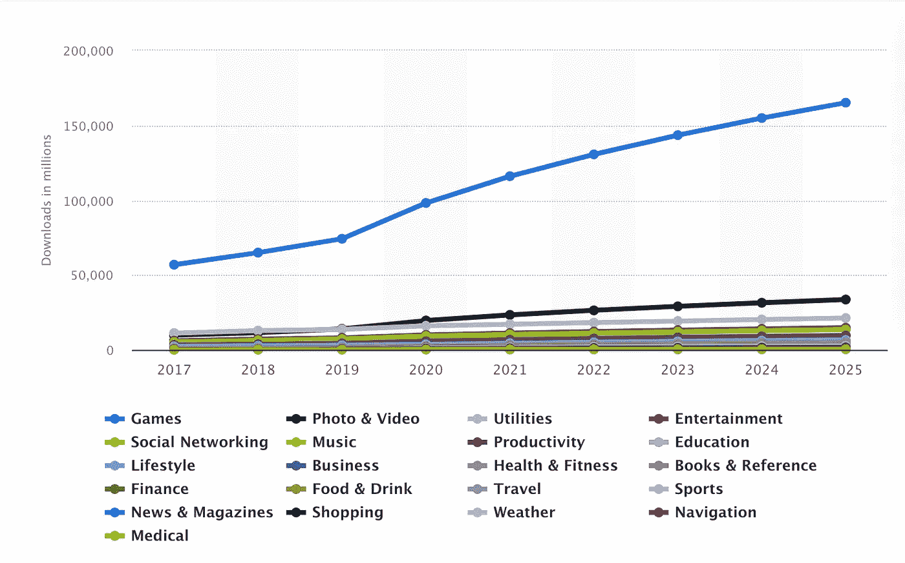
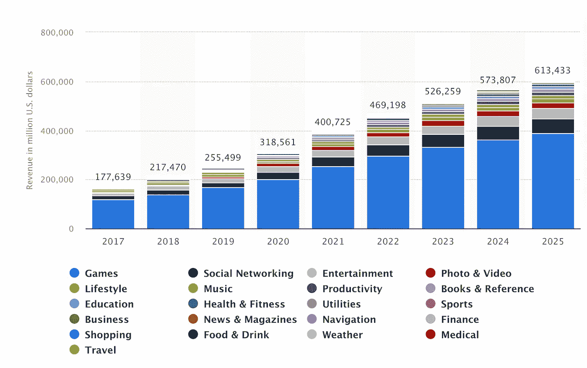
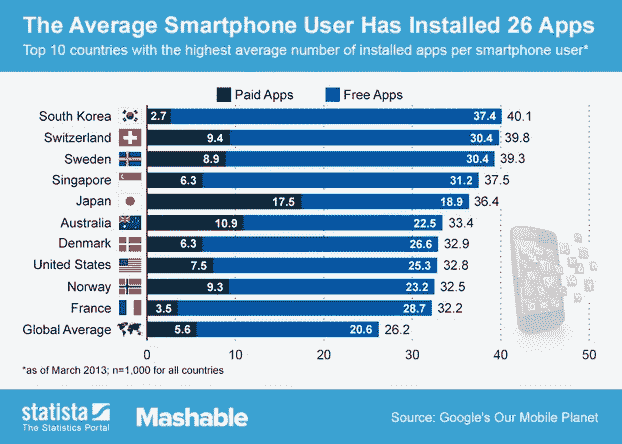

# 可能塑造移动应用未来的六件事

> 原文：<https://medium.com/nerd-for-tech/six-things-that-could-shape-the-future-of-mobile-apps-23eea190ac23?source=collection_archive---------1----------------------->

科林·艾弗里在 [Unsplash](https://unsplash.com/@shofukan?utm_source=unsplash&utm_medium=referral&utm_content=creditCopyText) 上的照片

基于创意的移动应用的淘金热已经过去很久了。在 2010 年，你可以创建一个新的应用程序，一夜之间成为明星，而现在，创建一个应用程序只是一个旅程的开始。

创建一个新的应用程序就像在意大利开一家披萨店，并希望有一天它会蓬勃发展。主要原因是应用程序市场已经饱和。然而，人们仍然需要吃比萨饼，不管市场上的情况如何，新的餐馆都会开业。

过去十年，我们用来构建移动应用的智能手机和技术取得了巨大的进步。在那些日子里，开发人员使用 Java、Objective-C 或 Xamarin 或 Ionic 等臭名昭著的框架。如今，我们使用 Swift 和 SwiftUI、Kotlin 以及 React Native 和 Flutter 等令人难以置信的跨平台解决方案。

今天，我们使用移动应用程序来唤醒我们，帮助我们睡觉，冥想，购买食物，支付账单。智能手机已经深深融入了我们的社会，几乎无法想象没有智能手机的日常生活。我们已经从在诺基亚 3310 上玩贪吃蛇走了很长一段路。

然而，移动应用行业正在经历一场变革，就像现在世界上的任何其他事情一样。要了解未来可能的结果，我们应该了解行业的现状。

# 初速电流状态

目前，在全球超过 60 亿智能手机用户的应用商店中，有 300 万个 Android 和 200 万个 iOS 应用。尽管移动应用在过去十年中稳步增长，但新冠肺炎显著加快了数字化转型和移动应用的使用。

Android 操作系统保持了其作为移动应用领先操作系统的地位。它以接近 70%的份额控制着市场，而 iOS 拥有大约 25%的移动操作系统市场份额。

statista:2017 年至 2025 年全球移动应用下载量(百万次下载)

一些类别比其他类别更受青睐。游戏是下载最多的，而且没有迹象表明这种情况会很快改变。照片和视频应用的增长主要是由于流行的社交媒体平台“迫使”用户分享高质量的视频和图片。

statista:2017–2025 年全球移动应用收入，按细分市场

在 **Google Play** 上排名靠前的应用类别是游戏&娱乐、个性化、生活方式、教育、书籍&参考。应用最少的类别是音乐&音频。

在**应用商店的 24 个类别中，**游戏构成了最大的类别，其次是教育、生活方式、商业和娱乐。天气应用在所有应用中排名垫底，约占 0.3%。

> 到 2023 年，移动应用收入可能会超过 5000 亿美元。

Statista:每个用户(每个国家)的平均应用数量

就平均应用使用量而言，千禧一代通常会在手机上安装超过 67 个应用。但是，常用的 app 号每人剩余 25 个。随着年龄的增长，安装的应用数量减少。

# 未来趋势

## 1.人工智能

人工智能在开发过程中发挥着至关重要的作用，因为这项技术带来了符合用户需求的个性化应用体验。在 2022 年，这将是一个全面发展的趋势。到 2023 年，人工智能收入将达到**709.4 亿美元**。

目前市场上流行的人工智能移动应用程序有:Youper，DataBot，ELSA Speak，Cortana，Socratic 和 Replika。

## **2。区块链**

据预测，到 2025 年，全球区块链收入将增长至 390 亿美元。区块链正在改变应用程序的开发和部署方式。一开始，区块链被认为擅长加密。如今，开发者使用区块链作为一个分散的数据库解决方案**。**

2021 年，我们看到了加密交易所、加密钱包和 NFT 应用的崛起趋势。2022 年，我们预计会看到 dApps 的增长。分散式应用程序(dApps)是存在于区块链计算机网络而不是单台计算机上的数字应用程序。DApps 通常建立在[以太坊](https://www.investopedia.com/terms/e/ethereum.asp)平台上。

市面上流行的区块链/加密应用:Uniswap、Rarable、OpenSea、Uniswap 和 TraceDonate

## **3。AI & VR**

2021 年，AR、VR 和混合现实市场达到 307 亿美元，到 2024 年可能会达到 3000 亿美元。随着 AR/VR 的推出，预计到 2026 年底，移动应用和游戏的工作方式将发生变化。人们也在从 PC 转向 AR/VR，展示了订票、交易、观看、迷你游戏等方面的进步。

## **5。物联网**

物联网和云集成简化了数据处理和存储，提供了简化的流程，增强了协作，提高了生产率，降低了托管成本，加快了安装和集成，并降低了数据处理成本及其复杂的性能。2021 年，物联网市场规模约为**3089.7 亿**美元**。**

## **6。即时应用程序**

谷歌几年前推出了即时应用。他们允许用户不用下载就可以使用应用程序。我们预计今年会看到使用和开发的增长。它们有大小限制，所以它们通常不是应用程序的完整版本。这些限制在未来几年可能会改变。

如果你正在为 2022 年或 2023 年的谷歌 Play 商店开发应用程序，你也需要有一个即时版本。

> 2021 年，预计 72.9%的电子商务将通过移动商务产生，高于 2017 年的 58.9%。

# 结论

这个帖子的动机是我在过去几个月里看过的很多不相关的文章。人们试图通过在开发者中传播恐惧和写误导性的标题来传播移动应用程序已经死亡。它们没有消亡，但移动应用正在经历一场变革，就像现在的世界一样。

我们很可能会在未来看到无代码和低代码工具的兴起，但是开发者不应该太担心。然而，如果你想用你的下一个应用赚钱，你应该考虑意大利的披萨店。好吃的披萨在市场上总有一席之地，这个机会不会很快消失。

👋编码快乐！