# 智能浮标—摘要

> 原文：<https://medium.com/nerd-for-tech/smart-buoy-summary-602f9db544bb?source=collection_archive---------8----------------------->

我们都喜欢海边。作为一个集体，我们聚集在这里度假，享受水上运动或谋生。但是海岸是一个受海浪支配的动态区域。海平面上升侵蚀海滩，飓风等强大的极端事件彻底摧毁它们。为了理解如何拯救他们，我们需要理解推动他们改变的力量。

研究是昂贵的，但如果你能创造廉价、有效的工具，你就能产生更多的数据——最终增进理解。这就是我们智能浮标项目背后的想法。在这个总结中，我们给你一个快速运行我们的项目，并将其分为设计，制作和数据演示。哦，浮标，你会喜欢这个的..！

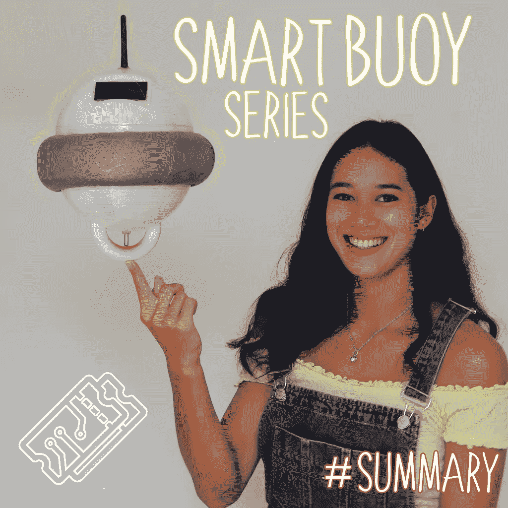

# 供应品:

对于完整的智能浮标建设，你需要很多东西。在相关教程中，我们会对每个构建阶段所需的特定材料进行细分，但以下是完整的列表:

*   Arduino Nano — [亚马逊](https://amzn.to/2jJN7xR)
*   树莓派零度— [亚马逊](https://amzn.to/2jHpV3D)
*   电池(18650)——[亚马逊](https://amzn.to/2ld11cp)
*   太阳能电池板— [亚马逊](https://amzn.to/2ld2vmZ)
*   阻塞二极管— [亚马逊](https://amzn.to/2ld2X4F)
*   充电控制器— [亚马逊](https://amzn.to/2jJhRz0)
*   降压升压器— [亚马逊](https://amzn.to/2jFnCxX)
*   GPS 模块— [亚马逊](https://amzn.to/2jHgwJ2)
*   GY-86(加速度计、陀螺仪、气压计、指南针)——[亚马逊](https://amzn.to/2ld5bB3)
*   水温传感器— [亚马逊](https://amzn.to/2lbTASO)
*   电源监控模块— [亚马逊](https://amzn.to/2lbU5MG)
*   实时时钟模块— [亚马逊](https://amzn.to/2ld6yjb)
*   无线电模块— [亚马逊](https://amzn.to/2l6Fq5t)
*   i c 多路复用器模块— [亚马逊](https://amzn.to/2jJnP2S)
*   3D 打印机— [亚马逊](https://amzn.to/2ld7xQp)
*   PETG 灯丝— [亚马逊](https://amzn.to/30yw95r)
*   环氧树脂— [亚马逊](https://amzn.to/2lbVRNQ)
*   底漆喷漆— [亚马逊](https://amzn.to/2ld55cE)
*   绳子— [亚马逊](https://amzn.to/2jHkjWM)
*   浮动— [亚马逊](https://amzn.to/2lfTZ6R)
*   胶水— [亚马逊](https://amzn.to/2jFpeaZ)

> [🔗在 Github 上获取智能浮标代码📔](https://github.com/sk-t3ch/smart-buoy)

# 它是做什么的？

智能浮标上的传感器使其能够测量:波高、波周期、波能、水温、气温、气压、电压、电流使用和 GPS 定位。

在一个理想的世界里，它也可以测量波浪方向。基于浮标所做的测量，我们非常接近于找到一个能够让我们计算波浪方向的解决方案。然而，它被证明是非常复杂的，在实际的研究社区中是一个巨大的问题。如果有任何人可以帮助我们，并建议一种有效的方法来获得波浪方向测量，请让我们知道——我们很想知道我们如何才能让它工作！

浮标收集的所有数据都通过无线电发送到基站，这是一个覆盆子 Pi。我们使用 Vue JS 制作了一个仪表板来显示它们。

# 建设🛠️

## 浮标外壳

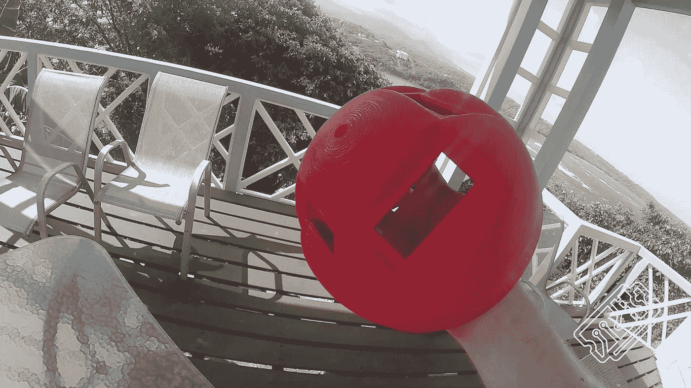

砂砾逐渐变软的沙子

这个浮标可能是迄今为止我们印刷的最难的东西。有太多的事情需要考虑，因为它将在海里，暴露在自然环境和大量的太阳下。我们将在后面的智能浮标系列中详细讨论这一点。

简而言之:我们打印了一个近乎中空的两半球体。上半部分有太阳能电池板的插槽和一个无线电天线穿过的孔。下半部分有一个供温度传感器穿过的孔和一个供绳子系住的把手。

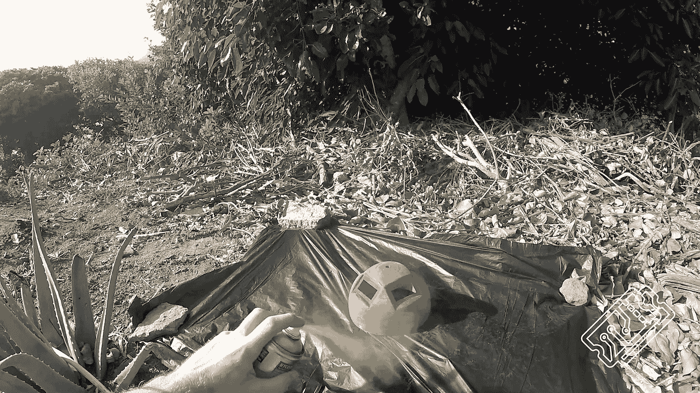

用塑料底漆填料喷涂 PETG 浮标图案

在用 PETG 细丝印刷浮标后，我们用砂纸打磨它，用一些填充底漆喷涂它，然后涂上几层环氧树脂。

在浮标上涂环氧树脂

带有太阳能电池板的环氧树脂覆盖浮标的上半部分

一旦外壳的准备工作完成，我们将所有的电子设备放入其中，然后用胶枪密封水温传感器、无线电天线和太阳能电池板。最后，我们用 StixAll 胶水/粘合剂(超级飞机胶)密封两半。

然后我们希望它是防水的…

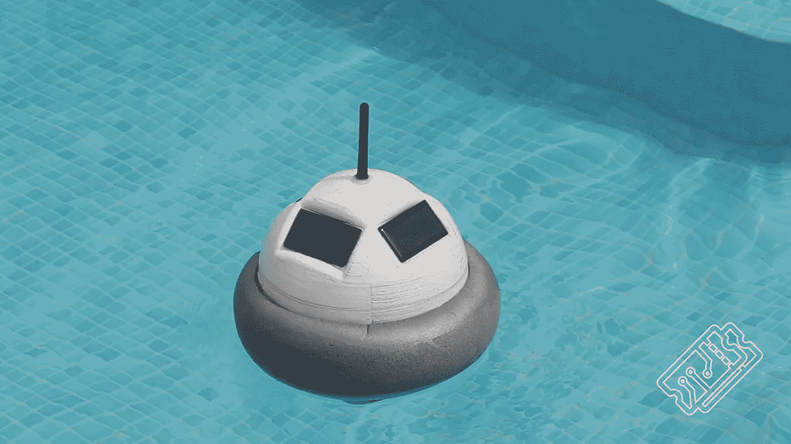

## 浮标电子设备

浮标上有许多传感器，我们将在相关教程中详细介绍这些传感器。由于这是一个总结，我们将尽量保持信息丰富，但简短！

浮标由 18650 电池供电，电池由四块 5V 太阳能电池板充电。然而，只有实时时钟被持续供电。浮标使用实时时钟的输出引脚来控制晶体管，从而允许电力进入系统的其余部分。当系统打开时，它首先从传感器获取测量值，包括来自电源监控模块的电压值。电源监控模块给出的值决定了系统在获取下一组读数之前的睡眠时间。这个时间设置了一个警报，然后系统自动关闭！

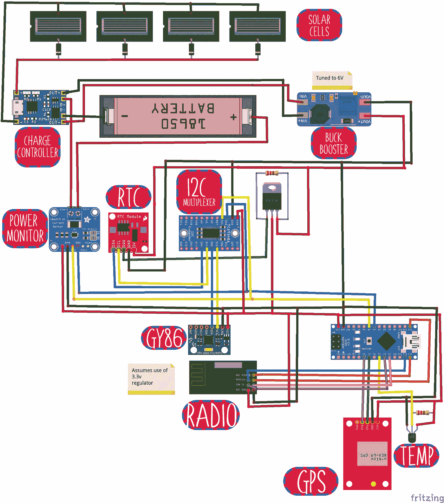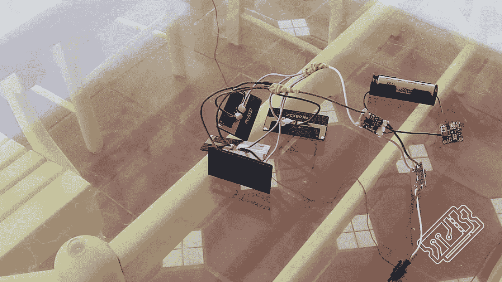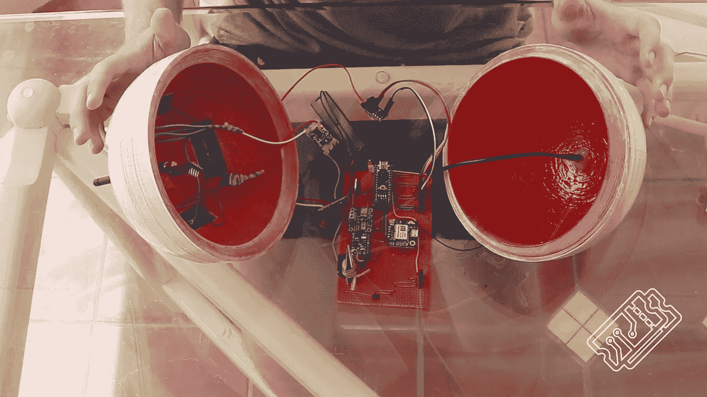

该系统本身是许多传感器和一个连接到 Arduino 的无线电模块。GY-86 模块、实时时钟(RTC)、电源监控模块和 I2C 多路复用器都使用 I2C 与 Arduino 通信。我们需要 I2C 多路复用器，因为我们使用的 GY-86 和 RTC 模块具有相同的地址。多路复用器模块允许你没有额外的麻烦地通信，尽管它可能有点过分。

无线电模块通过 SPI 通信。

最初，我们也有一个 SD 卡模块，但由于 SD 库的大小，它引起了很多令人头痛的问题，所以我们决定放弃它。

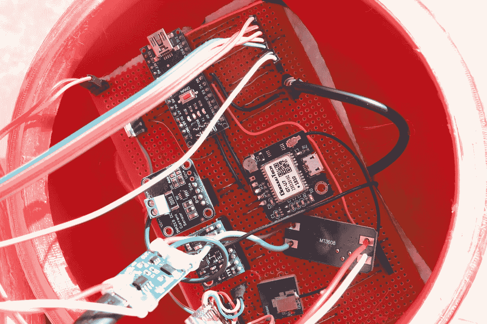

[看一下代码](https://github.com/sk-t3ch/smart-buoy)。很可能你有一些问题——也可能是挥之不去的疑问——我们很乐意倾听。深入的教程包括代码解释，所以希望他们会使它更清楚一点！

我们试图在逻辑上分离代码文件，并使用一个主文件来包含它们，这似乎工作得很好。

## 基站电子设备

基站由一个带有无线电模块的 Raspberry Pi Zero 制成。我们从 https://www.thingiverse.com/thing:1595429 得到了肠衣。你太棒了，非常感谢！

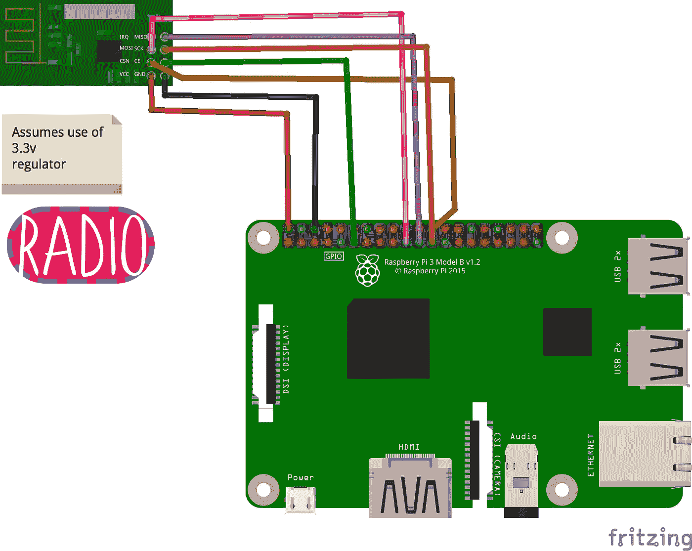

一旦代码在 Arduino 上运行，通过运行`listen_to_radio.py`代码就可以很容易地在 Raspberry Pi 上获得测量值。

## 仪表盘

向你展示我们是如何完成整个 dash 的有点冒险，因为这是一个相当漫长而复杂的项目。如果有人想知道我们是如何做到的，请告诉我们 T3ch Flicks 常驻 web 开发人员将非常乐意就此做一个教程！

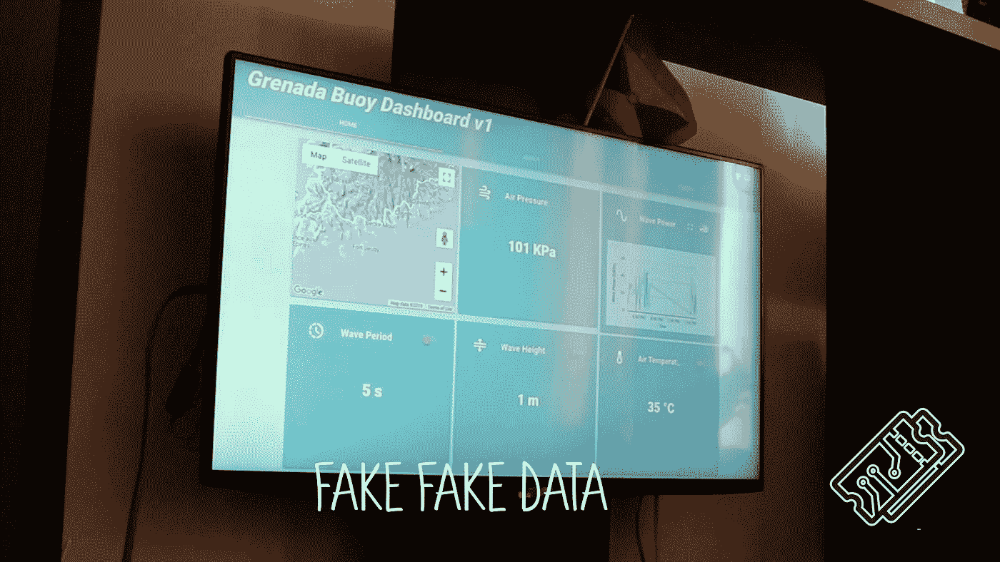

一旦你把这些文件放到一个 Raspberry Pi 上，你应该能够运行服务器并看到带有数据进来的仪表板。出于开发的原因，为了看看 dash 如果由良好的常规数据提供会是什么样子，我们在服务器中添加了一个假的数据生成器。如果你想看看当你有更多的数据时会是什么样子，就运行它。我们还将在后面的教程中详细解释这一点。

> [🔗在 Github 上获取智能浮标代码📔](https://github.com/sk-t3ch/smart-buoy)
> 
> [🔗观看实时仪表板演示💽](https://smart-buoy.t3chflicks.org/)

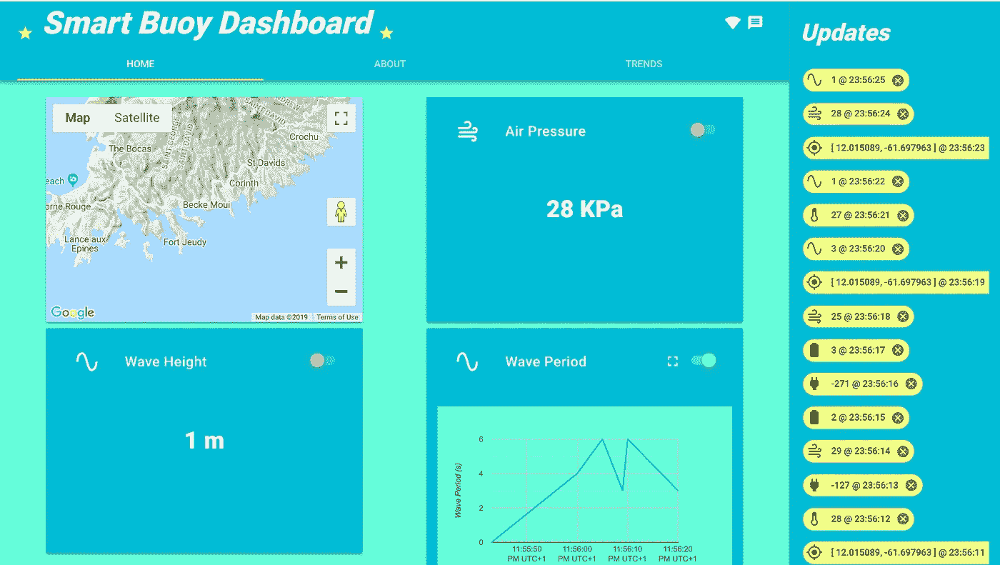

# 版本 2？？

## 问题

这个项目绝对不是完美的——我们更愿意把它看作是一个原型/概念验证。虽然原型在基本层面上工作:它浮动，进行测量，并能够传输它们，但有许多我们已经了解到的，并将在版本 2 中改变:

1.  我们最大的问题是，在把浮标粘住后，不能改变它的代码。这确实是一个小小的疏忽，用一个覆盖着橡胶密封的 USB 端口可以非常有效地解决这个问题。然而，这将为 3D 打印防水过程增加一层全新的复杂性！
2.  我们使用的算法远非完美。我们确定波浪属性的方法相当粗糙，最后我们花了很多时间阅读数学知识，将磁力计、加速计和陀螺仪的传感器数据结合起来。如果有人理解这一点，并愿意提供帮助，我们认为我们可以使这些测量更加准确。
3.  一些传感器表现得有点奇怪。水温传感器是特别不可靠的一个——有时与真实温度相差近 10 度。出现这种情况的原因可能是它只是一个坏的传感器，或者有什么东西在加热它…

## 丰富

Arduino 很好，但如前所述，由于内存问题，我们不得不放弃 SD 卡模块(如果无线电信息无法发送，它应该是数据备份)。我们可以将其更改为更强大的微控制器，如 Arduino Mega 或 Teensy，或者只使用另一个 Raspberry Pi zero。然而，这将增加成本和功耗。

我们使用的无线电模块只有几公里的有限范围[和直接视线](https://www.youtube.com/watch?v=57pdX6b0sfw)。

然而，在一个假设的世界中，我们能够在岛屿周围放置(非常)多的浮标，我们可以形成一个像这样的 T4 网状网络。远程数据传输有很多可能性，包括 lora、grsm。如果我们能够使用其中的一个，也许环岛网状网络将成为可能！

# 使用我们的智能浮标进行研究

我们在南加勒比海的一个小岛格林纳达建造并发射了浮标。当我们在那里时，我们与格林纳达政府进行了一次交谈，他们说像我们创造的智能浮标将有助于提供海洋特征的定量测量。自动化测量将减少一些人工努力和人为错误，并为理解不断变化的海岸提供有益的背景。政府还建议进行风力测量也是一个有用的功能。不知道我们将如何管理这一个，所以如果任何人有任何想法…

一个重要的警告是，虽然这是一个真正令人兴奋的海岸研究时期，特别是涉及技术的时候，但在它被完全采用之前还有很长的路要走。

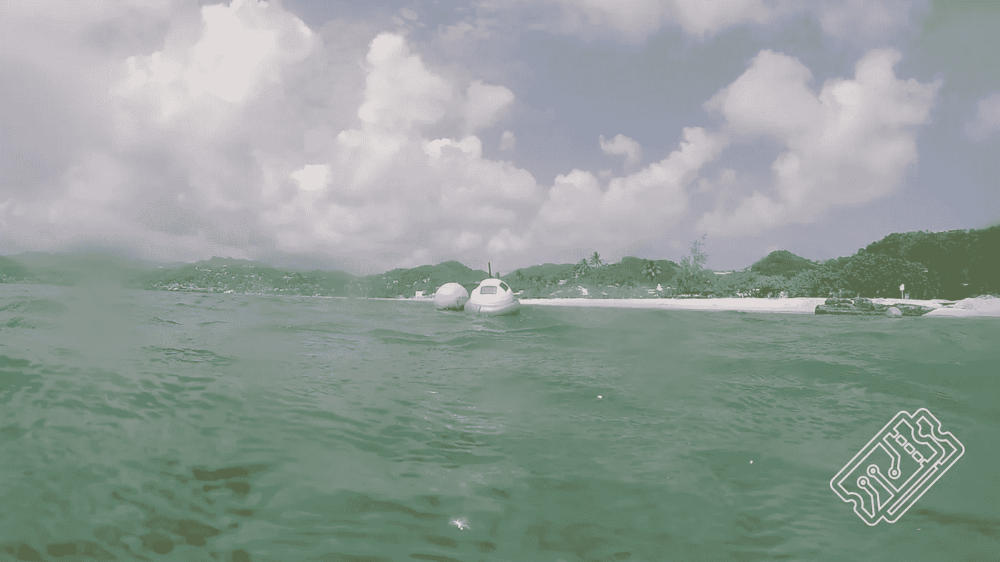

# 感谢阅读

感谢阅读智能浮标系列总结博文。如果你还没有，请看看我们在 YouTube 上的[总结视频。](https://www.youtube.com/watch?v=S-XMT6GDWk8)

[**第一部分**:造波和测温](https://t3chflicks.medium.com/smart-buoy-making-wave-and-temperature-measurements-%EF%B8%8F-cdda14c52196)
[**第二部分** : GPS、无线电(NRF24)和 SD 卡模块](https://t3chflicks.medium.com/smart-buoy-gps-radio-nrf24-and-a-sd-card-module-6029af3a69d)
[**第三部分**:调度浮标电源](https://t3chflicks.medium.com/smart-buoy-scheduling-power-to-the-system-81a2675fdac0)
[**第四部分**:防水、仪表盘和展开！](https://t3chflicks.medium.com/smart-buoy-waterproofing-dashboards-and-deploy-15c730bf9a3a)

我希望你喜欢这篇文章。如果你喜欢这种风格，可以去 T3chFlicks.org 的看看更多的科技教育内容( [YouTube](https://www.youtube.com/channel/UC0eSD-tdiJMI5GQTkMmZ-6w) ， [Instagram](https://www.instagram.com/t3chflicks/) ，[脸书](https://www.facebook.com/t3chflicks)， [Twitter](https://twitter.com/t3chflicks) )。