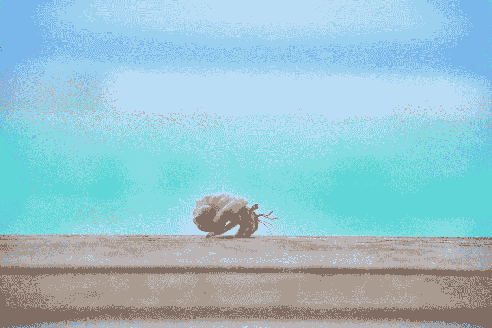

# Smartup

> 原文：<https://medium.com/nerd-for-tech/smartup-f48c378d8f9c?source=collection_archive---------17----------------------->

这是我在写书时发现的一个有趣的故事:寄居蟹在成长过程中必须获得新的更大的壳。换一个新的外壳需要信仰的飞跃，因为他们在尝试新外壳时很脆弱。这种危险是不可避免的:另一种选择是增长不够快，有被吃掉的风险。更惊人的是，寄居蟹可以按大小排队。它们形成了一个链表，然后每一个都在最佳时间内获取下一个 shell。我喜欢把它想象成一个金字塔式的教练。

我一直在重复一个简单的咒语，就像一张破唱片:领导者必须不断成长，否则他们的组织可能会超越他们。我们理所当然地认为，工程师应该定期学习新的工具和方法，但对待管理职位却不一样。

指导高管的一个重要部分是帮助他们认识到他们需要将这些增长努力集中在哪里。有时，发现这些区域可能很棘手。特别是当我们谈论要积极主动时，我们可能不容易找到有问题的地方。这就是为什么我总是说，作为一名顾问，被叫去灭火是很容易的:你可以看到火在哪里！

然而，你应该为你自己和你的团队付出努力。走向稳定健康的个人成长的第一步是接受它的必要性。我在 [*科技高管操作系统*](https://techexecutiveoperatingsystem.com) 中列出的领导方法之一是**放手。我指的不是争斗或分歧，而是不再为你服务的旧习惯。**

这与寄居蟹的故事直接相关。如果我们不放弃以前非常好的事情，我们就不会放弃它。随着时间的推移，我们必须学会识别这些地方，并更聪明地工作，而不是更努力。

# 增长模式

以前有人说过，个人成长似乎遵循 S 曲线模式。我们找到有用的东西，随着时间的推移，当事情变得更具挑战性时，我们会越来越努力地工作。最终，到达了一个平台期——更加努力的工作将不再奏效。在这一点上，我们必须有一个飞跃，改变做事的方式。这是我们追求的个人成长。我们学习如何以更聪明的方式做某件事。因此，一个新的篇章开始了，这一新的飞跃将在一段时间内足够了。你将更加努力地优化它，直到另一次飞跃成为必要。

这正是*放手*的意义所在。假设你有时间进行回顾，考虑你的时间和认知努力花在了哪里。你可能会注意到过去你曾经非常有影响力的领域，但这不再证明你不断努力是正确的。

例如，我看到一些公司没有定期检查和改变他们的招聘策略和流程。这意味着他们会继续尝试用同样的方法雇佣新员工，这些方法曾经适用于前十几名员工。通常，如果我们回顾招聘工作，我们可以注意到一些不平衡已经被引入。可能是渠道仍然很忙，但是你的成交率下降了——这表明你可能需要在把所有的面试精力花在错误的人身上之前改变一些事情。

另一种常见的情况是，领导者一直试图参与较低层次的决策和流程。工程副总裁通常是团队真正的技术资产，他们的投入是有价值的。然而，当副总裁参与进来时，他们没有评估机会成本——还有哪些事情因为被忽视而没有得到足够的重视？从长远来看，未能意识到这种权衡会损害组织的稳定性。

最后，成长有时需要你周围的努力(例如，当你不再能够亲自处理所有问题，必须培训你的员工参与时)，但这也可能只是个人问题。我见过相信别无选择的领导人。如果你问他们，他们会说除了越来越努力地工作别无选择——他们不能依靠他们的人。“他们还没到那一步。”我发现至少有一半的时间，情况并非如此。这个团队有能力也有意愿，我们很难放手。有时你充当拐杖，即使如果你让他们走，他们已经可以自己走了。

所有这些都是说，我们应该定期和常规地考虑我们努力的投资回报率，并找到新的关注领域。有时你可能需要学习如何以不同的方式做一些事情。其他时候，你可以完全脱离自己，看着事情变得比以前更好。你和你的团队将会筋疲力尽，如果没有对你的“努力组合”进行认真的管理，没有一个健康的再平衡来适应正在进行的变化。

*Aviv Ben-Yosef 2021 —在我最近出版的书中获得更多:* [***科技高管操作系统***](https://techexecutiveoperatingsystem.com/)