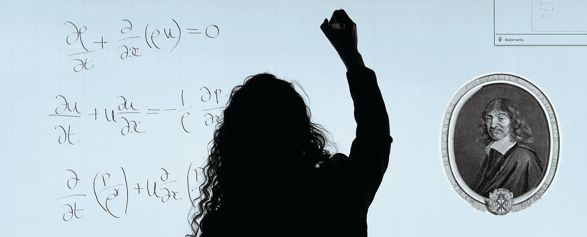
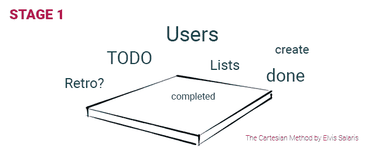
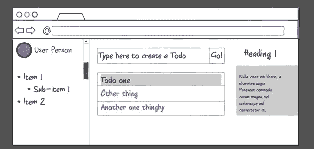
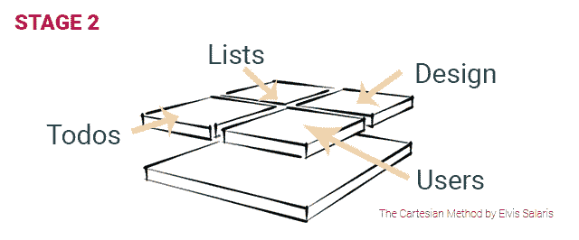
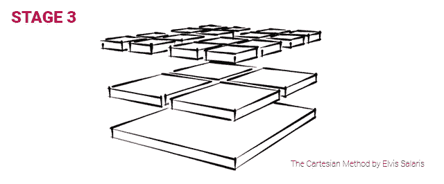

# 软件规划:笛卡尔方法

> 原文：<https://medium.com/nerd-for-tech/software-planning-the-cartesian-method-2fbc165832fc?source=collection_archive---------7----------------------->

来自 [Pexels](https://www.pexels.com/photo/woman-writing-on-a-whiteboard-3862130/?utm_content=attributionCopyText&utm_medium=referral&utm_source=pexels) 的 [ThisIsEngineering](https://www.pexels.com/@thisisengineering?utm_content=attributionCopyText&utm_medium=referral&utm_source=pexels) 摄影

大约十年前，我的任务是规划和开发一个复杂的业务应用程序。不幸的是，我很难理解构成最终作品的各个部分，即使完成的项目在我脑海中非常清晰。

那时，我正在研究旧文学，偶然发现了 T4·笛卡尔的作品，尤其是写于 17 世纪的未完成的论文《心灵方向的规则》。

笛卡尔亲切的头脑可以通过将某些相对简单的规则应用于任何思路来逆向工程几乎任何东西。我承认他的论文对我可怜的普通人脑来说非常复杂，但我很好奇，想尝试许多规则中的至少两条，作为他的方法的简化版本。

1.  从整体开始，一步一步地把事物分开，直到你得到简单的、不可分割的原子碎片；
2.  在分裂的每一步，分析各部分，它们的相互联系，它们与整体的关系，直到你相信你对你所处的阶段了如指掌，才进行下一步。

# 关于规则。

这种方法的第一步包括将一个概念分成三到五个部分，从而定义这个概念的主要参与者和组成部分。

我们拿一个用乐高积木搭建的房子模型来说吧；分割的第一步可能包括分离屋顶、外墙和地基。

现在让我们想象一下，我们首先看到的是房子的完整模型，然后我们被要求离开房间，同时有人将它分成我们之前看到的三个组成部分:看着这三个部分，我们仍然知道它们是如何联系的，以及它们如何被组合成原始模型。如果所有不可分割的部分都被分解，即使这就发生在我们眼前，情况也不会如此。

一旦我们定义了我们的第一个划分层，我们应该:a)分析各个部分，直到我们不能提取更多的信息；b)检查零件如何相互连接；c)了解他们在大局中扮演的角色。

在我们的房子的乐高模型的例子中，a)我们可以看到屋顶大部分是棕色的，我们可以记下它的形状，事实上它可能比其他组件用的部件少，等等。

下一步将是:b)看它如何连接到下一个部分，在屋顶的情况下是外墙，这样我们可以在稍后的阶段将模型放回一起。

在这个例子中，在这个阶段，非常容易理解屋顶在模型的顶部，以及 c)它在整体上有什么功能；

这个分裂层完成了，如果我们对我们的观察满意，我们可以进入下一个分裂阶段。例如，我们可以拆下烟囱，分离四面外墙，等等。

再次强调:在这个阶段不要把所有的部分都打碎，如果你得到了一个不可分割的部分，就让它保持原样(基础很可能是一个单独的乐高积木)。

# 实践中:一个完整的待办事项列表应用程序。

我真的很喜欢这种方法，我尽我所能分享它，因为我认为它可以帮助其他人建立他们自己的个人软件规划方法。尽管如此，我的英语很差，我的解释可能比我希望的更混乱。所以请允许我把它应用到一个现实世界的任务中。

我不想撒谎，这需要时间。

让我们想象一下，我们的老板为我们的下一个项目提出了一个聪明的新想法:待办事项应用程序。

在我们开始编写第一行代码之前，我们被要求确定项目的规模和范围、完成项目所需的资源和时间，以及成品的详细技术概述。

上面的例子含蓄地提到了公司雇佣的程序员，因为对于自由职业者来说，这似乎是一种奢侈，一种你不会得到报酬的东西，一种浪费时间的东西，不是你用来给客户开账单的东西，也不是客户应该在项目开始时提供的东西。作为一名前自由职业者，我想分享一句古老的谚语……

> 数周的编码可以节省你数小时的计划时间。

# 阶段 1:一个用户的故事。

我们正处于敏捷开发的时代，或者更确切地说，如果我幸运的话，正处于它的末期。别担心，我不会抱怨敏捷的缺点，它的许多错误，许多错误的应用，它的罗嗦无用，或者它给我们许多人留下的伤疤:我是谁😛。

但是让我们想象一下，我们的老板带着非常敏捷的用户故事或说明来找我们，这些故事或说明为项目定义了广泛的界限:

*   作为用户，我想创建 Todos。
*   作为用户，我想检查现有的待办事项是否已完成。
*   作为用户，我想将待办事项移到列表中。
*   作为一个老板，而且很可能在设计方面比你更有知识，我想给它一个复古的外观。

关于敏捷计划方式(或预先计划)的简要说明:它与这里介绍的方法正好相反，因为它试图定义一个项目所有可能的方面。对我来说，这就像买一套可能有用的乐高积木，我们可能需要它来建造房子的模型；例如，“作为一个用户，我希望有外墙，”开发商应该回答“我认为我们需要购买尚未确定数量的白色砌块，以便我们可以在下定决心后立即将它们涂成不同的颜色。注意:还要买油漆。”

让我们想象一下任务的原始阶段:一个包含未分割组件的块。

图一

如果你是一个更喜欢视觉的人，你可能更喜欢画这样的东西…

图 2

我看不出第一种方法(单词、概念和块)和第二种方法(把你所知道的一切放入一个线框)有多大区别，但是前者没有对外观做任何假设。

请注意， ***图 1*** 可能包含大量的标签/关键词，我见过完全致力于这一初始步骤的头脑风暴，但这种方法只对阶段有效。我们不仅不会在这一层添加任何关键字，还会丢弃那些属于后来的关键字。

# 第二阶段:削减四分之一。

第一部分通常需要我一分钟的时间。我没想太多就把大野兽切成了四等分。

*请注意，我在写这篇文章时正在应用这种计划方法，没有任何准备，我希望它显示了我在现实中出现的思路。*

## 阶段 1:让我们确定最重要的模块。

1.  托多斯；
2.  列表(或类别，或文件夹)；
3.  用户；
4.  复古风？让我们把它看作是一般的设计。

我没有看到其他大块在起作用，但这没关系:对我来说，在分析的任何阶段发现新的重要参与者都很常见，我们可以回去创建一个新的块，对它应用相同的方法。

## 第二阶段是对作品进行适当的分析或观察。

***a)观察:***

(1) Todos 是项目的主要对象；它们可能看起来像右边某处带有复选框的文本字符串；他们可能应该有自己的数据库表。

这比我可能写下来的还要多。我把它想象成一个贴有“TODO”标签的积木，但我无法阻止我的思绪游离，所以我会把这些内心想法留在这里。

(2)对我来说，列表看起来像文件夹，我在其中拖放上面的 TODO 对象；他们有自己的数据库表吗？很可能，但在现阶段无关紧要；它们有颜色吗？图标？子文件夹？它们在左边的一列吗？我不说了:这不是合适的时间和地点。

它们是 TODO 对象的集合，又是一个带有标签的块。

(3)用户:标签为“用户”的块

我必须非常努力地集中注意力，避免想到像认证这样的词；ACL 简介；头像；GDPR；隐私；电子邮件；密码；电话号码；数据库表；授权库和数据模型…

…开发人员的真正敌人；客户支持。让我跳到下一个街区。

(4)设计:第一个非常混乱的区块。

想想吧。对于开发人员来说，所有其他块都非常容易可视化:您可能会将它们视为数据库表、数据模型、网页上的块、对象、类，以及您专业头脑中想到的任何东西。

它不能被分割成小块，而且其他所有部分都需要各自的设计，所以我为什么要把它分开呢？

这是一个提醒。正如我们将在后面看到的，在对单个部分或整个项目进行决策时，查看该块是很重要的。这是需要牢记的不可分割的一点(我们不会分解这个，恭喜！)也因为这是规范的一部分。

***b)检查连接:***

在这个心理层面上，联系很容易被发现，但是记下来是很重要的。因此，我将按照脑海中浮现的顺序，随机列出我看到的一些例子:

用户创建待办事项；用户将待办事项设置为已完成；用户将待办事项移动到列表中；列表包含待办事项；todos 生活在列表中；用户可以创建列表。

设计呢？在这个阶段有没有什么会阻止这些连接正常工作？现在不行。我们还不知道其他积木的形状和外观。

回顾上面的连接列表，我看到许多新的关键字浮现在脑海中:edit 删除；设置回未完成；为列表命名；todos 能活在列表之外吗？如果是这样，我们需要一个“收件箱/包罗万象/未定义”的列表吗？是否有已删除待办事项或列表的存档？

如果您将 division 层想象成二维的，您应该会看到其中的一些问题可能会将讨论转移到其他层。我倾向于删除这样的问题，或者在别的地方做个记录:不要失去焦点，也不要在 Z 轴上移动。

***c)图层整体:***

我们的层或纸片现在看起来有点乱，但是不要担心，这是修复它并进入下一阶段的正确时间。

请记住，用户、待办事项、列表和设计是带有标签的块，如 ***图 3*** 所示。

图 3

因为该方法的规则不允许我们将块分成更小的组件，所以我们只能假设如下:

*   用户对 todos 执行*操作；
*   用户对列表采取行动；
*   待办事项可以是一个或多个列表的一部分；
*   我们无法知道设计是如何与零件联系在一起的；
*   都是积木；
*   用户、待办事项、列表必须进一步细分；

**act 在这里字面上指的是动词“动作”创建/更新/读取/删除都需要在接下来的阶段进行评估。*

由于指数的数学魔力，下一个细分级别将会更广(或者可能是抛物线或半双曲线之类的东西？).不过，如果我们幸运的话，这可能是最后一次。

# 第三阶段:寻找原子。

图 4

这是我的底线。

**我将从我们生长塔的主体开始，托多斯。我将把这个块分解成几块，同时检查到其他块的所有连接，但是这样做，我将从一个块跳到另一个块。随着复杂性的增长，我的小大脑需要一步一步的方法:找到块的一部分，检查我当时所有部分的连接，然后继续下一个部分。**

**这意味着阶段 1 和阶段 2 混合成一个单一的线性思路。让我告诉你我的方法。**

*   ***todo* 项目必须有标题**
*   **一个*用户*在创建时编写标题，并在以后更新它**
*   **这意味着 *todo* 可以通过一个标识符(比如一个`user_id`)绑定到一个*用户*，否则，每个*用户*都可以看到它或者对它进行操作**
*   **一个*待办事项*可能总是在一个*列表中。另外，让我们问问老板，一个待办事项是否应该一次只出现在一个列表中。他们说:“当然。”***
*   **一个*列表*也需要一个`user_id`字段，否则每一个其他的*用户*都可以访问它**
*   **如果前面两点是我们想要的，那么 todo 项不再需要`user_id`，所有的访问控制都可以连接到*列表***
*   **为*列表*设置一个`user_id`字段意味着一个*列表*只能由一个*用户*拥有**
*   **我们可以通过创建一个交叉引用表来解决前面的问题，这样一个*列表*可以由多个*用户*拥有。`user_id`领域突然消失了**
*   **等等，我们现在是在分享名单吗？问老板。他们说:“是的。”😰**

**好吧，让我们留到以后，回到第一个街区。到目前为止，我们知道一个 *todo* 条目有一个标题和一个对包含它的列表的引用(一个`list_id`数据库字段？).让我们看看还需要什么。**

*   **一个*待办事项*有两种状态:完成或未完成。**
*   **我们说过*待办事项*如果在一个共享列表中，将会被多个用户共享:那么谁能够将它们设置为完整的；改标题；删除它们，以此类推？等等，又是分享？**

**这需要第四阶段的计划和/或说服我们的老板。我会说，“这只是把我们的最后期限推迟了两个月。如果你想更快地把产品推出来，我们以后再考虑吧。”**

**与此同时，为了迎接共享功能成为我们当前工作的可怕一天(毕竟它已经成为新规范的一部分)，我们为什么不修正我们的数据结构以允许它:暂时，它将只是一个由前述单独表中的一个*用户*拥有的*列表*。**

**对我来说，关键是我们考虑过这个问题，我们不应该为了新的功能而疯狂地改变数据结构。**

**我们应该向老板询问是否有描述、评论、标签、附件、截止日期等等。这些都是待办事项的潜在部分。为了简洁起见，我忽略了它们。如果不是我们的方法至少允许我思考它们，我会感到遗憾。**

*   **日期:我们可能需要知道 todo 项是何时创建的；已更新；【软-】删除；已完成(这些要素的进一步细节和分解应在下一阶段进行)。**
*   **所有这些日期都可以用于排序(在下一阶段，我会考虑如何根据创建/更新日期来订购新的待办事项，以及根据完成日期来订购已完成的待办事项)。**
*   **排序是否需要对*待办事项*或*列表*进行分析？**

**让我们回顾一下:现在 *todos* 有了一个**标题**；它们属于单个**列表**；它们有一个用于完成状态**的布尔标志**；他们炫耀一系列的日期。他们是**八九不离十** *。***

**让我们花点时间讨论一下*列表*:**

*   **列表在创建时有一个可以更新的标题(老板这么说的，相信我)；**
*   ***用户*通过`user_list`交叉引用数据库表拥有它们(因为我们将需要共享它们，可能在我们辞职之前)；**
*   **一个*用户*只能看到他们拥有的*列表；***
*   **我问过老板，*列表*既没有颜色也没有标签；**
*   **一个*用户*可以看到他们拥有的*列表*中包含的所有*待办事项*；**
*   **他们可以在*列表*中创建*待办事项*；**
*   **他们可以将现有的一个移动到任何*列表*中；**
*   **删除一个*列表*会破坏我们的应用！除非我们把所有的*待办事项*都移到万能收件箱*列表*；**
*   **收件箱*列表*不能被删除、更新或移动。它必须在顶端；**
*   **每个*用户*一存在就有收件箱*列表*；**

***等一下。当我们删除待办事项时会发生什么？我们是否要软删除它，并在存档列表中显示它？是否应该禁止删除？自第一个数据库发明以来，这些问题一直困扰着开发人员。这篇文章甚至不会试图帮助你。这里没什么可看的。***

***用户*很容易！**

*   **身份验证:请使用任何库。就是不写自己的；**
*   **授权:请使用库；**
*   **如上所述，*用户*有权访问他们拥有的*列表*以及其中包含的所有*待办事项*；**

**正如你所看到的，块*用户*作为与其他块的连接是很重要的，它允许我们将项目作为一个整体来考虑，但是它看起来并不需要很多层的划分或分析。**

***除非你想自己写代码给用户管理。我求你，不要。***

**设计也是如此:它被用作一个提醒，一个占位符，但不应该被忽视。**

**直到现在我们确实忽略了它，但是这是一个极好的机会来检验我们的计划的有效性。**

**为了便于讨论，让我们假设我们的老板不是一个怪物，他在这一点上告诉我们“复古”与 1997 年的网络、终端或巴洛克时代的手稿没有任何关系。相反，他们在考虑复古游戏:像素化的背景和头像，厚厚的三维按钮，等等。**

**我们现在知道“复古”不应该过多地影响我们的计划，因为这只是一种审美要求。我们可能会被终端所困扰——比如“是-否”输入、`<marquee>` HTML 标签*或者其他会影响上述功能的东西。**

****我怀疑* `*marquee*` *标签会对任何事情产生任何影响。我只是想念他们。所以我才提起他们。***

**另一方面，一般的设计可以改变我们对想要使用的框架的选择。**

**从我们到目前为止的分析，我们可以推断出需要:**

*   **拖放(连接设计和待办事项)，**
*   **排序、动态列表(设计列表和设计待办事项)，**
*   ***todos(设计-用户-Todos)完成反馈***

**“复古”关键字意味着我们需要能够定制这样的 UX/用户界面设计元素，以包括花哨的东西。**

**突然，设计模块可以将我们的选择从一个前端框架推到另一个，这也意味着选择一个后端/数据库解决方案而不是另一个。**

# **结论**

**对于我们发现的所有方面和部分，我们还没有找到一个不可分割的原子元素。以一个 *todo* 项目的标题为例。在进一步的分裂阶段，我们可能要考虑它的最大尺寸；如果由于我们的设计选择和要求而需要截断；表情符号如何影响我们的数据库设置；我们需要一个单独的详细页面/弹出窗口/区块来显示完整长度的标题吗？**

**也许有一段时间，这种详细程度是必要的，但这与我在这篇文章中想要表达的观点无关:**

> **软件规划中最昂贵的决策是在开始时做出的。如果您希望避免可伸缩性问题，您应该为选项和潜在的变化做好计划，并尽可能保持数据结构的灵活性，如果成本和工作量允许的话。**

**这种笛卡尔规则的变化帮助我规划了许多项目，从数据库架构到类和方法，从选择前端解决方案到完成工作所需的库。**

**请随意尝试、修改或完全忘记它。我不介意，我打赌伟大的笛卡尔也不会介意。**

**如果你设法活着看到了这篇大帖子的结尾，请给我发一个你的任何帖子的链接，我应该为你鼓掌！**