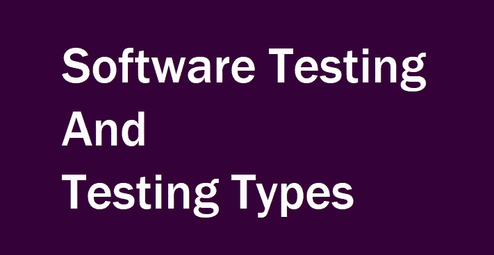

# 软件测试和测试类型/[测试文章系列第 6 部分中的软件开发工程师]

> 原文：<https://medium.com/nerd-for-tech/software-testing-and-testing-types-software-development-engineer-in-test-article-series-part-6-41ffcd4b4418?source=collection_archive---------12----------------------->

这是我的“如何成为一名测试中的软件开发工程师”文章系列的第六篇文章。所有这些文章都是以问答的形式写的。正如我从我的一些菲律宾朋友那里了解到的，这个方法是苏格拉底为了更好地解释事物而发明的。因此，我希望技术和非技术的家伙将受益于这些文章。

这里 可以找到之前的文章 [**。强烈推荐在这篇之前先看前面的文章。**](https://kicchi.medium.com/)

由于我已经做了 11 年多的软件开发人员，我将提供一些真实的和可行的示例代码。这些代码样本源自移动应用程序、桌面应用程序、web 应用程序、web 服务以及各种数据库过程。

为了更好地解释事情，LadyQ 和 SorBi 在我的文章中被大量用作样本。

***女士 Q:*** 索布应用程序的女商人和客户。她付钱给一家软件开发公司开发索比应用程序。

***SorBi:*** 一款用于创建和分享民调的 android 应用。在本系列文章中，以 SorBi 为例。这款应用在 [**Google Play**](https://play.google.com/store/apps/details?id=com.lespania.sorbi) 上可用，支持英语和土耳其语。

让我们享受学习软件测试令人兴奋的东西吧！

> **问题:**Q 女士发现自己的安卓应用索比有问题怎么办？

**回答:**首先要明确“问题”这个词。客户、业务团队和开发团队必须有共同理解的术语。这就是为什么我们遵循像 Scrum 这样的软件开发方法和实现。让我们用更明确的意义来谈论事情。

> 问:好吧，那么，举个例子，Q 女士想要一个“只有会员才能评论”的功能。但是索比应用程序不需要会员才能发表评论。下一步做什么？该怪谁呢？

**答:**正如我们在第一次和第四次会议中指出的，开发团队根据客户的需求开发应用**。如果需求不够清晰，这样的问题就会发生。为了避免这种情况，在软件开发生命周期(SDLC)中有一个测试机制。**

软件测试是一个**继续**的过程，以检查软件**是否符合客户**的需求。

尽管测试阶段是 SDLC 的第四步，但是在 SDLC 的每一步中都要执行许多不同类型的测试。事实上，在敏捷中，测试通常是与其他过程同时发生的**并行**过程。

你上面提到的问题，很可能源于需求收集的错误或者错误的文档。因此，测试活动应该从 SDLC 流程的最开始就开始。

> **问:**我明白了，测试人员从一开始就检查 SDLC 的所有过程？

不完全是。我的意思是，测试应用于整个 SDLC，但是**执行者在每一步都改变**。在敏捷的 Scrum 框架中，在 SDLC 的不同步骤中，每个动作的职责属于不同的人。由于每个动作/过程都有自己的特点，所以每个动作的测试都是不同的，测试人员也是如此。总而言之，测试在每一步都不一样，测试人员也不一样。

> 众所周知，SDLC 的第一步是需求收集。但是，还没有应用程序。那么，考什么，怎么考，考谁呢？

A: 好像没什么可考的。但是，事实上，这是执行测试最重要的一步。如果你错配了衬衫的第一个扣子，其余的扣子都会错配。所以你**必须回到**第一个按钮来正确地扣上你的衬衫。

是时候引入术语 Bug 或缺陷了。一个 **bug** ( **缺陷**)就是软件没有做产品规格书中说应该做的事情。因此，正如您从示例中看到的，如果在 SDLC 的最后**个**步骤中检测到错误，那么修复错误的**成本要高得多。在**早期**阶段修复 bug**更容易**，成本、精力和时间方面也是如此。**

测试活动应该从对照好的需求特征测试需求开始。良好的需求必须满足**智能**标准；**(1)**********【现实】【可测试】。********

****在 SDLC 的第一步(需求收集)中，业务团队创建了软件需求规范(SRS) **文档**。在 SDLC 的第二步(设计)中，设计团队创建了软件设计规范(SDS) **文档**。在 SDLC 测试计划**的第 4 阶段(测试),文档**主要由 QA 领导创建。这些文件通过个人审查、同行审查和小组审查进行测试/检查。**文件**测试、评审过程称为**静态测试**或**验证过程**。它只关注测试文档，而不是软件。静态测试是手动**而不是自动**完成的。****

> ******问:**但是编码阶段可能会有问题。如何检查那个过程？****

******答:**开发人员在 SDLC 的第三步执行单元测试和集成测试；编码。由于开发人员知道实际的代码，这种测试也被称为**白盒测试**。**单元测试***(****1/4****)动态测试* 是测试代码的最小部分，就像测试类和方法一样。**集成测试** *(动态测试的****2/4****)*是测试不同功能的交互和一致性，比如注册模块和购买模块之间的集成。****

****由于单元和集成测试是直接在软件本身上进行的，它们是**动态测试**的一部分。动态测试直接在软件上进行**。动态测试的另一个名称是**验证过程**。******

> ****问:**我越来越糊涂了。如果每个开发人员都测试他/她的代码，那么为什么我们在 SDLC 中有一个测试阶段？**

**答:伙计，这又是一个关键点。你触及了最重要的问题。在 SDLC 的第四步中，软件测试人员执行**系统测试** *(动态测试的****3/4****)*。这就是软件测试人员出现的地方。**

**系统测试是一种动态测试，因为它是在软件上进行的。**

**由于测试人员不知道他们正在测试的软件的底层代码，我们称之为**黑盒测试**。如果他们知道背后的代码，那么我们称之为**灰箱测试**。**

****系统测试分为两部分**；功能测试，非功能测试。**

****功能测试**由前端测试、数据库测试、API 测试(这三层我们在前两节已经看到了)、冒烟测试和回归测试组成。功能测试由 **QAs** ( **质量保证工程师**)执行。**

****非功能测试**包括性能测试、安全测试、负载测试、压力测试。这些测试由**性能测试员**执行。**

> ****问:**我真的被一大堆测试类型震惊了。进行这些测试需要多少钱？**

**答:让我问一个问题。**

**如何保证软件的质量？**

**正确答案是:**通过执行软件测试。****

**主要目标是**满足客户的期望**。**

**所以**确保**软件满足客户的期望。**

**质量保证是防止错误和缺陷的一种方式。**

**很久以来，一直有人工测试人员来执行功能测试。但是自动化测试人员有一个**改变游戏的效果**。他们也被称为**测试中的软件开发工程师** ( **SDET** )。**

**SDETs 使用软件框架和编码能力来执行**自动化**测试，而手动测试人员通过作为最终用户与软件**直接交互来测试软件。因此 SDETs 比人工测试人员执行测试更快。****

**总而言之，有些测试需要手动完成，大多数测试是自动完成的。**

> ****问:**越来越清晰了，但是我有一个问题。在 Scrum 团队中，SDETs 直接对软件进行测试，因为它们执行动态测试。如果后面的代码里或者数据库里有开发者改的东西，那岂不是**乱**？此外，没有人能解决问题，甚至 T42 也能发现问题。**

****答:**这就是为什么所有的测试都在不同的**阶段/环境**下进行。**

> ****问:**什么是**环境**？它是用来做什么的？**

****答:** **环境**无非就是软件的三层(前端、API、后端)。**

**想象一个只有 6 个网页的简单网站，它没有数据库和 API。正如我们所知，不是所有的软件都需要 API 和数据库，所以我们的示例网站需要。**

**假设我们网站的域名是“[www.abc.com](http://www.abc.com)”。当它发布到网络上时，您可以通过互联网浏览器导航到“【www.abc.com】”来访问网站的内容。**

**“【www.abc.com】的[在一个名为 **P** 的文件夹里有它的内容。现在我们称 **P** 为**生产环境**。最终用户只需导航至“www.abc.com”即可访问生产环境。](http://www.abc.com)**

**当“[www.abc.com](http://www.abc.com)”正在播出时，开发者可能想要开发新的功能。为了恰当地实现这一点，他们在另一个名为 **D** 的文件夹中创建了当前网站的精确副本。现在，我们称 **D** 为**开发环境**。开发环境是开发人员专用的，开发人员只需导航到指定的域名，如“dev-abc.com”即可访问该环境。正如您所猜测的，文件夹 **D** 保存着文件夹 **P** 的确切内容。此外，开发人员正在向文件夹 **D** 添加新功能的新代码，而不会干扰文件夹 **P** 。**

**开发人员完成新功能的编码后，他们创建一个名为 **T** 的新文件夹。现在我们把 **T** 称为**测试环境**。当开发人员完成一项功能时，他们将软件发布到测试环境中。当测试人员在文件夹 T 中测试完成的功能时，开发人员可以在文件夹 **D** 中开发新的功能。因此，当开发人员在开发环境中工作时，测试人员在测试环境中工作。这是完全不同的文件夹。测试人员只需导航到指定的域名，如“test-abc.com”或“qa-abc.com”，就可以访问测试环境。**无论**URL 是什么，包含测试环境内容的文件夹与 **P** 文件夹以及 **D** 文件夹完全**不同**。**系统测试在测试环境**中进行。**

**所以没人能修改 T 文件夹里的代码。测试人员自由测试 **T** 文件夹**的快乐时光**。实际上他们正在测试软件的一个特定的**版本**。另一个**构建**发布在 **P** 文件夹中，另一个**构建**发布在 **D** 文件夹中。**

> ****问:**测试环境出现问题怎么办？假设测试人员通过导航到“qa-abc.com”无法到达测试环境。**

****答:**在测试人员开始系统测试之前，有一些步骤需要执行**。例如，检查 web 服务器是否启动或数据库是否可访问。有一种测试叫做**冒烟测试**，用来检查一个软件最关键的部分是否启动并运行。****

**想想索比 app。正如你从前面的会议中所知道的，SorBi 有三层；(1)前端，(2) API，(3)后端(文件服务器，数据库)。如果我们想确保 SorBi 系统一切正常，我们必须测试每个级别，以验证它们是否正在运行并且可以访问。此外，我们必须测试**关键功能**(如注册、登录、创建投票、投票等。)的索布人。所有这些测试形成了烟雾测试。**

**对于测试人员来说，当他们将要在**测试环境**中开始测试时，首先，他们执行一个冒烟测试来检查最低系统要求是否工作良好。如果是这样，他们可以在之后立即执行系统测试。如果没有，他们会通知开发商。**

**软件发布后，每天在**生产环境**中进行冒烟测试，以验证系统已启动，用户可以与系统进行交互而不会出现问题。**

> **到目前为止，这些都很好。我想知道如果 Q 女士想用她依赖的其他测试人员来测试她的应用程序怎么办？**

**答:这就是我们所说的用户接受测试(UAT)。UAT *(动态测试的****4/4****)*由客户自己或聘请的手工测试人员和 SDETs 执行。由测试人员、客户和最终用户手动**执行的测试被命名为**UAT-贝塔测试**。由**自动化脚本**执行的测试被命名为**UAT-阿尔法测试**。该测试由 SDETs 完成。****

> **问:他们在什么环境下进行 UAT 测试？我认为如果他们使用生产环境或开发环境，那将是一场混乱。他们使用 Scrum 团队的测试人员目前使用的测试环境吗？**

****答:**为一个软件创造一个新环境没什么大不了的。只需通过选择另一个文件夹并分配一个新子域来更改生产路径。仅此而已。如果您有一个数据库，请创建它的克隆。就是这样。如果你有一个 Android 应用程序，创建一个不同版本号的新版本。**

**所以，没必要把事情搞得一团糟。对于 UAT 测试人员来说，合适的解决方案是在名为 **U** 的新文件夹中创建软件的新副本。我们将 **U** 文件夹称为**暂存(预生产)环境**。UAT 测试人员可以通过一个相关的 URL 访问这个环境，类似于“uat-abc.com”。**

**由于 UAT 是直接通过软件执行的，所以它是**动态测试**的一部分。**

> ****问:**脑子里有一件烦心的事。真的很吓人。*😨😬想都不敢想。但是，好吧，我鼓足了勇气。让我问一下，最后放松一下。所以，所以，所以，如果一个新功能或者一个代码更新和其他现有的不一致怎么办？请说他们将没有什么不好的软件，请*🤢* …***

****答:**那也是开发人员的噩梦。但是，是的，这类问题是有解决办法的。我们称之为**回归测试**。**

**一旦软件中的代码被改变，或者数据库中的列的数据类型被改变，或者新的功能被添加到软件中，或者错误被修复等等。我们测试所有旧的功能，以检查新代码或变更是否无意中破坏了现有的功能。**

**我们必须检查这一点，因为所有的代码和系统都以某种方式相互关联。**

**如上所述，回归测试是系统测试的功能测试的一部分，因此，它是在测试环境中执行的，主要由 SDETs 执行。它是在发布软件之前执行的。**

> ****问:**非常感谢哥们。你拯救了我的一天。回归测试让我放松了。现在，我可以吃午饭了。否则我不会因为**害怕新功能不一致**而吃。感谢回归测试。你愿意和我一起吃午饭吗？**

**当然，我会的。✔️**