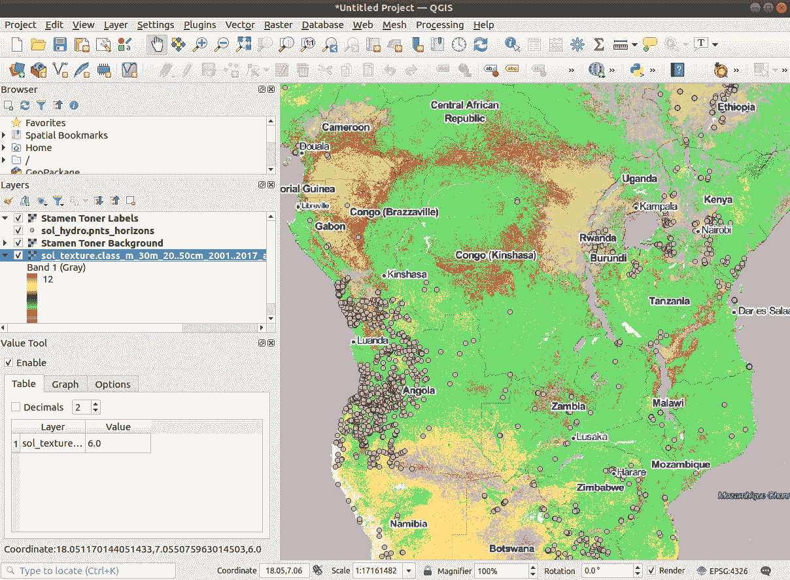
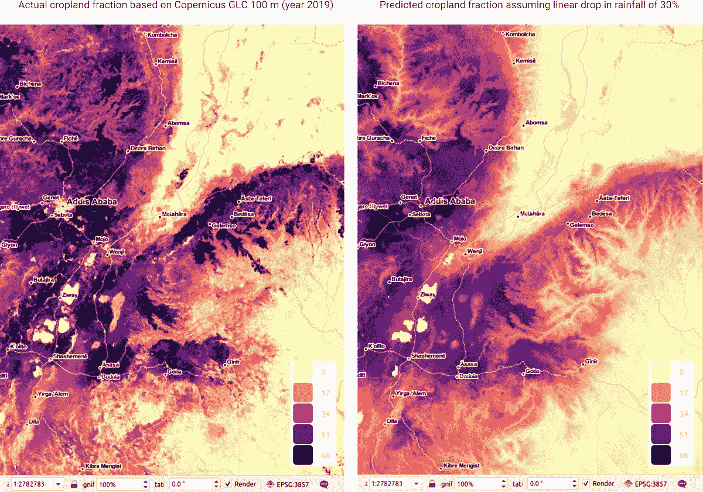
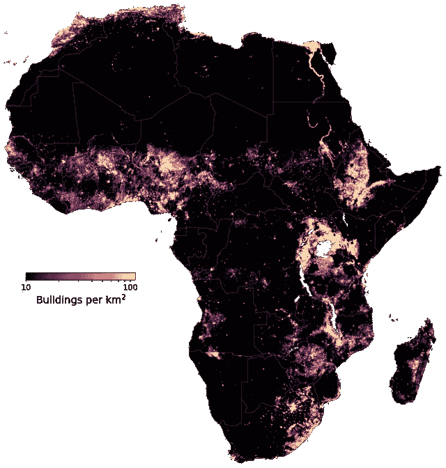

# 30 米空间分辨率的非洲土壤和农学数据立方体

> 原文：<https://medium.com/nerd-for-tech/soil-and-agronomy-data-cube-for-africa-at-30-m-spatial-resolution-591e04bfc372?source=collection_archive---------1----------------------->

*编制人:Tom Hengl (OpenGeoHub)和 Leandro Parente (OpenGeoHub)*

> 地球观测、土壤、地形、土地覆盖和土地利用、气候数据越来越多地为非洲的研究和商业所用。本教程解释了:如何访问非洲的 [iSDAsoil](https://isda-africa.com/isdasoil) 属性和营养地图，以及 Sentinel-2 无云带和地形变量的数量，如何使用它进行计算而无需下载万亿字节的数据。使用 Rmarkdown 编写的完整教程可从 [**这里**](https://gitlab.com/openlandmap/africa-soil-and-agronomy-data-cube) 获得。要了解更多关于 Python 中的云优化地理搜索和地理计算，请访问本教程 。iSDAsoil 的副本也可以从[亚马逊 AWS 开放数据](https://isdasoil.s3.amazonaws.com/)和[谷歌地球引擎数据目录](https://developers.google.com/earth-engine/datasets/tags/isda?hl=en)中获得。

# iSDAsoil 方法和数据

[决策农业创新解决方案有限公司(iSDA)](https://isda-africa.com) 是一家社会企业，其使命是提高非洲小农的盈利能力。iSDA 于 2020 年 11 月发布了一个 30 米空间分辨率的成熟的非洲土壤信息系统(数据根据知识共享归属许可提供)。这些数据的主要目的是帮助在非洲实施[综合土壤肥力管理](http://www.fao.org/global-soil-partnership/resources/highlights/detail/en/c/409514/) (ISFM)和其他可持续的土壤管理做法。该数据集的制作详细记录在 [**这篇中型文章**](/isda-africa/soil-science-and-smallholders-the-contribution-of-soil-to-sustainable-african-agriculture-35a1f67c19a8) 中，也记录在该同行评审出版物中:

*   Hengl，t .，Miller，M.A.E .，Križ an，j .等人(2021) **使用双尺度集合机器学习以 30 米空间分辨率绘制非洲土壤特性和养分图**。科学报告 116130。[https://doi.org/10.1038/s41598-021-85639-y](https://doi.org/10.1038/s41598-021-85639-y)

产生的预测现在可以通过许多服务(Wasabi、 [Google Earth Engine](https://developers.google.com/earth-engine/datasets/tags/isda?hl=en) 、[亚马逊 AWS](https://isdasoil.s3.amazonaws.com/) 公共数据集)作为云优化的地理信息提供，因此开发者和用户基本上可以无限制地使用。

本教程解释了:如何访问非洲的 iSDAsoil 属性和营养地图以及 Sentinel-2 无云带和地形变量的数量，如何在不需要下载万亿字节数据的情况下进行计算。使用 Rmarkdown 编写的完整教程可从 [**这里**](https://gitlab.com/openlandmap/africa-soil-and-agronomy-data-cube) 获得。知识库[https://github.com/iSDA-Africa/](https://github.com/iSDA-Africa/)也包含了用 Python 编写的 iSDAsoil 的例子(如何估计卢旺达和类似地区的石灰需求)。

# 什么是“云优化 GeoTIFF”(COG)？

[云优化地理标签](https://www.cogeo.org/)是针对文件共享进行优化的后处理图像，可被视为等同于地理空间数据库，因为它们[可以服务于空间查询](https://r-spatial.org/r/2021/04/23/cloud-based-cubes.html)。这可能是不受限制地分发空间图层的最佳方式，因为用户可以节省访问数据的时间，并且可以直接将数据加载到大多数 GIS 软件中(这主要归功于 [GDAL 开发团队](https://gdal.org/))。

COG 是如何工作的？COG 文件具有基于切片和比例的空间索引。因此，想象一下，如果您希望覆盖一个点来获取 COG 内的值，http 服务将首先定位图块(通常非常快)，然后定位 COG 内的确切像素，最后返回值(总是数字)。总之，只要你计划只访问一小部分数据，COG 通常会工作得非常快，它与访问和搜索地理空间数据库一样有效。限制 COG 服务的可能是带宽、每个 IP 的请求数量、请求中返回的数据大小等等。还要注意，如果您使用 GDAL 或任何 GDAL 兼容的 GIS 软件(我们建议使用 QGIS)，任何数据处理都是由您的本地机器完成的:COG 服务只专注于提供数据。这也是一个高度便携的系统，因为你只需要复制/上传并提供地理证明(理想情况下通过亚马逊 S3 或其他[亚马逊 S3 兼容服务](https://github.com/geotools/geotools/tree/main/modules/unsupported/s3-geotiff))。

# 怎么用 COG 的？

使用重心进行建模和可视化通常有两种主要的推荐方法:

1.  *将数据直接加载到 GIS / Geoserver，然后选择感兴趣边界框的感兴趣分析。*
2.  使用 R、Python 或类似语言对分析进行编程。

在实践中，我们建议同时使用两种访问路径，以确保您可以直观地验证分析和分析结果。用最简单的话来说:在 QGIS 中打开数据视图，然后使用 R / Python 编写分析程序。对于空间分析，我们建议主要使用 python 中的 [rasterio 包](https://rasterio.readthedocs.io/)和/或 R 中的 [terra / rgdal 包来访问数据。](https://github.com/rspatial/terra)

例如，这是 30 米分辨率下非洲土壤质地分类的网址:

[https://S3 . eu-central-1 . wasabisys . com/Africa-soil/layers 30m/sol _ texture . class _ m _ 30m _ 20..50 厘米 _2001..2017 _ 非洲 _epsg4326_v0.1.tif](https://s3.eu-central-1.wasabisys.com/africa-soil/layers30m/sol_texture.class_m_30m_20..50cm_2001..2017_africa_epsg4326_v0.1.tif)

重要提示:请**不要**在浏览器中打开该 URL，因为文件总大小为 2.1GiB，您的浏览器将直接尝试下载该文件。相反，您可以使用以下命令将此 URL 添加到 QGIS 中:

1.  选择*“图层”* → *“添加图层”* → *“添加光栅图层”*；
2.  选择*“源类型”* → *“协议 HTTP(s)/Cloud”*；
3.  输入图层的网址，离开*【无认证】*；

因此，您应该看到以下内容:



在 QGIS 中可视化的 iSDAsoil 层(土壤纹理类)。

这看起来好像整个地图在您的计算机上本地可用，但实际上不是:它只是实际下载的某个聚合比例的数据预览。Google Earth 和许多其他 web-GIS 应用程序的工作原理基本相同(根据视角和比例下载)。

在上面的案例中，我们还通过下载土壤质地类别的 [SLD 文件添加了图例。请注意，一旦连接到 QGIS 中的重心，就可以运行软件中可用的任何空间分析。请记住，只要您希望对较大部分的数据进行分析，QGIS 就必须下载该边界框的所有数据，这可能会非常耗时。](https://gitlab.com/openlandmap/global-layers/-/blob/master/SLD/sol_texture.class_usda.tt_m.sld)

要从 R 访问同一个层，我们可以运行:

```
library(terra)
tif = "/vsicurl/[https://s3.eu-central-1.wasabisys.com/africa-soil/layers30m/sol_texture.class_m_30m_20..50cm_2001..2017_africa_epsg4326_v0.1.tif](https://s3.eu-central-1.wasabisys.com/africa-soil/layers30m/sol_texture.class_m_30m_20..50cm_2001..2017_africa_epsg4326_v0.1.tif)"
r = rast(tif)
r
class : SpatRaster
dimensions : 268670, 327948, 1 (nrow, ncol, nlyr)
resolution : 0.00027, 0.00027 (x, y)
extent : -31.46424, 57.08172, -34.89109, 37.64981 (xmin, xmax, ymin, ymax)
coord. ref. : +proj=longlat +datum=WGS84 +no_defs
data source : sol_texture.class_m_30m_20..50cm_2001..2017_africa_epsg4326_v0.1.tif
names : sol_texture.class_m_30m_20..50cm_2001..2017_africa_epsg4326_v0.1
```

这表明这确实是 WGS84 坐标中的大 GeoTIFF，并且具有大约 30 米的空间分辨率。同样， [R/terra](https://rspatial.org/terra/spatial/index.html) 没有下载整个图像，而是仅*连接到文件，并且从文件头请求一些元数据。一旦我们从 R 连接到重心，我们就可以继续进行所有标准的空间分析，例如作物值、栅格计算等。假设我们只对每个国家的值感兴趣，那么这是一个非常有效的系统，因为您只需下载分析所需的最少数据。iSDAsoil 层的整体大小约为 1.5TiB，因此我们不建议下载覆盖整个非洲的所有文件。*

# *模拟作为气候、地形和土壤函数的农田分布*

*在 gitlab 上列出的 OpenLandMap 教程[中，您还可以找到一个例子，说明如何使用非洲土壤和农学数据立方体来模拟作为气候、地形和土壤函数的耕地分布。为了避免进行过多的计算，我们将分析限制在埃塞俄比亚和 1 公里的空间分辨率。Rmarkdown](https://gitlab.com/openlandmap/africa-soil-and-agronomy-data-cube) [教程](https://gitlab.com/openlandmap/africa-soil-and-agronomy-data-cube)解释了如何:(1)首先，将感兴趣的图层下载、重采样并裁剪到埃塞俄比亚的多边形地图中，(2)将所有数据加载到 R 中，(3)拟合随机森林模型以解释农田的分布，以及(4)假设(假设)未来降雨量线性减少，预测埃塞俄比亚的农田。*

*最简单地说，耕地的分布可以建模为:*

**农田~ f(降雨量、土壤特性、地形/坡度等)**

*在[教程](https://gitlab.com/openlandmap/africa-soil-and-agronomy-data-cube#building-a-spatial-model-to-explain-cropland-distribution)的例子中，我们实际上使用了 1 公里图像中的所有像素来拟合一个模型。这是因为所有目标和所有协变层都可以作为图像使用，因此要记住训练矩阵很大！为了提高计算效率，我们使用随机森林的 C++/ranger 实现( [Wright et al. 2017](https://www.jstatsoft.org/article/view/v077i01) )。建模结果表明:*

```
*## Ranger result
##
## Call:
## ranger(fm.crop, data = et.sp1km@data[sel, ], num.trees = 85, importance = "impurity")
##
## Type: Regression
## Number of trees: 85
## Sample size: 1084576
## Number of independent variables: 8
## Mtry: 2
## Target node size: 5
## Variable importance mode: impurity
## Splitrule: variance
## OOB prediction error (MSE): 31.36564
## R squared (OOB): 0.913671*
```

*在这种情况下,[结果显示](https://gitlab.com/openlandmap/africa-soil-and-agronomy-data-cube#building-a-spatial-model-to-explain-cropland-distribution)模型是显著的，海拔和降雨量成为最重要的变量。很高兴看到土壤 pH 值也是一个重要的协变量，尽管在这种特殊情况下，农田似乎主要受气候控制。实际与潜在的对比结果表明，假设降雨量减少，人们可以预期耕地分布会严重减少:*

**

*假设降雨量线性下降 30%，实际(左)与潜在(右)农田覆盖。*

*对这种类型的建模感兴趣？测试 iSDAsoil 图层/从 QGIS 和/或 R/Python 访问数据。通过 github/gitlab 运行分析并记录您的代码；然后通过 Twitter 或 Medium 分享结果，并请提及 **@iSDAAfrica** 和 **#SoilData4Africa** 以便我们也能跟踪进展。*

# *目前可用于非洲的图层*

*在 iSDAsoil 项目中，我们提供了一些图层作为 COG，即供公众无限制访问和使用(无需注册，无访问成本):*

*   *[**iSDAsoil**](https://isda-africa.com/isdasoil) 代表 0-20 和 20-50cm 两个标准深度区间的土壤性质和养分；*
*   ***Sentinel-2 无云镶嵌图**(为 iSDAsoil 项目准备)；*
*   ***数字地形模型(DTM)** 基于 ALOS AW3D30 和 NASADEM 以及 DTM 衍生工具(为 iSDAsoil 项目准备)；*
*   *[**open land map layers**](https://openlandmap.org)(从 250 米到 1 公里分辨率)；*
*   *【2018 年 30 米分辨率的非洲人口地图(脸书连通性实验室和国际地球科学信息网络中心-CIESIN-哥伦比亚大学。2016.高分辨率沉降层 HRSL)；*

*非洲的 Sentinel 镶嵌图(由 [MultiOne.hr](https://multione.hr) 准备)相对较大，可能仍然包含场景之间的伪像和水体之外的缺失值等。30 米空间分辨率的人口密度地图不包括**和**一些地区，如苏丹和索马里。*

*要列出整个非洲 30 米分辨率的所有图层，请使用此表[](https://gitlab.com/openlandmap/africa-soil-and-agronomy-data-cube/-/blob/master/csv/wasabi-africa-soil.csv)**。要列出分辨率为 250 的所有可用图层(全局陆地掩膜)，请使用此表[](https://gitlab.com/openlandmap/global-layers/-/tree/master/tables/openlandmap_wasabi_files.csv)**。注意:文件版本可能会改变，因此您的代码需要更新。请订阅该知识库或参考[https://isda-africa.com](https://isda-africa.com)获取关于 iSDAsoil 的最新信息。*****

******重要提示*:我们不**也不**建议下载 30 米分辨率的完整非洲地理照片，因为这些照片的大小通常为 10-20GB(每个文件)。目前知识库的总大小超过 1.5TB。相反，如果您需要分析整个非洲的陆地掩膜，我们建议直接从 zenodo.org 的[](https://zenodo.org/search?page=1&size=20&q=iSDAsoil&sort=mostviewed)**和/或亚马逊的[AWS](https://www.isda-africa.com/isdasoil/)下载文件。另请注意，可以使用各种程序(例如，参见[Hengl&MacMillan(2019)](https://soilmapper.org))得出养分储量和聚集土壤特性，并且总值可能最终会有所不同。*******

# *******其他感兴趣的数据提供者*******

*******其他数据来源(不包括在这个数据立方体中)和非洲的数据门户有地球观测和类似的数据集:*******

*   *******行星尼克菲(【https://www.planet.com/nicfi/】T2):你可以下载 5 米分辨率的 ARD 影像(仅限撒哈拉以南非洲和 CC-NC-like 许可证；由[挪威政府](https://www.nicfi.no/current/new-satellite-images-to-allow-anyone-anywhere-to-monitor-tropical-deforestation/)资助的项目；*******
*   *********数字地球非洲**([https://www.digitalearthafrica.org/](https://www.digitalearthafrica.org/)):提供对地图查看器和沙盒/工具箱( [**GeoMAD**](https://www.digitalearthafrica.org/platform-resources/services-and-analysis-tools) )的访问，可用于衍生每个农场/多边形的各种产品(该项目由美国 Leona M .和 Harry B. Helmsley 慈善信托基金和澳大利亚政府资助)；*******
*   *******非洲知识平台**([https://africa-knowledge-platform.ec.europa.eu/](https://africa-knowledge-platform.ec.europa.eu/)):提供获取非洲社会、经济、领土和环境发展信息的途径。*****
*   *******JRC 的森林资源和碳排放(IFORCE) Sentinel2 L1C 无云复合材料**2015–2017、2018、2019 和 2020([https://forobs.jrc.ec.europa.eu/recaredd/S2_composite.php](https://forobs.jrc.ec.europa.eu/recaredd/S2_composite.php)):提供 2015 年至 2020 年期间 Sentinel-2 L1C 集合 B11、B08、B04 (SWIR1、NIR、RED)波段的访问。更多详情见: [Simonetti 等人(2021)](https://doi.org/10.1016/j.dib.2021.107488) 。*****
*   *****非洲区域数据立方体**ARDC**([https://www . Data 4 sdgs . org/index . PHP/initiatives/Africa-Regional-Data-Cube](https://www.data4sdgs.org/index.php/initiatives/africa-regional-data-cube)):为加纳、肯尼亚、塞拉利昂、塞内加尔和坦桑尼亚提供各种基于 EO 的数据产品；*****
*   *****非洲-欧盟创新联盟([https://afrialliance.org/](https://afrialliance.org/)):旨在提供气候/气象和水文信息；*****
*   *******开放建筑**(【https://sites.research.google/open-buildings/】T2):提供非洲建筑的详细矢量；*****

**********

*****非洲建筑物的详细矢量图。图片来源:【https://sites.research.google/open-buildings/】T4。*****

*****在 [Woldai (2020)](https://doi.org/10.1080/10095020.2020.1730711) 中还可以找到对非洲地球观测(EO)数据服务和趋势的更详细审查。*****

# *****延伸阅读:*****

1.  *****粮农组织，全球土壤伙伴关系，(2016 年)。改良非洲的土壤。粮农组织非洲区域会议，[http://www.fao.org/3/a-i5532e.pdf](http://www.fao.org/3/a-i5532e.pdf)*****
2.  *****t .亨格尔和麦克米伦出版公司(2019 年)。用 R 进行土壤预测制图(第 370 页)。露露。com。从 https://soilmapper.org[取回](https://soilmapper.org)*****
3.  *****亨格尔，t .，李纳斯，J. G .，谢泼德，K. D .，沃尔什，M. G .，赫韦林克，G. B .，马莫，t .，…其他。(2017).撒哈拉以南非洲的土壤养分图:使用机器学习评估 250 米空间分辨率的土壤养分含量。农业生态系统中的养分循环，109(1)，77–102。[doi:10.1007/s 10705–017–9870-x](https://doi.org/10.1007/s10705-017-9870-x)*****
4.  *****Hengl，Miller，M.A.E .，Križ an，j .等人(2021 年)使用双尺度整体机器学习以 30 米空间分辨率绘制非洲土壤特性和养分图。科学报告 116130。[doi:10.1038/s 41598–021–85639-y](https://doi.org/10.1038/s41598-021-85639-y)*****
5.  *****Hijmans，R. J .、Bivand，r .、Forner，k .、Ooms，j .、Pebesma，E. (2020 年)。terra:空间数据分析。克兰。从 https://rspatial.org/terra[取回](https://rspatial.org/terra)*****
6.  *****萨拉戈，v .，巴伦，k .，阿尔伯奇，J. (2019)。推动云优化 GeoTIFF 的采用:一种用于云原生地理空间处理的影像格式。[http://cogeo.org](http://cogeo.org)*****
7.  *****西蒙内蒂博士、皮姆普尔大学、兰格纳大学和马瑞利大学(2021 年)。泛热带哨兵-2 无云年度合成数据集。数据简介，107488。doi:10.1016/j . DIB . 2021.107488*****
8.  *****t .沃尔代(2020 年)。非洲地球观测和地理信息科学的现状——趋势和挑战。*地理空间信息科学*， *23* (1)，107–123。[doi:10.1080/10095020 . 2020 . 1730711](https://doi.org/10.1080/10095020.2020.1730711)*****
9.  *****m . n . Wright 和 a .齐格勒(2017 年)。ranger:在 C++和 r 中对高维数据的随机森林的快速实现。统计软件杂志，77(1)，1–17。[https://www.jstatsoft.org/article/view/v077i01](https://www.jstatsoft.org/article/view/v077i01)*****