# 动荡中的坚实原则

> 原文：<https://medium.com/nerd-for-tech/solid-principles-in-a-flutter-32eaf7218476?source=collection_archive---------1----------------------->

## 这些原则通常由软件工程师使用，并为开发人员提供了一些好处。

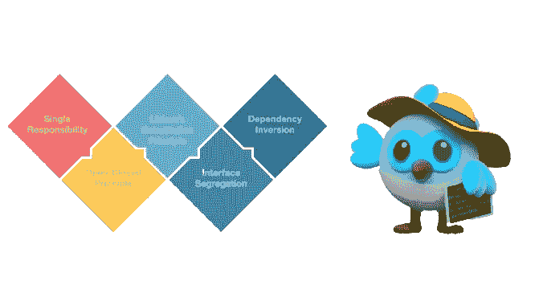

大家好，今天我们将讨论一个与软件工程相关的更普遍的话题。我们将着眼于模式和架构决策。我们要开始的第一部分是**坚实的原则**。

几乎每个面试都会至少问一次关于**坚实原则**的问题，这是最常见的软件开发模式之一。由此，每个人都应该对软件工程中的 SOLID 有一个清晰的认识。

**SOLID** 代表单一责任、开-闭、Liskov 替换、接口分离和依赖倒置，我们将在下面的部分中讨论。开发人员普遍认为它们是好的实践，并且非常受欢迎。

我们将讨论它们中的每一个，并试图理解为什么它们是重要的，为什么你应该在像 **DART** 这样的面向对象语言中考虑它们。

开始时，solid 包含五个原则，我们将逐一了解。对于 solid 中的每个字母，都有一个缩写，我们来看看它们代表什么。因此，我们将看一看它们，但是让我们花一点时间来理解为什么我们首先需要 solid。使用 solid，您可以避免糟糕的软件设计模式、工程错误和代码深度，因此您的代码将更容易，可读性更好。

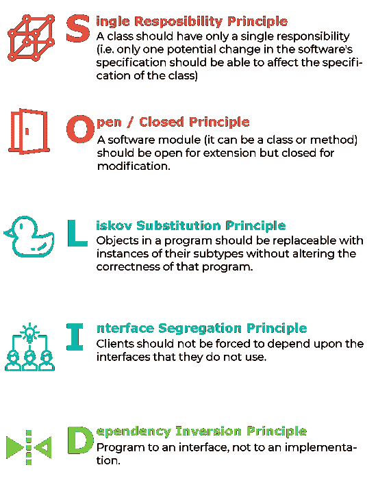

坚实的原则是由软件工程师兼讲师 [***罗伯特·c·马丁***](https://en.wikipedia.org/wiki/Robert_C._Martin) 在 2000 年提出的，被称为鲍勃大叔。它是软件工程中最重要的标准之一，几乎每个使用面向对象编程语言的开发人员都至少读过一次。如果你想了解整个主题的更多信息，我强烈推荐你阅读那本书。在我参加的几乎每一次面试或编码面试中，我都至少被问到一次关于 solid 的问题，所以我希望这篇文章对你有用。

# 单一责任原则

*坚实的原则以一个“S”开始:* ***单一责任原则*** *。在单一责任原则中，你被告知每一个类函数方法，不管你写什么，都只有一个特定的机会，并且应该独占地处理那个责任。如果您有一个发出 HTTP 请求的方法，那么该类应该只知道并理解这个 HTTP 请求是如何工作的，所以它应该只负责与汽车相关的问题。*

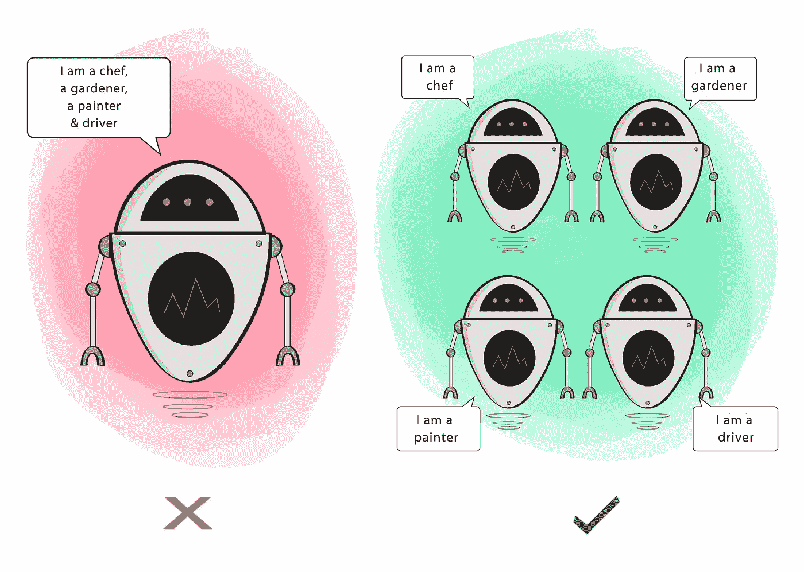

假设您有一个 try-catch，缓存会做类似日志记录的事情。对于这个 HTTP 请求方法来说，这并不是必需的，但是您应该了解如何创建一个日志记录器。

这样你就可以抽象出这些不同的部分，你只需要对你的函数类和其他东西负责，你将会大大改进你的代码，使它更具可读性，因为其他开发人员马上就能理解它是如何工作的。单一责任原则来自两个不同的方面。

首先，做出改变的一个原因，而且只有一个原因。第二，必须只有一个责任——比如说，如果你有数据类，它们应该只负责该类型的数据，而不是寄存器或其他任何东西。因此，单一责任模式或原则源自单一责任和单一变更原因。

让我们看一个例子:

## 不良做法

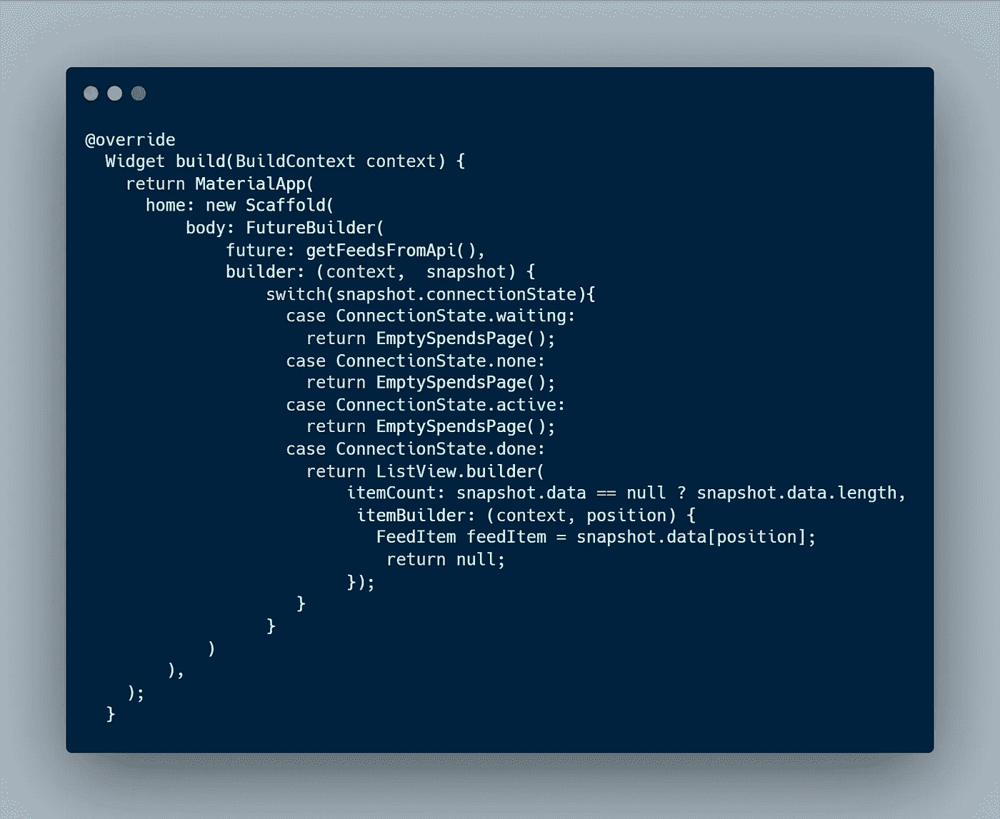

## 良好实践

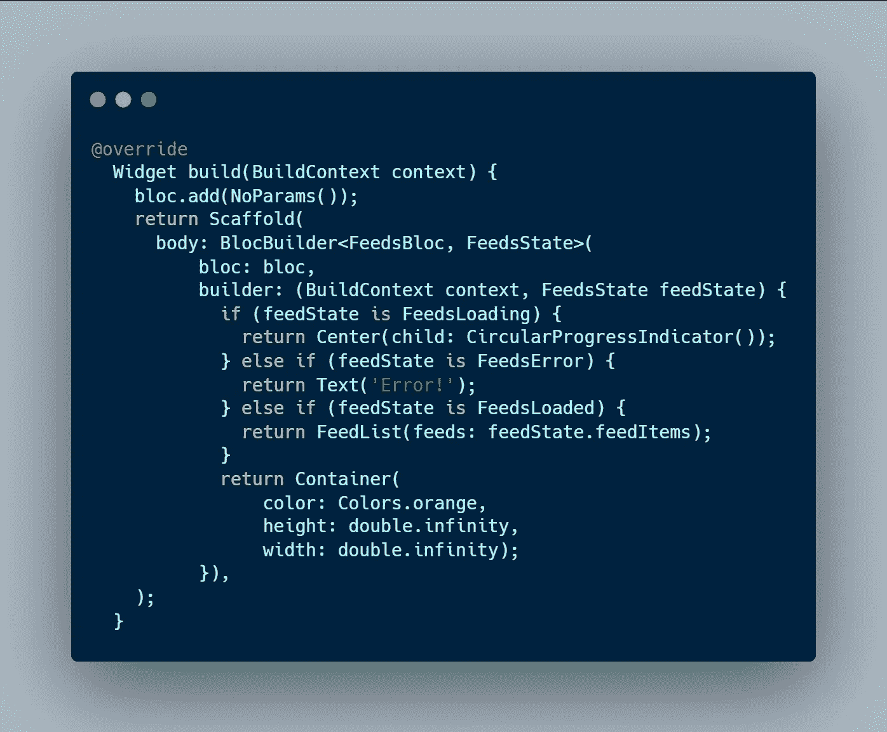

# o:开闭原则(OCP)

此外，还有第二个大原则，以一个**【O】**开始，叫做**开闭原则**。这个原则说，每个类和方法都应该对扩展开放，但对修改关闭。

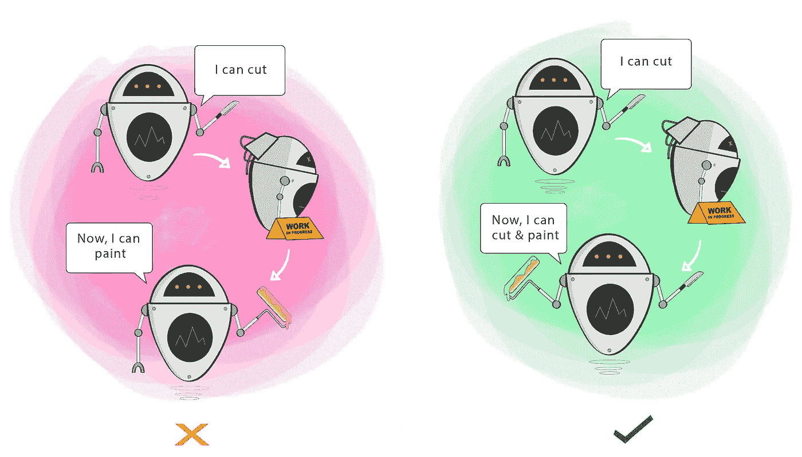

让我们假设你有一个电源插头，你把它插在墙上，你不能对它做任何事情，你不能修改它，你不能移动它或改变它的工作方式，你现在有另一个插头或多个插头，但你可以做的是你可以拿一个电源板，把它连接起来，现在你已经扩展了这个东西，它仍然可以工作，我们将在软件工程中考虑 同样的方法，让我们拿一个有不同储蓄账户的银行账户，一个储蓄账户可能是你的 giro contour，第二个是储蓄账户，第三个是其他账户，所以我们可以创建一个方法来处理这三个账户，比如说如果储蓄，如果用 if else 部分做其他事情，我们会一直改变行为，如果 银行创建了一个新的账户类型，我们必须进入这个方法并改变它，所以我们会修改它，但这并不是很好，所以我们希望有更多的可能性来扩展整个事情，所以如果有一个新的银行账户类型，我们希望扩展现有的。

因此，我们从中吸取了教训，作为单一责任方法的结果，我们使开发更有创意和更容易维护的东西成为可能，所以我们将有更好的机会测试所有的东西，特别是如果它需要扩展，所以如果新的东西进来，我们只需插入它，它就会工作得很好。因此，前两个原则已经确立，现在我们有了一个新的原则。

****开闭原则*** *指出，在有效的架构中，应该在不改变现有代码的情况下添加新的行为。它通常被称为“类应该对扩展开放，对变化关闭”。**

*看看这个例子:*

## *不良做法*

*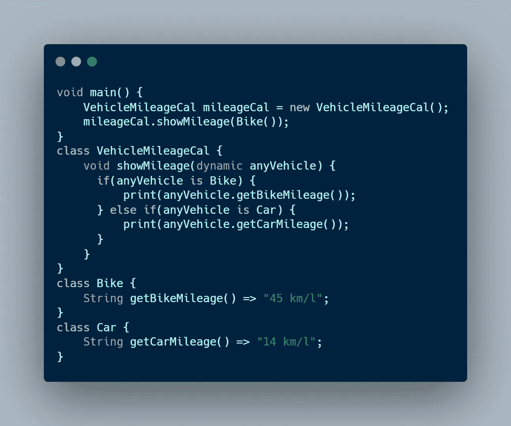*

## *良好实践*

*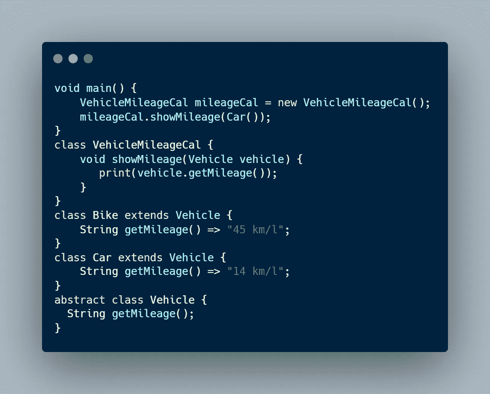*

# *李:利斯科夫替代原理(LSP)*

*以**“L”**开头的第三个大原则是 **LISKOV 替换原则**这很难理解，也是软件工程中最难掌握的部分之一，因为这个原则很难解释，所以我们会尽量解释得简单一点，这样替换原则的列表就更容易解释了。正如我提到的，替换的目的是以某种方式将子类型替换为其通用父类型，所以假设我们以咖啡机为例。*

*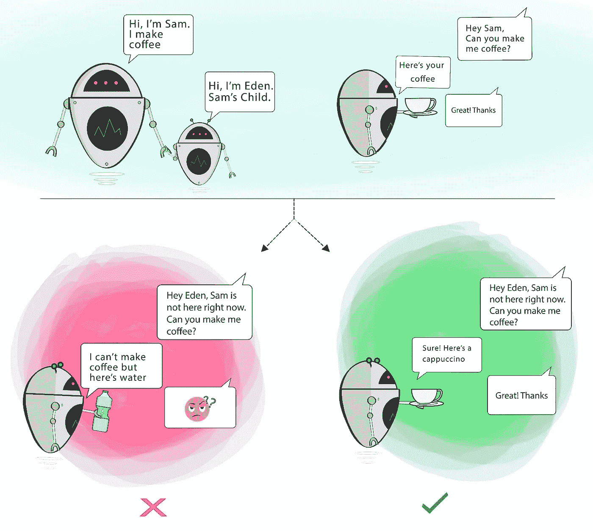*

*让我们假设你有一个基本的咖啡机，你作为一个用户想要一杯咖啡，所以你按下一个按钮，你调用的方法，例如制作咖啡，然后你就可以很容易地得到你的咖啡，非常容易，你把一个过滤器放在里面，这非常简单，你知道它是如何工作的，现在你把旧的咖啡机换成一个新的，高级咖啡机 deluxe 2000 有一个研磨机，它知道更多的方法 smarts 它确切地知道它需要的温度，但最终你作为一个用户仍然只是打电话制作咖啡，你并不真正关心如何制作咖啡，你不想照顾所有这些不同种类的东西，所以你可以很容易地替换它们，这使原则列表成为可能。*

**根据* ***LSP(LISKOV 替换原理)*** *在不改变程序逻辑正确性的前提下，子类应该替换为超类。本质上，子类型必须保证其超类型的“使用条件”以及一些额外的行为。**

*例如:*

## *不良做法*

*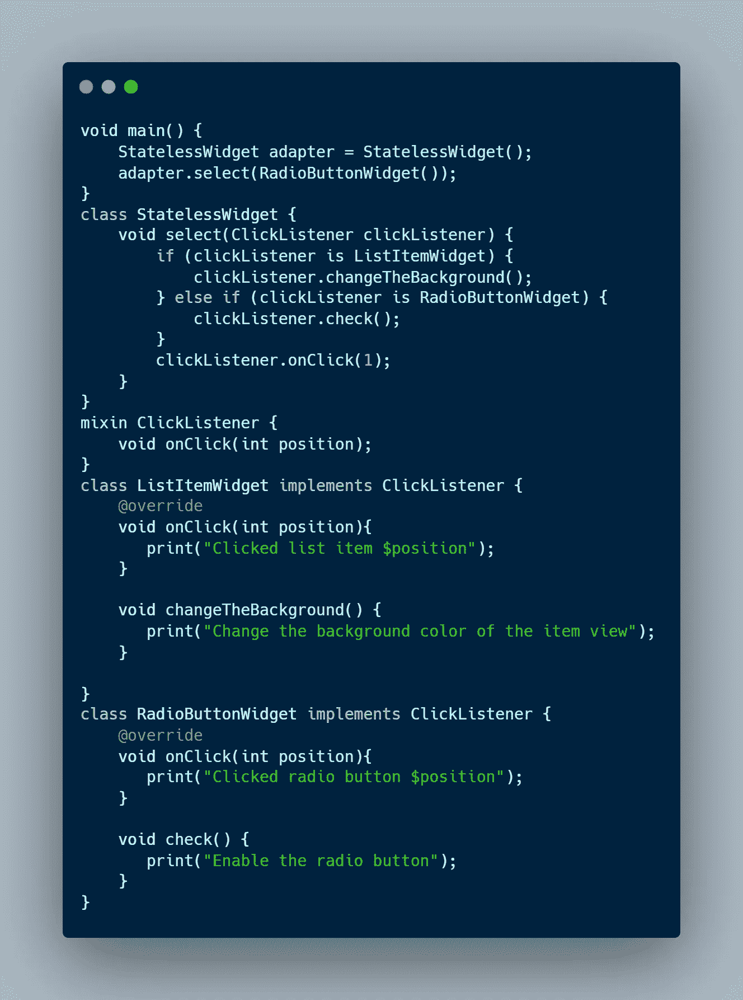*

## *良好实践*

*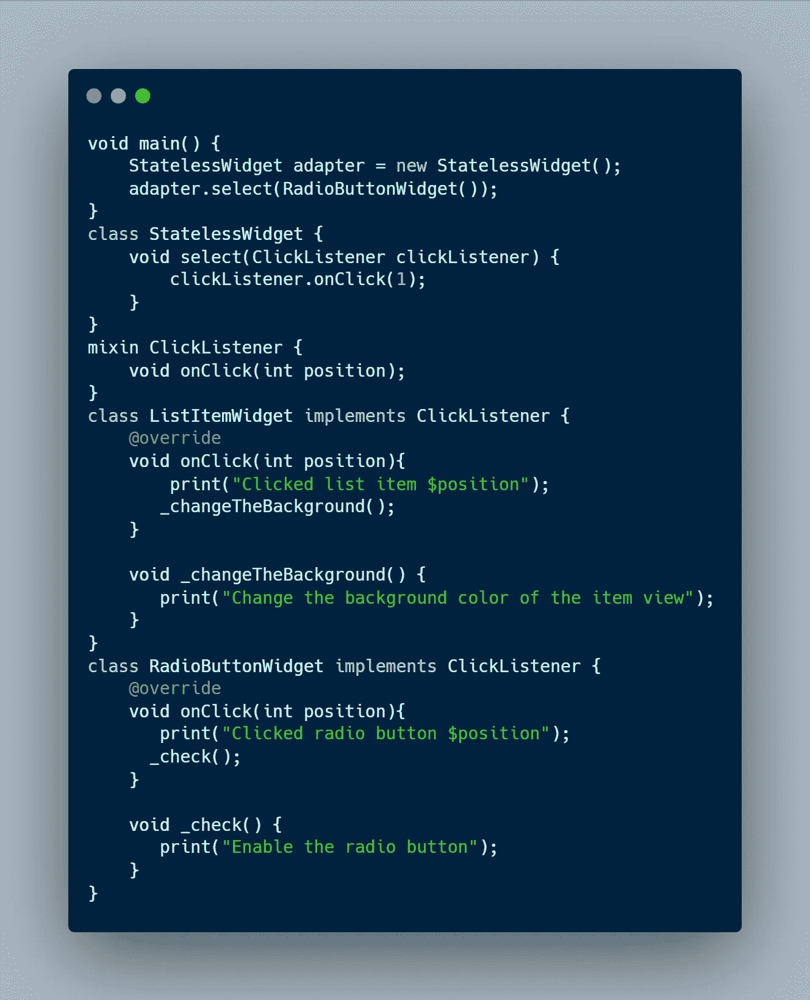*

# *I:接口隔离原则(ISP)*

*这就引出了我们的第四个原则，第四个以**“我”**开头的大原则是**界面分离原则**，听起来有点复杂，但实际上很容易理解。我们不想强迫我们的客户使用包含他们不太容易使用的函数或方法的接口。*

*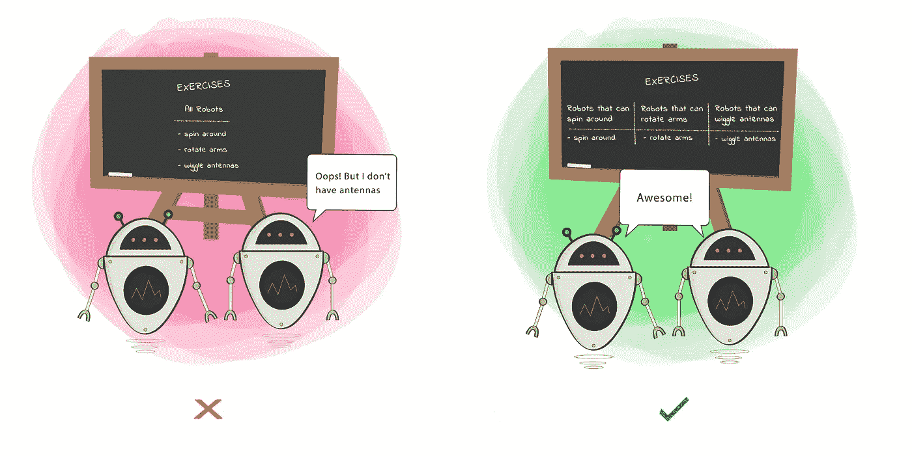*

*根据这个原则，客户不需要实现他们不想要的行为。一般来说，你应该用很少的方法创建小的接口。*

*让我们看看这个例子:*

## *不良做法*

*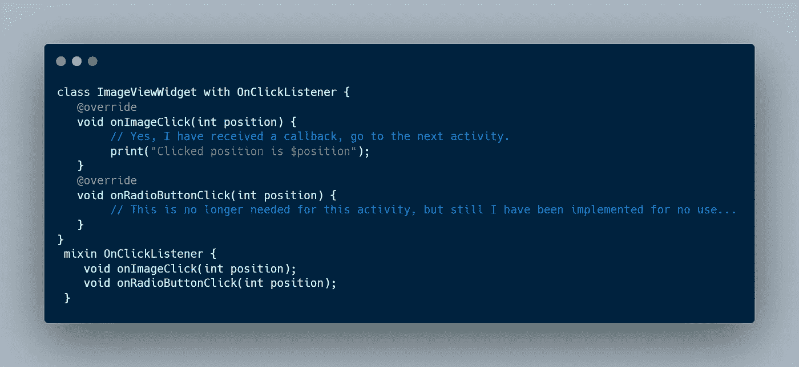*

## *良好实践*

*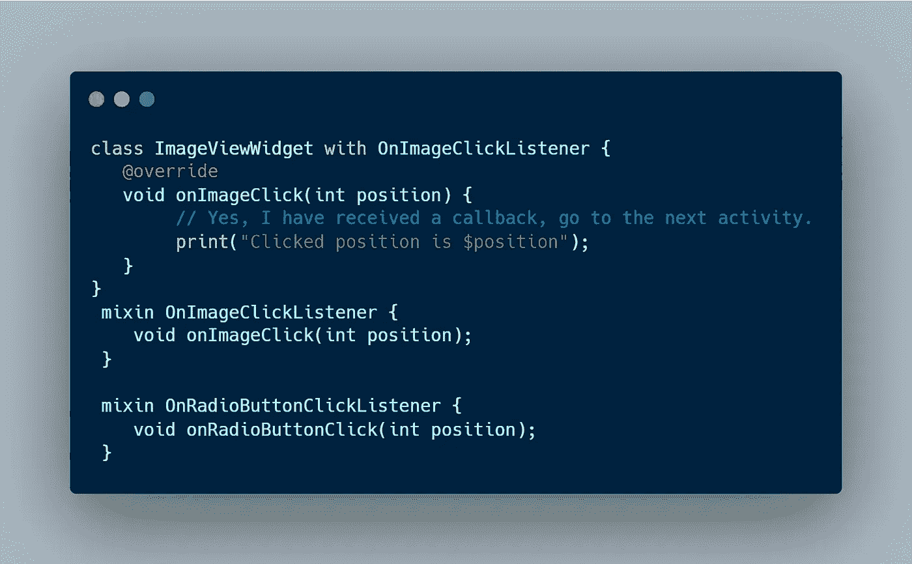*

# *依赖倒置原则(DIP)*

**最后，软件工程中非常重要的最后一个原则，以****【D】****开头，是* ***依赖倒置原则*** *，它声明高级模块不得依赖于没有抽象的低级模块。这是很多，但作为一个例子，这很容易理解。**

*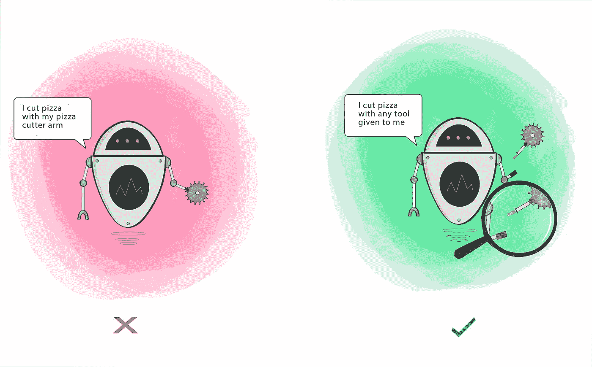*

*比方说，我们想用我们的打印机复制一些东西，复制功能将有两个依赖关系一个是两个，例如键盘阅读器，因为它从键盘获得输入，并将其发送到打印机或文案。这两个都是低级依赖关系，如果我们现在将我们的复制功能立即连接到这两个东西，然后为了改变较低层的一些东西，如果我们想改变我们的打印机的行为方式，或者 如果我们想改变其他东西的行为方式，我们可能必须替换和改变所有三个类中的一些东西，这意味着我们必须改变它上面的复制函数，即使下面的一些东西已经改变了，我们不希望这样，因此我们创建了一个抽象层，这些东西可以相互连接，这已经用依赖倒置原则完成了。*

**根据* ***DIP(依赖倒置原则)*** *，抽象应该优先于实现。扩展抽象类或者实现接口是好的，但是从具体类往下就不好了。当我们看开闭原则时，已经很清楚为什么了。看看这个例子:**

## *不良做法*

*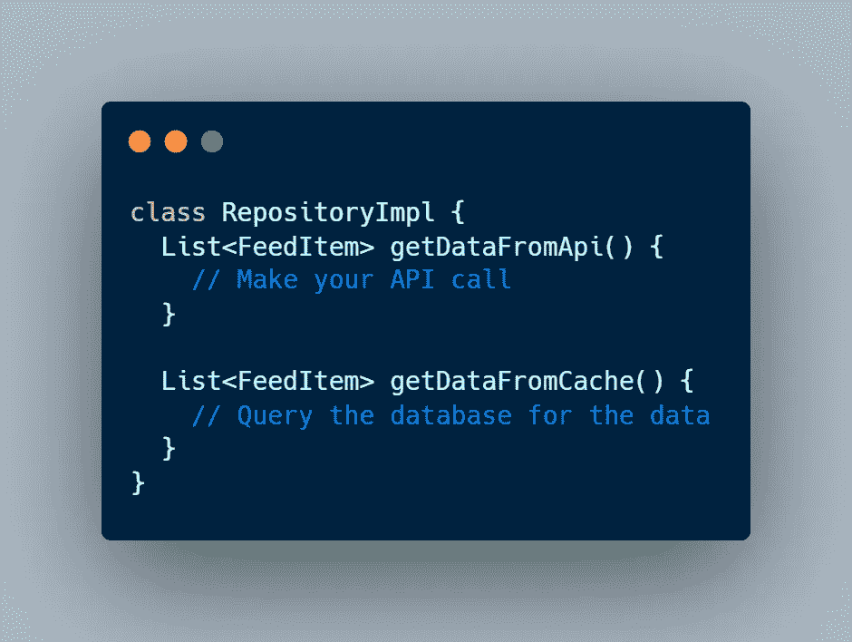*

## *良好实践*

*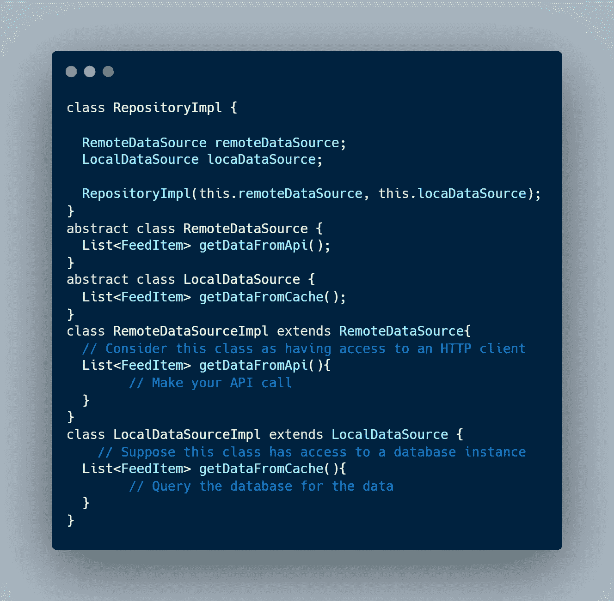*

**所以我们从罗伯特·c·马丁或者我们怎么称呼他们都称之为鲍勃叔叔那里谈到了固五原则所以让我们重述固五原则中的***为单责****【O】****为开闭原则****【L】****为替代原则***

***现在你已经为面试做好准备了。此外，开发了坚实的原则来对抗这些有问题的设计模式。坚实的原则旨在减少依赖性，以便工程师可以在不影响其他方面的情况下改变软件的一个方面。除了使设计更容易理解、维护和扩展之外，它们还被设计成使设计更容易维护和扩展。***

***这就是固体原理的全部信息，我想简单描述一下。这是我从很多网站上收集的一些研究和图片，如果你发现任何错误的信息或误导，请在下面指出或评论。***

***如果你做错了什么？请在评论中提及。我很想进步。我是**希尔什·舒克拉**。创意开发人员和技术爱好者。你可以在 [LinkedIn](https://www.linkedin.com/in/shirsh-shukla-95b85786) 上找到我，或者在 [Twitter](https://mobile.twitter.com/shirsh94?s=09) 上关注我，或者浏览我的[作品集](https://shirsh94.github.io/shirsh-portfolio.github.io/)了解更多详情。***

***祝您愉快！🙂***