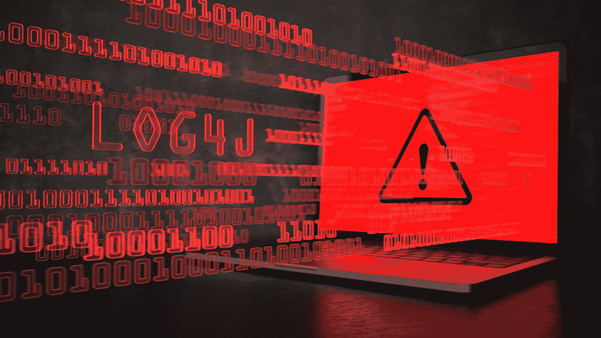

# 关于 Log4Shell 混乱披露的一些后知之明

> 原文：<https://medium.com/nerd-for-tech/some-needed-20-20-hindsight-on-the-chaotic-disclosure-of-log4shell-469013a822f7?source=collection_archive---------5----------------------->

到现在，围绕 [Log4Shell](https://www.synopsys.com/blogs/software-security/mitigating-impact-of-log4j-log4shell/?cmp=pr-sig&utm_medium=referral) 混乱披露的“是什么和如何”，是近年来打击数字世界最严重和最广泛的软件漏洞之一，已经相当完善。

在一个行业中，这种漏洞的“协调披露”应该是为了防止黑客在补丁可用之前发现软件漏洞，但人们普遍认为，在这种情况下，它没有协调。很多黑客在他们的潜在受害者之前就知道了。《安全分类账》的主编保罗·罗伯特(Paul Roberts)在上面做了一个播客，名为[“解开 Log4Shell 不协调的披露混乱。”](https://securityledger.com/2021/12/episode-233-unpacking-log4shells-un-coordinated-disclosure-chaos/)

“为什么”？不是很确定。但首先，简要总结一下“什么”

11 月 24 日，感恩节的前一天，阿里巴巴集团控股有限公司的云安全团队的一名成员向阿帕奇软件基金会(ASF)发送了一封电子邮件，报告了 ASF 的开源日志库 Log4j(用最流行的编程语言之一 Java 编写)中的一个软件漏洞，他说这可能会产生“重大影响”。

事实上，它可以让黑客实现“远程代码执行”——远程接管计算机。由于有数亿到数十亿台计算机使用 Log4j，“重大影响”现在听起来像是一个重大的保守说法。

但这引发了非营利组织 ASF 志愿者的疯狂争夺，他们开始尝试做正确的事情——快速创建补丁来修复漏洞。

**时机不好**

不幸的是，在接下来的几周内，发生了两件非常关键而且非常糟糕的事情。

首先，正如彭博等人所报道的，阿里巴巴在 12 月 8 日通知 ASF 组织“有人刚刚在一个中国博客平台上透露了漏洞的细节。”那个“某人”使用了化名，没有回复彭博的置评请求。但帖子让 Log4Shell 为世人所知，世界上的坏人开始迅速行动。

虽然 Apache 团队在不到 24 小时后完成了更新/补丁，但那时黑客已经开始“大规模利用”Log4Shell。到 12 月中旬，对 Log4j 的攻击以每秒超过一次的速度出现，即每天大约 100，000 次。国家漏洞数据库给 Log4Shell 的严重性评级为 10.0——满分为 10.0。

其次，该团队为修复漏洞而创建的补丁本身就有缺陷，这意味着攻击者有更多的时间，即使是打了补丁的应用程序和系统也容易受到攻击。

现在，几个星期后，Log4Shell 仍然被认为是一个紧急情况——美国网络安全和基础设施安全局(CISA)局长 Jen Easterly [称](https://www.cisa.gov/news/2021/12/11/statement-cisa-director-easterly-log4j-vulnerability)它是“我整个职业生涯中见过的最严重的(漏洞)之一，如果不是最严重的话”——对 Log4Shell 以非常不协调的方式披露的 20/20 事后分析有所增加。

专注于开源网络安全项目的开放网络应用安全项目的创始人马克·柯菲(Mark Curphey)也是 Open Raven 的联合创始人兼首席技术官，他告诉彭博，这一事件表明需要更加认真地对待开源软件的安全性。

事实上，它是免费的(有一些许可限制),这意味着使用它的人不是“客户”,所以如果发现了漏洞，他们不会直接得到通知。

“可重复使用的代码意味着可重复使用的漏洞，软件供应链满足了全球技术消费者的需求。这是一场完美的风暴，”柯菲说。

或者，换句话说，由于开源软件深深嵌入到每个企业中，如果它有风险，那么你的企业也有风险。

**必要的后知之明**

像这样的漏洞的利害关系意味着事后分析也提出了一个问题，即为什么协调披露漏洞的模板已经存在了几十年，而这一个却如此混乱？

罗伯茨在他的播客中指出，2008 年，已故的安全研究员丹·卡明斯基在域名系统互联网技术中发现了一个严重的漏洞，但他与公共和私人实体“悄悄地工作了几个月”，以“编写和分发补丁——所有这些都是在漏洞的细节公开之前。世界各地的供应商能够在漏洞的任何细节公开之前采取措施，大大降低攻击风险。”

显然，Log4Shell 没有出现这种情况。罗伯茨和他的客人，双子座信息安全副总裁马克·斯坦尼斯拉夫(Mark Stanislav)都表示，一个主要原因是阿里云团队和 ASF 团队都没有寻求计算机应急响应小组(CERT)的帮助。

“当我们遇到这些互联网规模的问题时，漏洞报告者——在这种情况下是阿里云团队或阿帕奇基金会——通常应该联系更高级别的实体，如卡内基梅隆大学的[CERT/CC[协调中心]，”斯坦尼斯拉夫说，并补充说，“信息安全方面的协调事件响应团队已经有 30 多年的历史，所以我们有经验。”](https://www.sei.cmu.edu/about/divisions/cert/)

“世界各地还有其他 CERTs，通常与一个国家、城市或地区相关，”Stanislav 说，“这很重要，因为这些组织与全球数百家甚至数千家供应商有联系，他们可以帮助协调披露，以确保这些问题以审慎、务实和彻底的方式出现。”

Synopsys 软件完整性小组的技术策略师 Travis Biehn 对此表示赞同。“发现者应该与 CERT 合作，各方应该协调保护漏洞信息，”他说，但他补充说，他不认为 ASF 过程是一个彻底的失败。

“失败之处可能在于，一个问题是否需要 CERT 的帮助并不明确。而且在每一份错误报告中加入证书可能会有一些困难。”

**没有预先通知**

但是没有发生的部分“为什么”是，至少在目前，参与 CERT 不是 ASF 处理任何漏洞(无论是严重的还是轻微的)的方式。ASF 安全副总裁 Mark Cox 说，该组织的[漏洞处理流程](https://www.apache.org/security/)“不包括直接或通过协调中心提前通知供应商。”

“当一个问题影响到一个被广泛使用的库时，没有实用的方法来预先通知受影响的供应商——有太多的方面来实施禁运，有太多的方面来识别和通知，这不仅不切实际，而且大大增加了通过泄漏提前披露的机会，”他说。

卡内基梅隆大学软件工程研究所 CERT 部门的漏洞分析技术经理 Art Manion 表示，这一论点有一定的价值，但他仍然认为对于这种规模的事件应该进行修改。

“Apache 的公开政策，像其他成熟的开源项目一样，是公开的、有据可查的、相对简单和公平的，”他说。但是对于 Log4Shell，“我会建议对此策略进行例外处理。让 CERT/CC 或另一名协调员参与进来，召集一个特设小组(在禁运之下)来规划应对措施，并选择能够为大部分弱势群体显著降低风险的团队和个人。”

曼尼昂说，如果与所有同意禁运的主要互联网参与者进行协调，“不准确的缓解建议和不完整的修复可能会在公开之前被注意到并得到处理”。

“然后，在公开披露日，服务提供商的大量用户将已经被修补，并且主要操作系统将已经有更新。”

他承认，这相当于“事后诸葛亮”。我不知道确实发生了什么协调的细节，即使是这种理想化的协调计划也可能因过早的公开披露或主动利用而被打破。”

**暗算**

尽管如此，正如前面提到的，是一个匿名博客在 ASF 团队完成补丁之前泄露了 Log4Shell 的细节。因此，虽然阿里巴巴团队可能打算在他们和 ASF 之间保密这个漏洞，但不知何故它泄露了。

新思软件完整性小组(Synopsys Software Integrity Group)的首席科学家萨米·米格斯(Sammy Migues)表示，虽然阿里巴巴团队似乎只是在 11 月 24 日向 ASF 报告了该漏洞，但“坊间报道称，该漏洞几乎在披露后立即就开始被利用，甚至可能在此之前，”米格斯说。

“一旦它被积极和容易地利用，每个人都需要知道。或许问题是，“当所有人都需要知道的时候，你该告诉谁？”这条新闻花了几个小时通过新闻频道、聊天频道、社交媒体频道等过滤。在它进入时代精神之前，”他说。

在阿里巴巴和 ASF 都被 Log4Shell 细节的发布弄得措手不及后，疯狂地急于推出补丁也可能导致了错误。

“正如我们现在所知，最初的补丁实际上并没有解决问题，”斯坦尼斯拉夫说。“最初发布的一些缓解措施并没有真正将问题缓解到人们可能认为的程度。我认为这是其中的一层——当你没有协调一致的披露时，你必须采取行动的速度。”

如果没有别的，Log4Shell 可能造成的损害的一个好处是它引起了拜登总统的注意，拜登总统[上周四会见了主要的技术高管](https://www.theverge.com/2022/1/13/22881813/white-house-tech-summit-apple-google-meta-amazon-open-source-security)，讨论如何提高开源软件的安全性。

这也将促使 ASF 进行一些讨论。“我们的目标是灵活性，并在几天而不是几个月内测量开源软件更新的时间，”考克斯说，“所以我们的政策包括一个共同的流程，用于披露和宣布修复，并在问题公开后迅速发布数据。”

“我们总是渴望讨论和探索各种选项，尤其是那些可以帮助最终用户更快地获得补丁的选项，我们将 CERT/CC 包括在这些讨论中。”

如果发生这种情况，曼尼昂说，卡内基梅隆证书有多种方式可以帮助协调披露。它们包括:

*   协助确定和管理参与者，尤其是在多方参与的情况下。
*   调解和协商，特别是当研究人员和供应商相处不好的时候。
*   技术验证。报告真的是漏洞吗？证书能再现声称的行为吗？缓解或补救措施有效吗？
*   某种程度的中立。“我们不是研究人员或供应商；我们寻求所有人的风险最小化。如果我们必须选择站在哪一边，那很可能是用户，”曼尼昂说。
*   一些针对法律威胁的保护措施，例如大型供应商对研究人员采取法律行动。
*   在帮助避免常见甚至不常见的陷阱方面有丰富的经验。

所有这些听起来都像是与 CERT 的合作可以带来更好的协调，减少混乱。