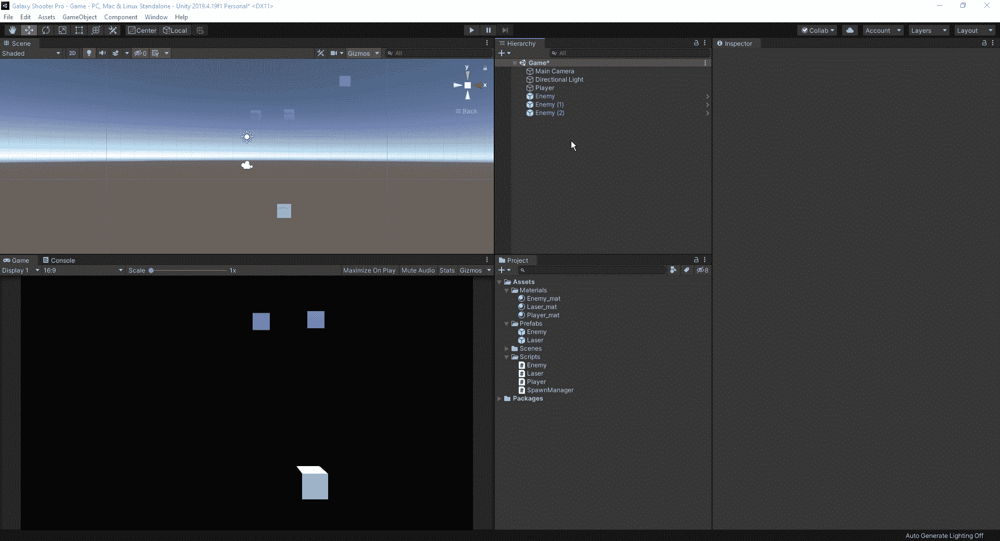
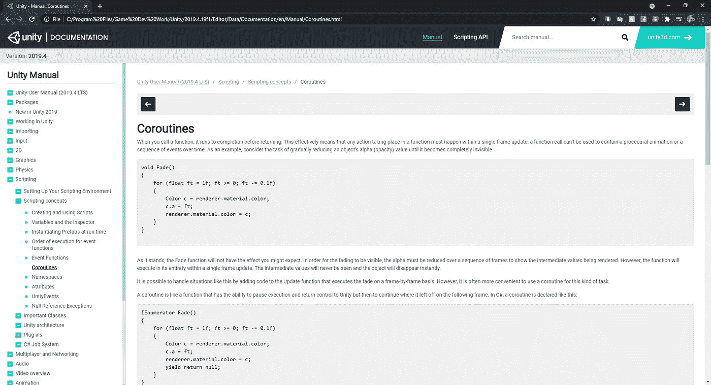
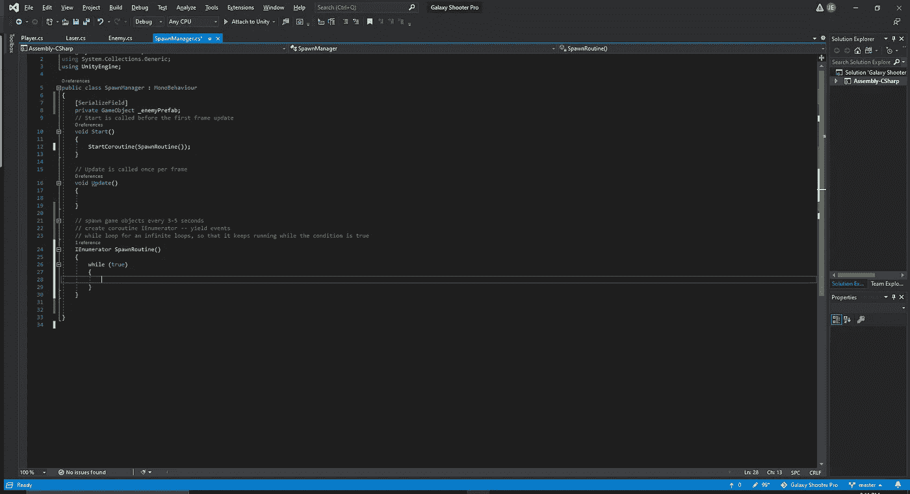
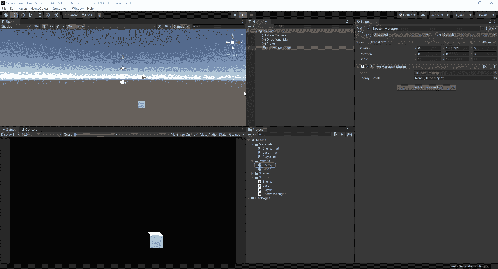
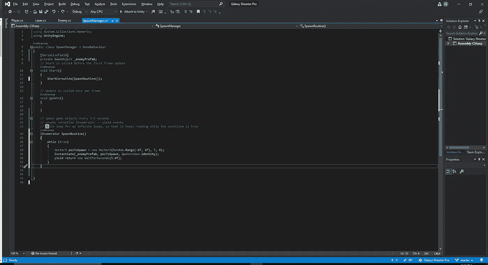
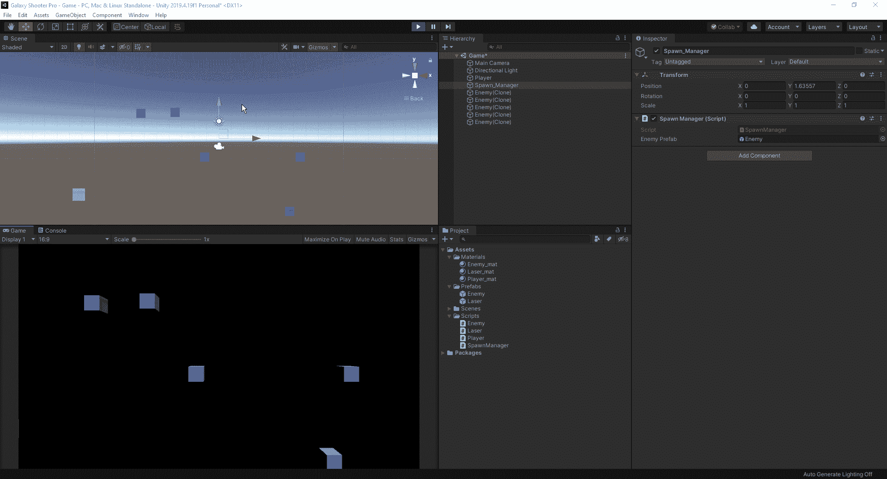

# 用花冠产卵

> 原文：<https://medium.com/nerd-for-tech/spawning-with-coroutines-be5df8f47ad2?source=collection_archive---------28----------------------->

现在，我们有一个内置于游戏中的命中检测的敌人，是时候开始产卵他们。产卵管理器的概念很简单，因为我们只是希望它在游戏运行时不断地产卵。至于我们如何做到这一点，我们可以很容易地通过谷歌搜索一种在一段时间内重复出现的产卵序列。在我们这样做之前，我们必须创建一个对象来表示我们的产卵管理器和脚本。

创建种子管理器

正如我们所看到的，我们只需要创建一个空的对象。这个对象不会出现在我们的直播游戏中，但只是我们脚本的占位符。

# 协同程序

为了让我们将游戏中的某个事件延迟一段时间，然后在达到这段时间后重新开始，我们必须使用一种叫做 coroutines 的东西。它们允许我们创建序列事件，然后让我们产生事件。
首先，我们必须弄清楚脚本 API 是如何为协同程序工作的，这样我们就知道如何在脚本中正确构建代码。

正如我们从上面的脚本 API 中所看到的，有了一个推论，我们需要确保在脚本中有“收益”。这让我们可以按照自己想要的时间间隔多次完成任务。

开始我们的共同诉讼

从上面可以看出，我们可以通过创建一个 IEnumerator SpawnRoutine()来开始我们的工作。这一行代码将创建一个新的系统，供我们在未来的代码中使用。从那里，我们一边打字一边(真的)。重要的是，对于这一行特定的代码，我们在它的位置放置了某种限制器。在我们的例子中，我们将每 5 秒钟产生一些新的东西。如果我们没有适当的限制器，我们不仅可以使程序崩溃，还可以使我们的计算机崩溃，因为我们已经创建了一个可以一直运行的无限循环。这个无限循环会让一切都超负荷，并导致崩溃。

此外，我们需要为我们的脚本制作一个游戏对象来获取信息。因此，我们将创建一个私有的游戏对象“_enemyPrefab”，保存它并进入 Unity，然后将我们刚刚创建的敌人的预置拖到这个部分:

应用敌方预制

从这里，我们现在可以添加我们的 while 代码行，让它知道我们想要实例化我们的敌人。

将这一行代码放在 while 部分，我们告诉 Unity，我们希望我们的敌人每隔 5 秒产卵一次。
最后，为了让我们的敌人单位产卵，我们需要让 Unity 知道我们想要开始我们的协同作战，所以我们将在虚空开始下做的是，我们进入 StartCoroutine(产卵例程())。一旦我们做到了这一点，我们就可以回到我们的 Unity 编辑器中，检查我们的单位是否每隔 5 秒就产卵一次。

产卵的敌人

现在我们已经有了我们的产卵系统，我们将在下一篇文章中研究让它更干净一点，并在我们的玩家死亡时停止我们的产卵管理器。