# Splunk 和使用来建立检测实验室

> 原文：<https://medium.com/nerd-for-tech/splunk-and-using-to-set-up-a-detection-lab-d483636d08d8?source=collection_archive---------7----------------------->

已经很久了，对吧？在此期间发生了许多事件，首先，我毕业了，从那以后我有点消沉，但学到了很多东西，特别是在 SOC 角色和恶意软件分析方面。此外，通过在线资源学习，我意识到通过执行任务来弄脏自己的手，并在追逐目标时从错误中学习。比如，如何不删除来宾虚拟机上的根目录，没有备份快照的后果，以及必须从一开始就执行繁琐的过程。

直到 5 月，我在网络安全领域探索的角色是测试、威胁情报和恶意软件分析角色。因此，在“冬眠”(xD)期间，我决定不妨探索一下 SOC 的角色，到目前为止，我只有关于监视和威胁搜索的理论知识，但从未动手做过。我做的下一件事是动手开始使用 Splunk，首先开始在我的 ubuntu 机器上安装它，然后从我的 Kali 机器上安装。我尝试了各种攻击，如蛮力，SQL 注入，等等。老实说，这有点酷，你知道，从蓝色团队的角度看攻击是什么样子，Splunk 到底有多强大。

在我的第一次尝试中，我没有记录任何工作，我严重地扰乱了我的 ubuntu 机器，并且大多数时候我不是根，所以如果发生了不好的事情，我可以工作回来。但是几天前，当我在 root 帐户上的时候，我真的搞砸了。最糟糕的是，我没有为我的 2 台机器(Kali，Windows 沙盒)中的其他机器拍摄快照。因此，我有了一个想法，我们如何在真实的生活场景中这样做，如何我把它安装在我的主要 windows 机器上，并寻找任何可能在我的机器上发生的可疑行为。总的来说，我认为我尽可能保持我的主 Windows 操作系统的安全，老实说，Windows Defender 为我们做了所有的工作，对于任何新的漏洞，我会在威胁公告发布后立即单独修补它们，并且在没有验证文件的来源和合法性之前，我不会安装或下载任何东西。所以，我基本上是安全的，除非某个巨大的 0 天弹出窗口，或者我疯了，没有验证就从网上下载东西。所以，我在我的主桌面上安装了 Splunk windows，这一次我确实记录了它，所以人们可以应用它，谁知道呢，人们可以发现在你的机器上发生的任何“恶意”行为。
因此，用户可以从他们的官方网站下载 Splunk 并进行安装，然后使用 admin 作为用户名创建您自己的 Splunk 登录凭据。安装完成后，您可以在您的 web 浏览器中访问 [http://127.0.0.1:8000/](http://127.0.0.1:8000/) ，使用您在安装阶段创建的凭据登录。登录后，您可以看到主屏幕

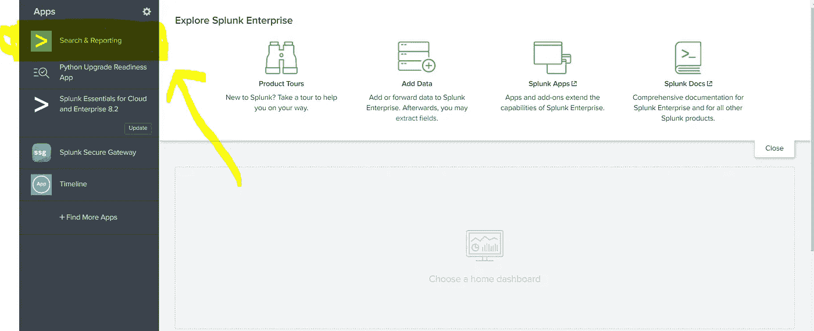

主屏幕

转到“搜索和报告”，然后你会看到一个搜索板，这是大部分工作发生的地方。

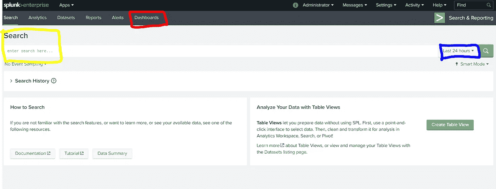

搜索头

现在，以黄色突出显示的搜索栏是您输入搜索命令的地方，就像 SQL Splunk 使用搜索处理语言(SPL)一样。Splunk 有几个重要的组件，索引器、转发器和搜索头。因此，转发器用于将日志从远程机器发送到索引器，在索引器中，日志被处理为事件并使人可读，这些处理后的日志通过搜索头进行访问。在我们的场景中，我们没有转发器，因为我们的日志来自本地机器。用户可以搜索和过滤他们的搜索，用蓝色突出显示时间。

在开始任何搜索之前，我们首先需要为 Splunk 输入日志，然后转到设置→数据输入→本地日志事件收集→选择您想要的日志。

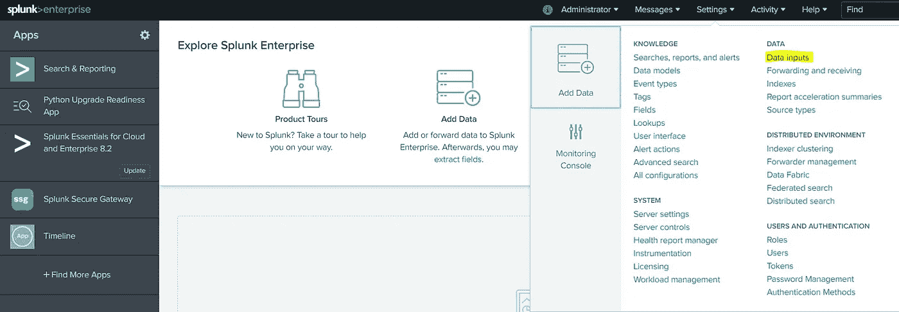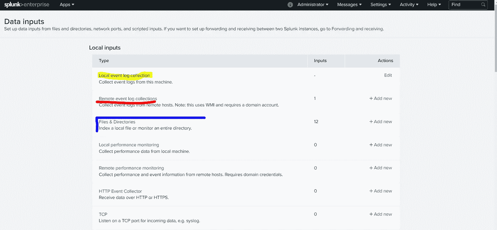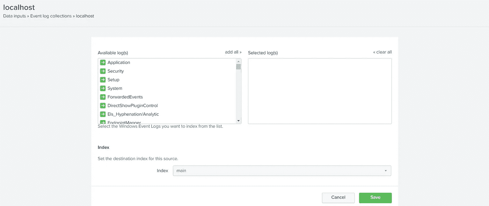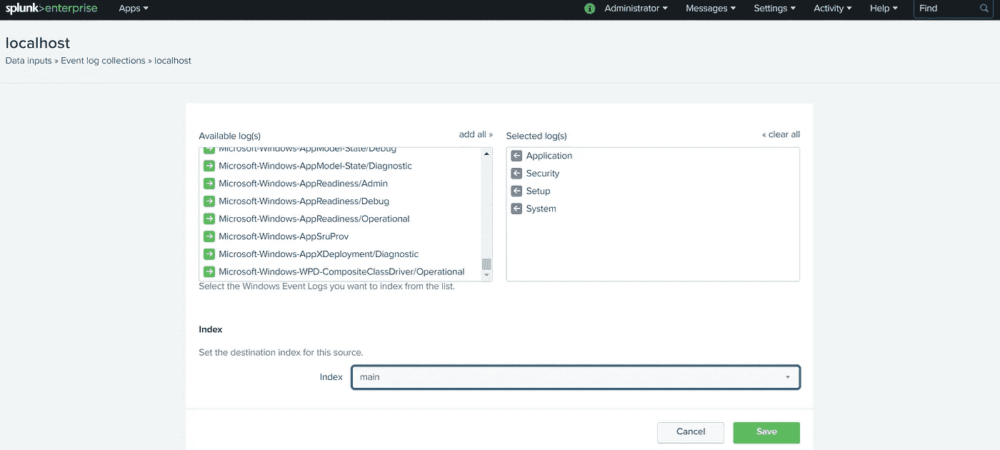

在我们的例子中，我选择了应用程序、设置、系统和安全日志，老实说，还有更重要的日志可以查看。但是为了简单起见，据我所知，4 个日志包含了大部分信息。因此，让我们回到头对头搜索，看看我们的机器上发生了什么事件。回归基础:

“事件是已经发生的正常或非正常的事情”。

"事件是已经发生的异常事件."

当我们使用搜索头进行搜索时，我们有一些约束条件和函数可以用来微调搜索结果。首先，我们需要找到我们的日志被索引的位置，在将数据输入 Splunk 索引器时，我们选择了主索引。所以让我们检查一下`index=main`

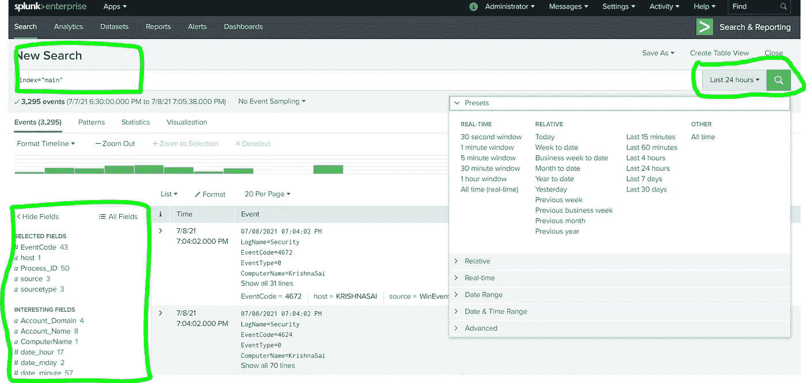

主索引

我们看到我们的搜索头返回了一些结果，我们的时间限制是最后 24 小时，您可以通过单击它并选择预定义的时间来更改它，在左侧的所有字段部分，我们可以在该部分中看到源和源类型。我要说的一件事是，从现在开始我的命令将会不同，因为我已经将全局搜索索引时间切换到“所有时间”。它索引了我在互联网上找到的所有日志，显示了各种来源类型。

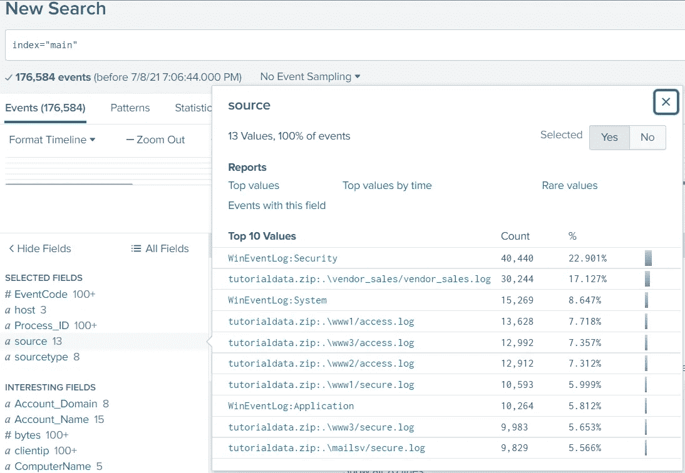

你们不需要它，所以从现在开始，你可以忽略第一部分，只使用`index=main`，后面跟着其余的搜索查询。

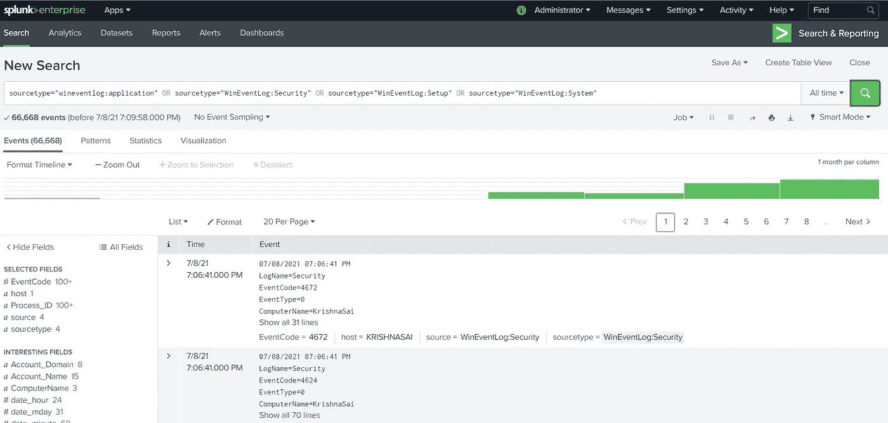

所以我的搜索命令`sourcetype="WinEventLog:application" OR sourcetype="WinEventLog:Security" OR sourcetype="WinEventLog:SetUp" OR sourcetype="WinEventLog:System"`相当于`index=main`

我喜欢 Splunk 的一点是它的数据分析功能。人们可以毫不费力地简单查看事件的数量。不多，但确实有帮助。

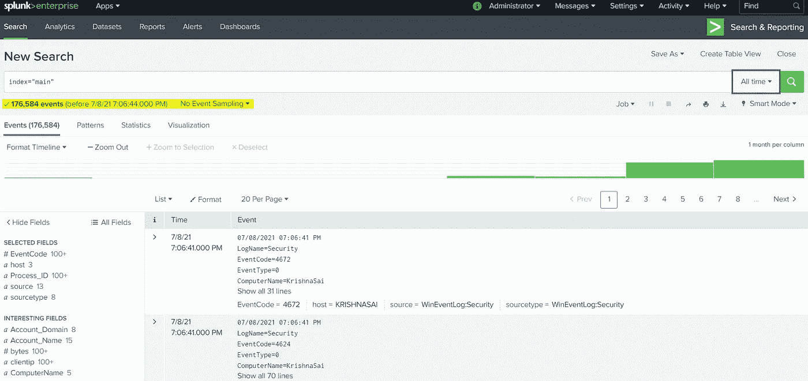

现在，Splunk 有一个惊人的功能，可以可视化数据并查找统计数据，这对于查找企业的安全状况有很大帮助。
在我们继续之前，我们需要知道 Windows 为曾经发生的每个事件分配了一个 ID，我们对它进行了微调，这个 EventID 帮助我们找到发生的事件。
我们得到的第一个搜索约束是 top，它允许查找出现次数最多的 EventID。默认情况下，top 只显示前 10 名，我们使用 top `limit=100`来更改它，它显示前 100 个事件。

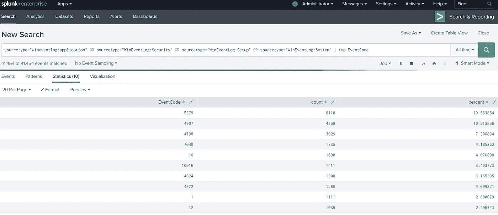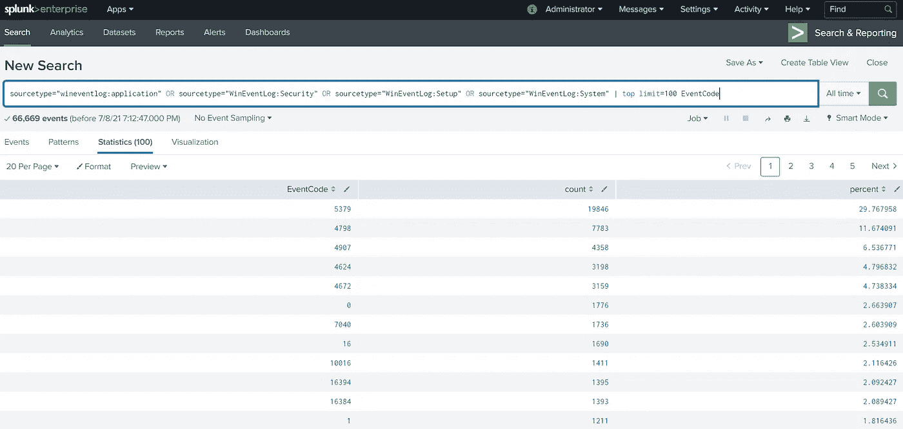

为了找到所有 EventID 的出现次数，我们可以使用`stats count`,它计算不同 EventID 的所有出现次数。

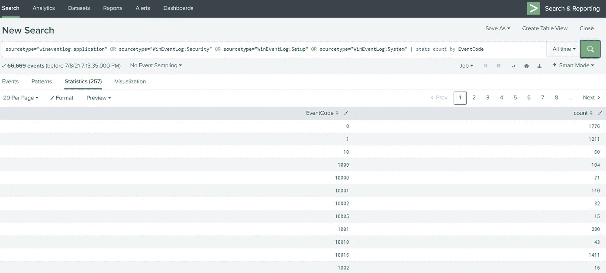

现在，我们可以在“Visualization”选项卡中可视化数据，在该选项卡中我们可以绘制图表，并且可以更改我们正在处理的图表的类型。

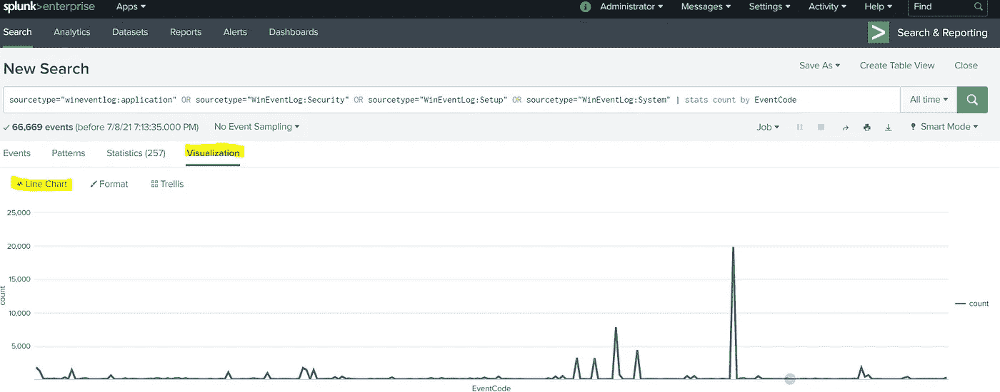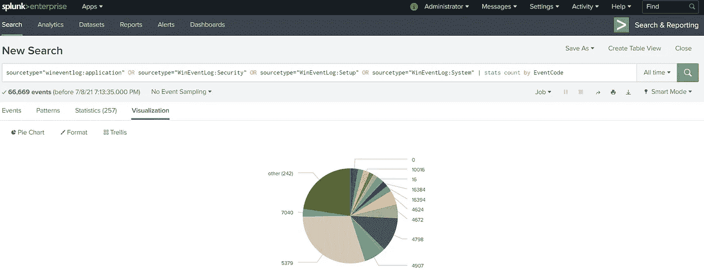

我们可以保存这些报告，称为仪表板。将报告保存到仪表板。

选择另存为，然后选择弹出窗口中的“新仪表板”选项

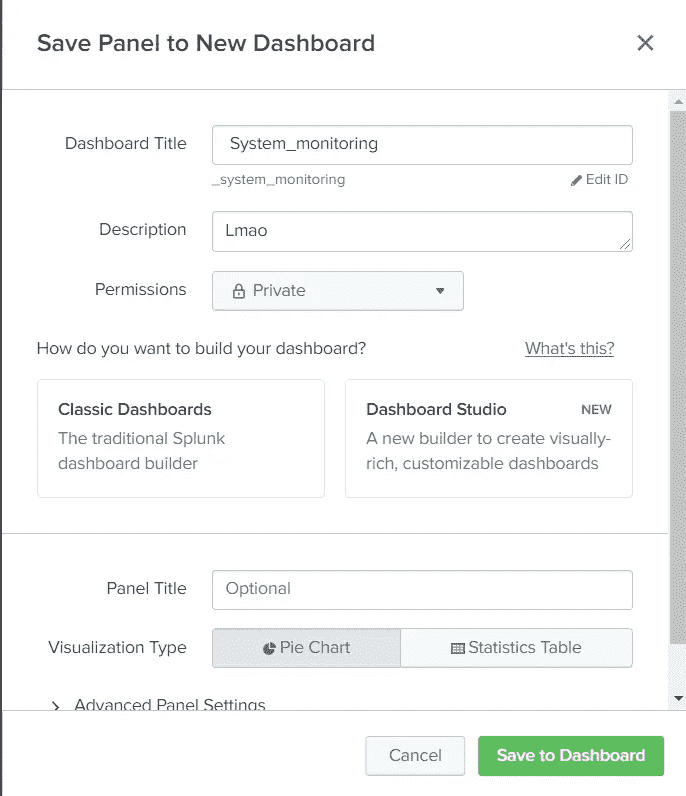

仪表板弹出窗口

现在，您可以填写详细信息，如名称、布局样式等等。要查看您的控制面板，您可以导航到“控制面板”选项卡，选择您的控制面板并查看已保存的报告。

Splunk 允许集成多个 stats 命令，以便更清楚地了解事件。在我的情况下，我们可以查看源类型发生的唯一事件的数量。

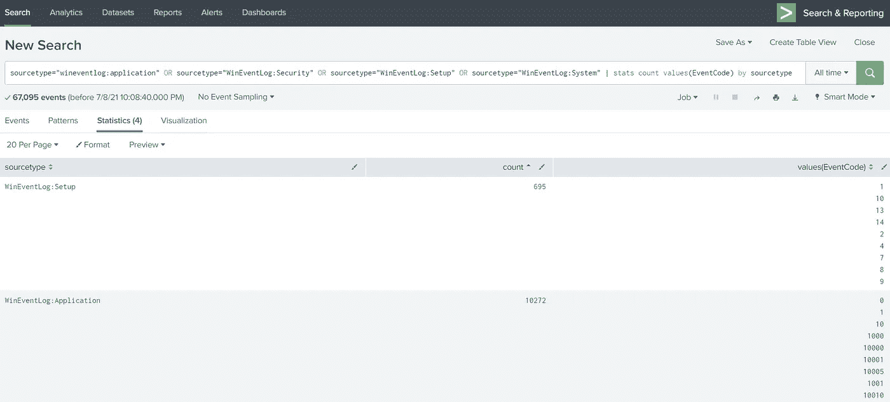

现在我们有了 EventID 及其发生次数，我们可以将 EventID 与可被视为事件的 EventID 进行匹配。我已经列出了一个事件列表，人们可以在他们的 windows 10 日志中查找是否有恶意事件发生。

我遇到的最常见的事件是 EventID 5379，它不被认为是恶意的，而“异常”事件 ID 是 4648，这是可以理解的，因为我的密码有点搞砸了。

所以，这整个工作是不必要的，老实说，通过这个愚蠢的事情，我学到了很多关于不同 EventID 的含义，以及如何将它与事件相关联。这再次帮助我了解了过去几个月我的电脑上发生了什么，感觉真的很好，虽然没有什么可疑事件，但大多数都是登录失败。我真的需要减少我的密码长度。

同样，如果你发现任何可疑的事件 ID，你可以简单地使用`index=main EventID=<id number>`来获得更多关于该事件的信息，因为 Windows 事件日志有一个叫做消息的东西，在那里你可以看到更多关于它的信息。

我正在添加下面的其他数据。

所有 Windows 事件日志

单个 Windows 事件日志

Windows 系统事件 ID

Windows 安装程序 EvnetID

Windows 安全事件 ID

Windows 应用程序事件 ID

这篇文章完全是无结构的，但相信这是我第一次也是最后一次这样写。

附言:我总是站在改正的一边，请给我一些可以改进的建议。

要联系的社交:Twitter [@krishnasai_456](https://twitter.com/krishnasai_456) 、LinkedIn- [链接](https://www.linkedin.com/in/krishna-sai-marella-892b62155/)和 GitHub- [链接](https://github.com/Presidentsu/)

保持安全，保持好奇！！！下次再见，❤

谢谢你，❤