# Spring Boot 简介

> 原文：<https://medium.com/nerd-for-tech/spring-boot-introduction-ab3fc10b0b8a?source=collection_archive---------1----------------------->

这是代尔夫特大学第一年面向对象编程专题课程中关于 Spring Boot 的一个非常浅显的介绍性报告。


由[马克西米利安·魏斯贝克尔](https://unsplash.com/@maxweisbecker?utm_source=medium&utm_medium=referral)在 [Unsplash](https://unsplash.com?utm_source=medium&utm_medium=referral) 上拍摄的照片

# 这是关于什么/这是给谁的

我真的对 Spring Boot 感兴趣有一段时间了，在过去的一个半月左右的时间里，我自学了一些基础知识。请记住，我是一名一年级学生，还没有选修 OOPP。也就是说，创建这个页面的目的是向我的同事介绍 Spring Boot，并给出一个非常基本的纯后端玩具应用程序，希望能帮助人们开始学习这门课程。

# 春天是用来做什么的？

Spring 是企业 Java 最流行的应用程序开发框架。它相当于 Java。它可以用来创建 Web 服务和应用程序。它还经常被用来创建`APIs`，然后被可能使用不同编程语言的独立代码库使用。

举个例子，想想去年的 OOPP，它是关于创建一个允许你订房和点餐的应用程序。

# 什么是 API

应用编程接口(API)是定义多个软件中介之间的交互的计算接口。它定义了可以进行的调用或请求的种类、如何进行、应该使用的数据格式、应该遵循的约定等等。它还可以提供扩展机制，以便用户可以以各种方式和不同程度扩展现有功能。API 可以完全定制，特定于组件，或者基于行业标准设计以确保互操作性。通过信息隐藏，API 支持模块化编程，允许用户独立于实现使用接口。

TL；博士:

> API 是一种软件中介，允许两个应用程序相互通信。换句话说，API 是一个信使，它将您的请求传递给请求它的提供者，然后将响应传递给您。

# 什么是 API 端点

简单地说，API 端点是两个系统交互时通信通道的入口点。它指的是 API 和服务器之间的通信接触点。端点可以被视为 API 从服务器访问执行任务所需的资源的手段。API 端点基本上是服务器或服务的 URL 的一个花哨的词。

举个例子，对于制作网页游戏的人来说，一个端点就是你的应用程序支持的每个 url(比如说`/`和`/game`或者`/play`)。

# Chocolatey:一个 windows 包管理器

如果要安装软件包，请确保以管理员权限运行 powershell。虫火谷安装可执行文件可以在[这里](https://chocolatey.org/install)找到。

# 什么是 Spring Boot

Spring Boot 为 Java 开发人员提供了一个很好的平台来开发一个可以运行的独立的生产级 Spring 应用程序。您可以从最少的配置开始，而不需要整个 Spring 配置设置。

# 要求

对于这个项目，我将使用 Java 15，这可能不同于将在该项目中使用的

*   [安装梯度](https://gradle.org/install/) ( `choco install gradle`)
*   确保`gradle -version`(JVM 部分)和`java -v`的输出指向同一个 Java 版本。如果不是这样，请尝试重新安装 Java SDK ( `choco install opensdk)`或更新您的路径。

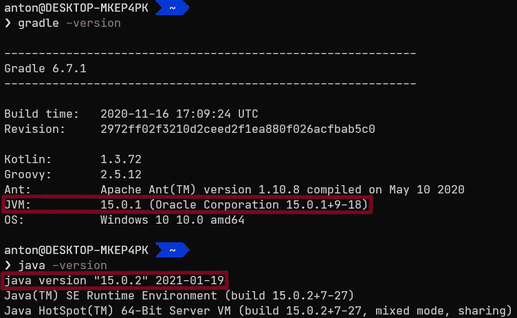

*   确保 Intellij 为项目使用了正确的 Java SDK 版本。点击`ctrl + shift + alt + s`在 Intellij 中打开项目结构面板(勾选这个我们创建项目)。


如果您使用不同的 Java 版本，请确保将`build.gradle`中的`sourceCompatibility = ‘15’`属性编辑为您已安装的 Java 版本(例如，如果您使用 Java 13，请将其更改为`sourceCompatibility = ‘13’`)。

# 应用程序结构

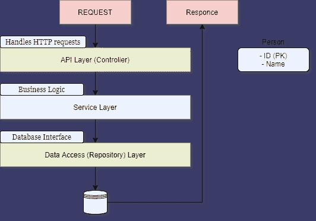

客户端将向我们的服务器创建**请求**，这些请求将由我们的 **API 层**或 Spring 术语中的**控制器**来处理。这一层管理应用程序的所有端点，并在将请求传递给下一层之前从请求中提取数据。

**服务层**负责我们的应用程序可能有的任何业务逻辑。例如，假设您有一个网站，您希望允许用户创建帐户，但没有两个帐户应该有相同的用户名。用户将向服务器发送一个请求，要求创建一个帐户以及他的用户名(和凭证，但这在这里并不重要)。控制器将接收请求并在调用适当的服务方法并将用户名传递给它之前析构用户名。该服务现在负责检查用户名是否已经存在于数据库中。请注意，它在下一层中执行与数据库的交互。

**数据访问**层或**存储库**负责与数据库交互。此时，生成一个典型的响应并发送给用户(异常可能导致在 3 层中的任何一层生成响应)。将应用程序分成*层*非常重要，并且有很多优点。

*   它提高了开发速度
*   这有助于代码更加简洁
*   不同的团队可以在不同的层上工作
*   它增加了应用程序的容错能力

在最右边，您可以看到我们稍后将实现的实体类，一个带有 ID 和名称的 Person 类。

# 文件结构

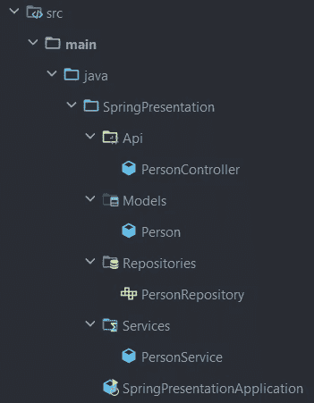

有几种不同的方法可以构建这样的应用程序，上面显示了我更喜欢的方法。另一种不同的方法是有一个`Person`文件夹，里面存放所有我不会用到的类，因为我认为它看起来更乱。

# 格拉德是什么

> Gradle 是一个用于多语言软件开发的构建自动化工具。它控制着从编译和打包到测试、部署和发布的开发过程。支持的语言包括 Java (Kotlin，Groovy，Scala)，C/C++，JavaScript。

# 邮递员是什么

> Postman 是一个可扩展的 API 测试工具，可以快速集成到 CI/CD 管道中。它始于 2012 年，是 Abhinav Asthana 的一个附带项目，旨在简化测试和开发中的 API 工作流。API 代表应用程序编程接口，它允许软件应用程序通过 API 调用相互通信。

# [计] 下载

Spring Initializr 是一个基于网络的工具，使用它我们可以很容易地生成 Spring Boot 项目的结构。

或者，有一个命令行工具可以帮你做到这一点！

`choco install spring-boot-cli`

```
spring init Copy
    --build=gradle 
    -j 15 
    -d 'web,jpa,postgresql' 
    -a SpringPresentation 
    -n SpringPresentation
    -g '.'
```

此命令将创建一个包含以下内容的项目:

*   Gradle 作为它的构建系统(默认情况下这是 maven)
*   Java 版本 15
*   前面提到的依赖项(web、jpa 和 postgresql 驱动程序)
*   `SpringPresentation`的神器 id
*   `SpringPresentation`的项目名称
*   没有包裹

如果您想使用它，运行`spring help init`获取文档。

上面列出的两种方法都会创建一个压缩文件夹，所以在继续之前一定要解压缩它。

```
mkdir SpringPresentation | tar -xf SpringPresentation.zip -C SpringPresentation
```

这将创建一个新的文件夹`SpringPresentation`，并提取你刚刚下载的压缩文件夹(假设你在正确的目录下)。你也可以跑步

`idea64.exe .`在当前目录下启动 Intellij。

可选:如果你想实现整个项目，包括一个数据库，确保安装了 PostgtSQL(我在 Docker 中安装了它)。使用 docker run 创建数据库:

```
docker run --name springboottestdb -e POSTGRES_PASSWORD=password -d -p 5432:5432 postgres:alpineCopy
    | docker exec -it 68627bf9417e bin/bash
```

其中`68627bf9417e`是你的集装箱 ID。我不会更深入地讨论这个问题，因为它超出了本文的范围。

或者，您可以使用一个非常流行的内存中 Java 数据库引擎，名为 H2，稍后将给出相关说明。

# 属国

*   `Spring Web`:允许构建 RESTful 应用程序
*   `JPA`:它使得构建使用数据访问技术的 Spring 驱动的应用程序变得更加容易。
*   PostgreSQL 驱动程序

# 编码

此时，您的空项目应该如下所示:

```
├── build.gradle
└── src
    ├── main
    │   ├── java
    │   │   └── SpringPresentation
    │   │       └── SpringPresentationApplication.java
    │   └── resources
    │       ├── application.properties
    │       ├── static
    │       └── templates
    └── test
        └── java
            └── SpringPresentation
                └── SpringPresentationApplicationTests.java
```

我们将从编辑`src.main.resources.application.properties`文件开始，如下所示:

*   `spring.datasource.url`数据库的 url
*   `spring.datasource.username` PostgreSQL 用户名
*   `spring.datasource.password` PostgreSQL 密码
*   `spring.jpa.hibernate.ddl-auto`指定如何在设置中操作数据库(`create-drop`在应用程序运行时清除数据库，用于测试目的)
*   `spring.jpa.show-sql`记录任何 SQL 命令
*   `spring.jpa.properties.hibernate.dialect`告诉 jpa 我们正在使用哪种风格的 SQL
*   `spring.jpa.properties.hibernate.format_sql`美化 SQL 输出

此配置适用于我的 PostgreSQL 数据库设置，但如果您想使用 H2 数据库，请在`src.main.resources.application.properties`中执行以下修改:

*   将`spring.datasource.url`改为`jdbc:h2:mem:springboottestdb`
*   将`spring.datasource.username`更改为`sa`(默认配置文件)，并将密码留空
*   将`spring.jpa.properties.hibernate.dialect`改为`org.hibernate.dialect.H2Dialect`

最后，转到`build.gradle`文件，用`runtimeOnly ‘com.h2database:h2’`替换`runtimeOnly ‘org.postgresql:postgresql’`(确保在这一步之后重新构建项目)

请注意，本文中提到的所有内容在适当的 PSQL 数据库和 H2 数据库中都是一样的。

我们现在将在`src.main.java.SpringPresentation`下创建以下 4 个包:

1.  美国石油学会(American Petroleum Institute)
2.  模型
3.  仓库
4.  服务

现在让我们创建`src.main.java.SpringPresentation.Models.Person`。添加私有字段`long id;`和`String name;`。创建 getters、setters、equals 方法、toString 以及两个构造函数:
`public Person()`和`public Person(String name)`。

到目前为止，我们已经创建了一个简单的 Java 类，现在让我们把它变成一个 Spring **实体**。
在`public class Person`前添加以下两个注释:

*   `@Entity(name = “Person”)`
*   `@Table(name = “people”)`

第一个告诉 Spring 这个类是一个**实体**类，并指定了它的名字。默认情况下，名称是类的名称(所以在我们的例子中，这没有什么不同)，但是最好总是指定名称。
第二个为带注释的实体指定主表。

此时，您可能会注意到，当您将鼠标悬停在表名
`Cannot resolve table 'people'`上时，Intellij 会给出一个错误。这是因为我们还没有在 Intellij 中配置数据源。按下
`ctrl + shift + a`并搜索`create data source`。选择 PostgreSQL。将用户、密码和数据库更改为我们在`application.properties`中指定的内容。单击应用和确定。此时，错误应该变为
`Cannot resolve table 'people'`，这很好，因为该表不存在，也不应该存在，一旦我们运行应用程序，它将自动创建。请注意，如果您使用的是 H2 数据库，则可以跳过这一步，因为该表将在运行时创建，所以错误仍然可见。不要担心那个；该表存在，并且按预期工作。

您应该在 Person 类上看到另一个错误:`Persistent entity 'Person' should have primary key` ，因为我们告诉 spring 这是一个数据库表，所以**必须有一个主键。在`private long id;`前添加`@Id`注释。**

此时，您可能已经注意到了一些奇怪的事情:我们没有在任何构造函数中包含`id`参数，那么它将如何获得一个值呢？这不是一个错误，我们希望所有的 id 都由数据库生成，而不是由用户生成(想象一下，如果一个用户每次想在一个网站上创建一个帐户，就必须在他的表单中包含一个唯一的 id；用户将无法知道他的 id 是否是唯一的)。生成数据库 id 的传统方式是使用序列生成器。

我们现在将定义序列生成器，并将其分配给 id 参数。在 id 声明前添加以下内容:

让我们再给 Spring 一些关于我们属性的细节。我们可以指定它们在数据库中的名称(因为它们是列)和其他一些东西，比如它们是否可以更新或者可以为空。将以下两个配置放在它们各自的属性声明之前。

如果我们现在运行应用程序并刷新 Intellij 数据源，我们应该会看到以下内容:

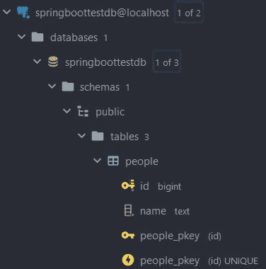

如我们所见，我们的数据库表已经创建，名称错误已经消失。

接下来，我们将创建**存储库**接口。创建文件`src.main.java.SpringPresentation.Repositories.PersonRepository`。让我们的界面从
延伸到`JpaRepository<Person, Long>`。第一个参数是我们的存储库将要使用的类，第二个参数指定了该类的 ID 类型。这个接口为我们提供了一些基本的 CRUD(创建、读取、更新、删除)操作。让我们添加一个`updateNameById`方法，用指定的 id 更新一个人的名字。

我们不会自己实现这个方法，因为 JpaRepository 接口可以帮我们实现。我们所要做的就是在我们刚刚创建的方法之上的注释中指定查询。

我们在注释中传递的字符串是这个存储库的名称，在我们的例子中是可选的。正如我们将在后面看到的，当我们处理多个存储库时，这是必要的。

这就是我们在存储库接口中所需要的，其余的由 JPA 处理。

上我们的**服务**课。创建文件`src.main.java.SpringPresentation.Services.PersonSerivce`。现在你可能已经猜到了，我们将用`@Service`对它进行注释

我们的服务类将有一个属性:我们之前创建的`PersonRepository`。继续创建一个构造函数。该给它做注解了。在构造函数上面添加`@Autowired`，这告诉 Spring 它应该使用[依赖注入](https://en.wikipedia.org/wiki/Dependency_injection)。最后，在我们的构造函数参数里面添加`@Qualifier("PersonRepository")`。这确保了名为`PersonRepository`的存储库是被注入的存储库。

我们现在必须实现我们的**控制器**能够使用的所有方法。因为我们在这里将我们的存储库作为一个属性，所以我们想要的所有简单的方法实际上都非常容易实现。

请记住，我们的应用程序非常简单。事实上，这一层中不包含任何逻辑。在一个普通的应用程序中，这应该是最复杂的一层。

最后，让我们创建`src.main.java.SpringPresentation.Api.PersonController`控制器。这里还涉及到一些注释。首先，让我们在类声明上方添加以下内容:

```
@RestController // Tells Spring this is a REST controller
@RequestMapping("api/v1")
```

第二个注释使得我们能够在`http://localhost:8080/api/v1/`而不是`http://localhost:8080/`访问我们的 API。这也是一个好的实践，因为现实生活中的项目经常会同时托管多个版本的 API(由于向后兼容不可行)。

根据我们希望端点/方法支持的 HTTP 请求类型，我们将使用 4 种注释:

*   @GetMapping
*   @PostMapping
*   @PutMapping
*   @DeleteMapping

所有这些都有一个`path`参数，它指定了到`http://localhost:8080/api/v1`的相对 url。例如`@GetMapping(path = "/example")`将为`http://localhost:8080/api/v1/example`创建一个 GET 请求处理程序。

但是如何使用请求中包含的数据呢？`@PathVariable, @RequestBody`告诉 Spring 分别从路径或请求体中提取变量。在`@PathVariable`的例子中，映射路径应该包括用花括号括起来的变量名，这样 Spring 就知道使用哪个了。这是为`@RequestBody`自动完成的。

这里没什么可谈的。请记住`@RequestBody`将尝试从请求体中提取**一个**对象。这意味着例如在我们的`updateNameById`方法中不能同时具有 **id** 和**人物**。最后，记住这将尝试将它找到的数据与一个定义的构造函数相匹配，我们确实有一个`public Person(String name)`构造函数。

在这一点上，我们的应用程序基本完成了，是时候使用邮差测试我们的端点了！

让我们先看看当我们在`[http://localhost:8080/api/v1/](http://localhost:8080/api/v1/)`提出 **GET** 请求时会发生什么

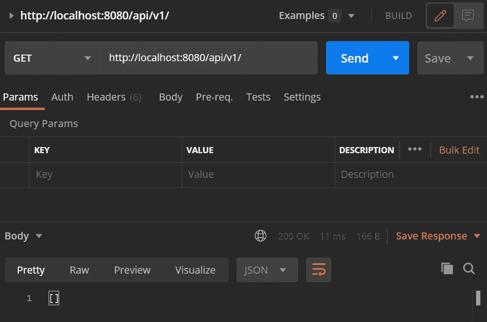

正如预期的那样，我们得到了一个空数组，因为我们的数据库中还没有对象。让我们添加一些！请记住，out **POST** 映射在`http://localhost:8080/api/v1/insert`处，我们使用`@RequestBody`从请求中提取了一个**人**。回想一下，Spring 会自动尝试将请求数据放入一个 **Person** 构造函数中，这意味着如果我们发送一个包含一个名为`name`的属性的有效载荷，该属性具有 String 类型的任何值，Spring 会用它创建一个 Person 对象。

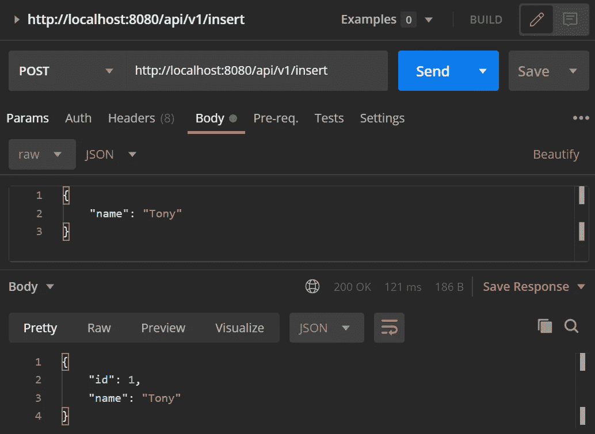

奏效了。我们甚至得到了预期返回给我们的完整对象，我们可以看到它自动被分配了一个 Id 1！让我们再次尝试我们之前的 **GET** 端点；

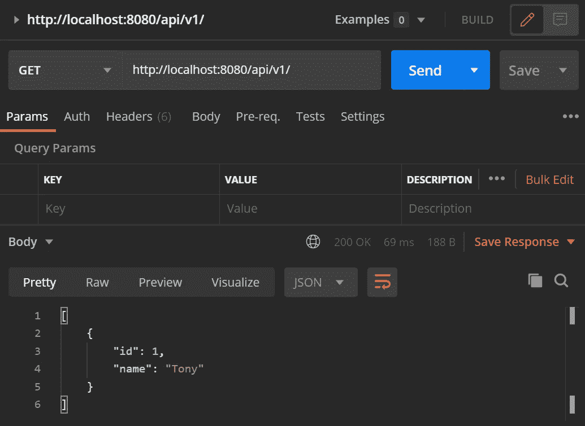

这一次，我们得到了一个元素数组，这个元素就是我们刚刚添加的人！既然我们现在在数据库中有了一个实体，让我们看看当我们在`[http://localhost:8080/api/v1/get/1](http://localhost:8080/api/v1/get/1)`处做另一个 **GET** 时会发生什么

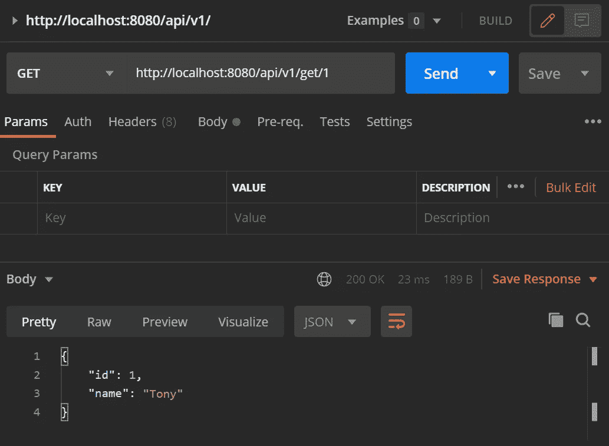

请记住，对于该终点，我们使用`@PathParameter`来获取 id。让我们看看当我们输入一个不存在的 id 时会发生什么

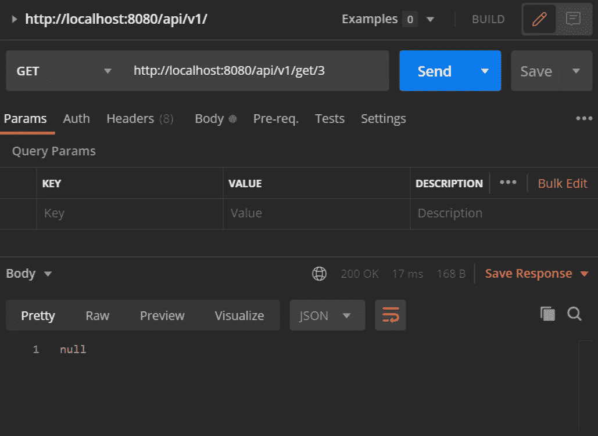

我们得到的是 **null** 而不是一个很好的错误。记住，这个方法返回了一个**可选的**。是时候测试我们的 **PUT** 映射了。为此，我们再次需要指定一个`name`，为了示例的缘故，让我们将其设置为`UPDATED`并看看会发生什么。

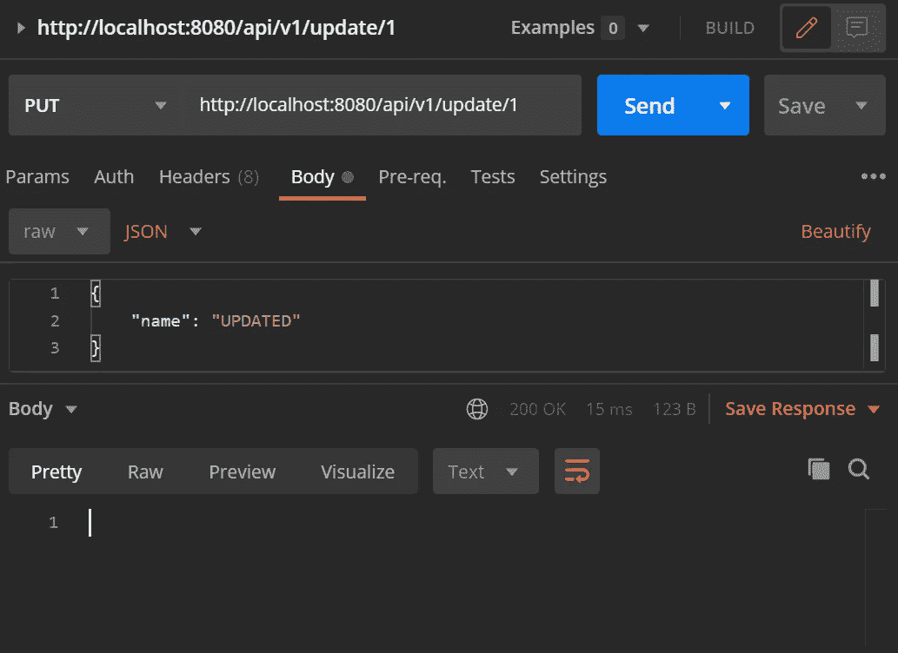

没有响应，因为我们的方法是空的，但是重用我们以前的请求，我们可以看到更新确实通过了。

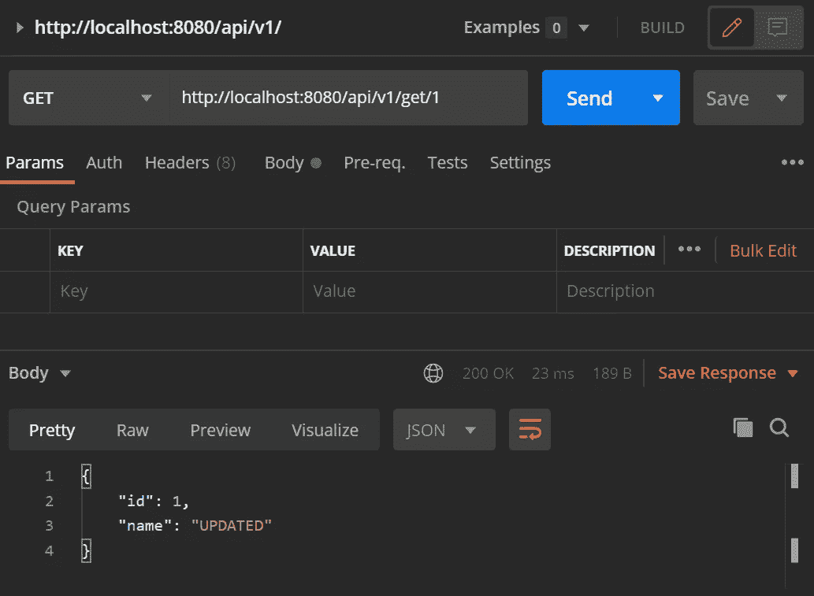

我们只有删除的时间来测试它。我们只需要在这里指定一个路径变量，就可以开始了。

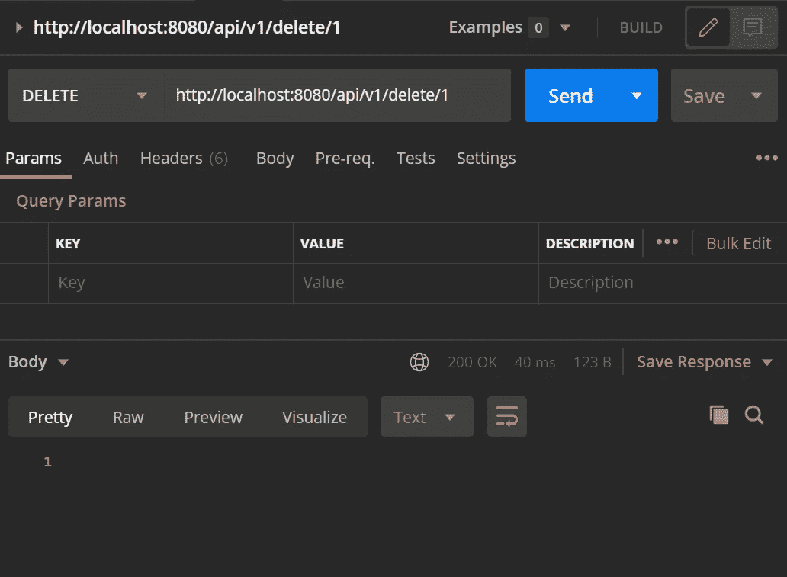

让我们重用我们的第一个请求，以确保数据库中没有留下任何东西。

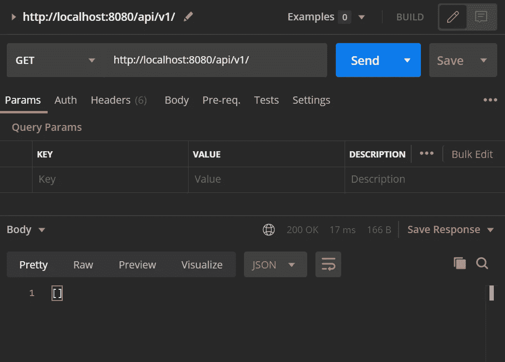

最后，让我们通过在数据库中添加另一个实体来确保我们的序列生成器正常工作。

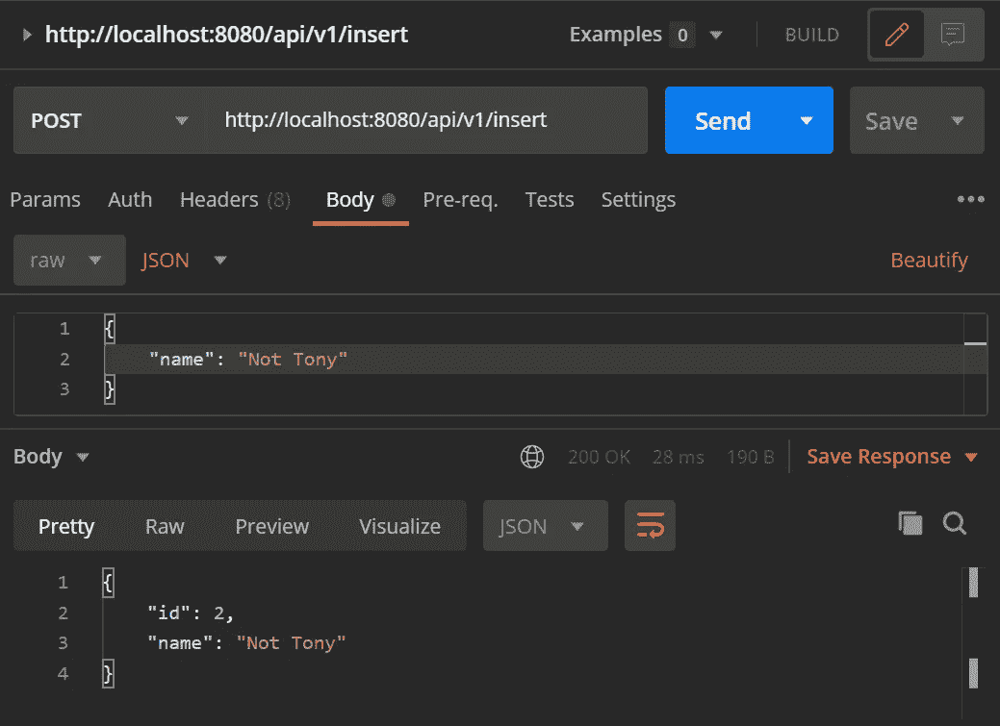

正如我们所看到的，它的 id 为 2，这意味着我们的序列器工作正常。

恭喜你！您只是使用了 postman 而不是编写测试，看看这是否能让您有所收获…

# 我的学习资源

如果你做到了这一步，那么我想感谢你的阅读，我希望你能从中有所收获:)

再次提醒，请记住，所有这些都是由还没有上过这门课的一年级学生写的。不要把其中的任何内容视为 100%正确或最佳实践，甚至是你在课程中肯定会用到的东西。我自学了一些 Spring 基础知识，主要使用了以下来源(前两个来源对示例应用程序有很大影响),所以一定要研究所有来源，尤其是第三个来源。代码已经发布在我的 github 上，你可以在下面找到链接。快乐编码；)

*   [有一些免费课程的网站](https://amigoscode.com/courses?query=spring)
*   [Youtube 播放列表](https://www.youtube.com/watch?v=8SGI_XS5OPw&list=PLwvrYc43l1MzeA2bBYQhCWr2gvWLs9A7S)
*   [谷歌](https://www.google.com/)
*   [官方春季文档](https://spring.io/projects/spring-boot)
*   [我在网上找到的几本书](https://github.com/AntoniosBarotsis/InterestingBooks/tree/master/Spring%20Boot)

最后但同样重要的是，你可以在这里找到这个项目的完整代码。