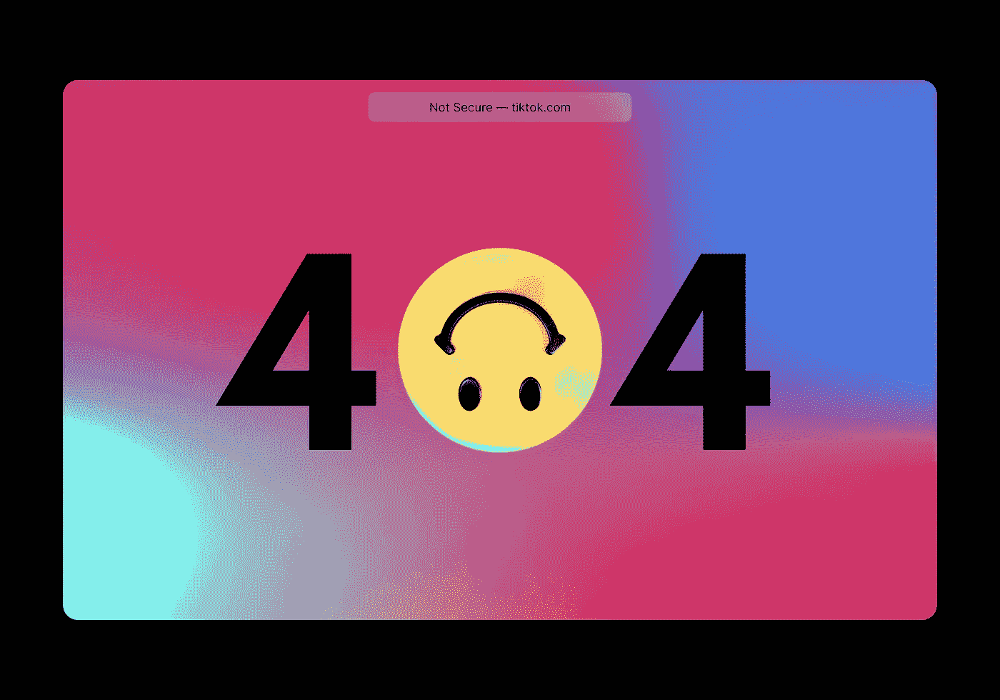

# 堆叠封装—更好的繁忙和错误处理

> 原文：<https://medium.com/nerd-for-tech/stacked-package-better-busy-and-error-handling-643b0131f0a6?source=collection_archive---------4----------------------->

你是否曾经因为在你的 UI 中塞满了太多的 setstate()，而感到沮丧？当然我们都经历过，至少我经历过。所以我开始用 bloC。但是使用 [bloC](https://pub.dev/packages/flutter_bloc) 有时候有些矫枉过正。所以我已经开始使用 [*提供者*](https://pub.dev/packages/provider) *包*，它帮助我写出干净的代码。但是当我想导航到另一个页面，显示一个简单的小吃店时，我仍然想将我的构建上下文传递给方法，这是我不喜欢的。这时我发现了一个名为`**stacked**`的很棒的包，它是内置的`ChangeNotifier`

堆叠封装中有**多种可用特性**。在这篇文章中，我将告诉你我们如何使用这个包更有效地处理错误和加载状态。

让我们看一个简单的例子，我们可以使用堆栈封装实现一个简单的递增计数器。

首先，让我们看看我们的视图模型

**BaseViewModel 只是 changeNotifier 的扩展，但它提供了更多的功能**

BaseViewModel 有许多子类型，如 FutureViewModel、ReactiveViewModel、StreamViewModel 等等。它们扩展了 BaseviewModel 的功能，并减少了许多样板代码。

下面是我们简单的计数器小部件(我们的视图)。

如果你看上面的视图(小部件)，我们用 **ViewModelBuilder** 包装它。

1.  **ViewModelBuilder < T >。无功()**

*   T 将是我们想要提供的视图模型的类型。(`CounterViewModel` 在这种情况下)
*   viewModelBuilder 接受一个回调，该回调将创建一个 ViewModel 实例。
*   每当从 ViewModel 调用 notifyListeners()时，如果它是一个**viewmodelbuilder . reactive()**，构建器将重新构建
*   还有另一个版本叫做**viewmodelbuilder . non reactive()，**当你调用 notifyListeners()时，它不会被重新构建。

我希望你能很好地理解上面的代码，因为它看起来完全像一个 changeNotifier 代码。那么这有什么特别的呢？为什么我这么夸大这个包裹？让我们看看


照片由[迈克·范·登博斯](https://unsplash.com/@mike_van_den_bos?utm_source=unsplash&utm_medium=referral&utm_content=creditCopyText)在 [Unsplash](https://unsplash.com/s/photos/loading?utm_source=unsplash&utm_medium=referral&utm_content=creditCopyText) 上拍摄

# **1。减负荷逻辑锅炉板代码**

你有没有写过这样的加载逻辑，

那么你必须做这样的事情，

## 1.伊斯布什()

但是用 stacked 你可以做一些事情，

如你所见，我们没有维护任何用于维护加载状态的布尔变量。包裹会帮你处理的。

**2。**忙碌(对象)

假设您想要维护单独变量的加载状态，而不是整个视图模型的加载状态。您可以使用`setBusyForObject()`，它将让您根据传入的对象的 hashcode 来设置忙碌状态。

在 viewModel 中使用 setBusyForObject()并传递您想要设置忙碌状态的对象和一个表示它是否忙碌的布尔值。

在视图中，执行如下操作

```
**viewModel.busy(viewModel.post)** 
             ? LoadingWidget() 
             : MyWidget(viewModel.post)
```

这种方法非常有用，它不是让整个视图模型忙碌起来，而是精确地针对一个属性。

> 它使用 hashcode，如果你想使用原始类型，让它们成为 final 或者 const

```
class PostViewModel extends BaseViewModel{
   final String initKey = 'initialized';
   void init(){
      setBusyForObject(initKey,true);
      //do initialization
      setBusyForObject(initKey,false); 
  }
}
```

在 UI 中，您可以使用字符串键来检查繁忙程度，

```
**viewModel.busy(viewModel.initKey)** ? LoadingWidget() : MyWidget()
```

3 .任意对象集合

*   还有另一种方法来检查 ***是否有任何对象忙***

```
**viewModel.anyObjectsBusy** ? LoadingWidget() : MyWidget()
```

当我们初始化一大堆对象，并且希望在 UI 中显示某些内容之前初始化所有对象时，上面的方法非常方便。

4.runBusyForFuture(未来)

如果我们想要运行一个长时间运行的任务，并且想要根据任务的完成状态自动设置忙碌状态，我们可以使用 runBusyForFuture()

runBusyFuture 将会有一个未来，

1.  对于整个 ViewModel 或传入的对象，将 Busy state 设置为 true。
2.  计算未来。
3.  将忙状态设置为假。
4.  返回结果。
5.  还为您处理错误(稍后将详细介绍)

您也可以传递一个对象来设置该特定对象的忙碌状态

```
void getAllPost() async{
   allPosts = await  runBusyFuture(myApiService.getAllPosts(),**busyObject:allPosts**);
   notifyListeners();
}
```

您还可以将一个字符串传递给`busyObject`，

```
void updateItem(int id) async{
   **String updateKey = '$id update-key';**
  _post = await runBusyFuture(
          myApiService.fetchPost(id),**busyObject:** updateKey);
   notifyListeners();
}
```

然后你可以在用户界面中使用它，

```
viewModel.busy('$id update-key') ? LoadingWidget() : MyWidget(id)
```



在 [Unsplash](https://unsplash.com/s/photos/error?utm_source=unsplash&utm_medium=referral&utm_content=creditCopyText) 上由[视觉](https://unsplash.com/@visuals?utm_source=unsplash&utm_medium=referral&utm_content=creditCopyText)拍摄的照片

# 2.错误处理变得简单

类似于繁忙处理，我们可以使用`stacked` 包轻松处理错误。它为我们做了一切，我们可以在用户界面中访问它们，并相应地显示小部件。

1.  **设置错误(错误)**

使用这种方法，您可以设置整个视图模型的误差。

```
setError(‘something went wrong’)
```

并在 UI 中访问它，

```
**viewModel.hasError** 
        ? Text(**viewModel.error(viewModel)**)//'something went wrong'
        : Text(‘success’)
```

1.  `ViewModel.hasError`告知我们的视图模型中是否有错误。
2.  `viewModel.error(object)`，这里我们已经传递了 ViewModel 本身，所以它将获取我们的 viewModel 中的错误。

## 2.setErrorForObject(对象，错误)

使用这个方法，您可以为特定的对象或键设置一个错误，并在您的 UI 中访问它。

try 块将在 3 秒后引发一个错误，它将被下面的 catch 块捕获。在其中，我们为对象`_post,`设置错误，用异常字符串作为错误的值。

我们可以检查 UI 内部的错误，

```
SomeWidget(
child: **viewModel.hasErrorForKey(viewModel.post)**
            ? Text(**viewModel.error(viewModel.post)**)
            : Text("success")),
);
```

这就是我们在 UI 中访问错误的方式。

我已经告诉过 runBusyFuture() 为我们处理错误，

语法:

```
Future<T> runBusyFuture<T>(
        Future<T> busyFuture,
       {Object? busyObject,
        bool throwException = false})
```

> **忙碌的未来**:这是我们想要实现的未来
> 
> **busyObject** :这个是可选的。如果我们传递一个对象，它的 hashcode 被用作设置错误或繁忙状态的键。
> 
> **throw exception**:runBusyFuture 默认不抛出错误，如果出现错误，只会设置错误状态。我们可以通过设置`throwException=true`来覆盖这个行为并抛出一个错误

**runErrorFuture()**

有时你不想处理任何忙碌(忙碌😂而不是商业)逻辑，并且仍然想要运行一个可能引起错误的未来。在那种情况下，你可以使用 **runErrorFuture()。它的工作方式类似于，`runBusyFuture()`，但是它不处理任何繁忙逻辑。而且 **runBusyFuture()是使用 runErrorFuture()构建的。****

# 3.处理未来—未来视图模型

有时，我们可能希望初始化来自未来的数据，所以我们使用 FutureBuilder，堆叠包也有一些很酷的功能来初始化来自未来的数据，并处理未来的生命周期。FutureViewModel 帮助我们利用 BaseViewModel 的强大功能和我上面提到的*特性。*

*   您只需覆盖方法 **futureToRun()，**，该方法将为您启动来自未来的数据，并将其保存在名为 **data** 的属性中。

这个方法的作用是，

*   当您创建 FutureViewModel 对象时，它将运行 futureToRun()。
*   它会叫`setBusy(true)`
*   一旦计算完成，您就可以使用`viewModel.data`来访问数据
*   如果它导致失败，它将设置 ViewModel 的错误状态。
*   最后，它会调用`setBusy(false)`

我们能用这个做什么？

*   我们可以使用`viewModel.dataReady`检查数据是否准备好
*   我们可以使用`viewModel.data`获取数据

```
Center(
  child: ViewModelBuilder<PostViewModel>.reactive(
    viewModelBuilder: () => PostViewModel(),
     builder: (ctx, viewModel, _) => 
        **viewModel.hasError**
        ? Text('Something went wrong')
        : **viewModel.dataReady**
            ? MyListItem(viewModel.data)
            : CircularProgressIndicator(),
  ),
)
```

## **onData()**

如果你想把获取的数据赋给某个变量，你可以覆盖一个钩子 **onData(data)。**

```
class PostViewModel extends FutureViewModel {
  **List<Post> allPosts;**
  @override
  Future futureToRun() async {
     //your future
  }@override
 **void onData(data) {   //called once the data is ready
    allPosts = data;
    super.onData(data);
  }**
 }
```

现在你可以使用 *allPosts 变量*访问相同的数据，你可以在 onData 内部做任何类型的操作，比如过滤数据，缓存等等。

## 一个错误()

如果您希望在 futureToRun()中发生错误时分配一些默认值，该怎么办？您可以覆盖 onError()挂钩。

```
@override
void onError(error) { 
  **onData(someDefaultData);**super.onError(error);
}
```

在上面的代码中，当错误发生时，我将一些默认值设置为我的“数据”。现在我们可以使用`viewModel.data`来访问默认数据

> 不要在 onError()内部再次调用`futureToRun()`，可能会造成死循环。

目前，没有重试功能，但我希望他们会很快添加它。

希望你已经了解了 ***堆栈*** *包*是如何减少大量样板代码并帮助我们轻松处理错误和加载状态的。

在我的下一篇[文章](/nerd-for-tech/stacked-package-service-location-routing-logging-b8bdc1e6c839)中，我将写这个包提供的服务，比如服务定位、路由、日志。感谢您的阅读😻，鼓掌👏如果你喜欢这篇文章。