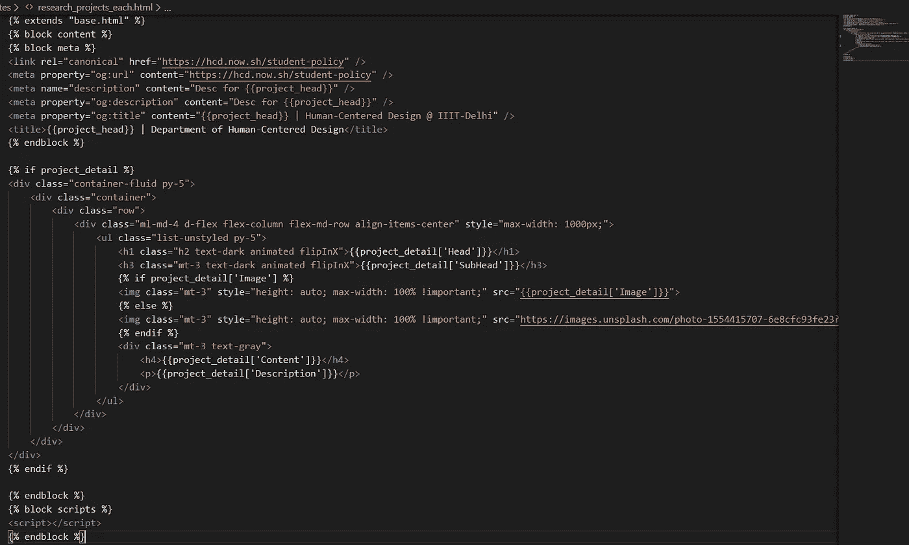

# 静态和动态网站

> 原文：<https://medium.com/nerd-for-tech/static-dynamic-websites-e2f2372cef6c?source=collection_archive---------0----------------------->

基于我之前的文章[“Web 开发入门的简短指南”](/@rishi18304/a-short-guide-to-starting-web-development-e4bff63f5ab3)，这篇文章将让你了解静态和动态网站之间的区别，当你请求一个链接时，两者是如何服务的，我开发的一些网站需要一个“动态”网站代码&。需要明确的是，网站是指以各种方式连接在一起的网页的集合。

# **有什么区别？**

静态是指缺少运动、动作或变化，而动态的特征是不断变化、活动或进步。

静态网站是那些每次被请求时都提供相同内容的网站。除非手动更改，否则所提供的内容不会改变。虽然内容保持不变，但这并不意味着网站失去了互动性。

动态网站涉及使用服务器端脚本(发送内容前执行的代码)和/或客户端脚本(在浏览器中执行的代码)。例如，试着想象一下 medium.com 的[如何保存所有商品的库存，然后只显示用户特别要求的那一个。但是你能想象这将会占用多少空间吗，即使他们已经创建了一个 harcoded。放在网站上的每个博客的 html 文件！这就是动态网站的切入点。他们从数据库中提取内容，然后操纵 DOM(文档对象模型，基本上是在浏览器中可以看到的一切)将其呈现给用户。](/)

简单地说，请求的网页是按需创建的，它们不是预先构建在动态网站中，而在静态网站中，可以请求的网页已经存在于服务器上，并且直接发送，而不进行任何其他处理。

# 为什么是动态网站？

动态网站比静态网站强大得多。它们提供了广泛的好处，从易维护性、可伸缩性到更好的可用性。想象一下，创建一个静态网站，就像你自己的 medium.com，最初有 250 页。现在，假设您需要更改标题的大小、字体类型或每个页面中的内容发生变化时的 meta 标记。想象一下编辑每个页面所耗费的大量时间和精力。因此，为了简化这个过程，你可以选择动态网站。弄清楚使用哪种内容管理系统，并编写每当页面被请求时就执行的 javascript，然后坐下来享受。这消除了编辑每个页面的所有顾虑，只需在需要时编辑用于创建该页面的脚本。

# 例子

看看下面的项目是如何按需创建的。它是在烧瓶中开发的。GitHub 回购的链接:[https://github.com/IIIT-Delhi/HCD-IIITD/](https://github.com/digitalPlayer1125/HCD-IIITD/)

(展示每个研究项目的模板)

在这里，我已经向您展示了创建的页面的代码。没错，我已经写了一个文件单个文件，其中的内容被计算出来，无论何时需要。查看 GitHub repo，查看在创建该文件时，内容是如何获取并传递到该文件的！⚡

这就是我现在所拥有的。希望这有所帮助！