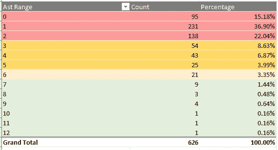
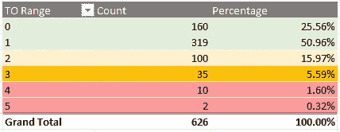
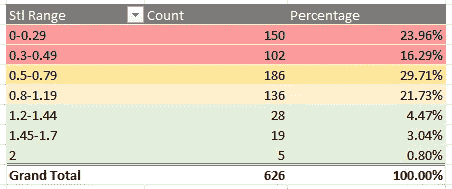
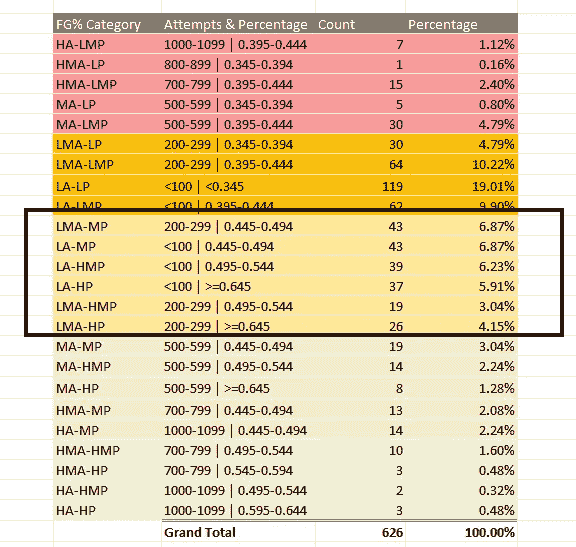
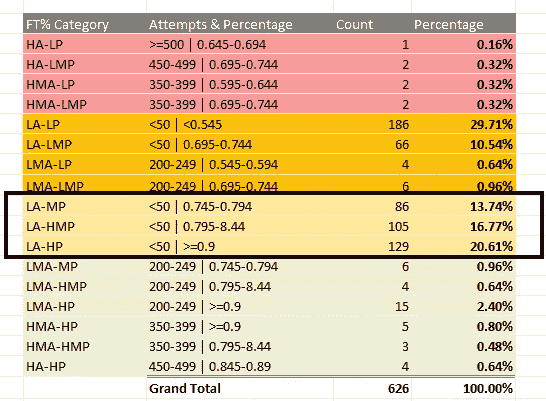
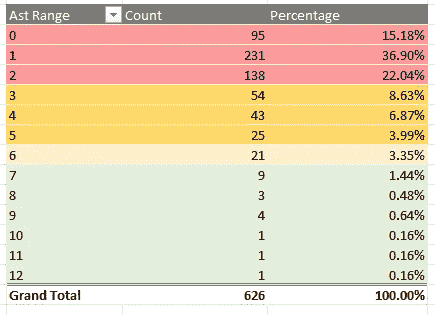

# 统计类别:稀缺的概念

> 原文：<https://medium.com/nerd-for-tech/statistical-categories-scarcity-level-scarcity-impact-88ced85a3222?source=collection_archive---------9----------------------->

*注意:这篇文章尝试了一种 Q & A 格式。请随意评论这种格式是否使内容更容易消化，读起来更有趣。“Q”代表提问者,“BFT”代表博客角色。*

*本帖显示的数据基于 2020-2021 NBA 赛季数据。*

由[马蒂亚斯·穆勒](https://unsplash.com/@berger412)拍摄。照片来自[https://unsplash.com/](https://unsplash.com/)

> 问:嘿，BFT，今天的菜单上有什么？

**BFT:** 今天的话题是关于统计类别，尤其是稀缺程度的概念&稀缺影响。

> 问:好的。先说「统计类别」？它们是什么？它们为什么重要？

**BFT:** 统计类别是现场篮球比赛中球员有形动作的指标。他们通过数字来衡量球员的表现。

在 fantasy 中，统计类别是决定谁最终成为联盟冠军的基本要素。

统计类别(H2H 标准设定)。图片取自雅虎幻想篮球。

特别是在头对头(H2H)幻想联盟，每个“统计类别赢得”对你的每周比赛转化为一个“获胜游戏点”。

要成为冠军，需要做到以下几点:

*   你的团队需要在每周的比赛中获得更高的胜场点数。
*   在梦幻“常规赛”阶段结束时赢得最高游戏分数的顶级球队进入“季后赛和总决赛”阶段。
*   在“季后赛和总决赛”阶段的所有周中，获得比每周比赛更高的获胜游戏分数的球队成为联盟冠军。

概括地说:

*   更高的统计类别胜利=更高的获胜游戏点数=每周比赛的获胜者=联赛冠军。

九(9)个最常见的统计类别是: **FG%** (投篮命中率) **FT%** (罚球命中率) **3PTM** (投进三分) **PTS** (得分) **REB** (篮板) **AST** (助攻) **ST** (抢断) **BLK** (盖帽)和 **TO**

> 问:现在我们有了统计类别的背景，那么“稀缺程度”和“稀缺影响”的概念是什么呢？它们与统计类别有什么关系？

# **稀缺性**

BFT:H2H 梦幻篮球是通过统计类别来竞争的。每个统计类别中的数字输入来自玩家——这使得玩家成为你的主要资源。

由于(1)球员的角色、技能、心态和上场时间以及(2)球队的进攻/防守方案等因素，球员产生的数字(统计类别的输入)会有所不同。某些球员在得分上很出色，其他的在篮板上，其他的在助攻上，等等。

现在，这种变化造成了球员(资源)供应的限制，这在很大程度上有助于一个特定的统计类别——供应的限制被称为**稀缺**。

有两(2)种稀缺性概念会影响统计类别的价值。这些是稀缺性水平和稀缺性影响。

# 稀缺程度

**BFT** : **稀缺程度**是供应受限的程度。

*   优秀球员供给越低，稀缺程度越高。

为了更好地形象化这个概念，表 1 显示了 REB(每场比赛总篮板数)的分布。

表 1。场均篮板球总数的分布

从该表中我们可以注意到，只有 41 个玩家(6.55%)构成了 REB 的上限，显示了该统计类别的稀缺程度。

更进一步，让我们比较一下表 1 和表 2。

表 2 显示了 AST(助攻/场均)的分布。

表二。场均助攻分布(AST)

比较这两个类别，有 41 名玩家(6.55%)在 reb 中处于较高范围，而只有 19 名玩家(3.04%)在 AST 中处于较高范围。

**鉴于可用球员数量较少，AST 比 REB 更稀缺。**

# 稀缺性影响

**BFT:** 与稀缺性水平概念并列的是稀缺性影响的概念。

**稀缺性影响**根据稀缺性的概念，从赢得统计类别的角度来看潜在的影响和风险。

为了评估稀缺性的影响，我们的方法很简单——我们试图回答这个问题:如果我的团队无法获得足够多的球员，在相应的统计类别的上限，有多少球员可能仍然可用？

这个问题背后的逻辑是:如果“A 队”选秀一个场均 14 REB 的球员，我依然可以选秀 2 个场均 7 REB 的球员。

考虑到这一点，我们可以查看统计类别中间范围的浓度。

*   对优秀玩家范围的集中程度越高，稀缺性影响就越低。

作为一个视觉，表 3 显示了 BLK 的分布(块/游戏)。

表 3。每场比赛的盖帽分布(BLK)

从稀缺程度来看，有 26 个玩家(4.15%)贡献了 BLK 的上限。

如果我的团队无法获得 26 名球员中的任何一名，我仍然可以从 69 名可用球员(11.02%)中挑选至少两名球员，以弥补与竞争对手在这一统计类别中的差距——这表明了 BLK 的稀缺性影响。

> 问:有意思。但是为什么这些概念很重要呢？我如何使用它们？

**BFT:** 理解这些概念对[创造你的战略](https://bball-fantasy-talks.medium.com/the-why-reasons-for-focusing-on-head-to-head-standard-setting-e40a7a90fa02)很有用，因为它们让你知道你的竞争对手和你的团队的优势统计、挑战者统计和踢腿统计。

*   **优势统计**是你最擅长的统计类别——在你的联盟中所有球队中排名前三。
*   **挑战者统计**是统计类别，与你所在联盟的其他球队相比，你仍然处于较高范围(前 4-6)。
*   **撑船统计**是你不擅长的统计范畴——理想情况下，根据你的意图，你要考虑战略权衡。

# 案例 1:团队组成策略

**BFT:** 概念有用的一个例子是在起草季节阶段建立你的团队的团队组成。

*   *作为后台，起草是团队的主要方式。在梦幻联盟的最开始，所有的 NBA 球员都是可用的，联盟中的每个球队都可以根据他们的选秀顺序选择他们想成为他们球队一部分的球员。一旦一名球员被选中，他将成为选择他的球队的一员，而不再为下一个球队效力。草案顺序是随机决定的(游戏中靠运气的部分)。*

假设你在第一轮和第二轮选秀中分别排名第 8 和第 17。

知道了 AST(助攻)的**稀缺程度**，你可以立刻瞄准 2 个助攻排名靠前的球员，让 AST 成为你的主导属性。这样做，你也拒绝了其他玩家在 AST 属性上的成功。

为了进一步确保 AST 作为你的主导属性，你可以在选秀的中后期增加 1-2 名球员，让竞争的球队更难赶上。

表 4。基于 AST 的优势统计构建示例。(挑战者统计:PTS，REB，ST，3PTM)

进入**稀缺性影响**，在这个统计类别中，其他球队需要 4-5 名中档 AST 球员才能达到你的人数。

这样做的目的是为敌对队伍创造一个决策点，要么挑战你，要么完全放弃这个属性。

如果他们选择挑战并为 AST 分配更多的花名册位置，您仍然可以在这个统计类别中保持竞争力，同时拥有花名册位置来建立您在其他统计类别中的优势。你也可以调整你如何起草，以完全保持你的优势。然而，你的对手冒着失去其他统计类别的名册位置的风险。

如果他们选择不挑战，好吧，那就让 AST 成为你的赢家——还有一个你在整个赛季中可以少监控的数据*(当然不考虑伤病)*。

最后，从另一方面来看，如果你看到其他队伍开始将 AST 作为他们的主导属性，你可以决定放弃 AST，因为你了解稀缺程度和影响。

# 案例#2:豁免线使用

**BFT:** 除了帮助你建立你的团队组成策略，这些概念还可以帮助你使用豁免线。

弃权线是在 fantasy 的常规赛中增加和减少球员的一种方式。当习惯于它的[最大潜力](https://bball-fantasy-talks.medium.com/the-why-reasons-for-focusing-on-head-to-head-standard-setting-e40a7a90fa02)时，拥有一个弃权线策略可以增强你的团队组成策略，以实现“在你的每周比赛中赢得大多数统计类别”的目标。

一个弃权的策略是有意识地设置一个花名册，通过增加和减少球员来增加某些属性。通过将你的名单中的球员与弃权名单中几乎相同类型的球员进行交换，你可以增加你在统计类别中产生的总数。

以下是可以执行上述豁免线策略的常见统计类别:

(a) **3PTM(每场比赛得三分)**—3PTM 的稀缺程度并没有那么高，与其他统计类别相比，有 94 名球员(15.02%)构成了较高的范围。

此外，有 79 名中端球员，这使得使用多名球员来弥补顶级球员的可能缺乏成为可能。

表 5。每场比赛三分的分配(3PTM)

(b) **(每场比赛得分)PTS**—PTS 的稀缺程度同样不高，与其他统计类别相比，有 95 名球员(15.18%)属于较高范围。

然而，与 3PTM 相比，只有 59 名中端玩家，这使得豁免线选项更加棘手，但仍有可能用于此统计类别。

表 6。每场比赛得分分布

以 3PTM 为例:

*   让我们说(1)你的 3PTM 作为你的挑战者 stat 是有争议的，(2)你选中了 Jordan Poole，和(3)他的花名册位置是让你在你的花名册和弃权线之间轮换球员。

要增加你的 3PTM，可以看看和乔丹普尔有相同 stat 线的球员。

表 7。3PTM 中拥有几乎相同统计数据的玩家示例

以下是执行流程:

*   **场景:**在第 2 周，乔丹·普尔有 3 场比赛，分别发生在周一、周二和周五。伊曼纽尔·奎克利在周六和周日有两场比赛
*   **行动:**在周五之前将 Poole 换成 Quickley
*   **结果:**将你的总 3PTM 输出从 6 3PTM 增加到 9 3PTM。

你可以每周重复一次，以确保 3PTM，要知道这个统计类别实际上并不稀缺。

这就是这些概念如何帮助你制定战略，即使你在《H2H 幻想》中是最后一稿。

> 问:现在我们知道了这些概念以及它们为什么重要，你能分享一下统计类别在总体稀缺性方面的排名吗(考虑稀缺性水平和稀缺性影响)？

**BFT:** 以下是基于稀缺性的九(9)个最常见统计类别的排名:

# **排名#9:至** —失误

*   **稀缺程度:**极低——476 名玩家(76.52%)在 TO 中表现优秀。
*   **稀缺性影响:**极低—不相关
*   **建议的统计类型:**撑船统计

表 8。每场比赛失误的分布

失误是一个独特的统计范畴。球员越优秀，失误就越多。

对于在 3-5 个统计类别中排名前 75 的球员，55/62 的球员平均每场比赛失误 2 次以上。

排名前 75 位的 7 位玩家，平均<2 turnovers/game are the following:

Table 9\. Players Ranked Top 75 in 3–5 Statistical Categories w/ Less Than 2 TOs/game

Given this, turnovers are often punted — meaning owners intentionally ignore this statistical category.

To increase your chances of winning TO, you need to:

*   Get the players in Table 9
*   Avoid the players in Table 10
*   Focus on getting players that dominate in 1–2 statistical categories with low turnovers.

Table 10\. Ten (10) Worst Players in TOs/game

# RANK#8: 3PTM — Three Points Made

*   **稀缺程度:**低——94 位玩家(15.02%)在 3PTM 中表现优秀。
*   **稀缺性影响:**低——79 玩家(12.62%)可以帮你恢复，有竞争力。
*   建议属性类型:挑战者属性

表 11。每场比赛三分的分配(3PTM)

3PTM 并不是一个稀缺的属性，并且可以很容易地恢复，因为有大量的玩家。

要增加赢得 3PTM 的机会，您可以:

*   在第一轮和最后一轮选拔排名靠前的球员
*   所有轮次中至少在 0.95-1.49 3 PTM 范围内的选秀球员——这意味着，你的所有名册上的球员都可以投三分。
*   最大化豁免线

# 排名#7:分数——得分

*   **稀缺程度:**低——95 位玩家(15.18%)PTS 优秀。
*   **稀缺性影响:**中-59 玩家(9.42%)可以帮你恢复，有竞争力。
*   **建议的统计类型:**挑战者统计

表 12。每场比赛得分分布

从稀缺程度的角度来看，PTS 也不是一个稀缺属性。但是，从稀缺影响的角度来看，它比 3PTM 更稀缺。

即使你考虑 9-12 分范围内的球员，在对阵拥有 24-27 分及以上球员的球队时，也需要消耗更多的球员名单。

要增加赢得点数的机会，您可以:

*   在第一轮和中/晚轮选拔排名靠前的球员。然而，在大多数情况下，PTS 类别中排名最高的玩家不会持续到最后一轮。
*   最大化豁免线

# 排名第六:第一抢断

*   **稀缺程度:**52 岁以下玩家(8.31%)在 ST 中表现优异。
*   **稀缺性影响:**低——136 个玩家(21.73%)可以帮你恢复，有竞争力。
*   **建议属性类型:**挑战者属性/主导属性

表 13。场均抢断分布(ST)

基于稀缺程度，抢断比 PTS 和 3PTM 更稀缺。但是，基于稀缺性影响，ST 可以很容易地恢复，因为 136 个玩家处于统计类别的中间范围。

要增加赢得 ST 的机会，您可以:

*   在第一轮选秀中选择排名靠前的球员，在剩下的几轮选秀中选择排名中等的球员。
*   最大化豁免线

# 排名#5(或 4): FG% —投篮命中率

*   **稀缺程度:**高——18 位玩家(2.88%)FG %优秀。
*   **稀缺性影响:**低——68 玩家(10.86%)能帮你恢复，有竞争力。但是，玩家的主要集中点，207 个玩家(33.07%)，都在中档(低尝试-高百分比)。
*   **建议统计类型:**挑战者统计/主导统计

表 16。投篮命中率的分布(FG%)。M-H 的意思是低中高。A-P 表示尝试百分比。

为了评估百分比类型的统计类别的真正影响，我们需要同时考察数量(尝试的次数)和质量(百分比)，因为数量将主要决定团队的整体百分比倾向于哪里。

*   例如，在球员 A 以 30% (60/200)投篮 200 次，球员 B 以 60% (60/100)投篮 100 次的阵容中，百分比结果是 40%。

鉴于这种想法，对于 FG%来说，优秀的、高影响力的球员似乎是稀缺的——只有 18 名，与其他统计类别相比，确实更少。

现在，另一个问题是:与其他团队相比，FG%的高百分比能有多大的竞争优势？

从表中我们可以看到，高 FG%的上升空间有限，因为分布首先就已经向高 FG%集中，尝试的次数很少。

高稀缺性水平和低稀缺性影响是 FG%排名#5 的原因。

要增加赢得 FG%的机会，您可以:

*   选择会影响你的 FG%的排名靠前的球员——以绿色突出显示。
*   避免选择会对你的 FG%产生负面影响的球员——以红色突出显示。
*   把你选秀剩下的部分集中在让球员穿浅色黄色的衣服上。

# 排名第四(或第五):英尺% —罚球命中率

*   **稀缺程度:**高——12 名球员(1.92%)在 FT%上是优秀的。
*   **稀缺性影响:**低——25 个玩家(3.99%)可以帮你恢复，有竞争力。但是，玩家的主要集中点，320 个玩家(51.12%)，都在中档(低尝试-高百分比)。
*   **建议统计类型:**挑战者统计/ 主导统计

表 16。罚球命中率的分布(FG%)。图例:L-M-H 的意思是低中高。A-P 表示尝试百分比。

从稀缺程度和影响角度来看，FT%与 FG%相似，它们的排名可以互换。

使 FT%在主观意义上稍微稀缺的是稀缺程度的差异——FT %中有 12 个玩家，FG%中有 18 个玩家。

要增加自己赢得 FT%的几率，可以用和 FG%一样的方法。

# 排名第三:篮板球

*   **稀缺程度:**中-41 玩家(6.55%)在 REB 中表现优异。
*   **稀缺性影响:** Mid — 71 个玩家(11.34%)可以帮你恢复，有竞争力。
*   **建议的统计类型:**主导统计

表 14。场均篮板球总数的分布

REB 是一个有趣的统计类别。

(1)因为权衡，它充当了你选择团队组成策略时的关键出发点之一。

在 REB 的顶级球员中，超过一半的人 FT%和 AST 较低，这是另外两个最稀缺的统计类别。相反，REB 也可以打开高 FG%和 BLK，这也是另一组稀缺的统计类别。

(2)单独评估 REB，REB 的上限可以进一步细分，将> 10 REB 与 8-10 REB 分开，以显示该统计数据的稀缺程度增加。

(3)增加 REB 稀缺性的一件事是[花名册位置](https://bball-fantasy-talks.medium.com/unlocking-nba-fantasy-basketball-c24e7704ba1c)的数量，这促使更多的球员对这一统计类别做出贡献。与大多数其他统计类别相反，REB 有 4 个名册位置需要填补，即 2 个中锋，1 个大前锋，1 个前锋位置-大多数其他统计类别有 2-3 个。

鉴于这三个特点，REB 是在草案的早期(开始)轮中最受关注的类别之一。

要增加赢得 REB 的机会，您可以:

*   在第一轮和最后一轮选拔排名靠前的球员；然后，在其他几轮中选中档球员。

# 排名第二:BLK——街区

*   **稀缺程度:**高**——**BLK 优秀选手 26 人(4.15%)。
*   **稀缺性影响:** Mid — 69 玩家(11.02%)可以帮你恢复，有竞争力。
*   **建议统计类型:**主导统计

表 17。每场比赛的盖帽分布(BLK)

BLK 和 REB 有着相同的原则，除了 BLK 更少。

要增加赢得 BLK 奖的机会，您可以:

*   在第一轮和第二轮选拔排名靠前的选手；然后，在其他几轮中选中档球员。

关于 BLK，有一点需要注意，那就是竞争非常激烈，尤其是在中期选举中。如果你选择 BLK 作为你的一个优势属性，在第 2-3 轮中至少带一个顶级玩家。

# 排名# 1:AST-助攻

*   **稀缺程度:**高 AST 中有 19 位玩家(3.04%)优秀。
*   **稀缺性影响:**高**——**21 个玩家(3.35%)可以帮你恢复，有竞争力。
*   **建议的统计类型:**主导统计

表 18。每场比赛总助攻数分布(AST)

考虑到稀缺性水平和稀缺性影响，AST 是最稀缺的统计类别。

只有少数球员每场比赛提供大量的助攻；如果他们不能选中高排名的 AST 球员，那么在这个统计类别中没有多少中档球员可以帮助球队恢复。

不管你的选秀位置如何，看看你如何在最后一战中获胜，因为一旦你能够在这个统计类别中创造优势，你的对手就很难赶上。

要增加赢得 AST 的机会，您可以:

*   用你的前 2 个选秀权来挑选排名靠前的 AST 球员。然后在中后期用 2–3 个皮卡选秀中端球员。

探索稀缺性概念背后的故事，以及稀缺性水平和稀缺性影响的子概念，是一个好奇心——我们想更好地了解基于他们占主导地位的统计类别的球员价值。

这些概念表明，在 H2H，球员的价值随着球队老板计划和执行的策略而变化。

在未来的帖子中，我们的目标是基于不同的平底船策略来揭示玩家的价值——这条路是复杂而有趣的。

希望这些概念有助于执行你的战略，以赢得 H2H 梦幻篮球赛。

下一季再见！