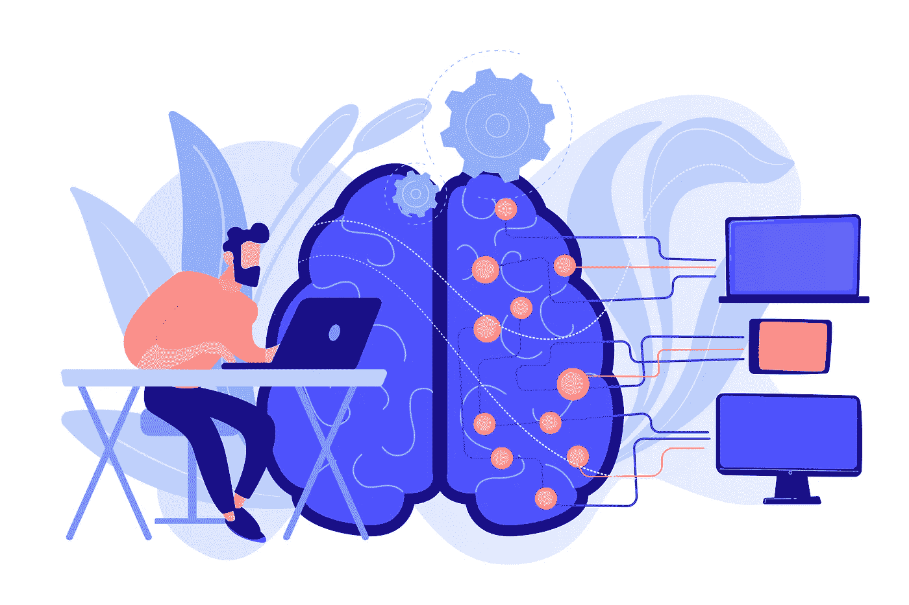
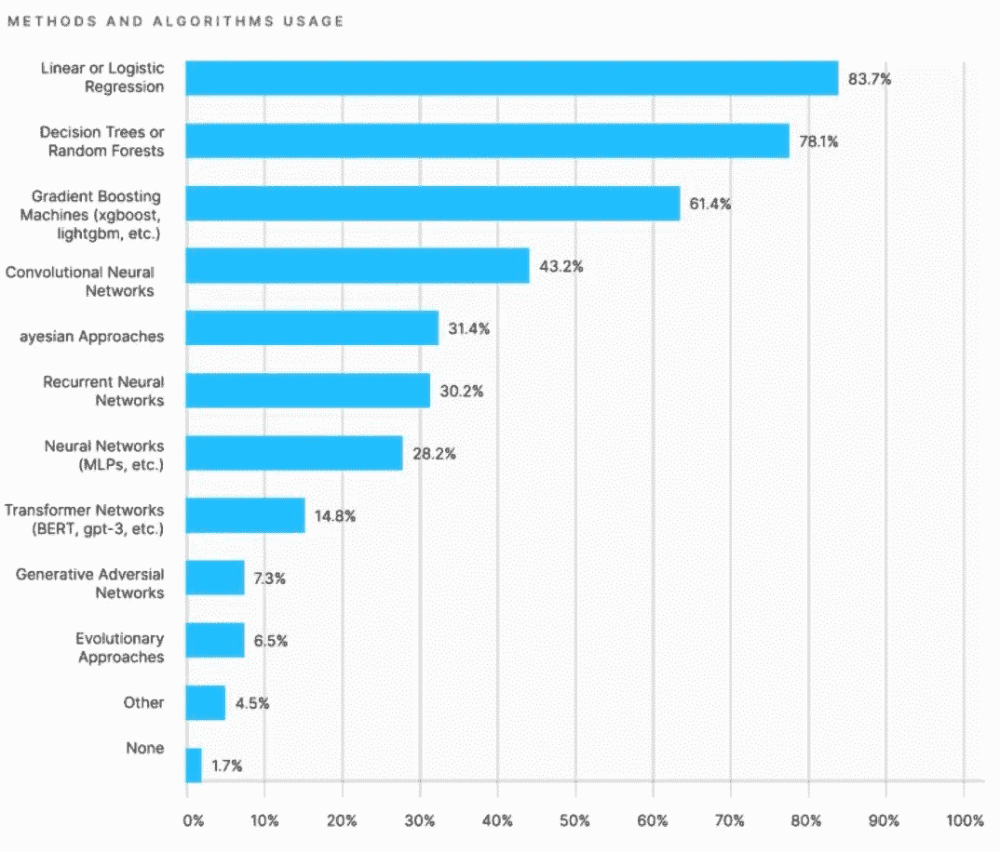
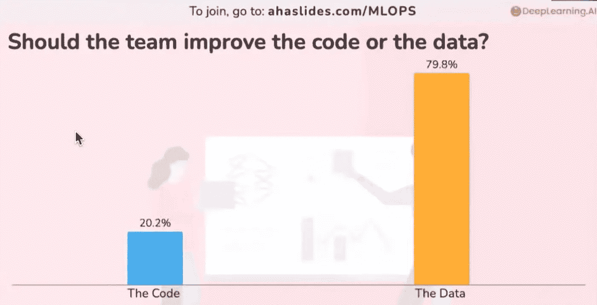

# 保持饥饿保持愚蠢——从我的分析之旅中学到的东西

> 原文：<https://medium.com/nerd-for-tech/stay-hungry-stay-foolish-learnings-from-my-analytics-journey-f051e29aa2cf?source=collection_archive---------14----------------------->

[https://www.freepik.com/vectors/education'](’<a)>由 vectorjuice 创建的教育向量—[www.freepik.com](http://www.freepik.com)</a>

这个世界唯一不变的规则是它总是在变化，为了生存，你需要成长并适应这个变化的世界。“改变”是我迄今为止描述我的分析之旅的方式。我在 2017 年开始担任分析师，今天我是首席数据分析师，这段旅程令人满意，充满挑战，不断学习一直是我的座右铭。我学到了很多东西，有些我希望在我开始这段旅程时就知道，但我很高兴在我职业生涯的早期有机会和优秀的导师学习。

**数据分析师的真正价值在于他们对组织的影响。**这篇文章重点讲述了我在成为一名高效数据分析师的过程中所学到的(以及仍在学习的)经验

**专注于业务**:经常有很多问题让你感兴趣，你想做的只是将很酷的 ML 和 DL 算法应用于这些问题，而我们没有问这个问题"**它将如何影响业务？**”。这个问题对于建立高质量的数据科学团队至关重要。将分析与业务相结合，可以让您摘下垂挂的果实，并确保您获得可见性。这也让企业对你的工作充满信心。作为数据分析师，您将面临的主要挑战之一是将业务问题转化为数据科学问题，这本身就是一项艰巨的任务，但如果不了解业务，这是一项不可能完成的任务。

**奥卡姆剃刀:**这简单地意味着最简单的解释往往是正确的(这是“简单是最好的策略”的另一种说法)。在企业中，最有效的解决方案往往是最简单的。与 Kaggle 等平台不同，这里的目标不是提高 0.1%甚至 0.5%的准确度，而是**让企业能够做出** **更好、更及时的决策**。如果逻辑回归模型的准确率为 80%，神经网络的准确率为 85%，那么逻辑回归模型很可能就足够了。事实上，在最近的 Kaggle 调查中，逻辑回归是业内最常用的算法之一

方法和算法使用 Kaggle 调查 2020

**保持相关性:**数据科学是一个不断发展的领域，如今“提升技能”是最新的热门话题，这也是有道理的。关注相关性——随时关注最新动态，了解该领域的最新动态。你看到一个新的包，在一个用例上试用，看看它是如何工作的。这有助于您保持领先，并且大多数情况下有助于您提供更高效的解决方案。当你第一次读一些东西时，你可能只能理解其中的 5%——但是不要放弃。随着你阅读更多相关的作品，你开始把这些点联系起来。**知识不是一个不相连的图表——它都是相连的，你只需要找到缺失的部分来填补空白。**

**沟通是关键:**作为一名数据分析师，你的角色是一个讲故事的人。要成为一个高效的讲故事者，你需要对故事非常熟悉。数据分析师需要熟悉问题、数据和结果，并能够向非数据科学利益相关者讲述故事。如果你不能与你的利益相关者交流你的结果，你所有的模型和分析都是没有意义的。

不要重新发明轮子:这是我花了很长时间才习惯的事情——我有时仍然会为此感到内疚。作为数据分析师的意义在于确保您使用正确的工具来解决问题。如果有一个软件包可以帮助你解决这个问题，就使用它——不要重写代码。此外，如果你正在编写自己的函数，并且你知道这些函数对多个项目都有用，那么就创建自己的库。

**有一个成长的心态:**作为一名分析师，你会从事很多可能看不到天日的项目。重要的是不要放弃。请记住，即使每一次失败，你都在学习和尝试

**构建概念验证(POC):** 作为第一次迭代，在构建完整的项目之前，总是要构建一个 POC，看看它是如何工作的，并与风险承担者进行讨论。POC 允许您了解什么是可能的，什么是不可能的，并帮助您更清楚地了解利益相关者的期望。有时候，对你来说可能很酷的想法可能不是企业想要的

**以数据为中心，而不是以模型为中心:**这是成为数据分析师的一个非常重要的方面。在你开始构建酷模型之前，要充分理解数据。有时候简单的 EDA 可以给你一些很酷的模型无法给你的答案。不要盲目相信数据-询问一些问题，如数据是如何收集的，不同的字段及其值的含义，缺失值表示什么，然后再去估算缺失值等。今天，如果你有格式正确的数据，AutoML 可以帮助你找到最好的模型。但是如果你的数据是混乱的，那么没有模型可以拯救你。在由 [Andrew N](https://www.youtube.com/watch?v=06-AZXmwHjo) g 主持的一次演讲中，他谈到“**的数据是人工智能**的食物”。就像一名厨师投入 80%的精力准备食材一样，在分析领域，80%的精力都用在寻找和准备用于分析的高质量数据上。

关注数据—吴恩达

在以数据为中心的方法中，最重要的是数据的一致性。

**成为一名 T 型数据分析师:**数据科学家的一个关键定义特征是他们技能的广度——他们能够单枪匹马地完成至少原型水平版本的所有步骤，以获得新的见解或构建数据产品( [Mason & Wiggins，2010](http://www.dataists.com/2010/09/a-taxonomy-of-data-science/) )。“T”代表技能的广度，一个区域的深度用竖线表示。T 型职业者更容易在跨学科团队中工作。数据科学本质上是一个协作和创新的领域，需要与数据库管理员、业务利益相关者和其他具有重叠技能的人合作，以完成数据项目。

分析行业的动态本质允许它不断发展。教训、问题和解决方案，总是引导我们快速进化。从我的经验来看，一个人在这个领域成长和成就事业需要关注的这些基本经验是一条基线，我希望我的读者可以从这条基线出发。