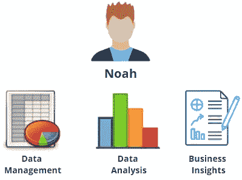
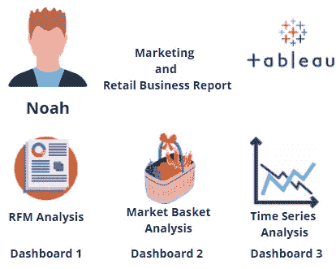
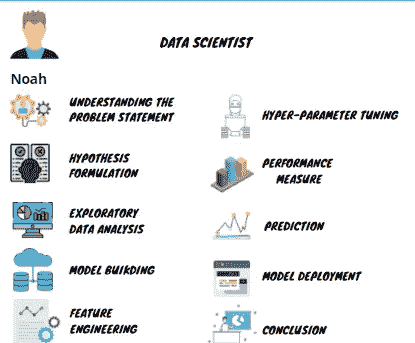

# 数据科学家的故事——诺亚

> 原文：<https://medium.com/nerd-for-tech/story-of-data-scientist-noah-799d6669b077?source=collection_archive---------15----------------------->

Noah 是一名数据科学家，在数据科学领域拥有丰富的经验。他在这个领域已经工作了五年，在早期的时候，他是一名数据分析师，随着时间的推移，他现在是一名首席数据科学家。

早期，他在一家跨国金融公司的银行担任数据分析师，在那里他必须手动维护数据库，在 MS Excel 中执行分析，并将商业见解提交给经理。当他作为新人加入公司时，他面临以下挑战:

*   了解属性
*   了解业务需求
*   了解公司使用的工具和技术

由于背景不同，他希望了解银行流程和政策的背景框架，以便能够提供更好的商业智能。对诺亚来说，典型的一天是这样的:诺亚的经理会通过他们将获得的数字来要求数据洞察力，然后，他必须进行演示，以便每个决策者能够以更好的方式理解。此后，他必须使用以下属性进行计算:

*   每个客户/成员的收入
*   平均课堂出席率
*   客户保留率
*   利润率
*   平均每日出勤

**作者图片**

由于高级工具的单调性和不可用性，他厌倦了这份工作，他开始学习 SQL 和 Tableau 更好的可视化工具，并开始在银行工作 3 年后寻找工作，从而不断提高自己的技能。

Noah 在营销和零售部门找到了一份工作，这家公司有一个庞大的 RDBMS 数据库，他必须在其中实现 SQL 和 Tableau，他的角色与他以前的工作类似。他的日常工作是使用 SQL 查询提取数据，根据需要转换数据，并将其加载到 Tableau 中以提供业务洞察。Tableau 完全是拖放式的，这是最酷的部分。这确保了非技术业务用户可以使用 Tableau，假设他们接受了必要的培训，可以有效地利用它，从数据团队提取的数据可以产生一些有趣的图形，为公司的其他部门带来好处。

在执行任务时，他通常会执行以下计算:

*   崭新
*   频率
*   货币的

**又名 RFM 分析**

新近性是指顾客最近访问商店的次数，频率是指顾客购买产品的频率，货币是指产品的货币价值。通过使用这种 RFM 分析，他过去常常通过在 Tableau 中讲故事来为经理和首席执行官提供很好的商业见解。

**作者图片**

诺亚有点厌倦了同样的投入，因此，他开始阅读有关市场篮子分析。购物篮分析是一种关联技术，在这种技术中，零售商了解顾客的购买行为和模式。它需要评估庞大的数据集，如购买历史记录，以确定可能一起购买的产品组和产品。他现在开始展示包括经常购买的物品和按地区或城市分组的其他物品。除了市场篮子分析，他还开始在 tableau 中进行时间序列分析，为首席执行官们提供更好的故事。

诺亚在营销和零售部门了解到，Tableau 是一种新型商业智能产品的最佳工具，所有这些产品都代表了一种新的分析方法。根据这一新策略，数据团队的工作是准备数据并提供给业务用户。在那之后，有能力的商业人士可以学习和使用像 Tableau 这样的直观技术来生成他们需要的所有报告。

作为持续专业发展的一部分，他开始潜行于数据科学领域的新趋势，开始掌握 PYTHON、机器学习和深度学习的知识。最初，在向他的老板提供仪表板时，他习惯于进行描述性分析，执行一些计算，并给出报告。

Noah 现在在 SQL、Tableau、Python、高级统计和机器学习等领域拥有近 5 年的经验。就目前而言，他渴望担任数据科学职位，而不是数据分析职位。他开始申请各种工作，并被一家体育公司选中，非常兴奋，因为他也是一名体育爱好者。

**作者图片**

现在，让我们谈谈他的日常工作，最初是作为以前的角色，他与项目经理坐在一起，理解问题陈述。他现在做的有点不同，他开始制定一个假设，一个为了讨论而提出的概念，然后测试它是否正确。他开始询问关于数据收集之类的数据的查询，无论你是想发起批量学习还是在线学习，基于实例的学习还是基于模型的学习。

他开始使用 python 进行探索性数据分析，包括单变量和双变量分析。他还开始构建模型，执行功能工程，超参数调整以增强模型的性能矩阵，进行预测，并最终构建复杂的 web 部署模型。因此，在构建演示文稿时，他会将报告分成几个部分:

*   描述性分析
*   聚类分析
*   预测分析
*   规定性分析

诺亚很快就看到了使用这条管道的好处。与 Tableau 范式不同，业务逻辑由数据团队在数据建模层创建一次。然后，其他分析师和非技术业务用户重新组合这些模型，以创建公司所需的报告和探索性界面。

在我们故事的这个时候，诺亚已经在商业智能领域工作了 5 年多。为他的第一份工作构建手动数据库的艰辛让他伤痕累累。在他的第二本书中，他与指标漂移斗争了数年。当诺亚适应了体育公司的新工作后，他反思了自己所学到的东西，并得出结论，新工具远比旧工具优越。

**外卖**

由 [Unsplash](https://unsplash.com?utm_source=medium&utm_medium=referral) 上的 [Snowscat](https://unsplash.com/@snowscat?utm_source=medium&utm_medium=referral) 拍摄

商业智能的世界现在令人困惑是有原因的:工具和方法已经存在很长时间了。市场上的新买家可能会对各种术语、想法、架构计划和可用的方法感到困惑。正如诺亚解释的那样，这些技术中的许多都是经过几代人的进化而成的，然而它们今天仍然尴尬的共存着。

我想在这里指出的一点是，概念或方法的变化比工具慢。如果你掌握了这一点，当一个新的商业智能产品上市时，评估它将变得容易得多。