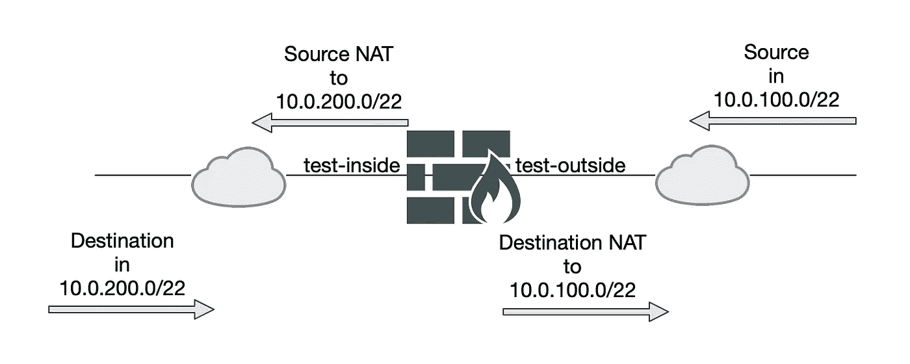
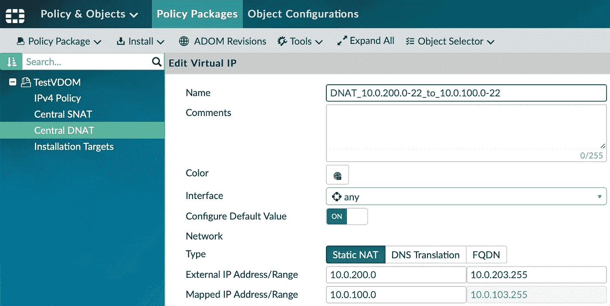
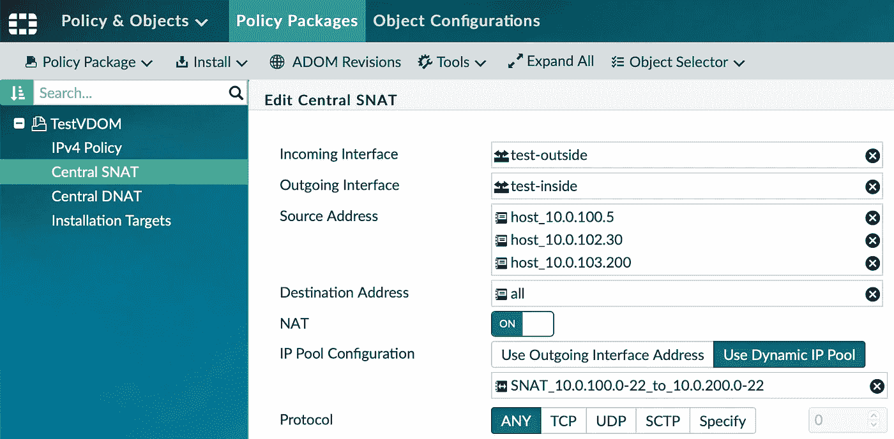
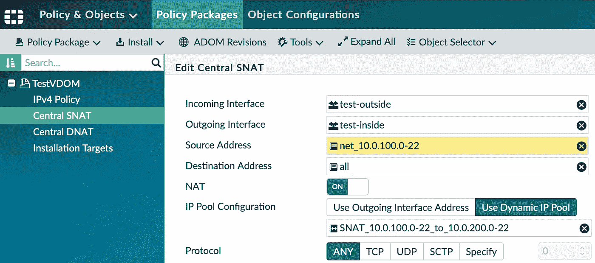

# 带中央 NAT 的 Fortinet 防火墙上的子网到子网 SNAT/DNAT

> 原文：<https://medium.com/nerd-for-tech/subnet-to-subnet-snat-dnat-on-fortinet-firewalls-with-central-nat-604a6102b21f?source=collection_archive---------0----------------------->

## 在 Fortinet 防火墙上实现 SNAT/DNAT 从来没有像在 Checkpoint 等其他平台上那样简单，在我看来，至少在引入中央 NAT 之前是这样。让我们看看如何使用虚拟化(DNAT)和固定端口范围的 IP 池(SNAT)，通过确定性映射实现子网到子网的一对一转换。

## 介绍

我最近不得不将一些防火墙安全和 NAT 规则从 Checkpoint 迁移到 Fortinet 防火墙，并且由于这两种技术的不同行为而面临一些挑战。Checkpoint 首先应用安全策略(至少是我正在使用的版本)，然后检查 NAT 策略并应用源和目的地 NAT。相反，Fortinet 有不同的操作顺序，更像带有 Iptables 的 Linux:数据包从传入接口到达，有一个预路由步骤，其中目的地 NAT(从现在起 DNAT)发生，遵循确定传出接口的路由决策(因为现在最终目的地是已知的)，安全策略(IPv4 策略)被检查，最后源 NAT(从现在起 SNAT)发生，数据包可以在传出接口上发送出去(更多细节可以在此处找到，我已经省略了许多其他中间步骤)。

在规则的迁移过程中，我有必要实现 SNAT 和 DNAT 规则，用确定性映射将一个/22 网络映射到另一个/22 网络。下面我们来举个例子:



右侧是合作伙伴的网络 10.0.100.0/22(即 IP 范围从 10.0.100.0 到 10.0.103.255 ),我们的防火墙有一条已知路由。我们有一些规则，要求从左侧网络到合作伙伴网络的通信必须通过别名网络 10.0.200.0/22，该网络在我们的网络中路由到我们的边界防火墙。重要的是，在两个方向上的映射必须是确定性的，即 10.0.101.55 必须映射到 10.0.201.55，反之亦然，或者以更一般的方式，10.0.10x.y 必须映射到 10.0.20x.y(反之亦然)。更复杂的是，从合作伙伴网络到我们的 SNAT 必须只发生在 10.0.100.0/22 范围内的一些 IP 上。

注意:显示的示例和图像取自 **FortiManager** ，这是用于管理 FortiGate 防火墙的接口/虚拟机。您可以在 FortiGate 防火墙上直接应用相同的概念(可能术语略有不同)。

## **中央国家公园**

正如我之前提到的，在 Fortinet FortiGate 防火墙上实施 DNAT 和 SNAT 从未像在其他平台上那样简单，但他们在中央 NAT 方面向前迈出了一大步，在标准 IPv4 表中添加了两个策略表，这些表包含我们通常在 FortiManager 上拥有的安全规则。仍然有一些东西使人想起配置 nat 的老方法(中央 DNAT 规则创建以前用于实现 DNAT 的 VirtualIP 对象，但是现在您不必在标准安全规则中将它们应用为目的地)，但是它更容易使用和阅读(并且不容易出错)。

## **安全规则**

正如我以前解释过的，DNAT 发生在安全策略被评估之前，所以当你写安全策略时，你必须考虑到 DNAT 已经转换了目的地址。相反，SNAT 还没有发生，所以必须使用原始源地址。为了实现上图所示的双向通信，我们需要两条规则:


IPv4 安全策略

如您所见，规则 *#1* 将 10.0.100.0/22 作为目的地，因为从 10.0.200.0/22 到 10.0.100.0/22 的 DNAT 已经被应用。

## **DNAT**

DNAT 很容易实现，它需要在中央 DNAT 表中有一个规则，这又会创建一个 VIP 对象:



DNAT 10.0.200.0/22 至 10.0.100.0/22

如您所见，您设置了我们“知道”的/22 网络的 IP 地址范围，然后您只指定了合作伙伴的真实映射(或内部)网络的第一个地址。GUI 计算该网络的最终 IP，以获得一对一的静态和确定性映射。

## SNAT 和固定端口范围 IP 池

我在实现相反的方面遇到了一些挑战，因为为了从旧的防火墙中迁移规则，我们必须能够实现 10.0.10x.y 到 10.0.20x.y IP 地址的确定性 SNAT，但仅限于特定的来源。源 NAT 是在中央 SNAT 表中实现的，在该表中，您可以编写一个类似于安全策略的策略，指定流量的源/目的地地址和端口以进行匹配(与后 DNAT 目的地相匹配)，然后您可以选择将流量 SNAT 到传出接口的 IP 或 *IP 池*。IP 池可以有不同的种类:*过载*、*一对一*、*固定端口范围*和*端口阻塞分配*。*一对一*对我来说似乎是正确的，因为我们希望在两个子网之间实现一对一的映射……但该对象允许您指定单一范围的 IP 地址，因此 FortiGate 无法知道哪个源 IP(这是您在中央 SNAT 策略中指定的内容，一个单独的对象)将被映射到 IP 池对象中指定的 IP 上。因此，在我的第一个测试中，我实施了一个集中的 SNAT 策略，该策略规定“来自测试外部且源 IP 在 10.0.100.0/22 中的流量必须被捕获到指定 10.0.200.0/22 为范围的 IP 池一对一对象上”。然后我做了一些测试，从 10.0.100.10 到 10.0.200 **.1** 的一个流，从 10.0.100.x 到 10.0.200 **.2** 的第二个流等等，所以我不能实现我需要的确定性的 1 对 1 映射。

我搜索了一下文档，了解了*固定端口范围 IP-Pool* 对象的工作原理:固定端口范围允许您将 a /22 网络映射到 a /24 网络，因此 IP 地址比例为 4:1，以确定的方式为每个 IP 保留 1/4 的端口。你可以在官方 Fortinet 文档中找到更多细节。你能看到的是，如果你在真实网络和映射网络之间有 1:1 的 IP 地址比例，你可以实现 10.0.10 *x.y* 端口 *w* 到 10.0.20 *x.y* 端口 *w* 的确定性 1 对 1 映射，具有固定的端口范围 SNAT。

以下公式可在官方文件的第*节公式*中找到:


图片取自[https://docs . fortinet . com/document/fortigate/5 . 4 . 0/cookbook/414467/fixed-port-range-IP-pools-algorithm](https://docs.fortinet.com/document/fortigate/5.4.0/cookbook/414467/fixed-port-range-ip-pools-algorithm)

让我们尝试一下我们的特定案例，合作伙伴的源 IP 为 10.0.102.55:

```
**factor** = (10.0.103.255–10.0.100.0 + 10.0.203.255–10.0.200.0 + 1) / (10.0.203.255–10.0.200.0 + 1) = (1024 + 1024 + 1) / (1024 + 1) = 2049 / 1025 = 1,999024 = **1** (there is an integer conversion that cuts the decimal part)**new IP** = 10.0.200.0 + (**10.0.102.55**–10.0.100.0) / **1** = 10.0.200.0 + (256 + 256 + 55) = **10.0.202.55**
```

给你: *10.0.102.55 翻译成 10.0.202.55* ！答对了。

子网和 IP 地址的数学运算一开始可能看起来不那么直观，但是在我展示的这个例子中应该非常清楚。

如下图所示，使用固定端口范围，您可以通过告诉 FortiManager 什么是外部 IP 范围(我方已知的 IP 地址)和内部(或映射的)IP 地址(合作伙伴网络上的真实 IP 地址)来指定确切的映射:


固定端口范围 IP 池

现在，我们可以在中央 SNAT 规则中使用这个 IP 池对象，确定我们希望确定性 NAT 发生在合作伙伴网络的哪些 IP 地址上:



中央 SNAT 规则详细信息


中央 SNAT 规则

显然，您可以用 3 条规则实现上述 SNAT，每条规则都有自己的过载/一对一 IP 池，将单个 IP 转换到相应的 IP 上，但在我的示例中，您有一个确定性的从原始/22 网络到目标/22 网络的一对一映射，然后您用 SNAT 策略来确定它何时发生。

根据上面的规则，来自 10.0.100.5 的流量到达我们的网络，其源为 10.0.200.5，这是意料之中的，而来自 10.0.101.100 的流量到达时使用其原始 IP 地址，因为它与中央 SNAT 策略不匹配。

在一个更简单的设置中，您可以通过在中央 SNAT 规则中将 SNAT 设置为源地址，使其适用于整个 10.0.100.0/22:



整个合作伙伴网络的 SNAT

## 结论

我想分享这一点知识，因为我在找到子网间这种确定性 SNAT 问题的解决方案之前有些头疼，也许它对那些从未想过(像我一样)使用*固定端口范围* *IP 池*对象来实现它的人有用，直到我阅读了文档并理解了它在我们 IP 地址比率为 1:1 的情况下是如何工作的。