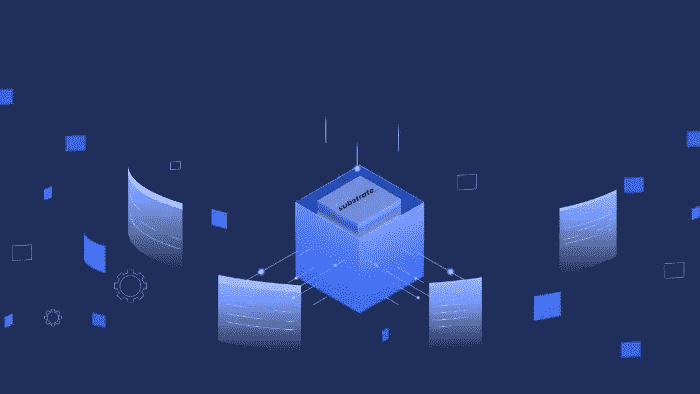

# 衬底区块链开发核心概念

> 原文：<https://medium.com/nerd-for-tech/substrate-blockchain-development-core-concepts-ce3c7d808e7?source=collection_archive---------4----------------------->

从零开始构建区块链平台无疑是一项极其艰巨的任务。这需要很大的复杂性，从编写共识代码到实现底层网络协议。Substrate 通过提供共识、网络和跨平台文件存储抽象，极大地简化了所有这一切。它甚至可以在浏览器中运行。该衬底建立在 Polkadot 上，并且是异质多链。其交换和翻译架构允许定制侧链连接到公共区块链。

因此， [Substrate 是一个区块链框架](https://productcoalition.com/substrate-a-framework-to-build-your-blockchain-in-the-fastest-way-6d82fc669254),它使开发人员能够以最快和最优化的方式为任何用例轻松构建面向未来的区块链。Substrate 通过由 Substrate 的生态系统构建的开源软件来利用开发者，因此开发者不需要从零开始。该基底被设计成高度可定制和灵活的模块化框架。它的代码经过实地测试和学术研究，这有助于开发人员快速构建区块链。

简单地说，底物是:

*   灵活的
*   打开
*   彼此协作的
*   经得起未来考验的

这种基质并不完全适合区块链的每一个项目。但是，如果您想要构建一个区块链，那么 Substrate 可能是一个完美的选择:

*   根据特定的使用案例量身定制
*   能够与其他区块链联系和沟通
*   随着时间的推移，能够随着升级而发展和变化
*   可使用预定义的可组合模块化组件进行定制

# 基板的固有特性

基质具有许多特性，您可以将这些特性整合到您的应用中:

*   一个验证器投票系统，工作共识机制和块终结算法。
*   对等连接、消息发送和数据复制层。
*   全节点模板以及它们在 web 浏览器中运行的能力。
*   数据库抽象允许几乎任何类型的定制数据被存储和使用。
*   Wasm 允许快速简单的客户端更新。没有硬叉子。
*   一旦完全释放，迁移到波尔卡多特的能力。
*   您可以使用许多模块来创建各种功能。
*   API 允许您与您的区块链通信，以便创建 dApps。
*   基于区块链构建的应用程序可以具有预定义的界面或通用用户界面。
*   Rust 开发允许你使用编程语言的所有特性。

# 基质的好处

*   易于使用的存储
*   安全快捷
*   无叉升级
*   分散网络环境
*   自定义消息
*   轻型客户端支持
*   开放定义您自己的自定义共识算法

# 底物是如何工作的？

要开始一个新的基底项目，有三个选项可供选择，如下所述:

# 衬底节点

基底节点是我们可以开始的顶层。它提供了最多的功能和最大的技术自由度。它是完全可运行的，并带有所有组件的默认实现，如特权访问、帐户管理和共识。首先，我们可以修改链的创世纪块。一旦我们准备好建立我们自己的区块链，我们最好去低一级使用框架。

# 基底框架

这是 Substrate 最强大的工具之一，包含各种简化运行时开发的模块和支持库。这些模块，也称为底层调色板，是可定制的业务逻辑，可用于特定的用例，如赌注、治理和共识。开发人员还可以使用系统、支持和执行托盘在运行时环境中提供广泛的服务。尽管不使用 FRAME 也可以构建基于衬底的区块链，但各种托盘和库允许开发人员使用其预定义的组件创建自定义运行时逻辑。

# 衬底核心

Substrate core 意味着运行时实现可以按照我们喜欢的方式来完成，前提是它必须以 WebAssembly 为目标。此外，它必须遵守子状态块创建的基本规则。这允许我们使用运行时并在 Substrate 中执行它。

# 衬底区块链开发的核心概念

[基板区块链开发](https://www.leewayhertz.com/substrate-development-services/)基于框架的核心概念，围绕以下内容展开:

*   运行时间
*   共识；一致
*   外部和交易

# 运行时间

基于基板的应用程序的运行时间是项目成功的关键。它描述了区块链的状态和指导它的逻辑。衬底的运行时间也称为状态转移函数。整个区块链可以被视为一个国家机器。运行库定义了控制从一种状态到另一种状态的转换的规则。运行时是区块链实现的核心。尽管任何运行时都必须兼容某些接口，但除此之外，您拥有完全的技术和创作自由。如上所述，FRAME 也可以用来创建现有的模块(托盘)。这包括 Substrate 附带的 50 多个托盘，以及第三方程序员提供的用于构建运行时的托盘。

# 共识；一致

区块链系统是点对点的，由多个节点组成，节点之间没有层级关系。这就产生了商定正确地位的问题。试图改变状态的多个参与者可能会使事务无效，并根据它们在网络中的位置进行不同的排序。这可能导致网络不同部分之间的冲突，需要快速解决，以便网络能够继续运行。

共识引擎用于实现区块链系统。这些引擎创建确定状态转换应该如何发生以及如何解决冲突的规则。这包括块的创建、终结、分叉选择或竞争状态间的冲突解决。Substrate 已经提供了一些共识，但您也可以根据您的具体需求或混合、匹配和扩展现有的解决方案，推出自己的解决方案。

# 外部和交易

区块链有内在和外在之分。这些是发生在链条内部的事情和发生在链条外部的事情。为了从外部与国家区块链互动，外在是必要的。这可用于向链的状态添加信息或进行更改。衬底块包含头部以及外部的阵列。这些信息对于底物和整个区块链的内部运作是重要的。

# 在衬底上创建第一个区块链的步骤

*   该过程首先在开发环境中构建一个节点，然后模拟一个双节点网络，以确认它们之间的所有交互是否都按照预期进行。
*   一旦完成，开发人员就可以在扩展到大规模之前，通过升级节点的运行时代码来开始一个小型的验证器网络。
*   使用 Substrate Playground，开发人员可以跳过初步的 Substrate 节点设置，直接过渡到基于云的沙盒环境，他们可以在节点模板或前端模板之间进行选择。
*   使用节点模板，开发人员可以使用“骨架区块链”工作，并使用 P2P 网络、共识、终结、帐户、交易和治理模块构建基本功能。
*   另一方面，前端模板是一个模块化 UI，它包含与节点模板的运行时交互所需的所有组件，同时充当底层节点模板的前端。

# 结论

基板是一个长期存在的项目，并以创新的方式发展。它提供了所有必要的支持，从安装到运行您的自定义区块链。它没有自己的加密令牌，但 Polkadot 令牌(dot)是最受欢迎的。这是因为它可以与 Substrate 或 Polkadot 生态系统中的所有其他副链一起使用，这反映了它对互操作性和可伸缩性的重视。使用该基板，您可以以最快的方式开发自定义区块链。