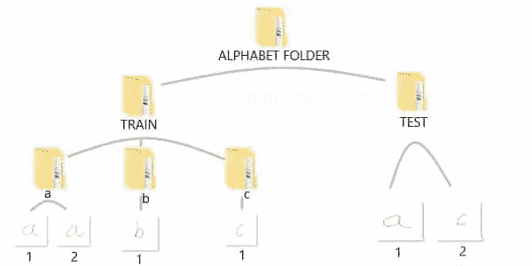

# 用于手写字母识别的支持向量机

> 原文：<https://medium.com/nerd-for-tech/support-vector-machine-for-hand-written-alphabet-recognition-ba12716263a1?source=collection_archive---------10----------------------->

写这篇文章的目的是使用非常粗糙的方法做图像分类，在这种情况下是手写文本的图像。虽然我们从头开始使用卷积神经网络模型，或者在 MNIST 数据集上使用预先训练的模型，但它更适合这项工作。我们使用迁移学习，在这个过程中，作为一名学生，我错过了最基本的东西。这就好像我在驾驶一辆自动汽车，我知道动力传动系统、离合器、油门和刹车是干什么的，但除此之外我一无所知。我们试图将手写字母图像识别的问题分解成一个简单的过程，而不是使用沉重的包。这是一种创建数据，然后使用支持向量机建立分类模型的尝试。

# 准备数据

我们将手动准备数据，而不是从网上下载。这将允许我们从初始阶段就理解我们的数据。我们将在一张白纸上手动写几个字母，并从我们的照相手机中拍摄图像。然后我们会把它移植到我们的硬盘上。因为这是一个实验，我不想在最初的运行中花费太多时间，所以我会为两个或三个不同的字母创建数据进行演示。建议你对所有的字母尝试这种机制，看看效率。当您添加更多的字母表类时，您可能需要修改您的代码，但这是学习部分将开始的地方。我们现在正处于培训阶段。

# 数据存储结构

我们可以在白纸上写下字母，然后使用手机摄像头提取，或者直接使用绘图工具，如 paint，使用钢笔工具进行书写。我创建了两个文件夹 train 和 test。在 train 文件夹中，我们可以保存带有字母名称的文件夹，而在 test 文件夹中，我们可以转储我们希望最终对其实例进行分类的图像。保留培训子文件夹的目的是将子文件夹名称作为培训标签。测试文件夹并没有像我们这里打算做的分类那样以相同的形式保存。



图 1:手写图像的文件模式

或者，如果您想下载我使用过的数据，右键单击此[下载数据](http://www.imurgence.com//uploads/thumbnails/sample_data/alphabet_folder.zip)链接，并在新的选项卡或窗口中打开。然后解压文件夹，你应该能够在下载文件夹中看到与上面相同的结构和数据。

稍后，您应该创建自己的数据，并再次执行整个过程。这将暴露出完整的循环。

# 下载 RStudio 中的依赖包

我们将使用 R 中的 jpeg 包进行图像处理，并使用 kernlab 包中的支持向量机实现。这将是一次性安装。我们还确保图像数据的尺寸为 200 x 200 像素，水平和垂直分辨率为 120dpi。在当前表单中实现之后，您可以尝试颜色通道和分辨率的变化。

```
# install package "jpeg"
  install.packages("jpeg", dependencies = TRUE)# install the "kernlab" package for building the model using support vector machines
  install.packages("kernlab", dependencies  = TRUE)
```

# 加载训练数据集

```
# load the "jpeg" package for reading the JPEG format files
  library(jpeg)
# set the working directory for reading the training image data set
  setwd("C:/Users/mohan/Desktop/alphabet_folder/Train")

# extract the directory names for using as image labels 
  f_train<-list.files()# Create an empty data frame to store the image data labels and the extracted new features in training environment
  df_train<- data.frame(matrix(nrow=0,ncol=5))
```

# 特征工程

由于我们的目的是不使用典型的 CNN 方法，我们将使用白色，灰色和黑色像素值来创建新的功能。我们打算使用图像实例的所有像素值的总和，并将其保存在一个称为“sum”的特征中，所有像素的计数评估为零为“零”，所有像素的计数评估为“1”，所有像素的总和评估为除 0 和 1 之外的值为“中间值”。“标签”特征是从文件夹名称中提取的。

```
# names the columns of the data frame as per the feature name schema
  names(df_train)<- c("sum","zero","one","in_between","label")# loop to compute as per the logic  
  counter<-1for(i in 1:length(f_train))
  {
    setwd(paste("C:/Users/mohan/Desktop/alphabet_folder/Train/",f_train[i],sep=""))

    data_list<-list.files()

    for(j in 1:length(data_list))
    {
      temp<- readJPEG(data_list[j])
      df_train[counter,1]<- sum(temp)
      df_train[counter,2]<- sum(temp==0)
      df_train[counter,3]<- sum(temp==1)
      df_train[counter,4]<- sum(temp > 0 & temp < 1)
      df_train[counter,5]<- f_train[i]
      counter=counter+1
    }
  }# Convert the labels from text to factor form
  df_train$label<- factor(df_train$label)
```

# 建立支持向量机模型

```
# load the "kernlab" package for accessing the support vector machine implementation
  library(kernlab)# build the model using the training data
  image_classifier <- ksvm(label~.,data=df_train)
```

# 加载测试数据集

```
# set the working directory for reading the testing image data set
  setwd("C:/Users/mohan/Desktop/alphabet_folder/Test")

# extract the directory names for using as image labels
  f_test <- list.files()# Create an empty data frame to store the image data labels and the extracted new features in training environment
  df_test<- data.frame(matrix(nrow=0,ncol=5))

# Repeat of feature extraction in test data
  names(df_test)<- c("sum","zero","one","in_between","label")

# loop to compute as per the logic  
  for(i in 1:length(f_test))
    {
      temp<- readJPEG(f_test[i])
      df_test[i,1]<- sum(temp)
      df_test[i,2]<- sum(temp==0)
      df_test[i,3]<- sum(temp==1)
      df_train[counter,4]<- sum(temp > 0 & temp < 1)
      df_test[i,5]<- strsplit(x = f_test[i],split = "[.]")[[1]][1]
    }# Use the classifier named "image_classifier" built in train environment to predict the outcomes on features in Test environment
  df_test$label_predicted<- predict(image_classifier,df_test)# Cross Tab for Classification Metric evaluation
  table(Actual_data=df_test$label,Predicted_data=df_test$label_predicted)
```

我鼓励你通过点击我的[免费数据科学和机器学习视频课程](https://www.imurgence.com/home/courses)的链接来学习本文无法完全探究的支持向量机的概念。虽然我们已经使用了 kernlab 包并创建了分类器，但是从向量空间到内核技巧，还涉及到许多数学知识。我们已经研究了分类器的实现，但是你当然应该学习支持向量机的概念部分和其他有趣的算法。

*原载于 https://imurgence.com/*