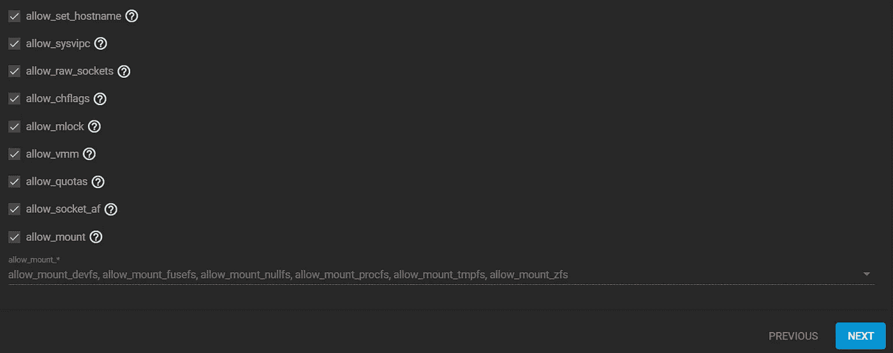

# 在 TrueNAS 中支持不受支持的 UPS

> 原文：<https://medium.com/nerd-for-tech/supporting-unsupported-upss-in-truenas-10d0cbcb30f8?source=collection_archive---------7----------------------->


TrueNAS 使用网络 UPS 工具(NUT)进行 UPS 监控，但如果您的 UPS 不受 NUT 支持怎么办？

这是我在使用 BX1500M 装甲运兵车时所处的位置。这些不间断电源相对便宜、可靠、高质量。看起来 NUT 目前不支持它们，或者至少我不能让它识别我的 UPS。

在 FreeBSD 的世界里，似乎我唯一的选择就是[APC USD](http://www.apcupsd.org/wordpress/)(【http://www.apcupsd.org/】T2)。没问题，我可以把它安装在监狱里，让它进行监控，对吗？问题是如何处理断电事件，因为在监狱中发出“断电”命令不会关闭整个 NAS。此外，弄清楚如何让监狱访问 USB UPS 可能会很棘手。在本文中，我们将探讨我如何设置 apcupsd 并解决这些问题的过程。

首先，您需要在 TrueNAS 中配置一个 API 密钥。如果您不熟悉，这是我写的关于配置 TrueNAS 的系列文章之一。您可以在本文中找到配置 API 键的基本过程的指导:[https://medium . com/the shellster/setting-up-true nas-with-crash plan-pro-backup-8707 CB 1 f 6 E8 b](/nerd-for-tech/setting-up-truenas-with-crashplan-pro-backup-8707cb1f6e8b)。

你还需要设置新的监控监狱。如果您已经关注了我的其他文章，您可能已经创建了一个，但是如果没有，这里有一个快速指南:

点击左边菜单中的“监狱”，然后点击“添加”。现在点击“高级监狱创建”。页面加载后，像这样填写顶部:


基本选项

对于“监狱类型”,你应该选择“Basejail ”,对于 release，选择 FreeBSD 的最新版本。对于网络部分，只需点击“NAT”。“VNET”将被自动选中。

我们需要给监狱更多额外的访问权限，以便它可以看到 USB 设备并与之交互。这是多余的，但在“监狱属性”下，选中所有这些框，并在它们下面添加额外的权利，以匹配下图:



确保我们有权与 UPS 联系。

以下是这些额外的权利(我刚刚检查了所有权利):


添加所有的访问，尽管 devfs 可能已经足够了。

此时，您应该已经正确地设置好了所有的东西，您可以点击提示直到监狱被创建。

现在访问监狱的根 shell，并安装 apcupsd 包:

```
# pkg update
# pkg install apcupsd
```

如有必要，我们将使用 TrueNAS API 关闭 NAS，因此我也将使用 Python 和请求库来完成这项工作:

```
# pkg update
# pkg install python3 py37-pip
# pip install requests
```

现在我们需要配置 apcupsd。配置文件位于:"/usr/local/etc/APC USD/APC USD . conf "

下面是我的配置中所有未注释的行，注释指示我更改的行:

```
UPSCABLE usb  #Not Default
UPSTYPE usb #Not Default
DEVICE #Not DefaultLOCKFILE /var/spool/lock
SCRIPTDIR /usr/local/etc/apcupsd
PWRFAILDIR /var/run
NOLOGINDIR /var/run
ONBATTERYDELAY 6 #How many secs after batt power before script runs
BATTERYLEVEL 5 # % of battery remaining before shutdown
MINUTES 5 # bat remaining minutes before shutdown
TIMEOUT 0 # disable TIMEOUT
ANNOY 300
ANNOYDELAY 60
NOLOGON disable
KILLDELAY 0
NETSERVER on
NISIP 0.0.0.0
NISPORT 3551
EVENTSFILE
```

如果你读过我之前链接的文章([https://medium . com/the shellster/setting-up-true nas-with-crash plan-pro-backup-8707 CB 1 f 6 E8 b](/nerd-for-tech/setting-up-truenas-with-crashplan-pro-backup-8707cb1f6e8b))，那么你会知道我在我的 NAS 上建立了一个名为 monitoring 的备份文件夹，并且已经与这个监狱共享了它。我将继续使用此文件夹存储我的自定义关机脚本。简而言之，监狱中的“/monitor/”是安装在我的 ZFS 坦克上的一个位置。

在这个文件夹中，我创建了一个名为“ups_push_alert”的脚本。此脚本包含各种与 UPS 相关的提示，我可能想通过 PushOver(https://pushover.net)发送到我的手机上。以下是这个脚本的内容:

接下来，我们将关闭脚本创建为“/监控/关闭”。以下是该文件的内容:

当调用时，关闭脚本调用 TrueNAS API 来关闭 NAS。确保“chmod +x”这两个脚本，以便它们是可执行的。

剩下唯一要做的事情是配置为不同 UPS 事件运行的脚本。这些脚本位于同一个“/usr/local/etc/APC USD/”文件夹中。以下是所有这些文件内容的一个要点:

您可以忽略每个文件顶部的注释，这些注释要求您必须将脚本复制到“/etc/APC USD”中才能运行。在我的测试中，这是不必要的。

至此，您应该已经准备好了，尽管我强烈建议进行测试。