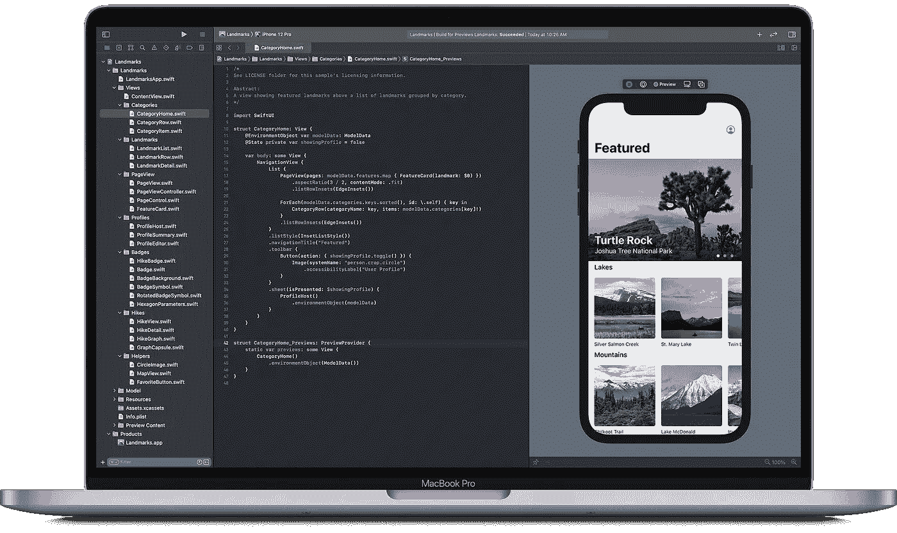

# IOS 开发 Swift 结构与类

> 原文：<https://medium.com/nerd-for-tech/swift-structs-vs-classes-f2014da7a20f?source=collection_archive---------8----------------------->



**班级示例**

```
import foundationclass ClassSuperhero{var name : Stringvar universe : Stringinit(name: String , universe:String){self.name = nameself.universe = universe}}//let hero = ClassSuperhero(name:"Iron Man" , universe :"Marvel")
```

swift 编译器不允许类、结构和枚举具有相同的名称。

**结构示例**

```
import Foundationstruct StructSuperhero{var name : Stringvar universe : Stringfunc revereseName1()->String{// self.name.reversed() : this will return a collectionnot a stringreturn String(self.name.reversed())}//this function will do goodfunc revereseName2(){self.name = self.name.reversed()//this will give us an error because we are trying tochange on of the struct's properties.//so we should use the mutating keyword}mutating func revereseName2(){self.name = self.name.reversed()}} 
```

即使我们这里没有初始化器，我们也不会有错误，不像类，因为在结构中我们实际上有一个自由的初始化器。

**总管**

```
import Foundationvar hero = ClassSuperHero(name:"Iron Man" , universe :"Marvel")var anotherMarvelHero = hero // we can simply make a copyof instances of classesanotherMarvelHero.name = "Hulk"print(hero.name)print(anotherMarvelHero.name)//these two lines will both print "Hulk". because classesare reference types unlike structs it means now we have torefrences to the same object.avengers[0].name = "Thor"print(hero.name) //prints "Thor"print(anotherMarvelHero.name) //prints "Thor"print(avengers[0].name) //prints "Thor"
```

这可以通过使用结构来解决。

```
var hero = StructSuperHero(name:"Iron Man" , universe :"Marvel")var anotherMarvelHero = heroanotherMarvelHero.name = "Hulk"var avengers = [hero , anotherMarvelHero]print(hero.name) //prints "Iron Man"print(anotherMarvelHero.name) //prints "Hulk"//changing the anotherHero's name doesnt effect the hero'sname because structs are value typesavengers[0].name = "Thor"print(hero.name) //prints "Thor"print(anotherMarvelHero.name) //prints "Hulk"print(avengers[0].name) //prints "Thor"
```

尽可能使用结构而不是类来避免弄乱代码。

```
let constantHero = ClassSuperHero(name:"Iron Man" ,universe : "Marvel")
```

常量只能赋值一次，并且不能更改。但是下面的代码行没有任何错误。

```
constantHero.name = "Cat Woman"
```

因为名字和宇宙在超级英雄类中被声明为 var。当我们试图将 constantHero 分配给另一个类时，唯一的问题是:

```
hero = ClassSuperHero()
```

这就是 let 阻止我们做的事情！但这不是我们想要的。我们使用常量的唯一原因是防止对象的意外变化，这也可以通过使用结构来解决！

```
let constantHero = StructSuperHero(name:"Iron Man" ,universe : "Marvel")constantHero.name = "Cat Woman" // this will result in anerror!
```

只有一件事我们必须知道，结构体不能做，那就是不能子类化，我们不能从结构体中获得继承。如果我们需要继承，我们必须使用类！使用 swift 和 objective-c 时，我们不能使用结构，因为 objective-c 中的结构与 swift 中的结构非常不同！

```
Struct StructHero : NSObject{}// this will give me anerror!
```

**结论**

*   结构是一种“值类型”,这意味着无论何时使用它，它都会被复制。
*   一个类是一个“引用类型”,这意味着对象不被复制，引用被复制，当我们改变它时，我们改变的是同一个底层对象！

## 结构:

1.  简单的
2.  更快(因为它们存储在堆栈中而不是堆中)
3.  深层副本
4.  真正的不变性
5.  没有内存泄漏
6.  线程安全

## 类别:

1.  具有继承性
2.  使用 objective-c 代码 iPhone 的许多 API 仍在 objective-C 中

关于这个问题，苹果的最后一句话是:

> 每当要创建一个
> 
> 自定义对象，只有当您发现
> 
> 实际上需要继承或者需要使用 objective-c 代码！
> 
> 从结构开始，只在需要的时候上升，就像访问级别一样！