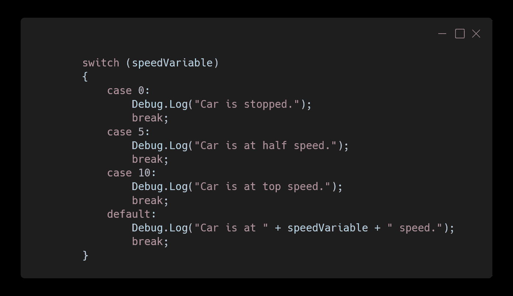
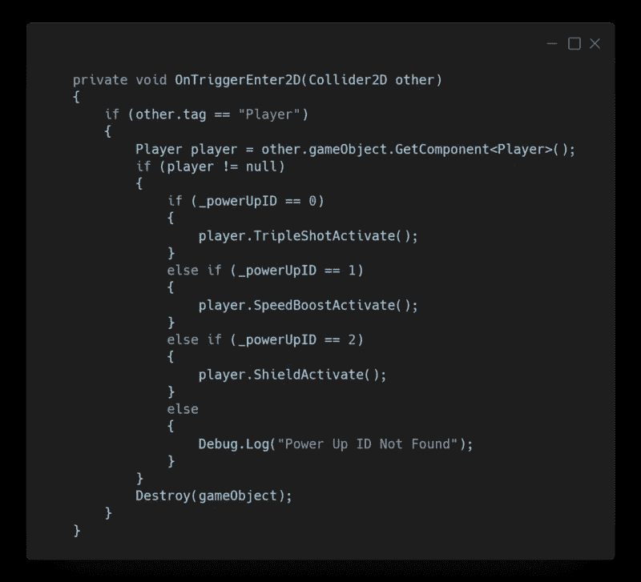
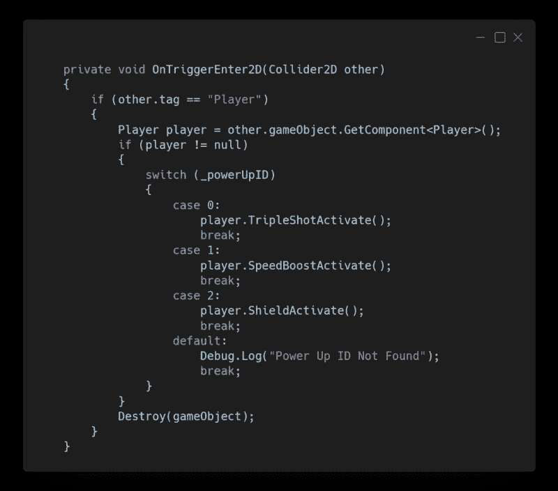
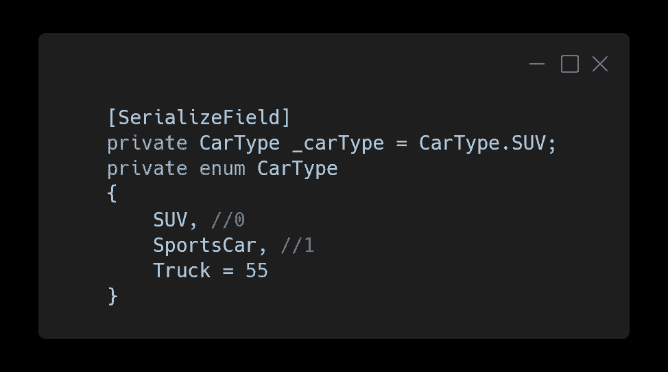
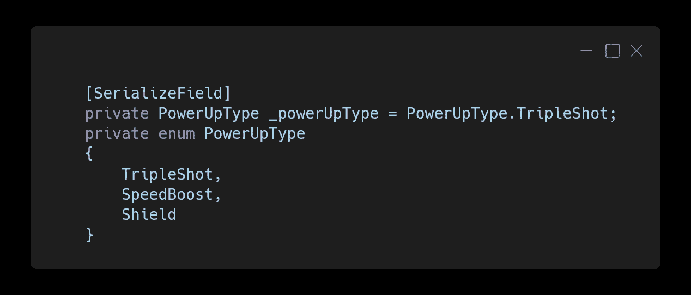
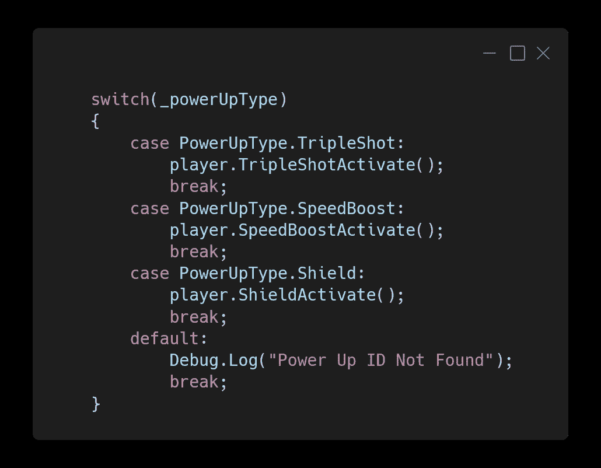
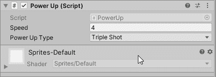

# 开关语句和枚举类型

> 原文：<https://medium.com/nerd-for-tech/switch-statements-enumeration-types-4bcd775e9dcb?source=collection_archive---------6----------------------->

在编程中，做事的方法几乎总是不止一种。有时一种方法比另一种方法更有效，但通常，这取决于个人偏好和代码的清晰性。

链式 if-else 语句与 switch 语句的区别主要在于后者，但是在较长的 if-else 链中，大多数情况下使用开关会更有效。我所说的长 if-else 链是指三个或更多 if-else 语句。使用枚举几乎完全取决于个人偏好和代码部分的清晰性。

# 转换

开关是一个选择语句，它根据与开关中定义的匹配，从候选项列表中选择要执行的单个事例。如果在三个或更多条件下检查单个变量，switch 语句通常用作 if-else 链的替代。

要创建一个开关，首先要使用 switch 关键字，然后是要在括号中检查的变量；然后，在 switch 语句中创建 cases。case 是一个 if 语句，可以归结为关键字 case 和后跟冒号的条件。然后，在下一行中，添加条件匹配时要执行的代码，之后，在下一行中，使用关键字 break 告诉交换机找到匹配并停止检查。添加完所有案例后，需要有一个默认值:捕捉案例范围之外的任何值，这样开关就不会继续运行。

示例开关

在以前的文章中，我们创建了一个加电脚本，它使用 if-else 链检查 _powerUpID 三次，以了解在播放器上激活哪个加电。让我们把它变成一个开关语句。首先，创建一个检查 _powerUpID 的开关，并为 0、1、2 和 default 创建案例。然后让 cases 在播放器上执行正确的代码，用于加电，TripleShot 为 0，SpeedBoost 为 1，Shield 为 2。

if-else 链(左)与开关(右)

# 枚举类型

枚举类型(或枚举类型)是由整数类型的一组命名常量(不可更改/只读变量)定义的类型的实例。默认情况下，枚举项的常数值为 int 类型，从 0 开始并随着每个项递增，但是枚举项的常数值可以手动设置为任何整数。

要创建一个枚举，设置它的可访问性级别，使用 enum 关键字，后跟您想要命名的内容，使用与方法相同的命名约定。在它的内部，您可以命名您的枚举项并用逗号分隔它们，现在枚举已经创建好了，但是您需要它的一个变量来保存当前常量的设置。为此，您创建一个变量，将类型作为枚举名称，然后将变量的名称作为枚举名称，并使它等于您希望作为默认值的枚举的常数。如果你想在 Unity 中看到下拉菜单，确保变量是公共的或序列化的。

示例枚举

在上一篇文章中，我们使用了 Tooltip 来显示当您将鼠标悬停在变量名上时，Unity 中会弹出哪些值对应于哪个加电激活。

工具提示代码

现在我们将把它改为枚举，以便在 Unity 中更容易调整。首先，创建一个名为“PowerUpType”的枚举，在其中添加 TripleShot、SpeedBoost 和 Shield。接下来，创建名为“_powerUpType”的 PowerUpType 类型的变量，并使其等于 PowerUpType.TripleShot。现在唯一要做的就是让 Switch 语句使用 Enum 变量。

PowerUpType 类型枚举

将开关的变量更改为 _powerUpType，然后将 case 条件更改为 enum 常量项，0 更改为 TripleShot，1 更改为 SpeedBoost，2 更改为 Shield。

使用枚举变量的开关

在 Unity 中，您现在可以从下拉菜单中选择不同的加电类型。现在很容易看出哪个做什么，并且您不能选择超出开关范围的数字。

通电类型下拉菜单